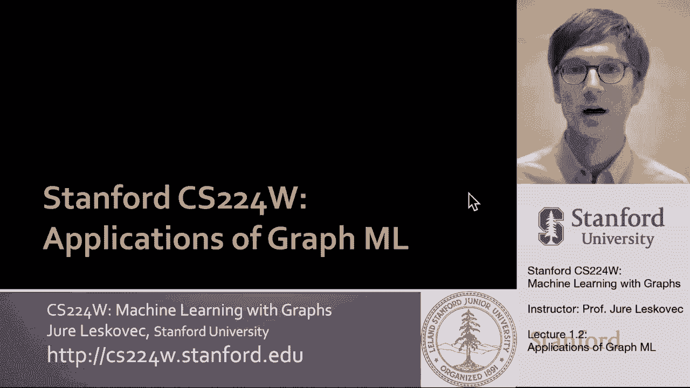
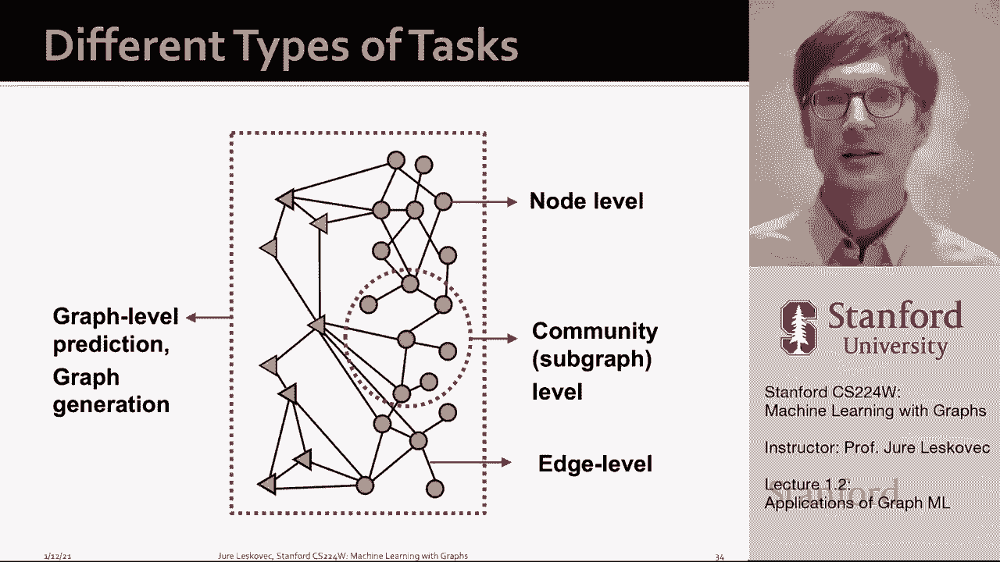
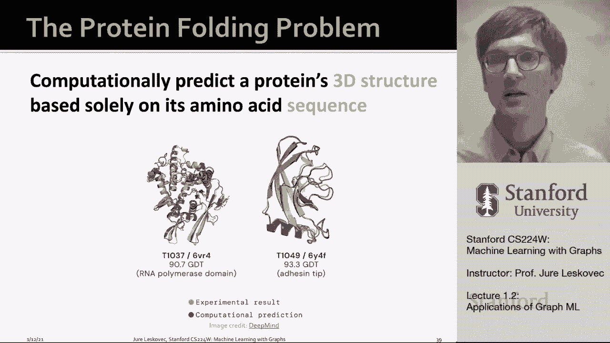
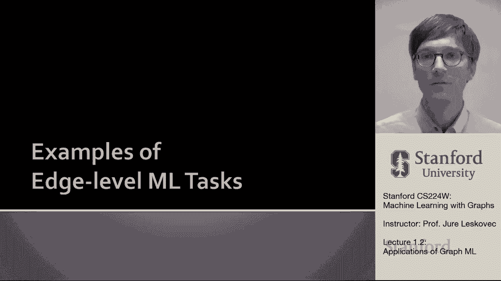
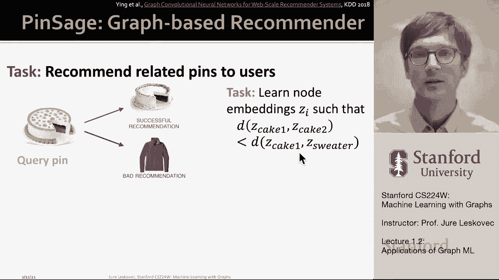
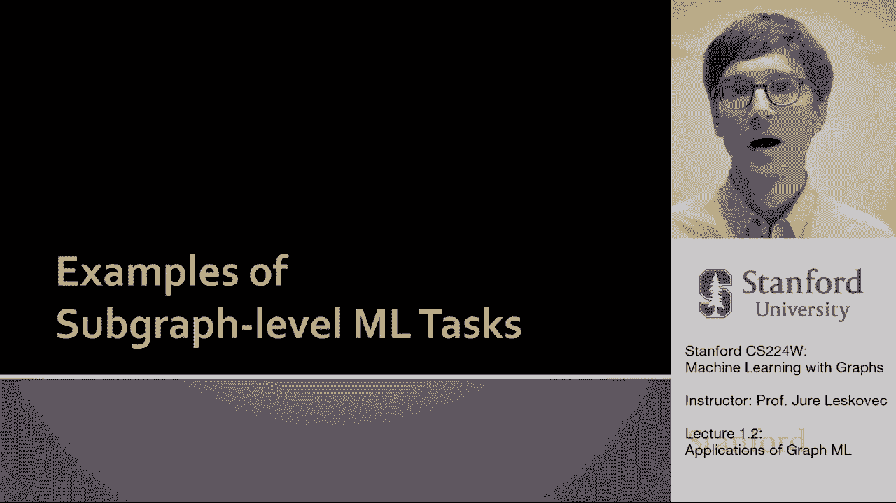
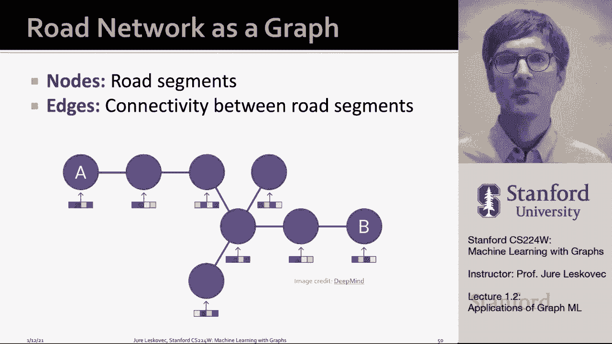
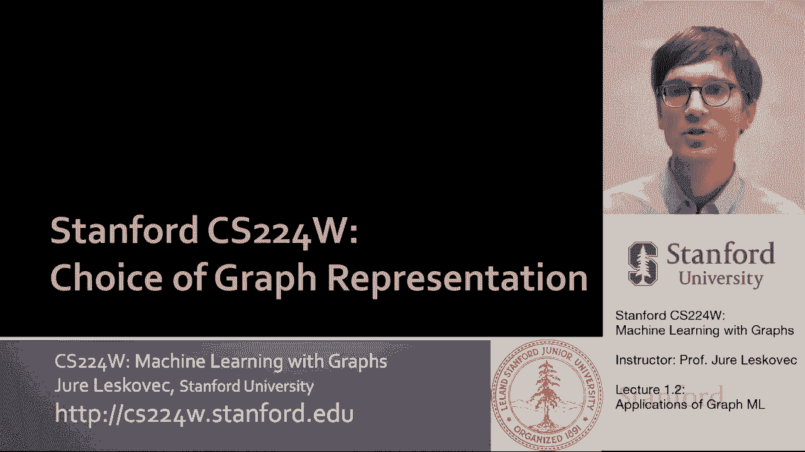

# 2：1.2 - 图机器学习的应用 🚀

在本节课中，我们将学习图机器学习在不同领域的具体应用。我们将看到图模型如何被用于解决从蛋白质结构预测到药物发现等一系列复杂且具有重大影响的实际问题。

## 概述

图机器学习可以制定不同层次的任务，包括节点级、边级、子图级和图级任务。通过在不同层次应用图模型，我们可以解决众多领域的实际问题。接下来，我们将逐一探讨这些任务层次及其对应的代表性应用。

## 节点级任务应用

上一节我们介绍了图任务的不同层次，本节中我们首先来看看节点级任务的应用。节点级任务通常指节点分类，即预测图中单个节点的性质。

### 蛋白质折叠问题

一个近期取得重大突破的节点级应用是蛋白质折叠问题。蛋白质是调节生物过程的分子，其功能依赖于其复杂的三维结构。生物学中长期存在的一个挑战是：仅根据氨基酸序列预测蛋白质的三维结构。

在2022年12月，DeepMind的AlphaFold系统将蛋白质结构预测的准确性大幅提升至90%以上，解决了这一重大科学难题。其核心思想是将蛋白质表示为**空间图**：
*   **节点**：代表氨基酸。
*   **边**：代表在空间上彼此接近的氨基酸对。

通过训练图神经网络来预测每个氨基酸节点的空间位置，从而模拟出整个蛋白质的折叠结构。这是一个典型的节点级预测任务。

## 边级任务应用

在理解了节点级预测后，我们转向边级任务。边级任务的核心是链路预测，旨在理解节点对之间的关系。

以下是边级任务的两个重要应用：

### 推荐系统

推荐系统可以建模为用户与物品（如商品、电影）之间的交互图。这是一个**二部图**，包含用户节点和物品节点。边表示用户与物品之间的交互行为（如购买、点击）。

该任务的目标是学习节点（用户和物品）的嵌入表示，使得相关的节点（例如用户可能喜欢的物品）在嵌入空间中彼此更接近。许多公司（如Pinterest、LinkedIn）的现代推荐系统都基于这种图表示学习和图神经网络。

### 药物副作用预测

许多患者同时服用多种药物，药物组合可能产生未知的副作用。由于药物组合数量庞大，无法全部通过实验测试。

该问题可以通过构建一个**异构网络**来形式化：
*   **节点**：药物（三角形）和人体内的蛋白质（圆形）。
*   **边**：
    1.  药物与靶点蛋白质之间的作用。
    2.  蛋白质与蛋白质之间的相互作用。
    3.  已知的由两种药物共同服用导致的副作用。

任务目标是预测图中缺失的“药物-药物-副作用”边，即预测任意两种药物组合可能产生的新副作用。基于图的方法可以高精度地预测出未被记录在官方数据库中的潜在副作用，并通过医学文献得到验证。

## 子图级与图级任务应用

接下来，我们探讨涉及更大范围结构的任务，即子图级和图级任务。

### 交通预测（子图级）

谷歌地图等应用的预计到达时间（ETA）功能使用了图机器学习。在该模型中：
*   **节点**：表示道路段。
*   **边**：表示路段之间的连接。

系统基于历史交通模式数据，训练图神经网络来预测从起点到终点整条路径（一个子图）的旅行时间。这是一个在实际生产中广泛应用的子图级预测任务。

### 药物发现与生成（图级）

在图级任务中，我们可以对整张图进行分类或生成新的图。

**1. 分子性质预测与药物发现**
分子可以被表示为图，其中原子是节点，化学键是边。图神经网络可以对分子图进行分类，预测其是否具有治疗效果（如抗菌性），从而在数十亿候选分子中快速筛选出有潜力的药物进行后续实验验证。

**2. 分子生成与优化**
图生成模型可以有针对性地创造全新的分子图结构，例如生成具有高溶解度或低毒性的分子。此外，它还可以对已知分子进行优化，修改其结构以增强某种特定性质。

### 物理模拟（图级）

在物理领域，图模型可用于模拟材料的变形。方法是将材料表示为一组粒子，并根据粒子间的邻近关系构建图。
1.  根据粒子当前位置构建邻近图。
2.  使用图神经网络，基于粒子当前的位置和速度属性，预测其下一时刻的位置和速度。
3.  更新粒子状态，并基于新的位置重新构建图，重复迭代。

这种方法能够实现快速且精确的基于物理的仿真。

## 总结

本节课中，我们一起学习了图机器学习在不同任务层级上的广泛应用。我们看到，从预测蛋白质结构的节点分类，到推荐系统和药物副作用预测的链路分析，再到交通预测的子图级任务，以及药物发现和物理模拟的图级任务，图模型为解决科学和工程领域的复杂问题提供了强大而统一的框架。这些应用充分展示了图机器学习技术的巨大潜力和实际影响力。