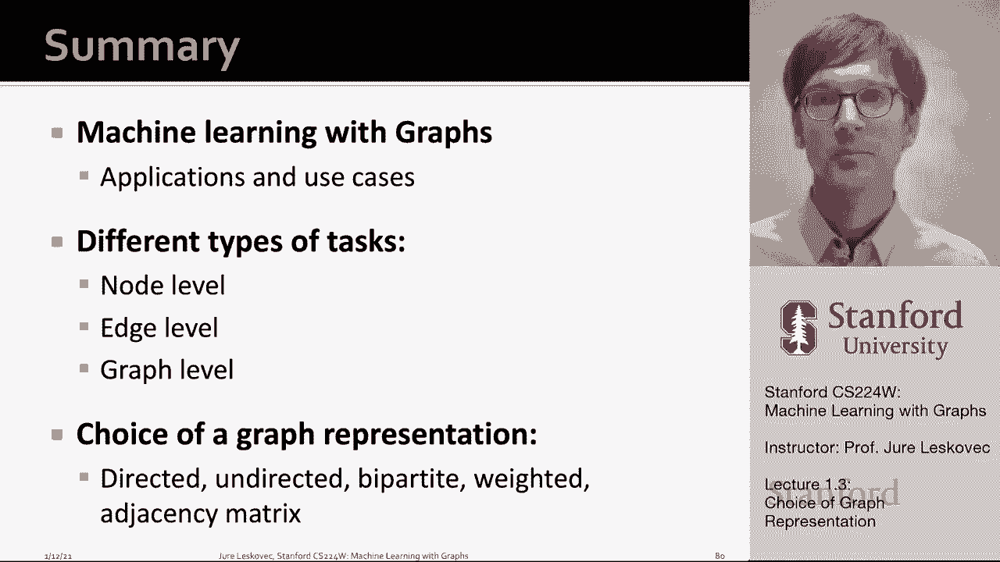

# 3：1.3 - 图表示的选择 📊

在本节课中，我们将学习如何为一个具体问题选择合适的图表示。图是一种强大的通用语言，可以描述演员、人际关系、蛋白质相互作用等多种系统。然而，如何定义图中的节点和边，将直接影响我们使用机器学习算法进行预测的能力和效果。

## 图的基本组成

上一节我们介绍了图的基本概念，本节中我们来看看图的正式组成部分。

一个图或网络由两种基本对象构成：
*   **节点**：也称为顶点，代表实体或对象。
*   **边**：也称为链接，代表节点之间的相互作用或关系。

整个系统被称为**图**或**网络**。我们通常用大写字母 **N** 或 **V** 表示节点集合，用大写字母 **E** 表示边集合。因此，一个图 **G** 可以形式化地定义为：
`G = (V, E)`

## 图表示的重要性

图是一种通用语言，这意味着同样的数学结构可以表示演员合作网络、社交网络或蛋白质相互作用网络。因此，同样的机器学习算法可以应用于这些不同的领域。

然而，为特定问题选择合适的图表示至关重要。例如，对于同一组人，根据“同事关系”构建的图与根据“性关系”构建的图完全不同。对于一组科学论文，根据“引用关系”构建的图与根据“标题共享词汇”构建的图，其质量和适用性也大相径庭。

因此，每当我们面对一个数据集，都需要仔细设计底层图：确定哪些对象是节点，它们之间应建立何种关系作为边。这个选择将决定我们能否成功利用网络进行分析和预测。

## 图的类型与概念

为了展示设计图表示时的选择，我们现在介绍几种常见的图类型和相关概念。

### 有向图与无向图

以下是两种基本的图类型：
*   **无向图**：边没有方向，用于建模对称关系（如友谊、蛋白质相互作用）。
*   **有向图**：边有方向，包含源节点和目标节点，用箭头表示。现实中的例子包括电话呼叫、金融交易和Twitter关注关系。

### 节点度

在无向图中，**节点度** 是指与该节点相邻的边的数量。例如，节点A的度为4。**平均节点度** 是网络中所有节点度的平均值。可以证明，平均节点度等于 `2 * |E| / |V|`，其中 `|E|` 是边数，`|V|` 是节点数。这是因为每条边在计算度时都被其两个端点各计算一次。

在有向图中，我们区分：
*   **入度**：指向该节点的边的数量。
*   **出度**：从该节点指出的边的数量。

### 二分图

**二分图** 是一种特殊的图，包含两种不同类型的节点，并且边只存在于不同类型节点之间，同类型节点之间没有边。以下是自然出现的二分图例子：
*   作者与论文（作者写了论文）
*   用户与电影（用户观看了电影）
*   顾客与产品（顾客购买了产品）

### 投影网络

从一个二分图可以衍生出**投影网络**。投影时，我们只保留其中一种类型的节点，并在两个节点之间建立连接，如果它们在原二分图中至少有一个共同的邻居。

例如，在“作者-论文”二分图中，投影到作者侧，就得到了**合著网络**：如果两位作者至少共同撰写过一篇论文，他们之间就有一条边。

## 图的表示方法

我们讨论了图的类型，现在来看看如何在计算机中表示图结构。

### 邻接矩阵

表示图的一种常用方法是**邻接矩阵**。对于一个有 `n` 个节点的图，我们创建一个 `n x n` 的方阵 **A**。对于无向图：
*   如果节点 `i` 和 `j` 之间有边，则 `A[i][j] = 1`，`A[j][i] = 1`。
*   如果无边，则为 `0`。

因此，无向图的邻接矩阵是对称的。对于有向图，邻接矩阵通常不对称。

节点的度可以通过对邻接矩阵的对应行（或列）求和得到。

### 现实网络的稀疏性

现实世界的网络通常非常**稀疏**。这意味着邻接矩阵中绝大多数元素都是0。例如，在社交网络中，一个人不可能与全球所有人成为朋友。因此，我们通常将邻接矩阵作为**稀疏矩阵**来存储和计算，以节省空间和时间。

### 其他表示方法

除了邻接矩阵，还有两种常见的表示方法：
*   **边列表**：简单地存储所有边的列表（如 `(节点1, 节点2)`）。这种表示简单，但不便于进行图操作和分析。
*   **邻接表**：为每个节点存储一个其所有邻居的列表。这种表示对于大型稀疏网络非常高效，可以快速检索任意节点的邻居。

## 图的属性与扩展概念

图的结构不仅仅是节点和边，还可以携带丰富的附加信息。

### 属性图

节点、边乃至整个图都可以拥有**属性**。
*   **边属性**：例如权重（关系强度）、类型、符号（友好/敌对）、持续时间等。
*   **节点属性**：例如人的年龄、性别，或化学品的分子式等。
*   **图属性**：描述整个图所代表系统的属性。

边的权重等属性可以直接在邻接矩阵中表示，此时矩阵元素不再是0或1，而是具体的权重值。

### 自环与多重图

在图表示中，我们还可以考虑更复杂的情况：
*   **自环**：一条边连接一个节点到其自身。在邻接矩阵中，这体现在对角线元素上。
*   **多重图**：允许两个节点之间存在多条边。这可以表示为带权图（权重为边数），或者单独表示每条边（如果边属性不同）。

### 连通性

**连通性** 是图的一个重要性质。
*   对于无向图，如果任意两个节点之间都存在一条路径，则该图是**连通**的。否则，图由多个**连通分量**组成。
*   对于有向图，连通性有两种：
    *   **弱连通**：忽略边的方向后，图是连通的。
    *   **强连通**：对于任意一对节点，都存在从一个节点到另一个节点的**有向**路径。图中满足此条件的最大节点子集称为**强连通分量**。

邻接矩阵的块对角线结构可以直观反映图的连通分量。

## 总结

本节课中，我们一起学习了如何为机器学习任务选择合适的图表示。我们首先回顾了图在多种应用中的通用性。然后，我们深入探讨了设计图表示时的关键选择：包括使用有向图还是无向图，是否采用二分图结构，以及如何为边和节点赋予权重或属性。

我们还介绍了图的几种数学和计算机表示方法，特别是邻接矩阵，并理解了现实世界网络普遍具有的稀疏特性。最后，我们讨论了图的一些基本性质，如节点度、连通性等，这些概念是后续进行图分析和算法设计的基础。正确理解和选择图表示，是成功应用图机器学习的第一步。