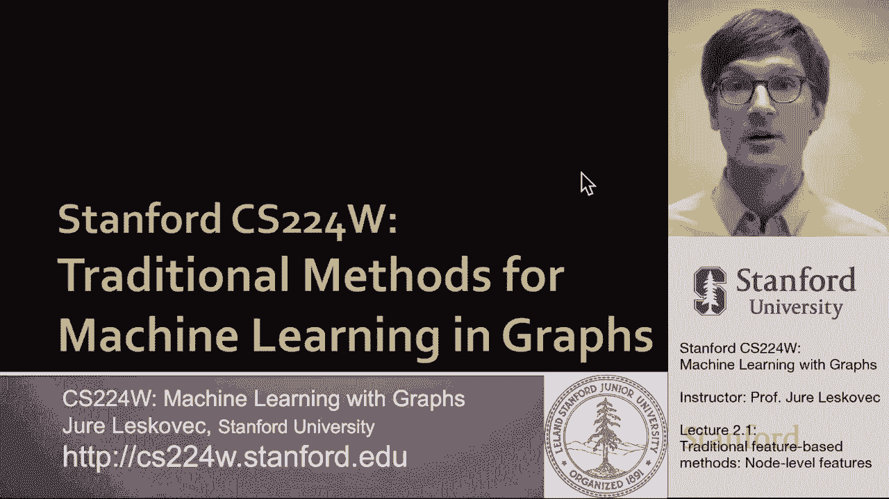
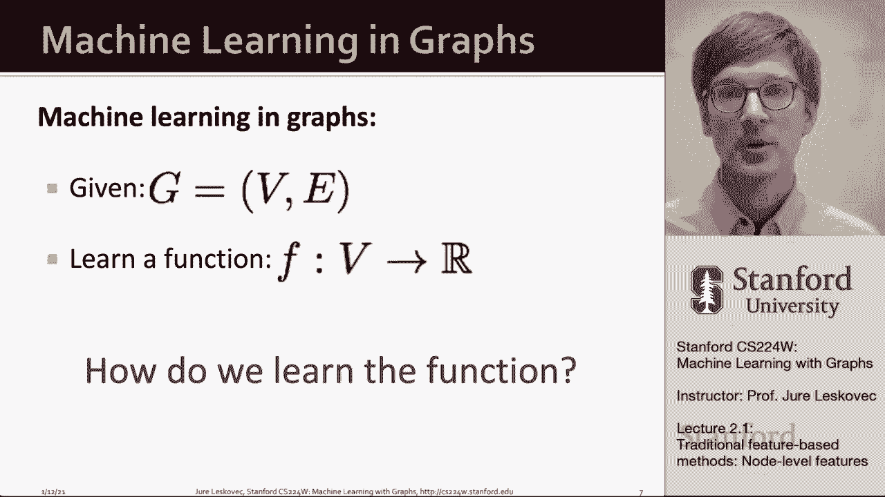
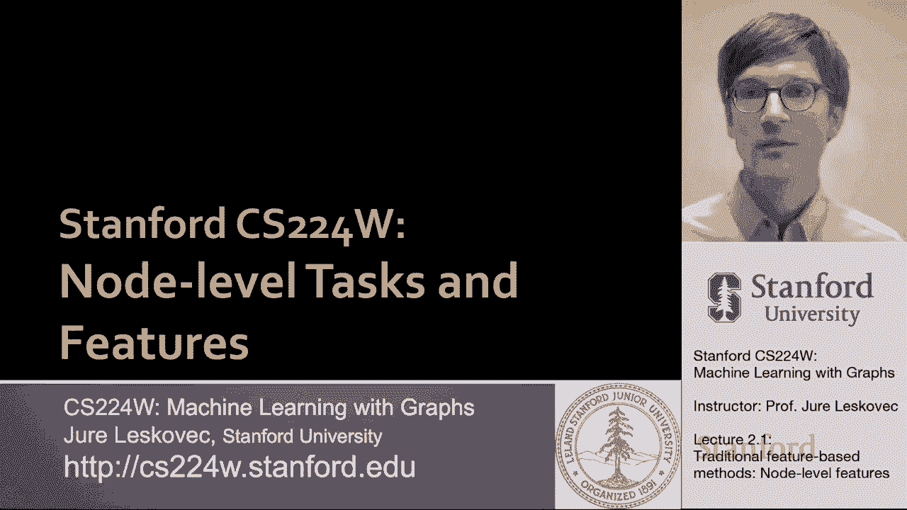
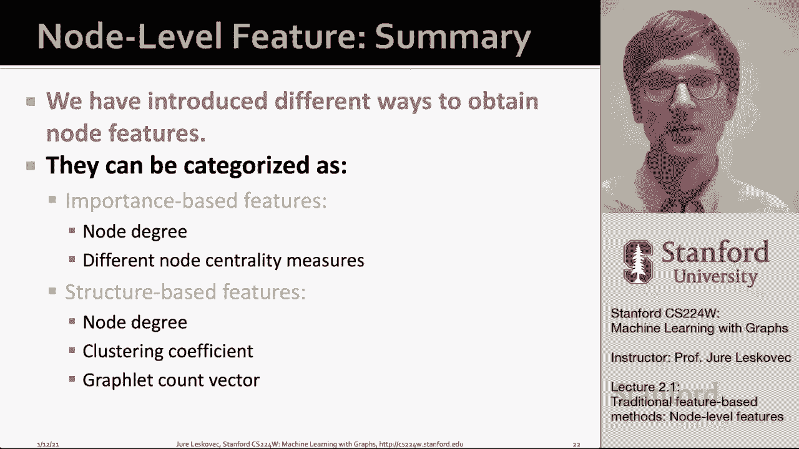

# 4：2.1 - 传统基于特征的方法：节点级特征 🧩

在本节课中，我们将学习如何为图中的节点设计特征。我们将重点关注**结构特征**，这些特征描述了节点在网络中的位置和其局部邻域的结构。通过将这些特征输入到机器学习模型中，我们可以进行节点级别的预测。

---

## 节点级任务与特征

上一节我们介绍了课程的整体框架，本节中我们来看看如何为**节点级预测任务**设计特征。在半监督学习场景中，我们已知部分节点的标签（例如颜色），目标是预测未标记节点的标签。为了做到这一点，我们需要能够描述每个节点在网络中位置和邻域结构的特征。

以下是四种描述节点结构的方法：

1.  **节点度**：这是最简单的特征，表示与节点相连的边数。公式为：
    `deg(v) = |N(v)|`
    其中 `N(v)` 是节点 `v` 的邻居集合。它的局限性在于无法区分度数相同但位置不同的节点。

2.  **节点中心性**：这类特征试图量化节点在网络中的“重要性”。我们介绍了三种中心性度量：
    *   **特征向量中心性**：一个节点的重要性取决于其邻居的重要性。这可以通过求解邻接矩阵 `A` 的主特征向量 `c` 得到：
        `λc = Ac`
    *   **中介中心性**：衡量一个节点作为“桥梁”或“枢纽”的重要性。计算节点 `v` 的中介中心性公式为：
        `c_B(v) = Σ_{s≠v≠t} (σ_{st}(v) / σ_{st})`
        其中 `σ_{st}` 是节点 `s` 到 `t` 的最短路径总数，`σ_{st}(v)` 是经过 `v` 的最短路径数。
    *   **接近中心性**：衡量一个节点到网络中所有其他节点的平均距离有多近。节点 `v` 的接近中心性计算为：
        `c_C(v) = 1 / Σ_{u≠v} d(u, v)`
        其中 `d(u, v)` 是节点 `u` 到 `v` 的最短路径长度。

3.  **聚类系数**：衡量一个节点的邻居之间相互连接的程度，即“朋友的朋友也是朋友”的概率。节点 `v` 的聚类系数计算公式为：
    `C(v) = (2 * #(v的邻居之间的边)) / (deg(v) * (deg(v) - 1))`
    其值在0到1之间。它本质上计算了以节点 `v` 为中心的三角形数量。

4.  **图元度向量**：这是对聚类系数（计数三角形）概念的推广。**图元** 是小的、连通的、非同构的子图。**图元度向量** 统计一个节点作为根节点时，参与不同图元结构的次数。这提供了比节点度或聚类系数更精细的局部拓扑描述。例如，一个基于2-5个节点的图元度向量可能有73个维度。

---

## 总结

本节课中我们一起学习了为节点设计传统手工特征的方法。

这些特征主要分为两大类：

*   **基于重要性的特征**：如节点度、特征向量中心性、中介中心性、接近中心性。它们用于预测节点在网络中的影响力或重要性，例如识别社交网络中的关键用户。
*   **基于结构的特征**：如节点度、聚类系数和图元度向量。它们用于捕获节点局部邻域的拓扑结构，适用于预测节点在网络中的角色，例如在蛋白质相互作用网络中预测蛋白质的功能。

通过将这些精心设计的特征与经典机器学习模型（如随机森林、支持向量机）结合，我们可以构建有效的节点级预测系统。下一节，我们将探讨如何为**边（链接）** 和**整个图**设计特征。