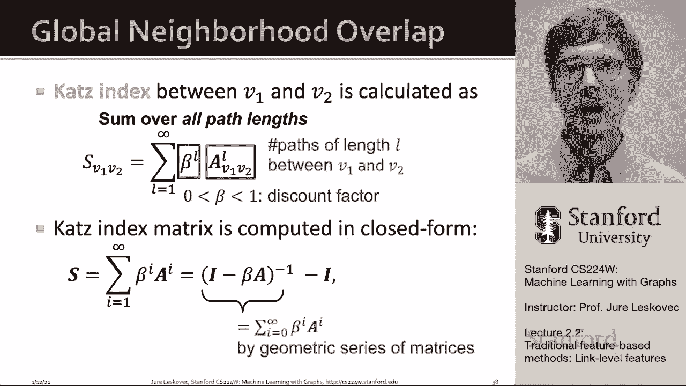

# 5：2.2 - 传统基于特征的方法：链接预测 🔗

在本节课中，我们将学习如何为**链接预测**任务设计特征。链接预测的目标是预测网络中未来可能出现的连接。我们将介绍三种主要的特征描述方法：基于距离的特征、局部邻域重叠特征和全局邻域重叠特征。

---

## 链接预测任务概述

链接预测任务是根据网络中已有的连接，预测新的链接。在测试时，我们需要评估所有尚未连接的节点对，对它们进行排名，并预测排名最高的K对节点之间将产生新的链接。

我们可以用两种方式表述此任务：
1.  **随机丢失链接**：假设网络中的一些链接是随机丢失的，我们的目标是使用机器学习算法预测这些丢失的链接。
2.  **随时间演化的链接**：对于随时间自然发展的网络（如引用网络、社交网络），我们基于过去某个时间点的图结构，预测未来将出现的链接。

这两种表述适用于不同类型的网络。第一种适用于静态网络（如蛋白质相互作用网络），第二种适用于动态演化网络（如社交网络）。

---

## 特征描述方法

我们的目标是为一对节点 `(x, y)` 计算一个得分 `c(x, y)`，然后根据得分对所有节点对进行降序排序，预测得分最高的节点对将产生新链接。以下是我们将探讨的三种特征化方法。

### 1. 基于距离的特征 📏

上一节我们介绍了任务的基本概念，本节首先来看一种直观的特征：基于节点间距离。

我们可以简单地使用两个节点之间的**最短路径距离**作为特征。例如，节点B和H之间的最短路径长度为2，则该特征值为2。

然而，这个度量只捕获了距离信息，无法衡量节点间连接的强度或邻域重叠的程度。例如，节点B和H有两个共同邻居，其连接应比只有一条路径的节点对（如D和F）更强。因此，我们需要能捕捉连接强度的特征。

### 2. 局部邻域重叠特征

为了捕捉两个节点之间连接的紧密程度，我们可以询问：“它们有多少个共同的邻居？” 这由**局部邻域重叠**的概念捕获。

以下是几种常见的局部邻域重叠度量：

*   **共同邻居数**：计算两个节点邻居集合的交集大小。
    *   **公式**： `CN(v1, v2) = |N(v1) ∩ N(v2)|`
*   **雅卡尔系数**：对共同邻居数进行归一化，除以两个节点邻居集合的并集大小。
    *   **公式**： `Jaccard(v1, v2) = |N(v1) ∩ N(v2)| / |N(v1) ∪ N(v2)|`
*   **Adamic-Adar指数**：不仅计算共同邻居数，还根据共同邻居自身的度数（连接数）对其重要性进行加权。度数低的共同邻居贡献更大。
    *   **公式**： `AA(v1, v2) = Σ_{u ∈ N(v1) ∩ N(v2)} 1 / log(|N(u)|)`

局部邻域重叠度量的一个限制是：如果两个节点没有共同邻居（例如，距离为两跳但没有直接共同朋友），这些度量值将为零。但在现实中，这样的节点未来仍有可能连接。为了解决这个问题，我们需要考虑更全局的图结构信息。

### 3. 全局邻域重叠特征

为了解决局部方法的局限性，我们引入**全局邻域重叠**度量。这类方法不仅考虑两跳路径，还考虑图中所有长度的路径。

我们将重点介绍 **Katz 指数**。它计算一对节点之间所有长度路径的加权数量，对较长路径给予较低的权重（折扣）。

**核心问题**：如何计算一对节点之间长度为 `k` 的路径数？

**解决方案**：这可以通过计算图的邻接矩阵 `A` 的 `k` 次方来优雅地实现。

*   **邻接矩阵 `A`**：如果节点 `u` 和 `v` 相连，则 `A[u][v] = 1`，否则为0。`A` 本身给出了长度为1的路径数。
*   **`A^k` 的含义**：矩阵 `A^k` 中的元素 `(A^k)[u][v]` 的值，等于节点 `u` 和 `v` 之间长度为 `k` 的路径数量。

**直观证明**：计算 `u` 和 `v` 之间长度为2的路径数，可以分解为：对 `u` 的每个邻居 `i`，计算从 `i` 到 `v` 长度为1的路径数，然后求和。这正是矩阵 `A` 与自身相乘（即 `A^2`）的计算过程。通过归纳法，此性质对任意 `k` 成立。

有了计算任意长度路径数的方法，我们就可以定义 Katz 指数。

**Katz 指数公式**：
对于一对节点 `v1` 和 `v2`，其 Katz 指数得分计算如下：
`S[v1][v2] = Σ_{l=1}^{∞} β^l · (A^l)[v1][v2]`
其中 `β` 是一个折扣因子（0 < β < 1），用于降低较长路径的重要性。

这个无穷级数有一个**闭式解**，可以直接计算：
`S = (I - βA)^{-1} - I`
其中 `I` 是单位矩阵。矩阵 `S` 中的每个元素 `S[i][j]` 就是节点 `i` 和 `j` 的 Katz 指数得分。

---

## 总结 📝

本节课我们一起学习了用于链接预测任务的三种特征描述方法：

1.  **基于距离的特征**：例如最短路径距离。简单直观，但无法捕捉邻域重叠信息。
2.  **局部邻域重叠特征**：例如共同邻居数、雅卡尔系数、Adamic-Adar指数。能精细刻画节点间的共同连接，但对于两跳以上无共同邻居的节点对会失效（得分为零）。
3.  **全局邻域重叠特征**：以 **Katz 指数** 为例。它利用全局图结构，通过计算节点间所有长度路径的加权和来给出分数，克服了局部方法的局限性。

掌握这些传统特征工程方法，是理解后续更复杂图神经网络模型的重要基础。