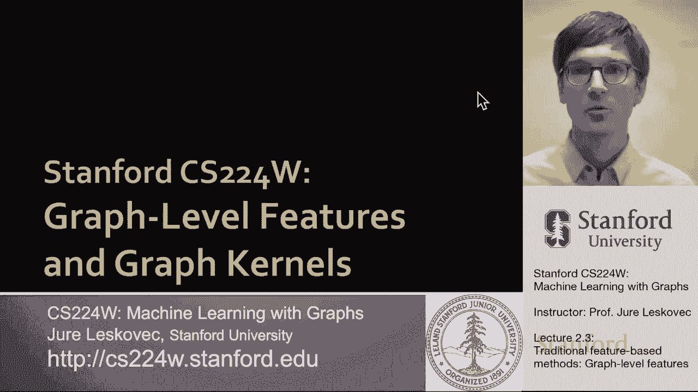
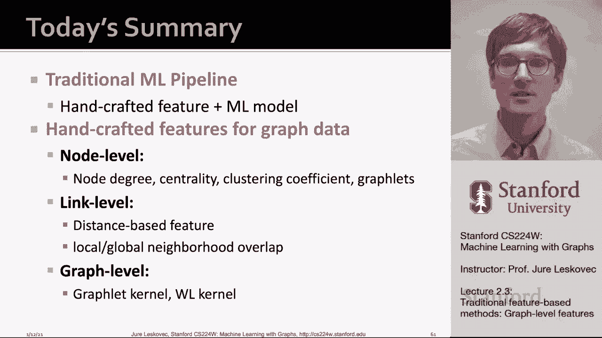
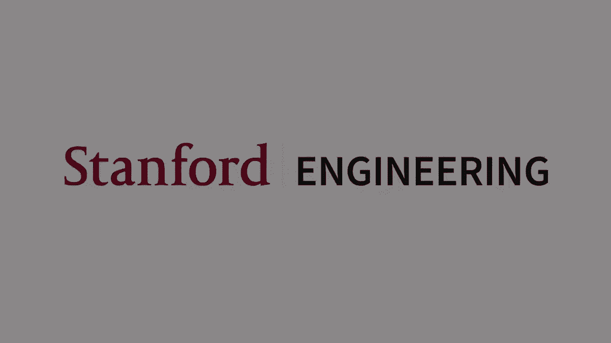

# 6：2.3 - 基于图的传统特征方法 📊

在本节课中，我们将学习如何为整个图结构设计特征，以便进行图级别的预测。我们将重点介绍图核方法，这是一种通过衡量图之间相似性来进行预测的传统机器学习技术。

---

## 概述

之前我们讨论了节点级别和边级别的特征。现在，我们将视角提升到图级别，目标是设计能够表征整个图结构的特征。例如，一个图可能由两个松散连接的部分组成，每个部分内部连接紧密，但两部分之间仅有一条边连接。问题在于，如何创建一个特征描述符来刻画这种整体结构。

我们将使用**核方法**来解决这个问题。核方法在传统机器学习中广泛应用于图级预测，其核心思想是设计一个**核函数**来衡量两个图之间的相似性，而不是直接设计特征向量。

---

## 什么是图核？🤔

图核 \( K(G, G') \) 是一个函数，它接收两个图 \( G \) 和 \( G' \) 作为输入，并返回一个实数值，用于衡量这两个图之间的相似性。

*   **核矩阵**：一个矩阵，其中每个元素 \( K_{ij} \) 衡量了数据集中第 \( i \) 个图与第 \(j\) 个图之间的相似性。一个有效的核矩阵必须是**对称**且**半正定**的。
*   **特征表示**：核函数的一个重要特性是，存在一个特征映射 \( \phi(\cdot) \)，使得两个图之间的核值等于它们特征向量的点积：
    \[
    K(G, G') = \phi(G)^T \phi(G')
    \]
    这个特征映射 \( \phi \) 甚至不需要显式地计算出来，只要能计算出核值即可。

一旦定义了核函数，就可以将其与支持向量机等核机器学习模型结合，进行图级别的预测。

在本节中，我们将讨论两种重要的图核：**图元核**和**Weisfeiler-Lehman核**。文献中还存在其他图核（如随机游走核、最短路径核等），它们在图级任务中通常能提供有竞争力的性能，但本课程不做深入讨论。

---

## 核方法的关键思想 🎯

图核背后的关键思想，是将图 \( G \) 的特征向量 \( \phi(G) \) 视为一种 **“词袋”** 表示。

*   **文本的词袋模型**：在文本处理中，我们可以将一个文档表示为一个词袋向量。向量中的每个位置对应一个特定的单词，其值是该单词在文档中出现的频率。
*   **图的词袋模型**：我们可以将这一思想扩展到图上。但如果我们简单地将**节点**视为“单词”，那么两个结构不同但节点数相同的图会得到相同的特征向量，这显然缺乏区分度。

因此，我们需要为图寻找更有表现力的“单词”。一个简单的改进是使用**节点度**作为“单词”。这样，图的特征向量就变成了图中不同度数的节点数量的计数。这种方法可以区分更多不同结构的图。

图元核和Weisfeiler-Lehman核都采用了图级别的“词袋”思想，但它们使用的“单词”比节点度更为复杂。

---

## 图元核 🧩

图元核的目标是将一个图表示为图中出现的不同**子图结构**（即“图元”）的计数。

这里需要明确一个重要区别：在图元核的语境中，“图元”的定义与节点级特征中的“图元”略有不同。在图元核中，图元：
1.  **不一定需要连通**。
2.  **不是有根的**。

例如，对于大小为 \( k=3 \) 的图元，在三个无向节点上存在四种不同的图：
*   全连接图（三角形）
*   有两条边的图（长度为2的路径）
*   有一条边的图
*   无边图（三个孤立节点）

对于 \( k=4 \)，则有十一种不同的图元。

给定一个图 \( G \) 和一个预定义的图元列表 \( (G_1, G_2, ..., G_{n_k}) \)，我们可以定义图的**图元计数向量** \( f_G \)：
\[
(f_G)_i = \text{图元 } G_i \text{ 在图 } G \text{ 中出现的次数}
\]
例如，对于一个包含一个三角形、三个长度为2的路径和六条边的图，其图元计数向量可能是 \( (1, 3, 6, 0) \)。

有了特征向量，两个图 \( G \) 和 \( G' \) 之间的图元核就可以简单地定义为它们计数向量的点积：
\[
K(G, G') = f_G^T f_{G'}
\]

然而，这里存在一个问题：图 \( G \) 和 \( G' \) 的大小可能不同，导致计数向量的尺度差异很大。常见的解决方案是对特征向量进行**归一化**，即用每个图元的计数除以图中图元的总数，从而得到一个与图大小和密度无关的比例向量 \( h_G \)。归一化后的图元核定义为：
\[
K(G, G') = h_G^T h_{G'}
\]

### 图元核的局限性

图元核有一个重要的局限性：**计算图元的计数非常昂贵**。在一个有 \( n \) 个节点的图中，通过枚举计算大小为 \( k \) 的图元，时间复杂度是 \( O(n^k) \)。这意味着计算复杂度在节点数上是多项式级，但在图元大小 \( k \) 上是指数级。

在最坏情况下，这是不可避免的，因为子图同构判定问题是NP难的。虽然对于节点度有界的图存在更快的算法，但计算这些离散结构总体上仍然非常耗时。因此，我们通常只能计算包含少量节点（例如3、4、5个）的图元。

---

## Weisfeiler-Lehman 图核 🎨

为了解决图元核的计算效率问题，Weisfeiler-Lehman图核应运而生。它的目标是设计一个高效的特征描述符 \( \phi(G) \)，其核心思想是：**通过迭代地聚合邻居信息来丰富节点的“颜色”标签**。这可以看作是节点度（一跳邻域信息）向多跳邻域信息的推广。

实现这一思想的算法称为 **Weisfeiler-Lehman（WL）图同构测试**，或**颜色细化算法**。

### 算法步骤

1.  **初始化**：给定图 \( G \)，为每个节点 \( v \) 分配一个初始颜色 \( c^{(0)}(v) \)。通常所有节点初始颜色相同。
2.  **迭代聚合**：对于第 \( k \) 次迭代，每个节点 \( v \) 的新颜色 \( c^{(k)}(v) \) 由其自身上一轮的颜色 \( c^{(k-1)}(v) \) 与其所有邻居 \( u \in N(v) \) 的颜色**拼接**后，经过一个**哈希函数** \( H \) 映射得到：
    \[
    c^{(k)}(v) = H\left( c^{(k-1)}(v), \{ c^{(k-1)}(u) | u \in N(v) \} \right)
    \]
    哈希函数 \( H \) 将不同的输入组合映射为不同的新颜色。
3.  **特征构建**：在运行 \( K \) 次迭代后，节点颜色 \( c^{(K)}(v) \) 总结了该节点 \( K \) 跳邻域内的结构信息。此时，整个图的特征描述符 \( \phi(G) \) 就是**所有迭代中出现的所有不同颜色的计数向量**。

### 算法示例

假设有两个结构相似但略有不同的图（区别在于一条对角边）。WL算法运行过程如下：
*   **迭代0**：所有节点被赋予相同的初始颜色（例如，灰色）。
*   **迭代1**：每个节点聚合自身和邻居的颜色（例如，“灰色+{灰色，灰色}”），经过哈希后得到新颜色（例如，红、蓝、绿等）。此时，两个图的着色已显示出差异。
*   **迭代2**：基于上一轮的颜色，再次进行聚合和哈希，得到更精细的颜色划分。
*   **构建特征**：假设运行了2轮，我们统计在整个过程中（第0、1、2轮）所有出现的颜色在图中的出现次数，形成一个计数向量。

### WL核的计算与优势

两个图 \( G \) 和 \( G' \) 之间的WL核，就是它们各自特征描述符 \( \phi(G) \) 和 \( \phi(G') \) 的点积：
\[
K_{WL}(G, G') = \phi(G)^T \phi(G')
\]

**WL核的优势在于其极高的计算效率**。颜色细化每一步的时间复杂度与图的边数成线性关系 \( O(|E|) \)，因为每个节点只需要收集邻居颜色并应用一次哈希。颜色的总数最多与节点数成正比。因此，计算一对图之间的WL核的总体复杂度是线性的，这使得它非常快速且实用，性能通常难以被超越。

---

## 总结

在本节课中，我们一起学习了用于图级别预测的传统特征方法——图核。

1.  **图核概念**：图核通过衡量图之间的相似性进行预测，其基础是将图表示为某种“词袋”。
2.  **图元核**：将图表示为不同**子图结构（图元）** 的计数袋。这种方法表达能力强，但计算图元计数非常昂贵，时间复杂度在图元大小上是指数级的。
3.  **Weisfeiler-Lehman核**：将图表示为迭代生成的**节点颜色**的计数袋。它通过高效的**颜色细化算法**，从邻居聚合信息，为节点分配颜色。WL核计算效率极高（线性时间复杂度），性能强大，并且与我们后续将要学习的图神经网络密切相关。

至此，我们完成了对图机器学习中传统特征方法的讨论，涵盖了节点级别、边级别和图级别的特征工程方法。