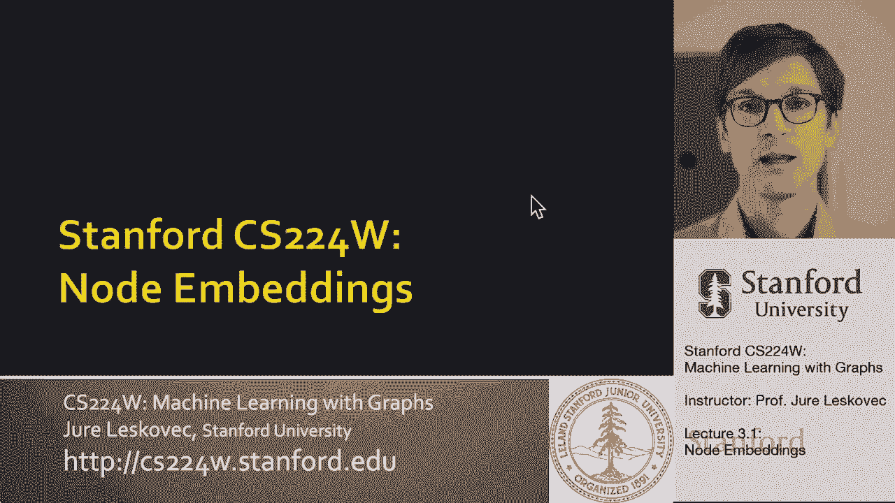
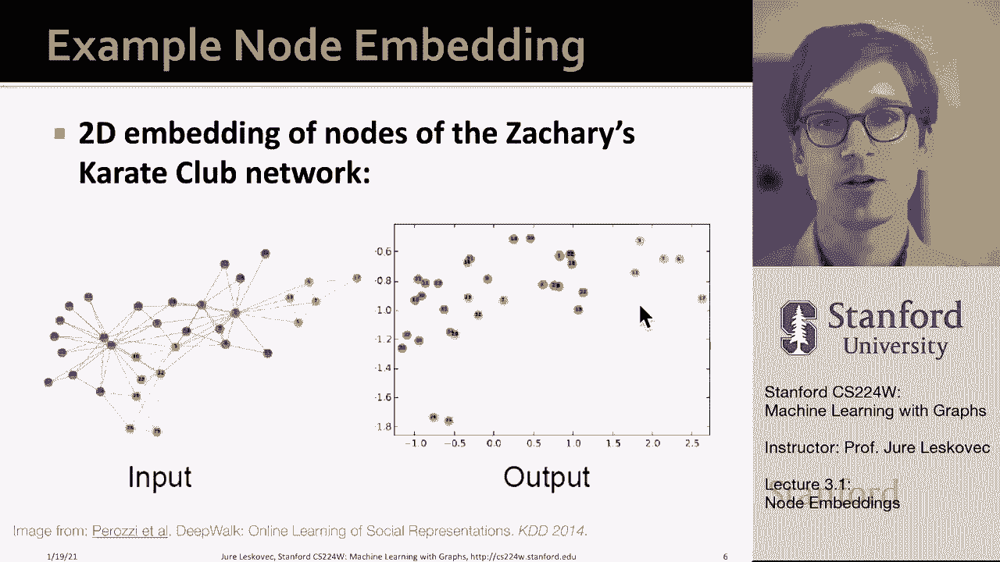
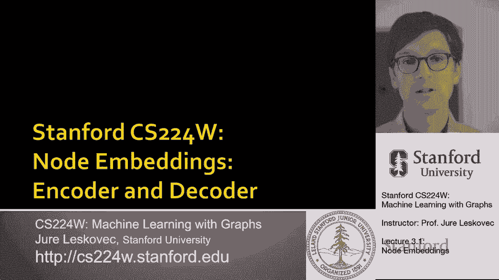
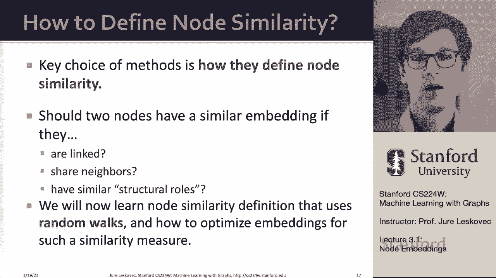

# 7：3.1 - 节点嵌入 🧩

在本节课中，我们将学习**节点嵌入**的核心概念。这是一种将图中的节点表示为低维向量的技术，旨在自动捕捉网络的结构信息，从而服务于下游的预测任务，如节点分类、链接预测和图分类。

---

## 核心思想与目标 🎯

上一节我们介绍了图分析的基本背景，本节中我们来看看节点嵌入的具体目标。

给定一个输入图，我们的目标是提取能够描述其拓扑结构（如节点间的连接或图级别的特征）的信息。传统方法依赖于人工特征工程，但节点嵌入旨在**自动化**这一过程。

具体做法是，为图中的每个节点生成一个D维向量，称为该节点的**特征表示**或**嵌入**。这个向量应能自动捕捉节点在网络中的结构信息。

将节点映射到嵌入空间后，**嵌入之间的相似性**应能反映**节点在网络中的相似性**。例如，网络中彼此靠近的节点，其嵌入在嵌入空间中也应彼此接近。这种编码后的结构信息可用于多种下游任务。

下图展示了一个小型网络的节点嵌入在二维空间中的可视化结果，不同颜色的节点被映射到了嵌入空间的不同区域，直观地展示了网络结构与嵌入空间的对应关系。

---

## 编码器-解码器框架 🔄

上一节我们了解了节点嵌入的目标，本节中我们将通过一个编码器-解码器框架来形式化这一过程。

我们将一个图表示为其**邻接矩阵A**，并假设节点没有额外的属性特征。目标是学习节点的嵌入，使得**嵌入空间中的相似性**（如点积）能够近似**原始网络中的相似性**。

以下是该框架的核心组件：

*   **编码器 (Encoder)**: 将节点映射为低维嵌入向量。我们使用一个简单的“浅层”编码器，即一个**嵌入查找矩阵**。
    *   公式：`ENC(v) = z_v`
    *   其中，`z_v` 是节点 `v` 的嵌入向量，存储在一个维度为 `|V| × d` 的矩阵 `Z` 中（`|V|` 是节点数，`d` 是嵌入维度）。这相当于为每个节点学习一个唯一的向量。

*   **相似度函数 (Similarity Function)**: 定义原始网络中两个节点的相似性。这是不同嵌入方法的核心区别所在。

*   **解码器 (Decoder)**: 从嵌入向量映射回相似性分数。我们使用简单的**点积**作为解码器。
    *   公式：`DEC(z_u, z_v) = z_u · z_v = z_u^T z_v`
    *   点积值高表示嵌入相似度高（向量方向接近）。

*   **优化目标**: 调整编码器的参数（即嵌入矩阵 `Z`），使得解码出的相似性 `DEC(ENC(u), ENC(v))` 尽可能接近由相似度函数定义的原始网络相似性 `similarity(u, v)`。

这种方法的参数数量与节点数成正比（`|V| × d`），对于超大规模图可能面临可扩展性挑战。后续课程将介绍如图神经网络等“深度”编码器来解决此问题。

---

## 定义节点相似性：随机游走 🚶‍♂️

上一节我们建立了编码器-解码器框架，本节中我们来看看如何具体定义节点相似性。这是节点嵌入方法的关键。

我们这里不使用任何节点标签或属性信息，仅基于网络拓扑结构来定义相似性。我们将根据**随机游走**来定义节点的相似性。

随机游走相似性的核心思想是：如果从节点 `u` 开始的随机游走序列经常访问到节点 `v`，那么节点 `u` 和 `v` 是相似的。

以下是基于随机游走定义相似性的步骤：

1.  从图中的一个节点开始，随机选择一条边移动到邻居节点，重复此过程，生成一个节点序列。
2.  定义 `N_R(u)` 为从节点 `u` 开始进行固定长度随机游走所访问到的节点集合（称为上下文节点）。
3.  优化节点嵌入，使得一个节点与其随机游走上下文节点在嵌入空间中是相似的。也就是说，对于每个节点 `u`，我们希望其嵌入 `z_u` 与 `N_R(u)` 中所有节点 `v` 的嵌入 `z_v` 的点积尽可能大。

通过优化这个目标，节点的嵌入将能捕捉到其局部网络邻域的结构信息。我们将学习两种基于此思想的具体方法：**DeepWalk** 和 **node2vec**。

---

## 总结 📝

本节课中我们一起学习了节点嵌入的基本概念。

*   我们首先了解了节点嵌入的目标：**自动学习**节点的低维向量表示，以捕捉网络结构，替代手工特征工程。
*   接着，我们通过**编码器-解码器框架**形式化了这个问题。编码器（如嵌入查找）将节点映射为向量，解码器（如点积）计算嵌入相似性，并通过优化使嵌入相似性逼近网络定义的节点相似性。
*   最后，我们介绍了基于**随机游走**来定义节点相似性的思想，这是 DeepWalk 和 node2vec 等流行方法的基础。

通过本课的学习，你应该对节点嵌入为何有用、其基本框架如何工作，以及如何利用随机游走定义相似性有了清晰的认识。