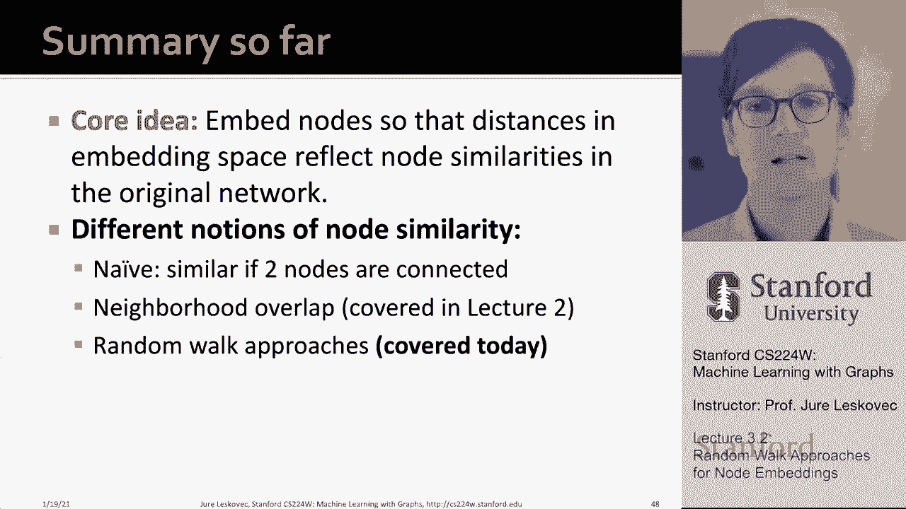

# 8：3.2 - 随机游走节点嵌入方法 🚶‍♂️➡️🧩

在本节课中，我们将学习如何利用随机游走的方法为图中的节点生成嵌入。我们将从核心概念出发，逐步讲解如何定义节点相似性、构建优化目标，并最终通过高效的算法学习到节点的向量表示。

---

## 概述

节点嵌入的目标是为图中的每个节点学习一个低维向量表示。本节课的核心思想是：**如果两个节点在随机游走中经常共同出现，那么它们在嵌入空间中也应该彼此接近**。我们将通过定义基于随机游走的节点相似性，并构建一个最大似然优化问题来学习这些嵌入。

---

## 核心概念与函数

在深入方法之前，我们需要理解两个关键的数学函数。

### Softmax函数

Softmax函数将一组实数转换成一个概率分布。给定一个向量，Softmax会放大其中的最大值，使其获得更高的概率。

**公式**：
对于一个包含 `k` 个实数的向量 `z`，其第 `i` 个元素的Softmax值为：
`softmax(z_i) = exp(z_i) / Σ_{j=1}^{k} exp(z_j)`

### Sigmoid函数

Sigmoid函数是一个S形函数，它将任意实数映射到(0, 1)区间内。

**公式**：
`sigmoid(x) = 1 / (1 + exp(-x))`

---

## 什么是随机游走？🔄

上一节我们介绍了用于概率转换的核心函数，本节中我们来看看定义节点相似性的基础——随机游走。

随机游走是图上一个简单的探索过程：
1.  从某个起始节点开始。
2.  随机选择当前节点的一个邻居。
3.  移动到该邻居节点。
4.  重复步骤2和3，进行固定步数。

这个过程中访问的节点序列，就构成了一次随机游走。随机游走可以重复访问节点和边。

---

## 基于随机游走的节点相似性

我们如何利用随机游走定义节点相似性呢？思路是：**从节点 `u` 开始的随机游走访问到节点 `v` 的概率，反映了 `u` 和 `v` 的相似度**。

我们希望学习到的节点嵌入 `z_u` 和 `z_v`，使得它们的点积 `z_u · z_v` 近似于这个共现概率。点积越大，表示两个向量在嵌入空间中越接近，对应节点也越相似。

使用随机游走定义相似性的好处包括：
*   **表达性强且灵活**：可以捕捉局部和高阶的邻域信息。
*   **高效**：训练时只需考虑在随机游走中共同出现的节点对，而非所有节点对。

---

## 优化目标：最大似然估计

我们的目标是学习一个映射函数 `f: u -> z_u`，将每个节点映射到其嵌入向量。

以下是构建优化问题的步骤：
1.  对图中每个节点 `u`，运行固定长度的随机游走。
2.  将这次游走访问的节点集合（允许重复）定义为节点 `u` 的邻域 `N_R(u)`。
3.  我们希望嵌入能够预测这些邻域节点。

因此，优化目标是**最大化所有节点预测其随机游走邻域节点的对数似然**。

**目标函数公式**：
`max Σ_{u ∈ V} Σ_{v ∈ N_R(u)} log P(v | z_u)`

其中，条件概率 `P(v | z_u)` 使用Softmax定义：
`P(v | z_u) = exp(z_u · z_v) / Σ_{n ∈ V} exp(z_u · z_n)`

这个公式的直觉是：我们想让起始节点 `u` 与其邻域节点 `v` 的点积尽可能大，同时让 `u` 与图中所有其他节点 `n` 的点积尽可能小。

---

## 计算挑战与负采样

直接优化上述目标函数计算量巨大，因为Softmax分母需要对图中所有节点求和，复杂度是 `O(|V|^2)`。

为了解决这个问题，我们采用**负采样**技术进行近似。

负采样的核心思想是：不再用所有节点做归一化，而是只使用一小部分“负样本”节点。我们采样 `k` 个负样本节点，这些节点通常不是 `u` 的邻居，并且采样概率与其节点度数成正比（度数高的节点更常被选为负样本）。

**近似优化目标公式**：
`log σ(z_u · z_v) - Σ_{i=1}^{k} log σ(z_u · z_{n_i})`
其中，`σ` 是Sigmoid函数，`n_i` 是第 `i` 个负样本。

实践中，`k` 值通常取5到20之间，在估计的稳健性和计算效率之间取得平衡。

---

## 优化算法：随机梯度下降

我们使用随机梯度下降来求解这个优化问题。其基本思想是：
1.  随机初始化所有节点的嵌入向量。
2.  重复以下步骤直到收敛：
    *   随机选取一个节点 `u` 及其邻域中的一个节点 `v`。
    *   采样 `k` 个负样本节点。
    *   计算当前参数下目标函数关于这些节点嵌入的梯度。
    *   **沿梯度相反方向，以一个小步长（学习率）更新嵌入向量**。

**更新公式（概念性）**：
`z := z - η * ∇L`
其中 `η` 是学习率，`∇L` 是损失函数 `L` 的梯度。

随机梯度下降的优势在于，它每次只基于一个或一小批样本更新参数，速度远快于计算全部数据梯度的传统梯度下降法。

---

## 更丰富的游走策略：Node2Vec 🧭

上一节我们介绍了基础的随机游走和优化方法，本节中我们来看看如何通过改进游走策略来获得更具表达力的嵌入。

基础的均匀随机游走可能限制了对网络结构的捕捉。Node2Vec方法提出了一种**有偏的二阶随机游走**策略，它通过两个参数在“广度优先”和“深度优先”探索之间进行权衡。

### 游走参数
*   **返回参数 `p`**：控制游走返回上一节点的概率。
    *   `p` 值小，则更容易返回，游走更倾向于在局部徘徊（类似BFS）。
*   **进出参数 `q`**：控制游走向更远节点探索的概率。
    *   `q` 值小，则更容易走向远方，游走更倾向于深度探索（类似DFS）。
    *   `q` 值大，则更倾向于停留在起始节点附近。

### 游走过程
假设游走刚从节点 `t` 走到节点 `v`，现在需要决定下一个节点 `x`。`x` 与前一节点 `t` 的距离关系分为三种：
1.  **返回**：`x = t`（距离0）。
2.  **保持相同距离**：`x` 是 `v` 的邻居，且与 `t` 距离为1。
3.  **走向更远**：`x` 是 `v` 的邻居，且与 `t` 距离为2。

Node2Vec为非归一化的转移概率设定权重：
*   返回 `t` 的权重为 `1/p`
*   保持距离的权重为 `1`
*   走向更远的权重为 `1/q`

通过调整 `p` 和 `q`，我们可以让游走策略适应不同的任务需求。

---

## 方法总结与比较

本节课中我们一起学习了基于随机游走的节点嵌入方法。让我们总结一下关键点：

**核心流程**：
1.  为图中每个节点生成随机游走序列（可使用Node2Vec等有偏策略）。
2.  将游走序列中共同出现的节点对视为正样本。
3.  通过负采样构造负样本。
4.  使用随机梯度下降优化目标函数，学习节点嵌入。

**方法特点**：
*   **优点**：表达力强，能捕捉网络局部和全局结构；通过随机游走和负采样，算法效率较高，可并行化。
*   **缺点**：需要为每个节点学习独立的嵌入，对于超大图存储开销大；且无法直接泛化到训练时未见过的新节点。

**方法选择**：
没有一种方法在所有任务上都是最优的。例如，Node2Vec在节点分类任务上表现突出，而其他方法可能在链接预测上更优。选择时应考虑任务特性，并匹配最合适的节点相似性定义。

---

## 延伸阅读

如果你想深入了解，可以查阅以下论文：
*   **DeepWalk**：首次将随机游走与语言模型技术应用于网络嵌入。
*   **Node2Vec**：提出了有偏随机游走，在探索网络时灵活性更高。
*   **LINE**：定义了明确的一阶与二阶相似性目标。
*   **Goyal & Ferrara的综述**：系统比较了多种网络嵌入方法在不同任务上的性能。