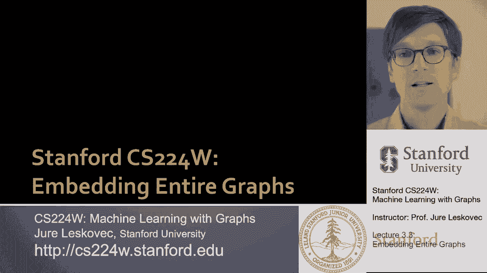
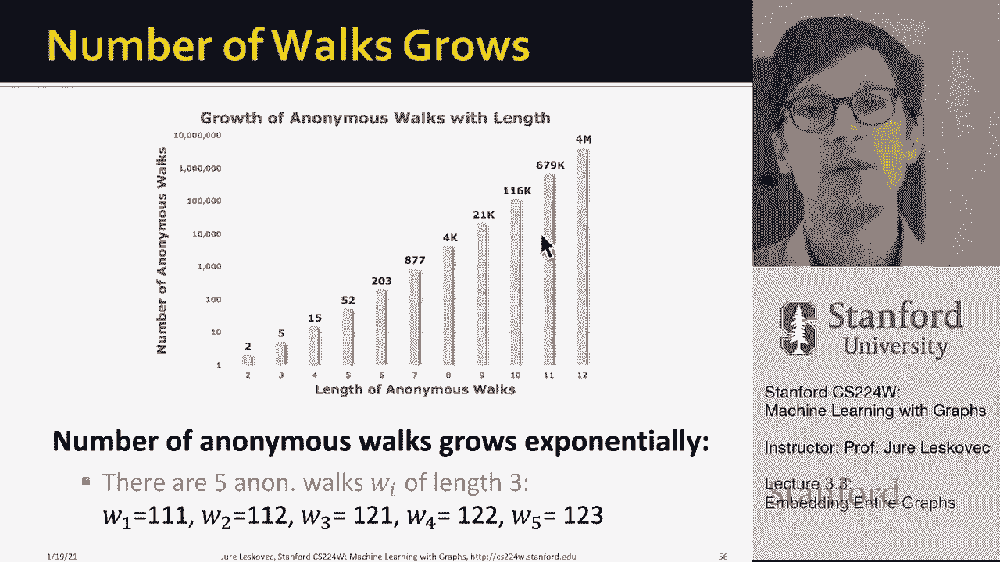

# 9：3.3 - 嵌入整个图 🧩


在本节课中，我们将学习如何将整个图或子图嵌入到低维向量空间中。这与之前嵌入单个节点的方法不同，其目标是为整个图结构生成一个统一的表示。我们将重点介绍一种基于**匿名随机游走**的方法。



---

## 概述

之前我们学习了如何为图中的单个节点生成嵌入。本节我们将探讨三种为整个图生成嵌入的思路：简单聚合节点嵌入、引入虚拟节点，以及基于**匿名随机游走**的方法。我们将详细讲解第三种方法，并了解如何将其应用于图分类等下游任务。

---

## 方法一：聚合节点嵌入

第一个思路非常简单直接。我们可以先运行标准的节点嵌入技术（如DeepWalk或Node2Vec），然后对图中所有节点的嵌入进行求和或平均，以此作为整个图的嵌入。

**公式表示如下：**
```
Z_G = (1/|V|) * Σ_{v∈V} z_v
```
其中 `Z_G` 是图的嵌入，`V` 是图中所有节点的集合，`z_v` 是节点 `v` 的嵌入。

这种方法虽然简单，但在实践中（例如在2016年的分子分类任务中）被证明非常有效。

---

## 方法二：引入虚拟节点

对平均节点嵌入思路的一个改进是引入一个**虚拟节点**来代表整个图或子图。

具体操作如下：
1.  创建一个虚拟节点，并将其连接到我们想要嵌入的那组节点（若要嵌入整个图，则连接到所有节点）。
2.  在这个扩展后的新图上运行标准的节点嵌入算法（如DeepWalk或Node2Vec）。
3.  将学习到的虚拟节点的嵌入 `z_virtual` 作为整个图 `G` 的嵌入 `Z_G`。



这种方法通过图结构本身的学习过程来生成图级表示，比简单的平均更为巧妙。

---

## 方法三：匿名随机游走

上一节我们介绍了通过虚拟节点获取图嵌入的方法。本节中，我们来看看一种更抽象、基于**匿名随机游走**的图嵌入方法。

### 什么是匿名随机游走？

匿名随机游走的核心思想是：在记录游走路径时，我们不记录节点的真实身份（如A、B、C），而是记录节点是**第几个被首次访问**的。

**举个例子：**
假设我们有一个图，从节点A出发的一条随机游走路径为：A -> B -> C -> B -> C。
-   第一步访问A，它是第一个被访问的节点，记为 `1`。
-   第二步访问B，它是第二个被访问的新节点，记为 `2`。
-   第三步访问C，它是第三个被访问的新节点，记为 `3`。
-   第四步再次访问B，B已被访问过，因此仍记为 `2`。
-   第五步再次访问C，C已被访问过，因此仍记为 `3`。
因此，这条游走的**匿名表示**为序列：`[1, 2, 3, 2, 3]`。

关键点在于，两条访问了不同节点但访问顺序相同的游走，会得到相同的匿名表示。这使得嵌入能够捕捉图的结构模式，而非具体的节点标签。

### 如何用匿名游走表示图？

一个直观的想法是：在图上进行大量长度为 `L` 的匿名随机游走采样，并统计每种匿名游走序列出现的频率。

**具体步骤如下：**
1.  选择匿名游走的长度 `L`（例如L=3）。
2.  在图上进行大量随机游走采样。
3.  将每条游走转换为匿名表示（如 `[1,2,1]`）。
4.  统计所有可能的匿名序列出现的概率，形成一个概率分布向量。

这个向量就可以作为图的嵌入。`L` 越大，可能的匿名序列越多，嵌入的维度就越高，能捕捉更复杂的结构信息。

### 需要采样多少次？

为了保证估计出的匿名游走概率分布足够准确，我们需要采样足够多的随机游走。所需的采样次数 `N` 可以通过以下公式估算：
```
N = (2 / ε²) * (log(2^L - 2) - log(δ))
```
其中：
-   `ε` 是容忍的误差。
-   `δ` 是允许的失败概率。
-   `L` 是匿名游走长度。
-   `2^L - 2` 近似为长度为 `L` 的可能匿名游走数量。

例如，当 `L=7`， `ε=0.1`， `δ=0.1` 时，大约需要采样12万次随机游走。

### 学习匿名游走的嵌入

我们还可以更进一步，不直接使用计数，而是像Word2Vec学习词向量一样，为**每一种匿名游走序列**也学习一个嵌入 `z_wi`。

**目标函数**是：给定一个图 `G` 的嵌入 `z_G` 和从某个节点 `u` 开始的匿名游走序列，我们希望最大化在同一个上下文窗口内共同出现的匿名游走序列的概率。

这类似于DeepWalk，但邻域 `N_R(u)` 的定义从“共现的节点”变成了“从节点 `u` 开始采样时共同出现的匿名游走序列”。

**优化目标公式如下：**
```
maximize Σ_{u∈V} Σ_{t∈[T-Δ, T+Δ]} log P(w_t | z_G, z_{w_{t±Δ}})
```
通过这种联合优化，我们可以同时学到图的嵌入 `z_G` 和每种匿名游走的嵌入 `z_wi`。

---

## 图嵌入的应用

学习到图的嵌入 `Z_G` 后，我们可以将其用于各种下游预测任务，例如：

以下是图嵌入的几个主要应用场景：
*   **图分类**：将 `Z_G` 输入一个分类器（如神经网络），预测图的标签（例如，分子是否有毒）。
*   **社区检测/节点聚类**：对节点的嵌入 `z_i` 运行聚类算法（如K-Means），以发现图中的社区结构。
*   **节点分类**：直接使用节点的嵌入 `z_i` 来预测该节点的标签。
*   **链路预测**：预测两个节点之间是否存在边。可以通过组合两个节点的嵌入来实现：
    *   **连接（Concatenate）**：`[z_i, z_j]`，适用于有向图。
    *   **哈达玛积（Hadamard Product）**：`z_i ⊙ z_j`，适用于无向图（具有交换性）。
    *   **求和/平均**：`z_i + z_j` 或 `(z_i + z_j)/2`，同样适用于无向图。
    *   **L2距离**：`||z_i - z_j||₂`。

---

## 总结

本节课中我们一起学习了如何为整个图生成嵌入表示。我们探讨了三种方法：
1.  **聚合节点嵌入**：对图中所有节点的嵌入进行平均或求和。
2.  **虚拟节点法**：引入代表全图的虚拟节点，并通过标准节点嵌入技术学习其嵌入。
3.  **匿名随机游走**：通过采样并统计匿名化的游走序列来表征图结构，并可进一步学习游走序列和图的联合嵌入。


这些方法使我们能够将复杂的图结构转换为固定长度的低维向量，从而方便地应用于图分类、社区发现等多种机器学习任务。在后续课程中，我们还将看到使用图神经网络进行层次化图嵌入等更高级的方法。