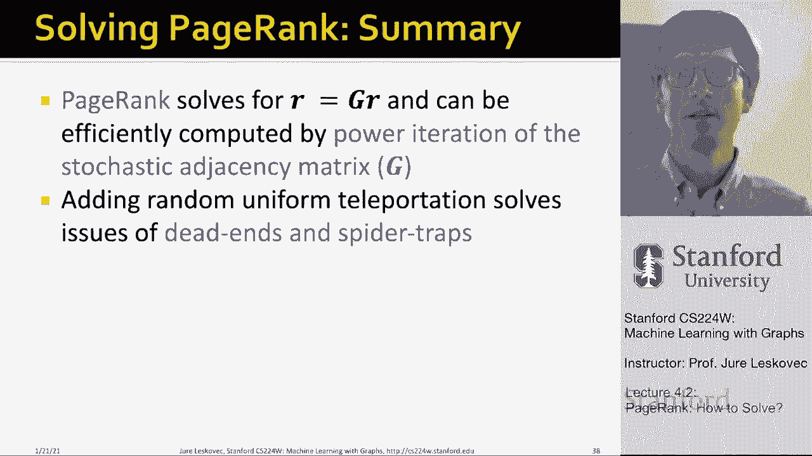

# 11：4.2 - PageRank 如何求解？ 🔍

在本节课中，我们将学习如何实际计算PageRank向量 `r`。我们将介绍一种名为“幂迭代”的有效方法，并探讨在计算过程中可能遇到的问题及其解决方案。

---

## 幂迭代法

上一节我们介绍了PageRank的基本方程。本节中我们来看看如何通过迭代过程求解这个方程。

核心思想是：给定一个有 `n` 个节点的图，我们通过一个迭代过程来逐步更新排名向量 `r`。

以下是算法的基本步骤：

1.  **初始化**：为每个节点分配一个初始的PageRank分数。可以均匀分配，也可以随机分配。
2.  **迭代更新**：重复应用更新公式，直到向量 `r` 的变化足够小。
3.  **收敛判断**：比较当前估计 `r^(t)` 和上一轮估计 `r^(t-1)`。如果向量中所有元素的变化总和小于一个预设的极小值 `ε`，则认为算法已收敛。

具体的迭代方程可以写作：
**`r^(t+1) = M * r^(t)`**
其中 `M` 是图的列随机邻接矩阵。

这个方程保证了迭代最终会收敛到矩阵 `M` 的主特征向量，即我们想要的PageRank向量。在实践中，大约进行50次迭代即可得到稳定的解。

---

## 潜在问题与挑战

虽然幂迭代法看起来简单有效，但在实际应用中会遇到两个主要问题。

### 1. 死胡同
死胡同是指那些没有出链的网页。在随机游走模型中，一旦到达死胡同节点，游走者将无处可去，导致重要性“泄漏”，最终所有节点的PageRank分数都可能收敛到零。

### 2. 蜘蛛陷阱
蜘蛛陷阱是指一组节点，其所有出链都指向组内节点（例如一个自循环）。随机游走者一旦进入这个组，就会被困住，最终该组会吸收网络中几乎所有的重要性，导致排名结果不合理。

---

## 解决方案：随机传送（Teleport）

为了解决上述问题，我们引入“随机传送”机制。其核心思想是：在每一步，随机游走者有两个选择。

以下是随机游走者的行为规则：

*   以概率 **`β`**（通常设为0.8到0.9），随机游走者沿着当前节点的出链前进。
*   以概率 **`1 - β`**，随机游走者“传送”到网络中的**任何一个**随机页面（包括当前页面），每个页面被选中的概率相同，均为 `1/n`。

这个机制通过以下方式解决问题：

*   **解决蜘蛛陷阱**：即使游走者进入蜘蛛陷阱，它也有一定概率通过传送跳出来，从而避免了重要性被单一节点或群组垄断。
*   **解决死胡同**：对于死胡同节点，我们可以将其视为以概率1进行传送（即强制跳转到随机页面），从而保证了转移矩阵的列随机性，使数学计算得以成立。

引入随机传送后，PageRank的更新公式变为：
**`r_j = β * Σ_{i→j} (r_i / d_i) + (1 - β) / n`**

这个公式可以写成矩阵形式：
**`G = βM + (1 - β) * (1/n) * ee^T`**
其中 `e` 是全1的列向量。新的迭代方程为：
**`r = G * r`**

我们依然可以使用幂迭代法在这个新的随机矩阵 `G` 上进行计算。

---

## 实例演示

让我们通过一个简单的例子来看随机传送的效果。假设有一个包含蜘蛛陷阱的图，设置 `β = 0.8`。

经过多次幂迭代后，PageRank分数会收敛到一个稳定分布。结果显示，即使存在蜘蛛陷阱，由于传送机制，所有节点仍然会获得非零的重要性分数，但蜘蛛陷阱节点的重要性不会无限膨胀。

在一个更复杂的图中，PageRank的结果会呈现出一些有趣的特性：
*   即使是没有入链的节点，也会因为传送机制而获得少量重要性。
*   从一个重要节点获得一个入链，比从多个不重要节点获得入链更能提升自身的重要性。
*   PageRank分数综合考量了入链的数量和质量。

---

## 总结

本节课中我们一起学习了如何求解PageRank。

1.  我们介绍了**幂迭代法**，这是一种通过矩阵乘法迭代来高效计算PageRank向量的方法。
2.  我们探讨了计算中可能遇到的**死胡同**和**蜘蛛陷阱**问题。
3.  我们引入了**随机传送**机制作为通用解决方案，并给出了更新后的PageRank公式 **`r = G * r`**。
4.  最终，我们看到了PageRank如何综合考虑链接的数量与质量，从而为网页给出合理的全局重要性评分。这种方法数学优美，且能扩展到包含数百亿节点的大型网络图上进行计算。