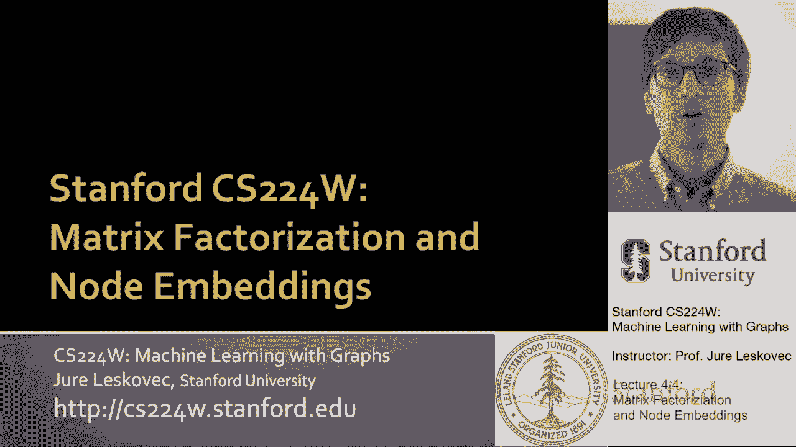
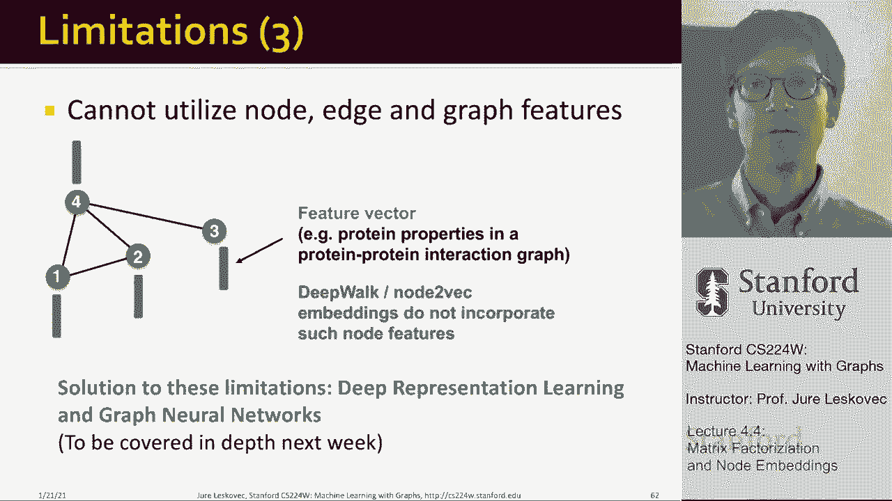

# 13：4.4 - 矩阵分解与节点嵌入 📊

在本节课中，我们将学习节点嵌入与矩阵分解之间的深刻联系。我们将看到，基于随机游走的节点嵌入方法，本质上可以归结为对图的邻接矩阵（或其某种变换形式）进行分解。理解这种联系，有助于我们从更统一的数学视角来看待各种图嵌入算法。

---

## 从节点嵌入到矩阵分解 🔄

上一节我们介绍了节点嵌入的基本框架，即通过编码器-解码器结构，最大化相似节点对之间的嵌入点积。本节中，我们来看看如何将这一目标形式化为一个矩阵分解问题。

我们的目标是学习一个嵌入矩阵 **Z**，其维度为 `(d, |V|)`，其中 `d` 是嵌入维度，`|V|` 是节点数。矩阵 **Z** 的每一列 `z_v` 存储了节点 `v` 的嵌入向量。

在编码器-解码器框架中，我们希望最大化相似节点对的嵌入点积。如果我们采用最简单的相似性定义：**两个节点相似当且仅当它们之间存在一条边**，那么我们的目标就变为：用嵌入向量的点积来近似图的邻接矩阵 **A**。

具体来说，对于任意节点对 `(u, v)`：
*   如果 `(u, v)` 之间存在边（即 `A[u, v] = 1`），我们希望 `z_u^T * z_v ≈ 1`。
*   如果 `(u, v)` 之间无边（即 `A[u, v] = 0`），我们希望 `z_u^T * z_v ≈ 0`。

将这个目标用矩阵形式表达，我们就是在尝试近似：
**A ≈ Z^T * Z**

这被称为**矩阵分解**，因为我们试图将邻接矩阵 **A** 分解为两个矩阵 **Z^T** 和 **Z** 的乘积。由于嵌入维度 `d` 通常远小于节点数 `|V|`，这个等式通常无法精确成立。因此，我们的目标是找到一个矩阵 **Z**，使得 `Z^T * Z` 在某种度量下尽可能接近 **A**，常用的度量是**弗罗贝尼乌斯范数**（即矩阵元素差值的平方和）。

因此，结论是：**基于边连通性（即邻接矩阵）的节点相似性定义，配合内积解码器，等价于对邻接矩阵 A 进行分解。**

---

## 更复杂的相似性与矩阵分解 🧩

上一节我们讨论了最简单的基于边的相似性。本节中我们来看看，当我们使用更复杂的、基于随机游走的相似性定义时，情况会如何。

事实证明，基于随机游走的节点嵌入方法（如 DeepWalk、node2vec）同样可以统一到矩阵分解的框架下。区别在于，此时我们分解的不再是原始的邻接矩阵 **A**，而是它的一个**变换矩阵**。

以下是 DeepWalk 方法对应的矩阵分解形式：
**log(vol(G) / b * (∑_{r=1}^T (D^{-1} A)^r) D^{-1}) ≈ Z^T * Z**

其中：
*   **A** 是邻接矩阵。
*   **D** 是度矩阵（对角矩阵）。
*   **T** 是随机游走的长度（即上下文窗口大小）。
*   **vol(G)** 是图的体积（所有节点度之和）。
*   **b** 是负采样中使用的负样本数量。

这意味着，通过模拟随机游动并进行梯度下降来优化节点嵌入，在数学上等价于分解上述这个经过复杂变换的矩阵。这个结论将 DeepWalk、node2vec 等多种算法统一到了一个数学框架中。

---

## 当前方法的局限性 🚧

通过矩阵分解或随机游走学习节点嵌入的方法虽然强大，但也存在一些明显的局限性。了解这些局限性有助于我们理解为何需要更先进的图表示学习方法。

以下是当前方法的主要局限：

1.  **无法处理新节点**：这些方法是**直推式**的。它们只能为训练时图中存在的节点生成嵌入。如果图是动态的，出现了新节点，我们必须为全图重新计算所有嵌入，这非常低效。
2.  **无法捕捉结构等价性**：这些方法更关注**节点的邻居身份**，而非**节点的局部网络结构**。例如，两个在不同子图中具有完全相同局部连接结构的节点，可能会得到完全不同的嵌入，因为它们的邻居ID不同。
3.  **无法利用节点、边及图的特征**：这些方法仅从图的结构（连接关系）中学习嵌入，无法自然地融合节点自身附带的特征向量（如用户属性、蛋白质特征）、边特征或整个图的全局特征信息。

---

## 总结与展望 📝

本节课中我们一起学习了以下内容：

*   我们从最简单的基于边的相似性出发，揭示了**节点嵌入与矩阵分解**之间的等价关系：用内积解码器近似邻接矩阵 `A ≈ Z^T * Z`。
*   我们进一步了解到，更复杂的基于随机游走的嵌入方法（如 DeepWalk）同样可以视为对**邻接矩阵的某种变换**进行矩阵分解。
*   最后，我们讨论了这些方法的局限性，包括无法泛化到新节点、难以捕捉结构相似性，以及无法利用丰富的特征信息。

这些局限性正是我们接下来要学习的**图神经网络**所要解决的核心问题。图神经网络能够以归纳的方式学习节点表示，融合结构与特征信息，从而为更复杂、更动态的图学习任务提供强大的解决方案。