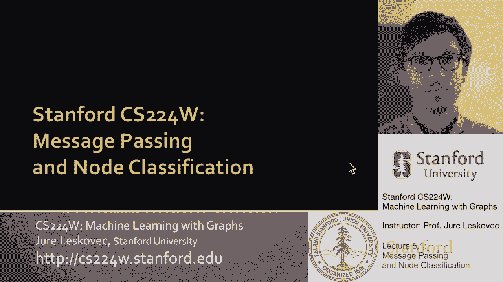
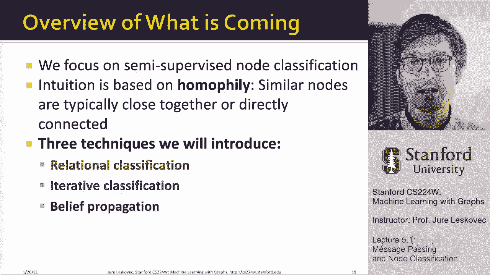

# 14：5.1 - 消息传递与节点分类 🧠

在本节课中，我们将要学习如何利用网络中的关联性，通过消息传递的框架来预测未标记节点的类别。这是一种半监督的节点分类方法，它结合了节点的自身特征和其邻居节点的标签信息。

## 概述

我们面临的问题是：给定一个部分节点带有标签（例如，可信或欺诈）的网络，如何预测其余未标记节点的标签？核心思想是，网络中相连的节点往往具有相似的标签，这种现象被称为同质性或影响力。我们将利用这种关联性，通过三种经典技术——关系分类、迭代分类和置信度传播——来迭代地更新和推断节点的标签。

## 网络中的关联性

上一节我们介绍了问题的背景，本节中我们来看看为何网络中会存在标签的关联性。个体行为在网络结构中通常是相关的，这意味着相邻的节点往往拥有相同的标签或属于同一类别。这主要由两种社会现象驱动：

*   **同质性**：指具有相似特征的个体倾向于彼此建立联系。例如，研究同一领域的研究人员更可能合作。
*   **影响力**：指社会连接会影响个体的特征或行为。例如，朋友之间会相互影响音乐品味。

这两种现象导致了网络中“物以类聚”的效应，即连接在一起的节点标签相似。这正是我们进行节点分类算法设计的基础直觉。

## 集体分类框架

基于上述关联性，我们采用“集体分类”的框架。其核心假设是：一个节点的标签取决于其自身特征**以及**其邻居节点的标签。这是一个概率框架，并遵循马尔可夫假设，即一个节点的标签仅依赖于其直接邻居的标签。

集体分类方法包含三个关键组成部分：

1.  **局部分类器**：用于为未标记节点分配初始标签，仅基于节点自身的属性，不利用网络信息。
2.  **关系分类器**：用于捕捉节点间的关联性，基于节点邻居的标签或属性来预测该节点的标签。这里开始利用网络结构。
3.  **集体推理**：迭代地应用关系分类器，在整个网络上传播标签信息，直到预测结果稳定或达到最大迭代次数。

## 方法一：关系分类

首先，我们来看第一种具体方法——关系分类。这是一种概率性方法，它直接利用邻居节点的标签分布来预测当前节点的标签。

其基本思路是：初始化所有未标记节点的标签（例如，使用局部分类器或随机初始化）。然后，我们迭代地扫描所有未标记节点，基于其**已标记邻居**的当前标签，按照以下公式更新其属于某类别 `c` 的概率：

**P(Y_v = c) = (1 / |N(v)|) * Σ_{u ∈ N(v)} P(Y_u = c)**

其中，`N(v)` 表示节点 `v` 的邻居集合。简单来说，节点 `v` 属于类别 `c` 的概率是其邻居节点属于类别 `c` 的平均概率。

以下是算法步骤的简述：

1.  将所有已标记节点的标签概率设为 1（对于其真实类别）或 0。
2.  初始化所有未标记节点的标签概率（例如，均匀分布或基于局部分类器）。
3.  按随机顺序遍历未标记节点，根据其**所有邻居的当前概率**，使用上述公式计算其属于每个类别的概率。
4.  将节点 `v` 的标签更新为概率最高的类别。
5.  重复步骤 3 和 4，直到所有节点的标签不再变化，或达到最大迭代次数。

**需要注意**：此方法可能不收敛，特别是当图中存在“标签冲突”的邻居结构时。它更适用于同质性很强的网络。

## 方法二：迭代分类

上一节介绍的关系分类器直接使用邻居标签。迭代分类方法则更为通用，它通过构建一个包含节点自身特征和**邻居标签摘要**的增强特征向量来进行分类。

其核心思想是：我们训练一个分类器（如逻辑回归、神经网络），其输入特征不仅包括节点自身的属性 `f_v`，还包括从其邻居标签中聚合而来的统计信息 `z_v`。

以下是构建邻居摘要特征 `z_v` 的一些常见方法：
*   邻居中不同标签的计数。
*   邻居中最常见标签（众数）。
*   邻居标签的列表（需定长编码）。

迭代分类算法分为两个阶段：

**阶段1：训练**
*   使用**已标记节点**的数据，训练两个分类器：
    *   **Φ1(f_v)**：仅基于节点自身特征 `f_v` 预测标签。
    *   **Φ2(f_v, z_v)**：基于节点自身特征 `f_v` 和邻居标签摘要 `z_v` 预测标签。计算 `z_v` 时需要已知邻居的真实标签。

**阶段2：迭代推理**
1.  使用分类器 Φ1 为所有未标记节点预测初始标签 `Y_v`。
2.  基于当前所有节点的预测标签 `Y`，为每个节点计算邻居摘要特征 `z_v`。
3.  使用分类器 Φ2(f_v, z_v) 为所有节点（或仅未标记节点）更新预测标签 `Y_v`。
4.  重复步骤 2 和 3，直到所有节点的标签稳定，或达到最大迭代次数。

这种方法更灵活，可以融入更复杂的邻居聚合函数和分类模型。

## 方法三：置信度传播

最后，我们介绍置信度传播。这是一种在概率图模型中进行精确推理的流行方法。它将节点分类问题转化为在由网络构成的“马尔可夫随机场”中传递“消息”并进行概率推断的问题。

BP 的核心是迭代地在相连的节点之间传递“消息”。消息 `m_{i->j}(Y_j)` 可以理解为节点 `i` 基于其自身信息，对节点 `j` 应该属于标签 `Y_j` 的“意见”或“支持度”。

每个节点 `v` 都会维护一个“置信向量” `b_v(Y_v)`，表示当前认为该节点属于各个标签的概率。置信度通过以下方式更新：
*   考虑节点自身的局部证据（由其特征得出）。
*   综合来自所有邻居节点传递来的消息。

算法流程简述如下：

1.  **初始化**：将所有已标记节点的标签固定（对应类别置信度为1），未标记节点的置信度初始化为均匀分布或先验概率。所有消息初始化为1。
2.  **迭代传播**：
    *   每个节点 `i` 计算并向外发送给每个邻居 `j` 的消息。消息综合了 `i` 自身的局部证据和来自 `i` 的其他邻居（除了 `j`）的消息。
    *   公式化表示（简化版）：`m_{i->j}(Y_j) ← Σ_{Y_i} [Ψ(Y_i, Y_j) * φ(Y_i) * Π_{k ∈ N(i)\j} m_{k->i}(Y_i)]`
        *   `Ψ(Y_i, Y_j)`：节点 `i` 和 `j` 之间的势函数，编码了它们标签一致性的强度（同质性假设）。
        *   `φ(Y_i)`：节点 `i` 的局部证据（来自节点特征）。
3.  **置信度计算**：在所有消息传递一轮后，每个节点根据来自所有邻居的消息和自身局部证据更新其置信向量 `b_v(Y_v)`。
4.  **重复**步骤2和3，直到消息和置信度的变化小于某个阈值。
5.  **预测**：对于每个未标记节点 `v`，选择使其置信度 `b_v(Y_v)` 最大的标签 `Y_v` 作为预测结果。

BP 的优点是在树状结构网络上能保证收敛并计算出精确的边缘概率。在一般图中，它作为近似推断算法也通常非常有效。

## 总结

本节课中我们一起学习了半监督节点分类的核心思想与方法。我们了解到，利用网络中存在的同质性，可以通过消息传递来推断未标记节点的标签。

我们详细介绍了三种经典的集体分类技术：
1.  **关系分类**：直接根据邻居的标签概率来更新当前节点标签，简单直观但可能不稳定。
2.  **迭代分类**：通过构建包含邻居摘要的特征向量，使用标准分类器进行迭代预测，灵活性更高。
3.  **置信度传播**：基于概率图模型框架，通过在节点间迭代传递消息来更新置信度，具有坚实的概率基础。

这些方法为理解更现代的图神经网络奠定了重要基础。在图神经网络中，消息传递、邻居聚合等概念将以可学习、端到端的方式得到更强大的实现。