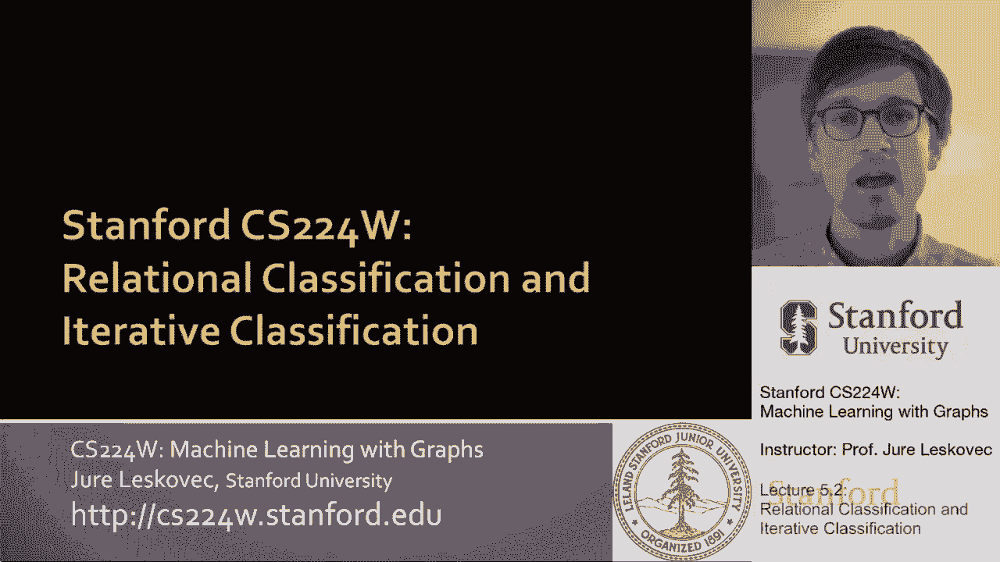
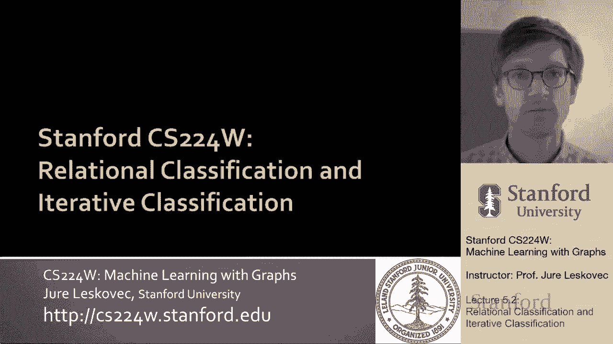
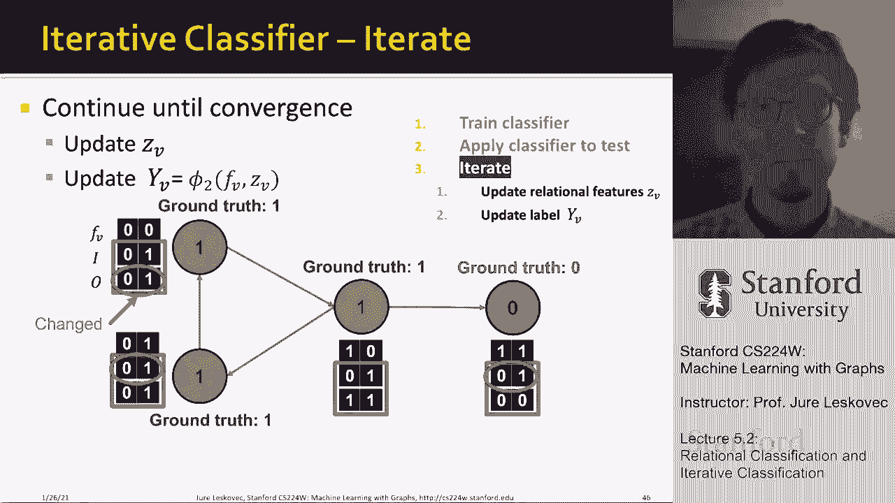

# 15：5.2 - 关系与迭代分类 🧠






在本节课中，我们将学习两种重要的图节点分类方法：关系分类和迭代分类。这两种方法都利用网络结构信息来预测未标记节点的标签，但它们在利用信息的方式上有所不同。我们将首先介绍关系分类，它仅使用节点标签和网络结构；然后探讨迭代分类，它进一步结合了节点的特征信息。

---

## 关系分类 🔗

上一节我们概述了课程内容，本节中我们来看看关系分类。关系分类的核心思想是：一个节点的类别概率，是其邻居节点类别概率的加权平均值。

这意味着，对于已标记的节点，我们固定其真实标签。对于未标记的节点，我们初始化其类别信念（例如，假设属于某个类别的概率为0.5）。然后，节点会根据其网络邻居的标签信念，迭代更新自身对类别的信念，直到收敛。**请注意，此方法仅使用节点标签和网络结构，不使用节点自身的属性特征。**

以下是更新节点信念的核心公式：

设节点 `v` 属于类别 `c` 的概率为 `P(Y_v = c)`。其更新公式为：
`P(Y_v = c) = (1 / Σ_{u∈N(v)} w_{vu}) * Σ_{u∈N(v)} [w_{vu} * P(Y_u = c)]`

其中：
*   `N(v)` 是节点 `v` 的邻居集合。
*   `w_{vu}` 是连接节点 `v` 和 `u` 的边的权重（对于无权图，可视为1）。
*   `P(Y_u = c)` 是邻居 `u` 属于类别 `c` 的概率。

**公式解读**：节点 `v` 属于类别 `c` 的概率，是其所有邻居属于类别 `c` 的概率的加权平均（并进行归一化）。这基于一个基本假设：网络中相连的节点更可能共享相同的标签。

### 关系分类工作流程示例

以下是关系分类在一个简单图上的迭代过程：

1.  **初始化**：
    *   标记节点（如绿色、红色）固定其真实标签概率（例如，绿色节点为1，红色节点为0）。
    *   未标记的灰色节点初始化其属于绿色类的概率为0.5。

2.  **迭代更新**：
    *   按一定顺序（例如节点ID顺序）更新每个未标记节点的概率。
    *   每个节点根据上述公式，计算其邻居当前概率的加权平均，作为自身新的概率。
    *   已标记节点的概率保持不变。

3.  **收敛**：
    *   重复迭代更新步骤，直到所有节点的概率变化很小或不再变化（即收敛）。
    *   最终，根据节点的最终概率（例如，大于0.5判为绿色，否则为红色）进行分类预测。

通过这种迭代，标签信息从已标记节点“传播”到未标记节点，最终完成对整个图的分类。

---

## 迭代分类 🔄

上一节我们介绍了仅使用标签和网络的关系分类，本节中我们来看看更强大的迭代分类。迭代分类的主要思想是：对一个节点 `v` 进行分类时，不仅依据其自身的属性特征 `f_v`，还依据其邻居节点的标签摘要 `z_v`。

这种方法结合了**节点特征信息**和**网络结构信息**。其工作流程分为两个阶段：分类器训练阶段和迭代应用阶段。

### 第一阶段：训练分类器

在此阶段，我们需要利用已标记的训练数据训练两个分类器：

1.  **基础分类器 φ₁**：该分类器**仅基于节点自身的特征向量 `f_v`** 来预测其标签 `Y_v`。可以使用任何分类模型，如逻辑回归、支持向量机或神经网络。
    ```python
    # 伪代码示例：训练基础分类器
    phi1 = train_classifier(X_features=train_node_features, y_labels=train_node_labels)
    ```

2.  **关系分类器 φ₂**：该分类器的输入有两部分：
    *   节点自身的特征向量 `f_v`。
    *   邻居标签摘要向量 `z_v`。这个向量总结了节点 `v` 的邻居们的标签分布情况（例如，邻居中属于各类别的数量或比例）。
    ```python
    # 伪代码示例：训练关系分类器
    # 首先为每个训练节点计算其邻居标签摘要 Z
    Z_summary = compute_neighbor_label_summary(graph, current_node_labels)
    # 然后使用特征和摘要一起训练
    phi2 = train_classifier(X_features_and_summary=[train_node_features, Z_summary], y_labels=train_node_labels)
    ```

### 第二阶段：迭代分类（在测试集/未标记节点上）

训练好分类器后，我们对未标记的节点进行如下迭代预测：

1.  **初始化**：使用基础分类器 φ₁ 为所有未标记节点预测一个初始标签。
2.  **迭代直至收敛**：
    a.  **计算摘要**：根据图中节点当前的标签（对于已标记节点是真实标签，对于未标记节点是上一轮的预测标签），为每个节点重新计算其邻居标签摘要向量 `z_v`。
    b.  **重新分类**：使用关系分类器 φ₂（输入为节点特征 `f_v` 和新的摘要 `z_v`）为每个节点重新预测标签。
    c.  **检查收敛**：如果节点的预测标签不再变化，或达到最大迭代次数，则停止；否则，回到步骤 (a)。

这个过程通过不断整合邻居的最新预测信息，来优化每个节点自身的分类结果。

### 迭代分类示例：网页主题分类

假设我们有一个网页链接图，任务是预测每个网页的主题（类别）。

*   **节点特征 `f_v`**：可以表示网页内容中的关键词向量。
*   **邻居标签摘要 `z_v`**：可以设计为一个向量，表示指向该网页的链接（入边）和该网页指向外部的链接（出边）中，各类别网页的数量。例如：
    `z_v = [入边中类别0的数量， 入边中类别1的数量， 出边中类别0的数量， 出边中类别1的数量]`

**工作流程**：
1.  首先，用 φ₁ 根据网页内容词向量预测其主题，得到初始标签。
2.  然后，进入迭代阶段：
    *   基于当前所有网页的标签，计算每个网页的 `z_v`（即其入链和出链网页的主题分布）。
    *   用 φ₂（考虑自身词向量 `f_v` 和链接主题分布 `z_v`）重新预测每个网页的主题。
    *   重复此过程。例如，一个网页如果内容模糊，但所有指向它的链接都来自“体育”主题的网页，那么迭代后它很可能也被分类为“体育”。

---

## 总结 📝



本节课中我们一起学习了两种基于图的集体分类方法。

1.  **关系分类**：该方法通过迭代方式，让节点根据其邻居的类别概率来更新自身的类别概率。它**只利用了网络结构和节点标签**，实现简单，适用于没有节点特征信息的场景。
2.  **迭代分类**：这是一种更通用的框架。它通过训练两个分类器，在分类时同时考虑**节点自身的特征**和**其邻居的标签分布**。通过迭代地更新邻居信息并重新分类，能够更有效地结合网络信息和内容信息，通常能获得比关系分类更好的性能。


这两种方法都体现了网络数据中“物以类聚”的基本思想，即相连的节点很可能具有相似的属性或标签，是图机器学习中的重要基础技术。