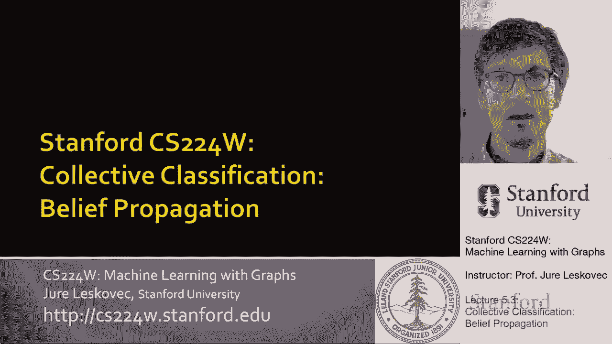
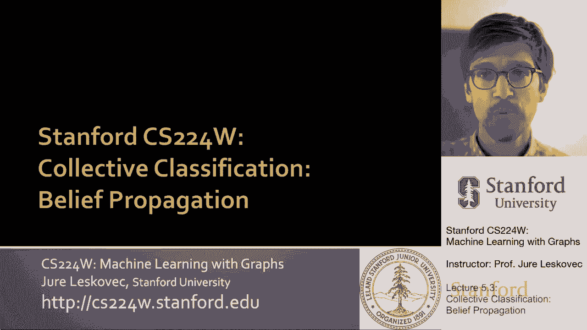
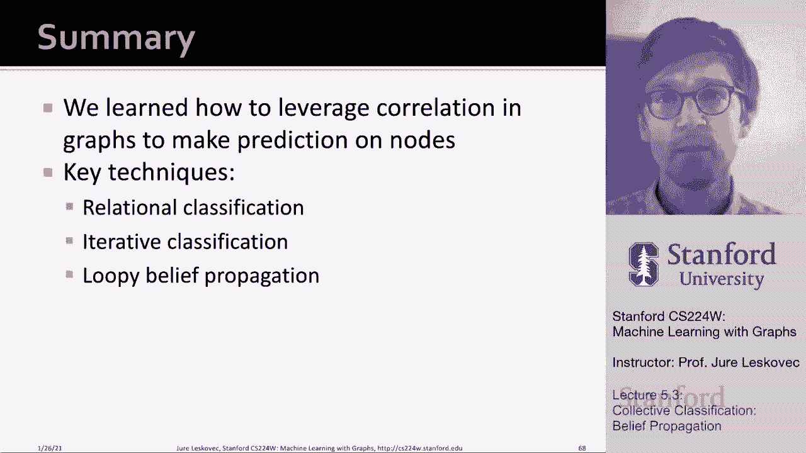

# 16：5.3 - 集体分类 🧠

在本节课中，我们将要学习集体分类的第三种核心方法：信念传播。我们将了解它如何通过节点间传递“信念”信息来协同预测标签，并探讨其在树状结构和带环图上的应用。

---

## 概述 📋

上一节我们介绍了迭代分类，它结合了节点特征和邻居标签。本节中，我们将探讨一种基于概率图模型的方法——信念传播。这种方法的核心思想是，节点通过与邻居交换关于其可能标签的“信念”信息，迭代地更新自身判断，最终达成全局一致的分类结果。

---

## 信念传播的基本思想 💡

信念传播是一种动态规划方法，用于回答图中的概率查询，例如计算某个节点属于特定类别的概率。这是一个迭代过程，节点之间相互传递信息。

节点 `v` 会告诉它的邻居：“我相信你属于某个类别的可能性如下。” 然后，一个节点会收集来自所有邻居的这些信念，综合这些信息来更新自己对自身类别的确信程度。当这些信息在网络中传递并逐渐稳定时，我们就得到了每个节点标签的最优估计。

---

## 从简单图开始：线图计数 🔢

为了理解消息传递的基本操作，我们首先在一个简单的线图上完成一个任务：计算图中的节点总数。假设每个节点只能与直接邻居交互。

我们定义节点的顺序，例如从节点1到节点6。消息传递从节点1开始，向节点6方向进行。

*   每个节点会监听来自其“上游”邻居的消息。
*   节点会更新这个消息（例如，将计数值加1，代表自己），然后将其传递给下一个“下游”邻居。

用 `m` 表示消息。过程如下：
*   节点1发送消息 `m = 1`（只有自己）给节点2。
*   节点2收到 `m=1`，更新为 `m = 1 + 1 = 2`，发送给节点3。
*   节点3收到 `m=2`，更新为 `m = 2 + 1 = 3`，发送给节点4。
*   以此类推，当消息到达节点6时，其值为6，即图中节点的总数。

这个例子展示了信念传播的核心操作：**节点收集来自邻居的消息，进行处理和更新，然后将新的消息发送出去**。

---

## 推广到树状结构 🌳

同样的算法可以应用于树状结构。关键在于消息需要从叶子节点开始，向根节点传递。

以下是消息在树中传递的步骤：
1.  叶子节点（如节点5、6、7）初始化自己的消息（例如，`m=1`），发送给它们的父节点（节点2、3）。
2.  父节点收集所有子节点传来的消息，将这些值求和，并加上自身（`+1`），然后将新的消息值发送给它们的父节点。
3.  这个过程递归进行，直到根节点。根节点最终的消息值就是整棵树的节点总数。

在树结构上，由于没有环，消息来自互不相交的子树，因此信念传播算法是精确且收敛的。

---

## 循环信念传播算法 🔁

现在，我们将上述思想形式化，并推广到一般图，此时的算法称为“循环信念传播”。

我们需要定义几个核心概念：
*   **标签-标签势矩阵 (ψ)**：这个矩阵捕获节点与其邻居在标签上的依赖关系。矩阵中的元素 `ψ(Y_i, Y_j)` 表示在已知节点 `i` 的标签为 `Y_i` 的条件下，节点 `j` 的标签为 `Y_j` 的可能性。如果图中存在同质性（相连节点倾向于相同标签），则该矩阵对角线上的值会很高。
*   **先验信念 (φ)**：函数 `φ(Y_i)` 表示节点 `i` 属于标签 `Y_i` 的先验概率。
*   **消息 (m)**：消息 `m_{i->j}(Y_j)` 表示节点 `i` 认为节点 `j` 属于标签 `Y_j` 的“信念”。

以下是算法的核心步骤：

**1. 初始化**
将所有消息初始化为1。

**2. 迭代更新消息**
对于图中的每条边 `(i, j)`，节点 `i` 发送给节点 `j` 的消息按以下公式计算：
`m_{i->j}(Y_j) = α * Σ_{Y_i} [ ψ(Y_i, Y_j) * φ_i(Y_i) * Π_{k ∈ N(i)\j} m_{k->i}(Y_i) ]`
其中：
*   `α` 是归一化常数。
*   `Σ_{Y_i}` 是对节点 `i` 所有可能的标签求和。
*   `Π_{k ∈ N(i)\j}` 是乘积符号，表示对节点 `i` 的所有邻居 `k`（除了节点 `j`）传来的消息进行连乘。

这个公式的含义是：节点 `i` 综合了自身的先验信念 `φ`、它与节点 `j` 的关联强度 `ψ`，以及来自其他所有邻居 `k` 的信念 `m_{k->i}`，来形成它对节点 `j` 标签的判断 `m_{i->j}`。

**3. 计算最终信念**
当消息传递收敛（或达到预设迭代次数）后，对于每个节点 `i`，其属于标签 `Y_i` 的最终信念 `b_i(Y_i)` 为：
`b_i(Y_i) = α * φ_i(Y_i) * Π_{j ∈ N(i)} m_{j->i}(Y_i)`
即，节点自身的先验信念与所有邻居传来消息的乘积。

---

## 处理图中的环 ⭕

上一节我们介绍了在树上的精确传播，本节中我们来看看当图存在环时会遇到什么挑战。

如果图中有环，消息可以在环中循环传递。这可能导致两个问题：
1.  **理论收敛性**：算法可能无法保证收敛。
2.  **信念放大**：消息在环中循环时，可能人为地放大某些信念。例如，一个关于“某节点为真”的微弱信念，在环中传递一圈后，可能被错误地强化为强信念，因为节点收到了来自环上不同路径的、本质上是同一来源的重复信息。

然而在实践中，许多真实世界的网络（如社交网络、引用网络）虽然存在环，但环的数量相对较少，且环往往较长（即环的周长很大）。这使得环内消息的相关性较弱，信念强度在循环中会衰减，因此“循环信念传播”仍然是一个非常有效的启发式方法。

---

## 方法总结与对比 📊

本节课中，我们一起学习了如何利用图中的关联性进行节点预测。我们共介绍了三种技术：

**以下是三种集体分类方法的对比：**

*   **关系分类**：我的标签是我邻居标签的函数（如多数投票）。它利用了网络结构，但**不使用**节点自身的特征信息。
*   **迭代分类**：我的标签基于我自身的特征向量 `z`，以及我邻居的标签摘要。它同时使用了节点特征和邻居标签，但仍主要依赖于同质性假设。
*   **（循环）信念传播**：通过标签-标签势矩阵 `ψ` 来建模节点间的依赖关系。其过程是收集来自邻居的消息，转换它们，并发送新的消息。该方法在树状图上是精确的。在带环图上，虽然存在理论挑战，但由于真实网络中的环通常影响较弱，它仍是一种强大且通用的半监督节点分类方法。

**信念传播的优点：**
*   易于编程实现和并行化。
*   通用性强，可以定义复杂的势函数（不限于同质性）。
*   在实践中，对于复杂网络非常有效。

**信念传播的挑战：**
*   在带环图上不能保证收敛。
*   势函数 `ψ` 需要从数据中估计或学习。

---

通过本课程，你已经掌握了集体分类的核心范式，从简单的基于邻居的方法，到结合特征的迭代方法，再到基于概率消息传递的信念传播。理解这些方法的原理和适用场景，将帮助你为实际的图节点分类任务选择合适的技术。