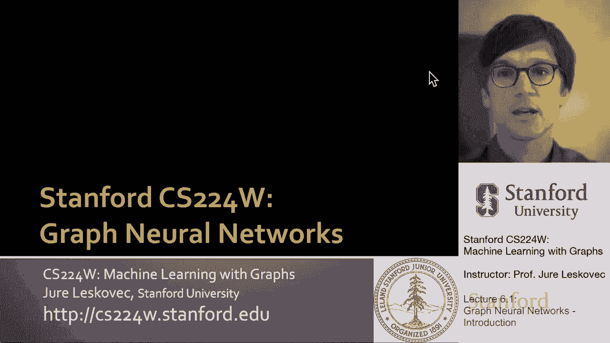
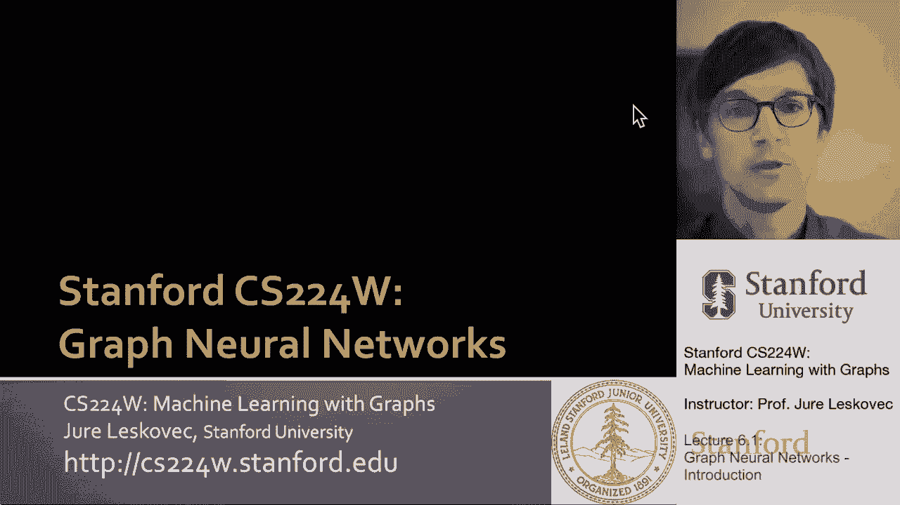
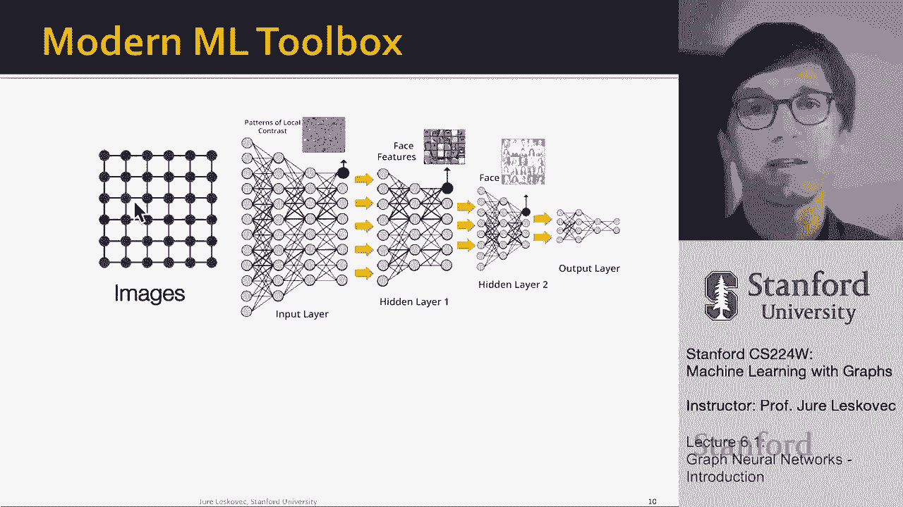

# 17：6.1 - 图神经网络简介 🧠

在本节课中，我们将要学习图神经网络的基本概念。我们将了解为什么需要图神经网络，它与之前学习的浅层节点嵌入方法有何不同，以及它如何帮助我们处理更复杂的图结构数据。

---

## 概述

到目前为止，我们一直在讨论节点嵌入。其核心思想是将图中的节点映射到一个D维的嵌入空间中，使得图中相似的节点在嵌入空间中也彼此靠近。我们的目标是学习一个函数 `f`，它接收一个图作为输入，并为每个节点生成一个位置嵌入。

我们曾在编码器-解码器框架中考虑过这个问题。我们希望网络中节点的相似性（表示为 `similarity(u, v)`）能够匹配它们在嵌入空间中的相似性（例如，通过点积 `z_u^T z_v` 来衡量）。因此，给定一个输入网络，我们希望通过计算嵌入来编码节点，使得如果网络中的节点相似，它们在嵌入空间中也相似。

在之前的节点嵌入框架中，有两个关键组件：
1.  **编码器**：将每个节点 `v` 映射到一个低维向量 `z_v`。
2.  **相似性函数（解码器）**：指定向量空间中的关系如何映射回原始网络中的关系。

我们的目标是训练编码器，使得当我们解码嵌入时，能够恢复网络中的相似性。

---

## 浅层编码的局限性

之前我们讨论的是**浅层编码**。这是学习编码器最简单的方法，编码器本质上只是一个嵌入查找表。这意味着我们直接学习一个矩阵 `Z`，其中每一列对应一个节点的嵌入。

以下是这种方法的局限性：

*   **参数数量庞大**：模型需要学习的参数数量与图中的节点数量成正比（即 `O(|V| * d)`）。对于大型图，参数空间会变得极其巨大。
*   **缺乏参数共享**：每个节点都必须学习自己独特的嵌入，计算开销大。
*   **缺乏归纳能力**：这是一种**直推式**学习。我们只能为训练阶段见过的节点生成嵌入，无法为未见过的节点生成嵌入，也无法将学到的嵌入迁移到另一个图上。
*   **未利用节点特征**：许多图具有附加在节点上的特征属性，而浅层方法（如DeepWalk、node2vec）无法自然地利用这些信息。

---

## 深度图编码器：图神经网络

为了解决上述问题，本节我们将介绍**深度图编码器**，即**图神经网络**。

其核心思想是：节点 `v` 的嵌入 `z_v` 是基于图结构，通过多层非线性变换计算得到的。我们现在要考虑真正的深度神经网络，以及它们如何通过信息的多层非线性传播来生成最终的嵌入。

重要的是，所有这些深度编码器都可以与第三讲中提到的节点相似性函数（解码器）相结合。我们可以训练编码器来解码节点标签，这意味着我们可以直接以端到端的方式训练这些模型。

直观地说，我们将开发深度神经网络：
*   **输入**：图结构、节点特征、边信息。
*   **处理**：通过多层非线性变换在网络中传递信息。
*   **输出**：节点嵌入、子图嵌入、节点对嵌入等，可用于各种预测任务。

这种端到端的训练方式（从右侧的标签一直反向传播到左侧的图结构）使得模型是**任务无关的**，可以应用于多种任务，例如：
*   节点分类
*   链接预测
*   社区检测
*   图相似性比较

---

## 为什么需要图神经网络？🤔

这很有趣，但也颇具挑战。传统的深度学习工具箱是为简单的数据类型设计的：
*   **固定大小的网格**（如图像，可表示为固定大小的矩阵）。
*   **线性序列**（如文本、语音，可表示为链式图）。

然而，许多现实世界的数据无法用这两种简单形式表示。图神经网络允许我们将表示学习应用于更复杂的数据类型。

处理图数据之所以困难，是因为图具有以下复杂性：
*   **任意大小**：图可以包含任意数量的节点和边。
*   **复杂的拓扑结构**：图没有像网格那样的空间局部性概念。
*   **没有参考点或固定顺序**：图中没有“左上角”或“右下角”，也没有像文本中那样的“左”和“右”的固定方向。
*   **动态性**：图通常是动态变化的。
*   **多模态特征**：节点和边可以具有多种类型的特征。

正如在第一节课中展示的，在许多领域和用例中，图是表示底层数据和关系的正确方式，而这些数据无法简单地用固定大小的矩阵或线性序列来表示。

---

## 总结

本节课中，我们一起学习了图神经网络的基本动机和概念。我们回顾了浅层节点嵌入方法的局限性，并引出了深度图编码器——图神经网络。图神经网络通过多层非线性变换聚合图结构和节点特征信息，能够生成更强大、可归纳的节点表示，并能以端到端的方式应用于各种图分析任务。它扩展了深度学习的能力，使其能够处理具有复杂、非欧几里得结构的图数据。