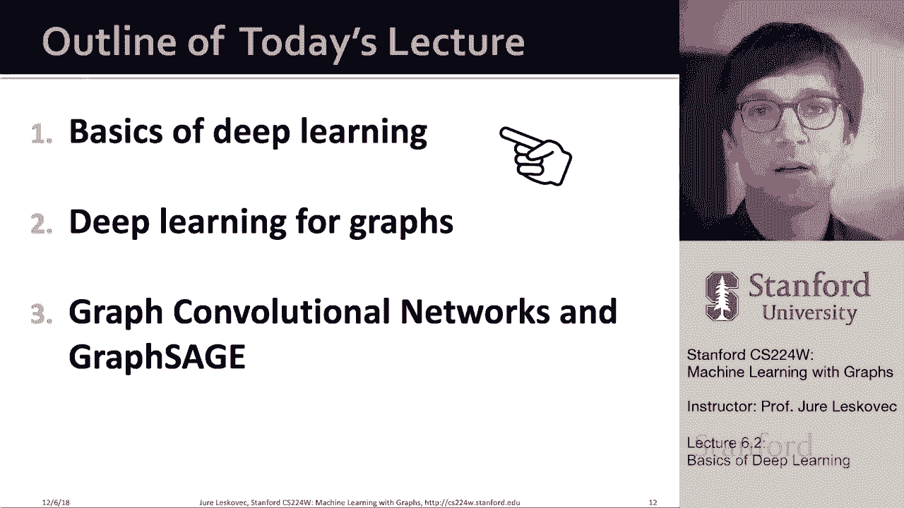
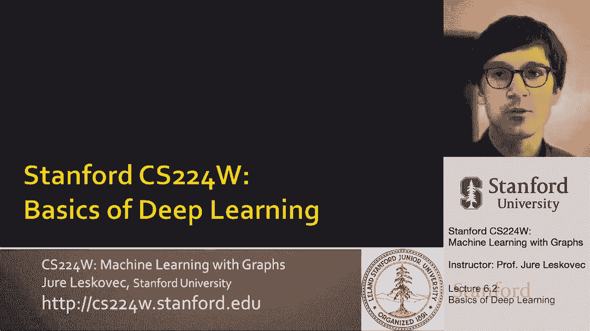
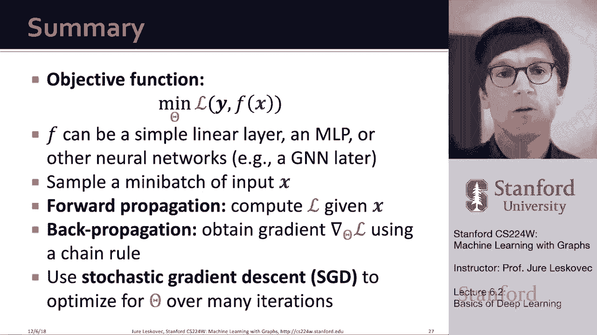

# 18：6.2 - Basics of Deep Learning 🧠

在本节课中，我们将学习深度学习的基础概念。我们将从机器学习的基本框架开始，逐步深入到深度神经网络的核心思想，包括损失函数、优化方法以及反向传播算法。这些知识是理解后续更复杂模型（如图神经网络）的基石。

---

## 机器学习作为优化问题 🤖

我们将监督学习视为一个优化问题。其核心思想是：给定输入 `x`，目标是预测或产生输出标签 `y`。`x` 可以有多种表示形式，例如实数向量、序列（如自然语言）、矩阵（如图像）或图结构数据。

我们的目标是学习一个函数 `f`，将输入 `x` 映射到标签 `y`。我们将这个学习过程表述为一个优化问题：函数 `f` 由一组参数 `θ` 参数化，我们的目标是找到能使预测值与真实值之间差异（即损失）最小的 `θ`。

损失函数 `L` 用于量化预测值与真实值之间的差异。例如，在回归任务中，常用 L2 损失（均方误差）。在分类任务中，则常用交叉熵损失。

---

## 损失函数与优化目标 📉

我们定义损失函数来衡量单个数据点的预测质量。总损失则是所有训练样本损失的总和。我们的优化目标是找到模型参数 `θ`，使得总损失最小化。

以下是一个常见的损失函数示例——交叉熵损失，它常用于多类分类任务。

假设我们有 5 个类别，使用独热编码表示真实标签 `y`。模型输出 `f(x)` 是一个经过 Softmax 函数处理的概率分布，表示属于每个类别的预测概率。交叉熵损失的计算公式如下：

**公式：**
`L = - Σ [y_i * log(f(x)_i)]`，其中求和遍历所有类别 `i`。

损失值越低，表示预测概率分布越接近真实的独热编码分布。

---

## 梯度下降与参数优化 📈

为了最小化损失函数，我们使用梯度下降法。梯度是一个向量，指示了函数在给定点上升最快的方向。为了最小化损失，我们沿着梯度的反方向更新参数。

基础梯度下降的更新公式为：

**公式：**
`θ_new = θ_old - η * ∇L(θ_old)`

其中，`η` 是学习率，控制更新步长。`∇L(θ_old)` 是损失函数在 `θ_old` 处的梯度。

在实际训练中，我们通常不会在梯度为零时（即陷入局部最小值）才停止，而是根据模型在独立验证集上的性能是否停止提升来决定是否终止训练。

---

## 随机梯度下降与小批量处理 ⚡

计算整个数据集的精确梯度（批量梯度下降）成本高昂，尤其对于大型数据集。因此，我们采用随机梯度下降。

其核心思想是：每次迭代时，我们不使用全部数据，而是随机抽取一个小子集（称为小批量）来计算损失和梯度。这大大加快了优化速度。

以下是几个关键概念：
*   **小批量**：用于计算梯度的数据子集。
*   **批量大小**：每个小批量中包含的数据点数量。
*   **迭代**：处理一个小批量并更新一次参数。
*   **周期**：完整遍历一遍整个训练数据集。

SGD 使用小批量梯度作为全数据集梯度的无偏估计。虽然需要仔细调整学习率，但它是深度学习优化的核心，后续许多高级优化器（如 Adam）都基于此思想改进。

---

## 反向传播与自动求导 🔄

在深度学习中，预测函数 `f` 可能非常复杂（例如深度神经网络）。手动计算梯度极其困难。反向传播算法利用链式法则，可以自动、高效地计算损失函数关于所有模型参数的梯度。

其工作原理是：
1.  **前向传播**：输入 `x` 通过网络层层计算，得到最终输出和损失值。
2.  **反向传播**：从损失值开始，逆向应用链式法则，将梯度从输出层逐层传播回输入层，计算出损失关于每一层参数的梯度。

现代深度学习框架（如 PyTorch、TensorFlow）实现了自动微分，使得我们只需定义前向计算图，框架会自动处理反向传播过程，极大简化了模型开发。

---

## 从线性模型到深度网络 🏗️

简单的线性层组合（如 `f(x) = W2 * (W1 * x)`）本质上仍是线性模型。为了增加模型的表达能力，我们在线性变换之间引入非线性激活函数。

常见的激活函数包括：
*   **ReLU**：`g(a) = max(0, a)`
*   **Sigmoid**：`g(a) = 1 / (1 + exp(-a))`

通过将线性变换与非线性激活函数交替堆叠，就构成了**多层感知机**，这是深度神经网络的基本构建块。网络越深，其表示能力通常越强。

---

## 核心流程总结 🎯

本节课我们一起学习了深度学习的基本流程：

1.  **定义模型**：构建一个由参数 `θ` 定义的预测函数 `f`，它可以是一个简单的线性层，也可以是多层感知机等复杂网络。
2.  **定义损失**：根据任务（回归、分类等）选择合适的损失函数 `L`。
3.  **准备数据**：从数据集中抽取小批量样本 `{x, y}`。
4.  **前向传播**：将小批量输入 `x` 送入模型，计算得到预测输出和损失值。
5.  **反向传播**：利用链式法则（通常由框架自动完成），计算损失关于模型参数 `θ` 的梯度 `∇L(θ)`。
6.  **参数更新**：使用随机梯度下降法，沿梯度反方向更新参数：`θ = θ - η * ∇L(θ)`。
7.  **循环迭代**：重复步骤 3-6，遍历多个周期，直到模型在验证集上的性能满意为止。

掌握了这些基础知识后，在接下来的课程中，我们将探讨如何将这些概念应用于图结构数据，并学习图神经网络的基本架构。