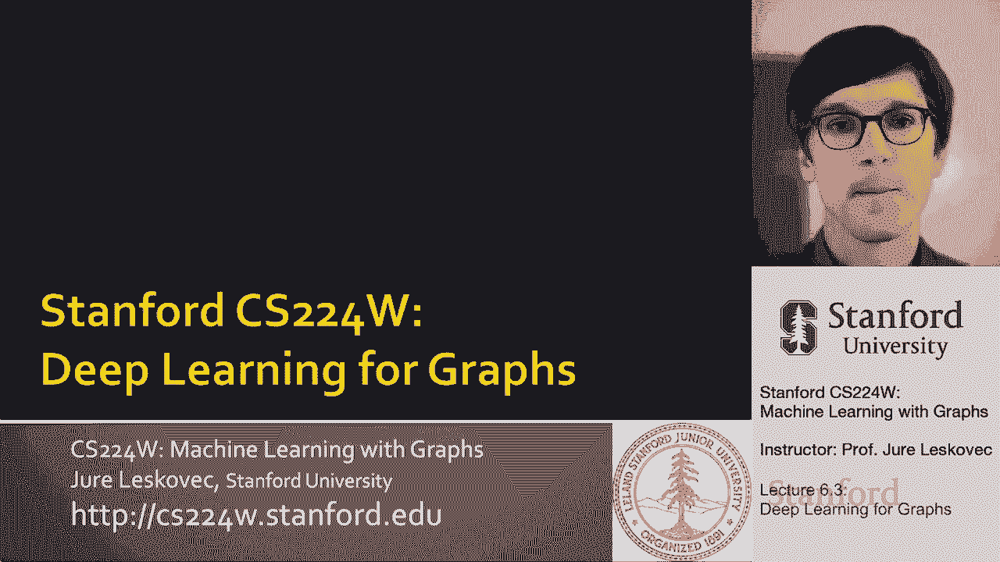
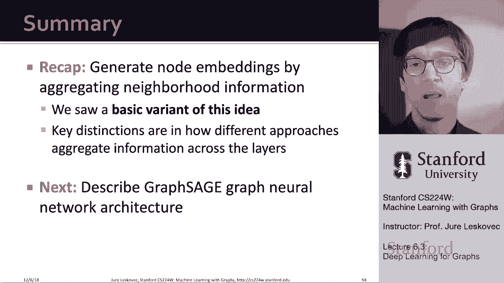

# 19：6.3 - 图的深度学习 V2 🧠

在本节课中，我们将要学习如何将深度神经网络推广到图结构数据上，即图神经网络。我们将从基本概念出发，理解如何利用图的结构来定义神经网络的计算图，并学习如何通过聚合邻居信息来生成节点嵌入。

---

## 背景与设置

上一节我们介绍了神经网络的基本概念。本节中，我们来看看如何将其推广到图结构上。

我们假设有一个图 **G**，它包含：
*   一组节点（顶点）**V**。
*   一个邻接矩阵 **A**。为简化起见，我们假设它是二元的，表示一个无向、无权图（但方法可推广到有向图）。
*   每个节点 **v** 关联一个特征向量 **x_v**。这可以是用户画像、基因表达谱等信息。如果没有节点特征，常用做法是使用独热编码向量或全1向量，有时也会使用节点度数作为特征。
*   用 **N(v)** 表示节点 **v** 的邻居集合。

---

## 为何不能直接使用邻接矩阵？

一个朴素的想法是：直接将邻接矩阵 **A** 与节点特征拼接，作为神经网络的输入。但这种方法存在几个关键问题：

1.  **参数过多**：输入维度与节点数相关，导致参数量巨大，容易过拟合。
2.  **无法处理可变大小图**：模型输入尺寸固定，难以适应不同节点数的图。
3.  **对节点顺序敏感**：同一个图可以有多种邻接矩阵表示（取决于节点编号顺序），而模型无法识别这种等价性。图数据没有固定的节点排序。

因此，我们需要一种对节点顺序不变（置换不变）的方法。

---

## 核心思想：借鉴卷积，推广到图

卷积神经网络在图像上的成功在于其**滑动窗口**操作：一个中心像素从其邻居像素聚合信息，经过变换后生成新的像素值。

我们的目标是将这一思想推广到复杂的图上：
*   将图中的**节点**视为中心。
*   节点的**邻域**定义了其信息聚合的范围。
*   通过**聚合（Aggregate）**邻居的信息，并结合自身信息进行**变换（Transform）**，来生成节点的新表示（嵌入）。

这个过程可以看作是一个**消息传递**机制：节点从其邻居接收信息，聚合并转换后，再传递给下一层。

---

## 计算图与神经网络架构

图神经网络可以看作一个两步过程：
1.  为每个目标节点确定其**计算图**。该计算图基于目标节点周围的网络邻域结构（如k跳内的邻居）定义。
2.  在这个计算图上进行信息的**传播与转换**。

**关键洞察**：
*   每个节点的计算图（即神经网络结构）由其局部网络结构唯一决定。
*   结构相似的节点（如对称节点）会拥有相似的计算图。
*   因此，我们实际上是在**同时训练多个不同结构的神经网络**，但这些网络共享相同的**变换参数**。

---

## 基础模型：邻域聚合与嵌入更新

现在，我们来看看计算图中的“黑盒”里具体发生了什么。核心是**邻域聚合函数**，它必须是**置换不变**的（例如求和、求平均）。

一个基础的图神经网络层操作如下：

设 **h_v^(l)** 为节点 **v** 在第 **l** 层的嵌入。初始层（第0层）的嵌入即节点特征：**h_v^(0) = x_v**。

从第 **l** 层到第 **l+1** 层的更新公式为：

**h_v^(l+1) = σ ( W_self * h_v^(l) + W_neigh * MEAN( { h_u^(l), for u in N(v) } ) )**

其中：
*   **MEAN** 是聚合函数（此处为求平均），保证了置换不变性。
*   **W_self** 和 **W_neigh** 是可学习的权重矩阵，用于转换节点自身信息和聚合后的邻居信息。
*   **σ** 是非线性激活函数（如ReLU）。

这个公式的含义是：节点新的嵌入由其**自身上一层的嵌入**和**邻居上一层的聚合嵌入**共同决定，经过线性变换和非线性激活后得到。

---

### 矩阵形式与高效计算

为了高效计算，我们可以将上述操作写成矩阵形式。

令 **H^(l)** 为第 **l** 层所有节点嵌入堆叠而成的矩阵。
令 **D** 为度矩阵（对角矩阵，**D_ii** = 节点 i 的度数）。
令 **A** 为邻接矩阵。

那么，对所有节点的邻居信息求平均这一操作，可以表示为：**D^(-1) A H^(l)**。

因此，单层更新的矩阵形式可写为：

**H^(l+1) = σ ( A_hat * H^(l) * W^(l) )**

其中 **A_hat** 是包含了自连接的归一化邻接矩阵（例如 **D^(-1/2) (A+I) D^(-1/2)**），**W^(l)** 是该层可学习的权重矩阵。这种形式便于利用稀疏矩阵乘法进行高效实现。

---

## 模型训练

模型参数（各层的 **W** 矩阵）通过最小化损失函数来学习。训练可以在有监督或无监督设置下进行。

### 有监督训练
当节点带有标签时（例如，社交网络中用户的类别，分子网络中原子的类型），我们可以直接使用这些标签进行监督训练。

**损失函数**（例如交叉熵损失）：
**L = - Σ [ y_v * log(σ(z_v^T θ)) + (1 - y_v) * log(1 - σ(z_v^T θ)) ]**

其中：
*   **y_v** 是节点 **v** 的真实标签。
*   **z_v = h_v^(L)** 是图神经网络最后一层（第 **L** 层）输出的节点嵌入。
*   **θ** 是分类层的权重参数。
*   **σ** 是sigmoid函数。

通过反向传播和随机梯度下降优化这个损失，可以同时更新分类权重 **θ** 和图神经网络内部的聚合/变换参数 **W**。

### 无监督训练
当没有节点标签时，我们可以利用图结构本身作为监督信号。例如，使用随机游走等方法来定义节点的“相似性”（如Node2Vec中的思想）。

**损失函数**可以设计为：让在随机游走中共现的节点（相似节点），其嵌入向量的点积更大。

**L = - Σ_{(u,v) in walks} log(σ(z_u^T z_v))**

通过优化此类损失，模型可以学习到保留图结构信息的节点嵌入。

---

## 归纳能力与模型泛化

图神经网络有一个强大的特性：**归纳学习**能力。

*   **参数共享**：所有节点共享相同的聚合与变换参数（**W** 矩阵）。
*   **参数数量与图大小无关**：参数量只取决于嵌入维度和特征维度，与图中节点数无关。

这意味着：
1.  训练完成后，模型可以为**训练时未见过的节点**生成嵌入，只需根据该节点的新邻域进行前向传播即可。
2.  模型可以**跨图迁移**。在一个图上训练好的模型（学到了通用的聚合变换规则），可以应用到另一个结构相似的图上。

这对于演化网络、大规模图或需要在多个相似领域应用模型的任务来说，是一个极其重要的优势。

---

## 总结

本节课中，我们一起学习了图神经网络的基础：
1.  **核心思想**：通过聚合目标节点的邻居信息来生成其节点嵌入，这是一个消息传递过程。
2.  **关键结构**：每个节点的计算图由其局部网络邻域定义，实现了“图结构即神经网络架构”。
3.  **基础操作**：介绍了最基本的邻域聚合（平均）与变换的更新公式 **h_v^(l+1) = σ ( W_self * h_v^(l) + W_neigh * MEAN( { h_u^(l) } ) )** 及其矩阵形式。
4.  **模型训练**：模型可以在有监督（使用节点标签）或无监督（使用图结构相似性）的设置下进行训练。
5.  **重要特性**：图神经网络具有归纳能力，参数在所有节点间共享且与图规模无关，因此能够泛化到未见过的节点和图。

下一节课，我们将探讨更强大的图神经网络框架（如图注意力网络），它们使用更灵活的聚合方式（如基于注意力的加权聚合）来进一步提升模型性能。