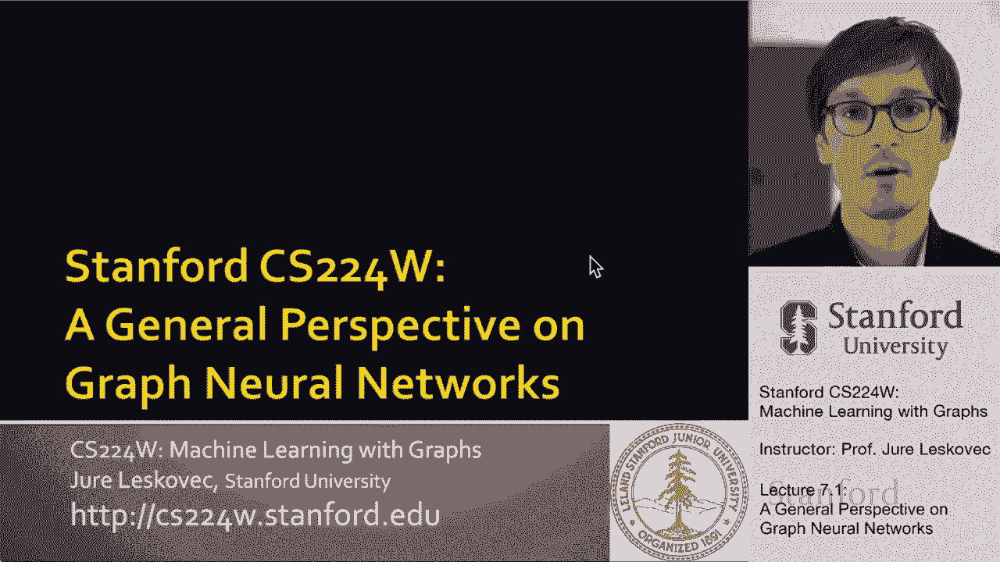
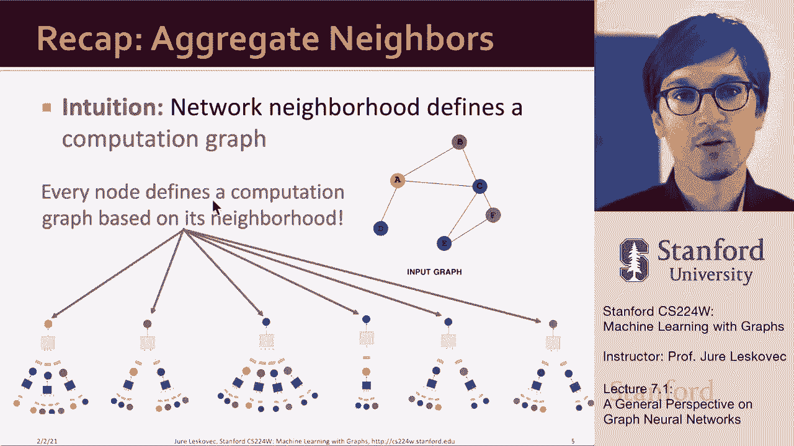
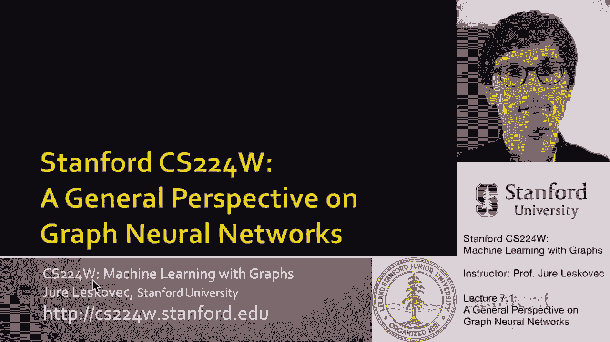
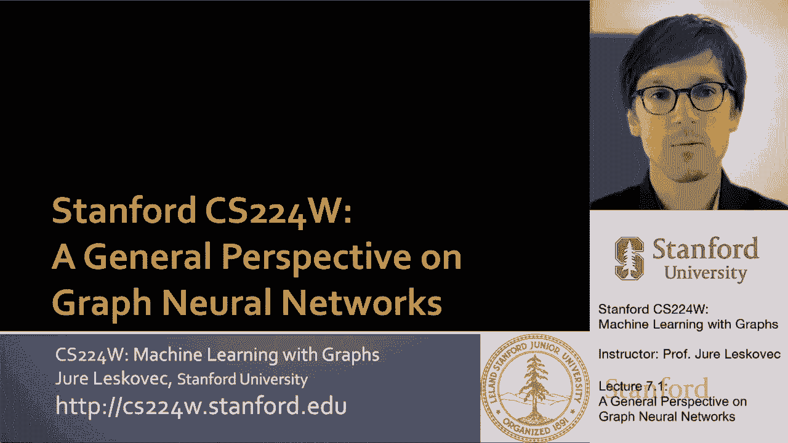
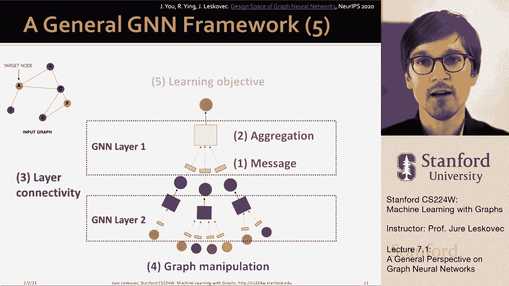

# 20：7.1 - 图神经网络（GNN）概述 🧠

在本节课中，我们将学习图神经网络（GNN）的通用框架。我们将回顾其核心思想，并深入探讨如何从数学上形式化一个深度图编码器。课程将涵盖GNN的关键设计组件，包括单层定义、多层堆叠方式、计算图的构建以及训练目标的选择。

上一节我们回顾了图神经网络的基本直觉，即每个节点根据其网络邻域定义一个计算图。本节中，我们来看看如何从数学上形式化这一过程，并理解其设计空间。

## 深度图编码器的目标 🎯

我们的目标是构建一个深度图编码器。它以图作为输入，通过一系列非线性变换（即深度神经网络），产生可用于预测的输出。这些预测可以在节点级别、子图级别或节点对级别进行。

## 图神经网络的核心组件 ⚙️

基于之前的讨论，图神经网络的核心思想是将底层网络视为计算图。当我们想对网络中某个节点（例如一个红色节点）进行预测时，首先需要基于该节点周围的网络邻域构建一个计算图。这个计算图的结构就定义了图神经网络的结构。

信息（或消息）通过网络中的边进行传播和转换，从一个邻居聚合到另一个邻居，最终汇聚到中心节点。这使得中心节点能够基于聚合的信息做出预测或生成嵌入表示。直觉上，每个节点都利用神经网络来聚合其邻居的信息。

因此，网络中的每个节点都可以定义一个多层神经网络结构，这个结构依赖于以该节点为中心的图结构。例如，节点B会从它的邻居节点A和C获取信息。这个神经网络中的转换过程由参数控制，从而使整个方法生效。

关键在于，网络邻域定义了一个计算图。图中的每个节点都基于其邻域获得自己独特的神经网络架构。

## 图神经网络的通用框架 🏗️

有了上述快速回顾，现在我们来讨论通常如何定义图神经网络，它们的组成部分是什么，以及如何在数学上形式化这些组件。

在这个通用框架中，主要有两个方面需要考虑。

### 1. 单层定义：消息与聚合

不同的架构（如图卷积网络GCN、图注意力网络GAT等）的区别在于它们如何定义“消息”和“聚合”这两个核心概念。

*   **消息（Message）**：指在边上传播和转换的信息。
*   **聚合（Aggregation）**：指将来自邻居的消息汇集到中心节点的操作。

因此，**转换（消息）** 和 **聚合** 是构建图神经网络单层的两个核心操作。

### 2. 多层堆叠：层间连接性

第二组操作是关于如何将多个图神经网络层堆叠在一起。我们是简单地按顺序堆叠这些层，还是添加跳跃连接（Skip Connections）等机制？这定义了层与层之间的连接性，是架构设计的重要部分。

### 3. 计算图的构建：图增强

第三个重要的设计决策是如何创建计算图。我们是直接使用输入图作为计算图，还是对其进行增强？这可能包括特征增强（例如添加节点特征），或图结构操作（例如采样或添加虚拟节点）。本节课将介绍这些概念，后续课程会深入细节。

### 4. 训练目标与任务

第四个设计领域是目标函数和任务类型。我们如何训练这个网络？是使用监督学习、无监督学习还是自监督学习？任务是在节点级别、边级别还是整个图级别进行预测？这些选择决定了模型的学习目标。

以下是图神经网络设计空间的五个关键部分总结：

1.  **单层设计**：如何定义消息传递和聚合操作。
2.  **层间连接**：如何堆叠和连接多个网络层。
3.  **图增强**：如何构建和增强用于计算的基础图。
4.  **训练目标**：针对何种任务（节点/边/图级别）进行训练。
5.  **目标函数**：使用何种学习目标（监督/无监督等）。

## 总结 📝

本节课中，我们一起学习了图神经网络（GNN）的通用视角。我们首先明确了构建深度图编码器的目标。然后，我们回顾了GNN的核心直觉：每个节点根据其邻域定义独特的计算图。接着，我们深入探讨了GNN的通用框架，将其分解为四个关键的设计组件：单层的消息与聚合定义、多层的堆叠与连接方式、计算图的构建与增强方法，以及训练任务与目标函数的选择。理解这个设计空间是灵活构建和运用各种图神经网络模型的基础。