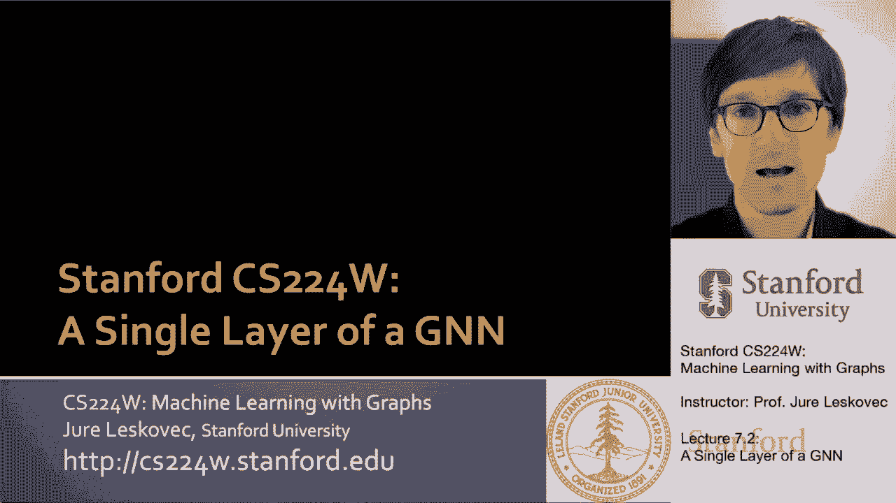
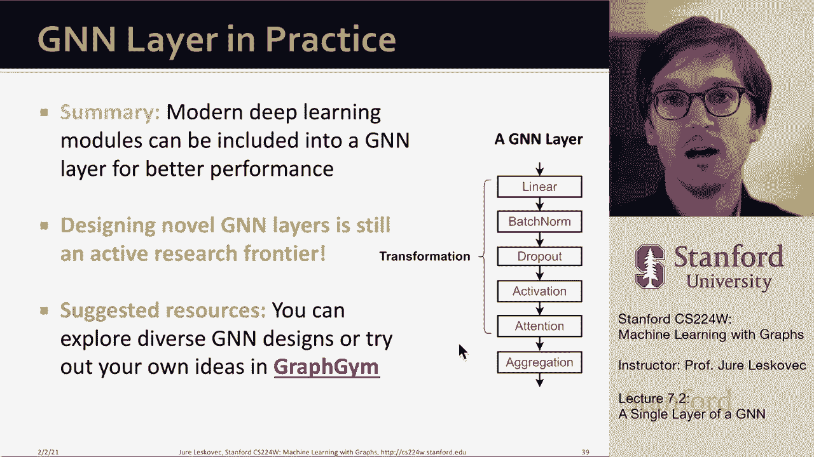

# 21：7.2 - 图神经网络单层详解 🧠

在本节课中，我们将学习图神经网络（GNN）单层的核心构成。我们将深入探讨消息传递与聚合机制，并了解几种经典GNN架构（如GCN、GraphSAGE、GAT）是如何在这一统一框架下构建的。最后，我们还会介绍如何将现代深度学习技术（如批归一化、Dropout、激活函数）融入GNN层中，以提升模型性能。

## 单层GNN的定义与核心思想

首先，我们来讨论如何定义图神经网络的单层。

一个GNN单层包含两个核心组件：**消息转换** 和 **消息聚合**。不同的GNN架构主要在这些操作的设计上存在差异。

单层GNN的核心思想是：将来自邻居节点（即“子节点”）的一组向量信息进行压缩，并通过聚合操作将其融合。我们将这个过程分为两步：消息转换和消息聚合。

## 消息转换与聚合的基本流程

上一节我们介绍了单层GNN的核心思想，本节中我们来看看其具体流程。

想象一下，在网络的底层，我们有一组输入。我们的目标是从每个邻居节点获取信息，将其转换，然后将这些转换后的消息聚合成一条信息，传递给上一层。

我们可以这样理解：节点 `v` 从上一层的三个邻居那里接收信息（用圆圈表示），同时它自身也拥有来自上一层的嵌入信息 `h_v^(l-1)`。我们的目标是将这些信息结合起来，生成节点 `v` 在当前层 `l` 的新嵌入 `h_v^(l)`。

这里有两个关键细节需要注意：
1.  来自邻居的信息是一个**集合**，聚合这些信息的顺序应该是**无关的**（置换不变性）。因为图中节点的邻居没有特定的顺序。
2.  我们需要结合来自邻居的信息 **和** 节点自身的信息，以生成新的节点表示。

现在，让我们更精确地定义这些操作。

### 消息计算

消息计算是第一个操作。它接收上一层节点的表示，并通过某种变换将其转换为一条“消息”，这条消息将被发送给邻居节点。

一个简单的消息转换例子是线性变换：
`m_u = W * h_u^(l-1)`
其中 `W` 是一个可学习的权重矩阵。这就是一个简单的线性层。

### 消息聚合

消息聚合的直觉是：每个节点聚合来自其所有邻居的转换后消息。

以下是聚合函数的一些例子（它们都是置换不变的）：
*   **求和**： `sum({m_u for u in N(v)})`
*   **平均**： `mean({m_u for u in N(v)})`
*   **最大值**： `max({m_u for u in N(v)})`

一个具体的实现方式是，节点 `v` 在 `l` 层的嵌入是其邻居转换后消息的总和：
`h_v^(l) = sum( W * h_u^(l-1) for u in N(v) )`

### 融入节点自身信息

目前的设计存在一个问题：节点 `v` 自身的上一层信息 `h_v^(l-1)` 在计算新嵌入时可能丢失。

为了解决这个问题，我们通常采用两种策略：
1.  **使用不同的变换矩阵**：对邻居消息和自身消息应用不同的线性变换（例如，邻居用矩阵 `W`，自身用矩阵 `B`）。
2.  **合并自身信息**：在聚合邻居消息后，将节点自身的信息也合并进来。通常通过**拼接**或**求和**来实现。

例如，我们可以这样定义：
`h_v^(l) = CONCATENATE( AGGREGATE({W * h_u^(l-1) for u in N(v)}), B * h_v^(l-1) )`
或者：
`h_v^(l) = AGGREGATE({W * h_u^(l-1) for u in N(v)}) + B * h_v^(l-1)`

## 经典架构剖析

上一节我们介绍了单层GNN的通用框架，本节中我们来看看几种经典架构是如何实例化这一框架的。

### 图卷积网络 (GCN)

GCN的层定义公式为：
`h_v^(l) = σ( sum( (1 / sqrt(deg(u)*deg(v))) * W * h_u^(l-1) for u in N(v) ∪ {v} ) )`

在消息转换与聚合框架下，我们可以这样理解GCN：
*   **消息转换**：每个邻居 `u` 将其上一层的嵌入 `h_u^(l-1)` 与权重矩阵 `W` 相乘，并按照节点度 `deg(u)` 和 `deg(v)` 进行归一化。
*   **消息聚合**：对来自所有邻居（包括节点自身）的转换后消息进行**求和**。
*   **非线性激活**：最后应用一个非线性激活函数 `σ`（如ReLU）。

### GraphSAGE

GraphSAGE在GCN的基础上进行了重要扩展：
1.  它允许使用**任意**的置换不变聚合函数（不仅仅是平均）。
2.  它显式地将节点自身的信息与聚合后的邻居信息进行**拼接**。

其公式可以表示为：
`h_v^(l) = σ( W * CONCATENATE( AGGREGATE({h_u^(l-1) for u in N(v)}), h_v^(l-1) ) )`

在消息转换与聚合框架下：
*   **消息转换**：可以是一个简单的线性层，也可以是一个多层感知机(MLP)。
*   **消息聚合**：使用一个通用的聚合算子 `AGGREGATE`，可以是均值、池化（如最大池化）甚至LSTM（需配合随机排序以近似置换不变性）。
*   **合并与激活**：将聚合后的邻居信息与节点自身信息拼接，经过线性变换 `W` 和非线性激活 `σ`。

GraphSAGE还引入了 **L2归一化** 的选项，即对每一层的节点嵌入进行归一化，使其欧几里得长度为1。这有时能带来性能提升，因为它避免了嵌入向量尺度不一致的问题。

### 图注意力网络 (GAT)

GAT的核心创新是引入了**注意力机制**，使得模型能够学习邻居节点对中心节点的重要性差异。

动机在于：在GCN或GraphSAGE中，所有邻居的重要性是隐含的、相同的（例如，在GCN中仅由节点度决定）。GAT希望显式地学习一个权重 `α_uv`，来衡量邻居 `u` 对中心节点 `v` 的重要性。

注意力机制的工作流程如下：
1.  **计算注意力系数**：使用一个函数 `a`，基于一对节点 `(u, v)` 上一层的嵌入，计算出一个未归一化的注意力分数 `e_uv`。
    `e_uv = a( W * h_u^(l-1), W * h_v^(l-1) )`
    函数 `a` 可以是一个简单的单层神经网络，将两个嵌入拼接后输出一个标量。
2.  **归一化注意力权重**：使用softmax函数对某个节点所有邻居的 `e_uv` 进行归一化，得到最终的注意力权重 `α_uv`，使得对于节点 `v`，其所有邻居的权重之和为1。
    `α_uv = softmax_u(e_uv) = exp(e_uv) / sum( exp(e_uk) for k in N(v) )`
3.  **加权聚合**：在消息聚合时，使用学到的注意力权重进行加权求和。
    `h_v^(l) = σ( sum( α_uv * W * h_u^(l-1) for u in N(v) ) )`

为了稳定训练，GAT常使用**多头注意力**。即并行运行多个独立的注意力机制，然后将它们输出的嵌入拼接（或平均）作为最终输出。这增加了模型的表达能力与稳健性。

注意力机制的优势包括：
*   **隐式指定重要性**：允许为不同邻居分配不同的重要性。
*   **计算高效**：注意力系数的计算可以并行化。
*   **存储高效**：参数数量固定，与图大小无关。
*   **归纳能力强**：注意力函数 `a` 不依赖于全局图结构，可以迁移到未见过的图上。

## 融入现代深度学习技术

上一节我们探讨了几种经典的GNN架构，本节中我们来看看如何将其他成功的深度学习模块整合到GNN层中，以构建更强大、更稳定的模型。

以下是几种可以融入GNN的关键技术：

### 批归一化 (Batch Normalization)

批归一化的目标是稳定神经网络的训练。对于一批节点嵌入，它将其重新中心化为零均值，并缩放为单位方差。

具体操作如下：
1.  计算该批数据在每个特征维度上的均值 `μ` 和方差 `σ^2`。
2.  对数据进行标准化： `x‘_i = (x_i - μ) / sqrt(σ^2 + ε)`
3.  引入可学习的缩放参数 `γ` 和平移参数 `β`，进行仿射变换： `y_i = γ * x‘_i + β`

在GNN中，可以在非线性激活函数之前应用批归一化。

### Dropout

Dropout是一种防止过拟合的正则化技术。在训练时，它以概率 `p` 随机将神经网络中的一部分神经元（或其输出）设置为零。在测试时，则使用全部神经元。

在GNN中，Dropout可以应用于消息转换中的线性变换层。例如，在计算 `W * h_u^(l-1)` 时，可以对输入 `h_u^(l-1)` 或输出应用Dropout。

### 激活函数 (Activation Functions)

激活函数为神经网络引入了非线性，是模型具有强大表达能力的关键。常用的激活函数包括：
*   **ReLU (Rectified Linear Unit)**： `σ(x) = max(0, x)`
*   **Sigmoid**： `σ(x) = 1 / (1 + exp(-x))`，将输出压缩到(0,1)区间。
*   **Parametric ReLU (PReLU)**： `σ(x) = max(0, x) + a * min(0, x)`，其中 `a` 是一个可学习的参数。经验上，PReLU通常比ReLU效果更好。

## 总结与工具

本节课中，我们一起学习了图神经网络单层的核心原理与设计。
*   我们首先定义了GNN单层的两个基本组件：**消息转换**和**消息聚合**，并强调了聚合函数的置换不变性以及融入节点自身信息的重要性。
*   接着，我们在这一统一框架下剖析了三种经典架构：**GCN**、**GraphSAGE**和**GAT**，重点理解了GAT的注意力机制如何学习邻居的重要性。
*   最后，我们探讨了如何将**批归一化**、**Dropout**和**多种激活函数**等现代深度学习技术融入GNN层，以提升模型的性能和稳定性。

如果你想快速尝试和比较这些不同的架构选择与设计决策，可以探索名为 **GraphGym** 的工具包。它可以帮助你系统地进行GNN架构实验，以找到针对特定问题的最有效设计。