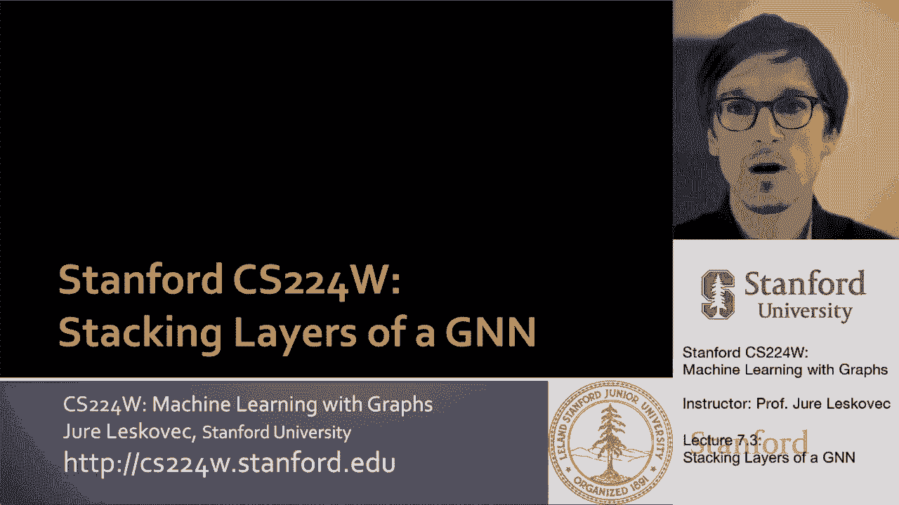
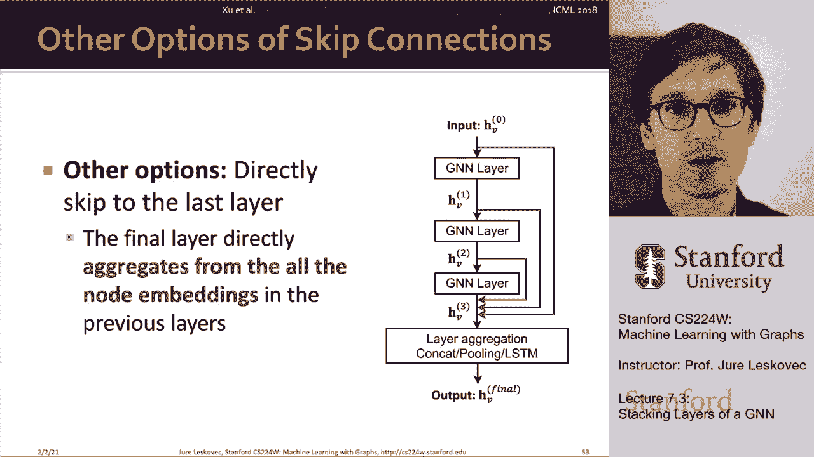

# 22：7.3 - 堆叠 GNN 层 🧱

在本节课中，我们将要学习如何将多个图神经网络层堆叠起来，构建一个多层的 GNN 模型。我们将探讨堆叠层时可能遇到的“过度平滑”问题，并学习如何通过调整网络深度、增加层内表达能力以及添加跳过连接等方法来克服它。

## 概述

上一节我们介绍了图神经网络单层的设计与定义，它由消息转换和消息聚合操作组成。本节中，我们来看看如何将这些单层堆叠起来，形成更深层的 GNN 架构。

## 堆叠 GNN 层

一个标准且常见的方法是顺序堆叠 GNN 层。基本思想是：第 0 层的节点嵌入使用节点的原始特征。然后，这些特征通过每一层 GNN 进行逐层转换。

例如，一个三层的 GNN 会将输入节点特征在每一层水平上转换为新的嵌入。

然而，一个重要的问题是，堆叠太多 GNN 层会带来挑战。这里需要向你介绍“过度平滑”的概念，并讨论如何预防它。

此外，需要指出的是，GNN 中“层”的深度概念与卷积神经网络不同。GNN 的深度更多地表示信息在网络中传播的“跳数”，它不一定直接等同于网络的整体复杂度或表达能力，因为这还取决于每一层 GNN 的具体设计。

## 过度平滑问题

将许多 GNN 层堆叠在一起时，模型往往会遭受所谓的“过度平滑”问题。过度平滑是指所有节点的嵌入收敛于相同或非常相似的值。

发生这种情况的原因是：如果网络的“感受野”过大，那么基本上所有节点都会收集到相同的信息，最终导致所有节点的输出嵌入也相同。我们不希望出现过度平滑问题，因为我们希望不同节点的嵌入是不同的。

### 感受野的定义

首先，我们需要定义“感受野”的概念。感受野是指决定目标节点嵌入的那一组节点。在一个 K 层 GNN 中，每个节点都有一个 K 跳的接收场，即该节点周围的 K 跳邻域。

这一点很重要。例如，考虑图中两个黄色节点之间的链接预测任务。随着网络深度增加，这两个节点对应的计算图（即感受野）会变得多大？

*   对于一层 GNN，感受野是一跳邻居。
*   对于两层 GNN，感受野扩展到两跳邻居（邻居的邻居）。
*   对于三层 GNN，在这个小图的例子中，感受野几乎覆盖了网络中的每个节点。

这意味着黄色节点将收集网络中几乎所有其他节点的信息来确定自己的嵌入。对于链接预测任务，当增加 GNN 的跳数时，两个节点共享的邻居数量会快速增长，导致它们的感受野高度重叠。

### 过度平滑的解释

节点的嵌入由其感受野决定。如果两个节点的感受野高度重叠，那么它们的嵌入也很可能相似。

因此，如果堆叠很多 GNN 层，节点的感受野会高度重叠，它们会从网络的相同部分收集信息并以相同方式聚合，从而导致节点嵌入高度相似，难以区分。这就是过度平滑问题。

## 克服过度平滑的方法

### 1. 谨慎选择层数

首先，与图像分类中的卷积神经网络不同，向 GNN 添加更多层并不总是有帮助。我们需要确定合适的层数。

*   **分析信息需求**：分析做出良好预测需要多少信息，平衡网络直径与单层 GNN 聚合的信息量。如果深度太大，单个节点的感受野可能基本覆盖整个网络。
*   **设置层数**：将 GNN 层数 `L` 设置为略大于我们所需的感受野大小，但避免 `L` 不必要地过大。

### 2. 增加单层的表达能力

如果我们无法通过增加深度来提升性能，另一种方法是让较浅的 GNN 变得更有表现力。

*   **深化聚合与转换函数**：在我们之前的例子中，每个变换或聚合函数可能只是一个线性变换。但我们可以让聚合算子和转换算子本身成为深度神经网络，例如使用三层多层感知机，而不仅仅是一个简单的线性层。这样就在单层 GNN 内增加了表现力。
*   **添加预处理与后处理层**：我们可以在 GNN 层前后添加不传递消息的层，例如多层感知机层。这可以看作是预处理和后处理步骤。
    *   **预处理层**：在编码节点特征时很重要，例如，如果节点特征表示图像或文本，我们可能希望这里有一个完整的 CNN。
    *   **后处理层**：在进行图分类或知识图谱推理等任务时，对嵌入进行转换很重要。
    在实践中，添加这些预处理和后处理层效果很好，这意味着我们将经典的神经网络层与图神经网络层结合了起来。

### 3. 添加跳过连接

让浅层 GNN 更有表现力的最后一个方法是添加跳过连接。过度平滑问题的一个观察是：早期 GNN 层中的节点嵌入有时能更好地区分不同节点。

解决方案是：我们可以通过添加“快捷方式”（即跳过连接）来增加早期层对最终嵌入的影响。

**跳过连接的工作原理**：
在标准的 GNN 层中，我们接收消息并对其进行转换。添加跳过连接后，我们不仅转换消息，还将转换后的结果与未转换的原始消息（或来自更早层的消息）相加。

**代码示意**：
假设 `f(x)` 是当前层的消息转换函数，`x` 是上一层的输出。带有跳过连接的标准操作可以表示为：
`output = σ( f(x) + x )`
其中 `σ` 是非线性激活函数。

**为什么跳过连接有效**：
直觉上，跳过连接创建了一种“混合模型”。现在你的模型是上一层和当前层的加权组合，这意味着你将两个不同层（或模型）的信息混合在一起。

通过添加多个跳过连接，可以极大地增加模型的表达能力，让 GNN 在如何传递和聚合消息方面具有更大的灵活性。例如，一个三层的 GNN 添加跳过连接后，最终的输出可以是单层、两层和三层子网络输出的某种组合，这相当于同时利用了多种深度的网络架构。

**应用示例**：
以图卷积网络层为例，添加跳过连接后，该层的操作变为：将从邻居聚合的消息与上一层的节点自身表示相加，然后通过非线性激活函数。

更复杂的跳过连接策略，如“跳跃知识网络”，建议从多个中间层直接跳过连接到最后一层，然后在最后一层聚合来自不同深度的所有嵌入。这样，模型可以自动确定对于预测任务而言，是附近节点的信息更重要，还是需要聚合更广网络范围的信息。

## 总结

本节课中，我们一起学习了如何堆叠 GNN 层以构建深层网络。我们深入探讨了堆叠过多层会导致的“过度平滑”问题，其根源在于节点感受野的重叠。为了克服这一问题，我们学习了三种主要策略：谨慎选择网络层数以匹配任务需求；通过深化单层内部结构或添加预处理/后处理层来增强模型表达能力；以及使用跳过连接来融合不同深度的特征信息，从而提升模型性能并缓解过度平滑。