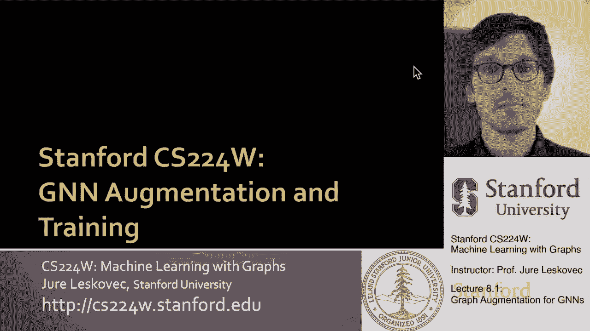
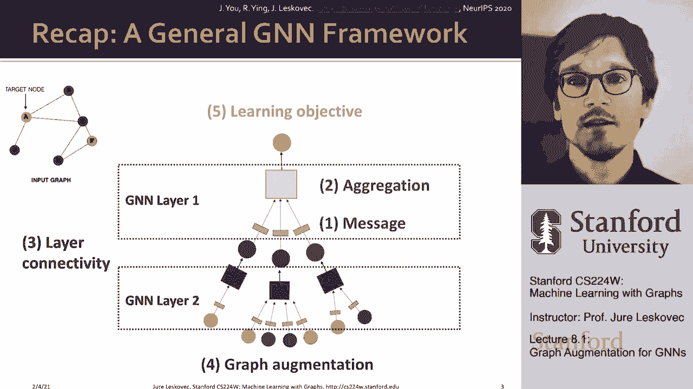
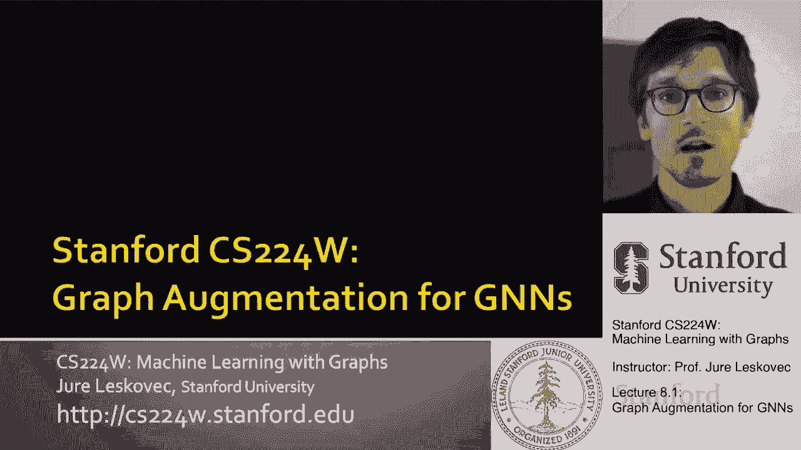
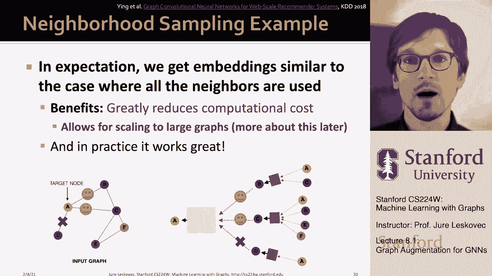

# 23：8.1 - 图神经网络中的图增强 🛠️






在本节课中，我们将学习如何通过图增强技术来改进图神经网络（GNN）的性能。我们将探讨当输入图的结构或特征不理想时，如何通过添加虚拟节点、边或特征来优化GNN的计算图，使其更高效、更具表现力。

---



## 图增强的必要性 📈

上一节我们介绍了图神经网络的基本架构。本节中我们来看看为什么需要对输入图进行增强。

原始输入图并不总是定义GNN计算图的最佳选择。有时，输入图可能过于稀疏或过于稠密，导致消息传递效率低下。有时，图可能缺乏节点特征，或者某些图结构（如循环）难以被标准GNN学习。此外，对于非常大的图，计算图可能无法放入GPU内存。因此，我们需要通过图增强技术来改进输入图，使其更适合用于GNN嵌入。

---

## 图特征增强 🧩

当输入图缺乏节点特征时，我们可以通过特征增强来创建有用的特征。以下是几种常见的方法：

### 1. 分配常量特征
为图中的每个节点分配一个相同的常量特征值（例如，所有节点的特征向量均为 `[1]`）。这种方法计算成本低，允许GNN通过聚合函数（如求和）捕捉节点邻域的结构信息（例如，一级邻居的数量）。然而，其表现力有限，因为所有节点的初始特征相同。

### 2. 分配独热编码特征
为每个节点分配一个唯一的独热编码（One-Hot Encoding）向量。例如，在一个有6个节点的图中，每个节点的特征是一个6维二进制向量，其中仅在其对应索引位置为1。这种方法表现力强，因为每个节点都有唯一标识。但其缺点是无法泛化到训练时未见过的节点或新图，且特征维度随节点数增长，不适用于大型图。

### 3. 添加图结构特征
有时，GNN难以学习某些图结构信息（例如，节点所在的循环长度）。我们可以通过计算并添加这些信息作为节点特征来增强GNN的表达能力。例如，可以为每个节点创建一个特征向量，记录其参与的长度为0、1、2、3等的循环数量。其他可添加的图结构特征还包括PageRank值、节点中心性度量等。这相当于将领域知识编码到特征中，可以显著提升模型性能。

---

## 图结构增强 🔗

除了特征，我们还可以增强图本身的结构。这主要针对图过于稀疏、过于稠密或过大的情况。

### 添加虚拟边
对于稀疏图，一个常见方法是连接两跳邻居。具体做法是使用邻接矩阵 **A** 加上其平方 **A²** 作为新的邻接关系。公式表示为：
```
A_augmented = A + A²
```
这在二部图中特别有用，例如，可以快速建立作者合作网络。添加虚拟边可以减少所需GNN的深度，使消息传递更高效。

### 添加虚拟节点
另一种增强稀疏图的方法是在图中添加一个虚拟节点，并将其连接到图中所有节点或一个精心选择的子集。这样，原本相距很远的节点可以通过虚拟节点进行快速通信，从而减少所需的消息传递层数，提高效率。

---

## 处理稠密图：邻居采样 👥

当图过于稠密（例如，社交网络中的高度数节点）时，聚合所有邻居的信息计算成本会非常高。此时，我们可以采用邻居采样技术。

核心思想是：在每一层消息传递中，不是从节点的所有邻居聚合信息，而是只从一个采样子集中聚合。例如，对于一个有大量邻居的节点，我们可能只随机选择其中一小部分（如2个）进行信息聚合。

以下是邻居采样的关键点：
*   **计算效率**：显著减小了计算图的规模，降低了计算和内存开销。
*   **表达能力**：可能会丢失被忽略邻居的重要信息，从而影响模型性能。这是一种权衡。
*   **鲁棒性**：可以在不同的训练轮次或层中对不同的邻居子集进行采样。这增加了模型的鲁棒性，使其对边缺失等情况不那么敏感。
*   **可扩展性**：这是将GNN扩展到具有数十亿节点和边的大规模图（如工业推荐系统）的关键技术。

通过邻居采样，我们可以控制计算成本，并使GNN能够处理现实世界中的超大规模图。

---

## 总结 📝

本节课中我们一起学习了图神经网络中的图增强技术。我们首先了解了为什么需要对输入图进行增强，然后详细探讨了两种主要增强方式：
1.  **图特征增强**：包括为节点分配常量特征、独热编码，以及添加基于图结构的特征（如循环计数、节点中心性），以弥补原始特征的不足或提升模型对特定结构的感知能力。
2.  **图结构增强**：包括为稀疏图添加虚拟边或虚拟节点以提高消息传递效率，以及对稠密图采用邻居采样技术以控制计算成本并实现大规模扩展。




这些技术是设计和训练高效、强大图神经网络的重要工具，使我们能够根据具体问题灵活地调整和优化模型输入。