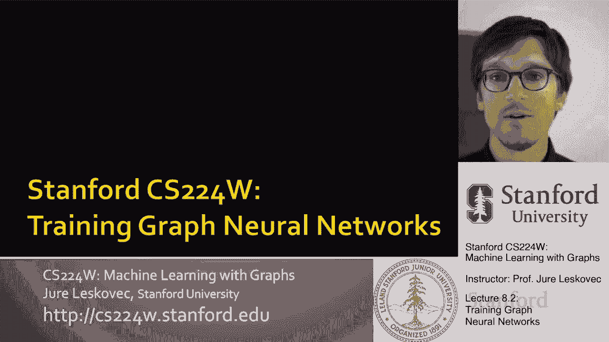
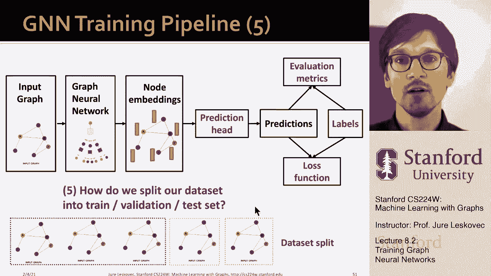

# 24：8.2 - 训练图神经网络 🧠




在本节课中，我们将要学习如何训练图神经网络。我们将讨论如何从模型生成的节点嵌入得到最终预测、如何定义损失函数以及如何评估模型性能。

---

## 预测头：从嵌入到预测

上一节我们介绍了图神经网络如何生成节点嵌入。本节中我们来看看如何将这些嵌入转化为具体的预测。预测头是模型的最终输出部分，根据任务的不同，可以分为节点级、边（链接）级和图级预测。

### 节点级预测头

对于节点级任务，我们可以直接使用节点的最终嵌入进行预测。例如，进行K分类（预测节点属于K个类别中的哪一个）或回归任务。

其核心思想是使用一个线性变换将节点嵌入映射到预测空间。公式如下：

**公式：**
`Ŷ = W * h_v`

其中，`h_v` 是节点v的最终嵌入，`W` 是一个可学习的权重矩阵，`Ŷ` 是预测值（例如，K维向量，表示属于各类别的概率）。

### 边级预测头

对于边级任务（如链接预测），我们需要使用一对节点的嵌入来做出预测。

以下是两种常见的构建边级预测头的方法：

1.  **连接后线性变换**：将两个节点的嵌入连接起来，然后通过一个线性层（可能加上非线性激活函数如Sigmoid或Softmax）。
    **代码示例（概念）：**
    ```python
    # h_u, h_v 分别是节点u和v的嵌入
    concatenated = torch.cat([h_u, h_v], dim=-1)
    prediction = linear_layer(concatenated)  # linear_layer 将维度映射到目标输出维度
    ```

2.  **点积变换**：计算两个节点嵌入的点积。对于二元分类（如链接存在与否），这直接得到一个标量。对于K分类（如预测链接类型），可以为每个类别学习一个变换矩阵，分别计算点积后再组合。
    **公式（二元分类）：**
    `Ŷ = h_u^T · h_v`
    **公式（K分类，简化）：**
    `Ŷ_k = h_u^T · W_k · h_v`， 其中 `W_k` 是为第k个类别学习的变换矩阵。

### 图级预测头

对于图级任务，我们需要聚合图中所有节点的嵌入，形成一个图级别的表示，然后再进行预测。

常见的聚合（池化）方法有：
*   **全局平均池化**：计算所有节点嵌入的均值。
*   **全局最大池化**：取所有节点嵌入在每个维度上的最大值。
*   **全局求和池化**：对所有节点嵌入求和。

然而，简单的全局池化可能会丢失信息，例如两个结构不同的图可能产生相同的池化结果。为了解决这个问题，可以采用**分层池化**。

分层池化的核心思想是：先识别图中紧密连接的社区（簇），在社区内部聚合节点嵌入，形成“超级节点”；然后基于超级节点之间的结构，再次进行聚合，如此迭代，最终得到图的嵌入。这种方法可以通过可学习的图神经网络（如DiffPool）来实现，从而自动学习如何最优地聚合节点。

---

## 监督信号：标签从何而来

有了预测，我们需要知道“正确答案”是什么来计算损失。根据标签来源，学习任务可分为监督学习和无监督学习。

### 监督学习

监督学习的标签来自外部数据源。
*   **节点级**：例如，在引文网络中，论文的研究领域。
*   **边级**：例如，在交易网络中，某笔交易是否为欺诈。
*   **图级**：例如，在分子图中，分子的毒性。

将实际问题建模为这三种标准任务之一，有助于利用现有的研究和方法。

### 无监督学习

无监督学习的监督信号来自图数据本身的结构。
*   **节点级**：预测节点的内在属性，如聚类系数、PageRank值或原子类型。
*   **边级**：预测链路是否存在（链路预测）。
*   **图级**：预测图统计量，如图是否同构，或包含何种子图模式。

---

## 损失函数与评估指标

本节我们将定义如何衡量预测与真实标签之间的差距，即损失函数，并介绍如何评估模型性能。

### 损失函数

损失函数的选择取决于任务是分类还是回归。

1.  **分类任务 - 交叉熵损失**：这是最常用的分类损失。对于K分类任务，单个数据点的损失计算如下：
    **公式：**
    `L = - Σ_{k=1}^{K} y_k · log(ŷ_k)`
    其中 `y` 是真实标签的one-hot编码，`ŷ` 是模型预测的（通常经过Softmax的）概率分布。总损失是所有训练数据点损失之和。

2.  **回归任务 - 均方误差损失**：用于预测连续值。单个数据点的损失计算如下：
    **公式：**
    `L = Σ_{k=1}^{K} (y_k - ŷ_k)²`
    同样，总损失是所有数据点损失之和。

### 评估指标

训练后，我们需要用独立的评估指标来衡量模型性能。

以下是常见的评估指标：

*   **回归任务**：
    *   **均方根误差**：`RMSE = sqrt( mean( (y - ŷ)² ) )`
    *   **平均绝对误差**：`MAE = mean( |y - ŷ| )`

*   **分类任务**：
    *   **准确率**：`Accuracy = (正确预测数) / (总预测数)`。在类别不平衡时可能不具代表性。
    *   **精确率与召回率**：基于混淆矩阵计算。
        *   **精确率**：`Precision = TP / (TP + FP)` （预测为正的样本中，真正为正的比例）。
        *   **召回率**：`Recall = TP / (TP + FN)` （所有正样本中，被正确预测出来的比例）。
    *   **F1分数**：精确率和召回率的调和平均数，`F1 = 2 * (Precision * Recall) / (Precision + Recall)`。
    *   **ROC-AUC**：绘制真正例率 vs. 假正例率曲线，并计算曲线下面积。AUC值越接近1，模型性能越好；0.5相当于随机猜测。AUC可以理解为“随机选取一个正样本和一个负样本，模型对正样本打分高于负样本的概率”。

---

## 总结

本节课中我们一起学习了图神经网络的完整训练流程。我们首先介绍了**预测头**，它负责将节点嵌入转化为节点级、边级或图级的预测。接着，我们探讨了**监督信号的来源**，区分了监督学习和无监督学习场景。最后，我们详细讲解了用于优化模型的**损失函数**（如交叉熵损失和均方误差损失）以及评估模型性能的多种**评估指标**（如准确率、F1分数和ROC-AUC）。




下一节，我们将讨论如何具体设置训练过程，包括如何划分数据集、如何进行训练和测试，以实现高效且可靠的模型训练。