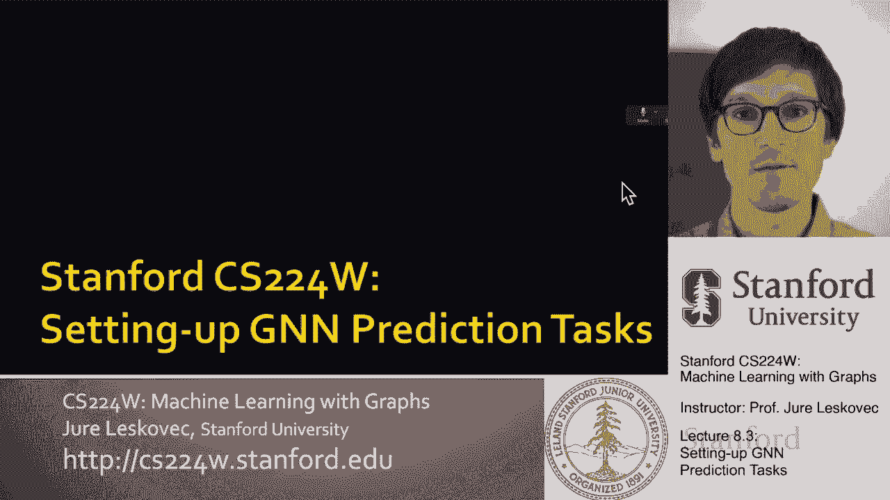
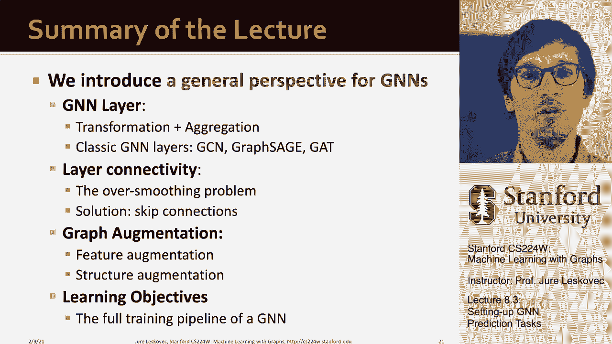

# 25：8.3 - 设置图神经网络预测任务 📊

在本节课中，我们将学习如何为图神经网络（GNN）设置预测任务。我们将重点讨论如何将图数据集正确划分为训练集、验证集和测试集，并深入探讨在节点分类、图分类和链路预测等不同任务中划分策略的差异与挑战。

---

## 概述

上一节我们介绍了图神经网络的设计选择、训练推理流程以及评估指标。本节中，我们将解决一个关键问题：如何将图数据集划分为训练集、验证集和测试集。由于图中节点和边相互连接的特性，这种划分比传统数据（如图像或文本）更为复杂，需要特别注意信息泄露问题。

---

## 数据集划分的两种基本方法

在划分数据集时，我们主要有两种策略。

以下是两种基本划分方法：

1.  **固定划分**：将数据集一次性划分为训练集、验证集和测试集三个固定部分。训练集用于优化模型参数，验证集用于调整超参数，测试集则用于最终评估模型性能。
2.  **随机划分**：进行多次随机划分，每次生成不同的训练、验证和测试集组合。最终报告模型在多次划分上的平均性能，以获得更稳健的结果。

对于图数据，划分的复杂性在于节点之间通过边相互连接。例如，在节点分类任务中，一个节点的预测会受到其邻居节点信息的影响。如果邻居节点在训练集中，而目标节点在测试集中，就可能发生信息从训练集“泄露”到测试集的情况。

---

## 节点分类的划分策略

针对节点分类任务，我们有两种主要的划分设置来处理信息泄露问题。

以下是两种节点分类划分策略：

*   **转导设置**：所有数据拆分（训练、验证、测试）共享**同一个完整的图结构**。我们只划分节点的**标签**。在训练时，模型能看到整个图的结构和所有节点特征，但只能使用训练集节点的标签进行学习。这种设置也被视为一种半监督学习。
*   **归纳设置**：在不同数据拆分之间**切断边**，从而为训练、验证和测试集创建**不同的子图**。这样，测试集的预测完全不会受到训练集图结构信息的影响。但这种方法的缺点是会丢弃部分边，损失图的结构信息。

**转导设置**适用于我们只有一个连通图，且希望利用全图信息进行预测的场景。**归纳设置**则更侧重于测试模型在完全未见过的图结构上的泛化能力。如果我们没有多个天然独立的图，就需要通过切割边来人为创建多个子图。

---

## 图分类的划分策略

既然我们已经讨论了节点分类，让我们切换到下一个分类任务：图分类。

图分类通常在**归纳设置**中定义良好。我们可以简单地将不同的图样本分配到训练集、验证集和测试集中。由于每个图是独立的数据点，这种划分简单直接，不存在信息泄露问题。

---

## 链路预测的划分策略

所有设置中最棘手的可能是链路预测。链路预测本质上是一种无监督任务，我们需要自己创建标签和划分数据。核心思想是：对GNN隐藏一部分边，然后让GNN去预测这些缺失的边。

设置链路预测需要两个步骤。

以下是链路预测设置的两个步骤：

1.  **边类型分配**：将原始图中的边分为两类：
    *   **消息传递边**：GNN在计算节点嵌入时可以使用的边。
    *   **监督边**：我们将尝试预测的边，用于计算损失函数和评估模型性能。
2.  **数据集划分**：进一步将监督边划分为训练、验证和测试集。这里也有两种方式：
    *   **归纳链路预测划分**：假设我们有多个图，每个图独立划分其消息传递边和监督边。
    *   **转导链路预测划分（默认）**：只有一个输入图。我们需要精心划分出四种边：
        *   **训练消息传递边**
        *   **训练监督边**
        *   **验证边**
        *   **测试边**

在转导设置中，划分是嵌套的。例如，在训练时，图仅包含训练消息传递边，模型需要预测训练监督边。在验证时，图包含训练消息传递边和训练监督边，模型需要预测验证边。在测试时，图包含之前所有的边，模型需要预测最终的测试边。这可以模拟图随着时间推移而演化的场景。

---

## 总结与工具

本节课中，我们一起学习了如何为GNN设置预测任务。我们讨论了整个GNN训练流程，从划分策略到应对不同任务（节点分类、图分类、链路预测）的挑战。我们了解到：

*   **转导设置**和**归纳设置**是处理图数据划分的两种核心思想。
*   节点分类需要仔细处理邻居信息泄露。
*   图分类的划分最为直接。
*   链路预测的划分最为复杂，需要创建“隐藏边”作为预测目标。

幸运的是，我们有像 **DeepSNAP** 和 **GraphGym** 这样的工具，可以帮助我们自动化地、正确地完成这些复杂的划分工作，让我们能够更专注于模型本身的设计与优化。