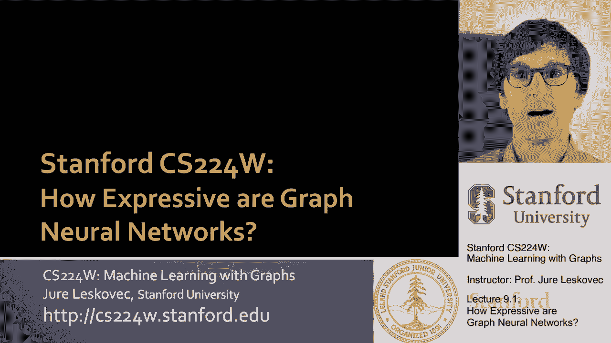
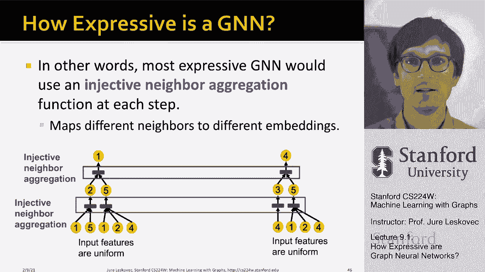

# 26：9.1 - 图神经网络有多强大？ 🧠

在本节课中，我们将要学习图神经网络（GNN）的表达能力。我们将探讨GNN能学习什么、不能学习什么，以及如何设计出理论上最具表达能力的GNN模型。理解这些理论概念对于选择和应用不同的GNN架构至关重要。

## 背景与核心问题

上一节我们介绍了多种GNN模型及其设计选择。本节中，我们来看看这些模型的理论表达能力。

图神经网络通过多层非线性传播，为图中的节点生成嵌入表示，以便进行各种机器学习预测任务。其核心思想是聚合目标节点周围局部邻域的信息。

关键在于，GNN通过神经网络聚合来自邻居的信息。我们已经讨论过在设计消息传递和聚合操作时的各种选择。今天，我们将聚焦于GNN的理论能力。

我们特别要问：图神经网络有多强大？它们的表达能力如何？它们能学到什么，又有什么是学不到的？理解这一点非常重要，因为存在许多不同的GNN模型，如图卷积网络（GCN）、图注意力网络（GAT）和图SAGE网络等。问题在于它们的表达能力究竟是什么？这本质上是指它们区分不同节点和不同图结构的能力，以及在学习不同类型模式时的表现力。

一个非常酷的目标是，我们今天将能够设计出理论上最具表达能力的GNN模型，即最强大的图神经网络。

## 表达能力：区分节点与结构

计划如下：背景是我们拥有许多具有不同聚合和转换方式的GNN模型。问题是，我们能理解它们的表达能力吗？这些不同的设计选择如何导致不同类型的模型？

例如，在图卷积网络（GCN）中，它使用所谓的均值池化。当我们从邻居聚合信息时，我们使用元素级的平均池化，然后进行线性变换和ReLU非线性激活。而图SAGE网络则使用多层感知机（MLP）加上元素级的最大池化。这两者有何不同？在理论性质和表达能力方面，哪个更好？

这里有一个重要的说明：在图神经网络中，我们有两个方面：节点特征（属性）和图结构方面。为了本次讲座的目的，我将用节点的颜色来表示它们的特征向量。如果两个节点颜色相同，则意味着它们具有相同的特征向量和特征表示。

例如，在下图中，数字表示节点ID，但所有节点的特征都是相同的（都是黄色），因此没有特征信息可以用来区分节点。问题在于，GNN能在多大程度上区分不同的图结构？因为如果每个节点都有独特的特征向量，区分节点就很容易。但如果所有特征向量都相同，那么问题就变成了：你还能区分节点吗？你能了解到节点五和节点四不同吗？

在图神经网络中，我们对局部邻域结构的概念特别感兴趣。我们想要量化每个节点周围的本地网络邻居。

例如，考虑节点一和节点五。我能学会区分节点一和节点五吗？这相当容易，因为它们具有不同的邻域结构。即使只看每个节点的邻居数量（度），节点一的度为2，节点五的度为3。所以，如果GNN能捕捉节点的度，就可以区分节点一和五。

现在看第二个例子：节点一和节点四呢？如果只看单跳邻域，节点一的度是2，节点四的度也是2。所以，如果只能捕捉节点本身的度，就无法区分一和四。然而，一和四仍然是不同的。因为如果观察二度邻域，节点一的两个邻居，一个度为2，一个度为3；而节点四的两个邻居，一个度为1，另一个度为3。所以，如果我能捕捉节点本身的度加上邻居的度，那么一和四就是可区分的，因为它们的邻居具有不同的度。

这非常有趣：两个节点乍看相同，但深入网络探索邻居后，它们就变得可区分了。

现在继续研究另一对节点：节点一和节点二。有趣的是，一和二在这个图中实际上是无法区分的，因为它们在图中是对称的。它们都是2度，它们的邻居也都有两个邻居（一个2度，一个3度）。即使探索到第二跳邻域，网络邻居也是相同的。无论我们探索网络多深，因为在这两种情况下，它们在二跳邻域都有一个2度节点和一个3度节点，在三跳远都有一个2度邻居和一个1度邻居。所以，你无法区分一和二，除非有一些特征信息。但基于图结构，你无法区分它们，因为它们在图中位置同构。

这是一个建立直觉的例子。我们想要的关键问题是：GNN节点嵌入能区分不同的局部邻域结构吗？如果可以，是在什么情况下？如果不能，GNN的失败案例有哪些？

## 计算图：理解GNN如何工作

接下来我们需要理解GNN如何捕捉局部邻域结构。我们将通过**计算图**这个关键概念来理解。

想法是：GNN的每一层都会聚合邻居的嵌入。在GNN中，我们通过定义在节点邻域结构上的计算图来生成嵌入。

例如，对于节点一，如果我们构建一个两层的GNN计算图：节点一聚合来自节点二和节点五的信息。节点五聚合来自其邻居（节点一、二、四）的信息。节点二聚合来自其邻居（节点一、五）的信息。这就是我们所说的计算图，它展示了消息如何从第0层聚合到第1层再到第2层。这是描述节点一的两层GNN计算图。

有趣的是，现在如果我为节点二创建计算图：节点二聚合来自节点一和节点五的信息，节点五聚合来自节点一、二、四的信息，节点一聚合来自节点二和五的信息。你注意到，节点一和节点二的计算图实际上是相同的。它们都有两个一度子节点（在零层），其中一个子节点有2个邻居，另一个有3个邻居。

GNN只是在传递信息，而不使用节点ID，它只使用节点特征向量。这意味着如果你观察这些传播树（计算图），它们现在是不同的，因为你说“哦，很明显，这是第一个节点，那是第二个节点”。但如果你只看颜色（即节点特征信息），这些树看起来一模一样，并且无法区分节点彼此。

在所有情况下，GNN所能做的只是聚合这些黄色节点的信息。它可以说“我有三个黄色的子节点”，而另一个节点可以说“我有两个黄色的子节点”。然后我们可以描述：“我有两个孩子，其中一个有两个子节点，另一个有三个子节点”。但关键是，对于两个不同的节点一和二，计算图是相同的。因此，在没有特征信息、没有节点属性信息的情况下，这两个计算图是一样的。

因此，这两个节点将被嵌入到嵌入空间中的同一点，这意味着它们将重叠。所以图神经网络无法区分它们，也不能将节点一划分为与节点二不同的类别，因为它们的嵌入将完全相同。它们会重叠，因为计算图相同，并且没有可区分的节点特征信息（这是我们的假设）。

这是本节课最重要的一张幻灯片：**我们通过计算图捕捉局部邻域结构。如果两个节点的计算图相同，那么这两个节点将完全嵌入到同一点，在嵌入空间中。这意味着我们不能把一个归为一个类别，把另一个归为另一个类别，因为它们是相同的、重叠的。所以我们无法区分它们。**

总结一下，在这个简单的例子中，GNN将为节点1和节点2生成相同的嵌入，因为两个事实：首先，计算图是相同的；其次，节点特征信息在这种情况下是相同的（所有节点都是黄色的）。因为GNN不关心节点ID，它关心的是节点的属性/特征并将其聚合。这意味着这个GNN不能区分节点一和节点二，所以1和2总是有完全相同的嵌入，总是被归入同一个类别或分配相同的标签。

这看起来相当令人失望，我们这么快就找到了GNN的一个失败案例：它们基本上不能区分某些节点。

这里要说的重点是：**总的来说，不同的局部邻域定义不同的计算图。** 下图展示了节点一和二、节点三和四、以及节点五的计算图。我们已经知道我们将无法区分一和二，因为它们有相同的计算图。但问题仍然是：三和四，或者三和五呢？图神经网络能区分这些节点吗？因为很明显它们有不同的计算图。所以也许图神经网络能够记住或捕获计算图的结构，这意味着节点三和节点四将得到不同的嵌入，因为它们的计算图不同。这在某种意义上是个大问题。

关键是，计算图与每个节点周围的**有根子树**结构相同。所以我们可以把这个有根子树看作定义了每个节点周围邻域的拓扑结构。两个节点在最好的情况下能够被区分，如果它们有不同的有根子树结构，即不同的计算图。当然，也许我们的GNN太不完美，它甚至无法区分具有不同计算图的节点（即根树结构不同的节点）。我们接下来要看的是，在什么情况下二和三会被简单地归类为同一个嵌入。

## 单射性：最具表达力的GNN

继续右边的内容：GNN节点嵌入捕获根子树结构。它们基本上试图捕捉计算图（即给定节点周围网络邻域）的图结构。最具表达力的图神经网络会将不同的有根子树映射到不同的节点嵌入中（这里用不同的颜色表示）。

例如，一和二，因为它们有完全相同的计算图，将映射到相同的点。以目前GNN的定义，我们对此无能为力。但例如，节点三、四和五，它们没有相同的计算图结构，所以它们应该被映射到嵌入空间中的不同点。

因此，最具表现力的图神经网络基本上能够学习或捕捉计算图的结构，并基于此结构为每个计算图分配不同的嵌入。这是我们的前提。

我们希望确保：如果两个节点有不同的计算图，那么它们被映射到嵌入空间中的不同点。问题是，图神经网络有一个重要的数学概念可以让我们在理解方面取得进一步进展：图神经网络是否可以将两个不同的计算图（即有根子树）映射到嵌入空间中的不同点？

有一个概念，或者说定义，关于什么是**单射函数**：一个从域X映射的函数，如果它将不同的元素映射到不同的输出，那么基本上意味着f保留了输入的信息。这意味着无论你得到什么输入，你总是把它们映射到不同的点或不同的输出。例如，不是二和三会碰撞并给出相同的输出。每个输入都映射到不同的输出，这是单射函数的定义。这是一个非常重要的概念，我们将在讲座的其余部分大量使用。

我们想知道图神经网络有多有表现力。最具表现力的图神经网络应该将这些子树（这些计算图）单射地映射到节点嵌入中。这意味着对于每一个不同的子树，我们应该把它映射到嵌入空间中的另一个点。如果这个映射不是单射的，意味着两个不同的输入（两个不同的子树）映射到同一个点，那就有问题了。

所以我们想展示一个场景，其中不同的子树被映射到嵌入空间中的不同点。

关键的观察使我们能够取得进展：**相同深度的树可以递归地从叶节点到根节点进行表征。** 我的意思是，如果我们能够区分树的某一层，那么我们可以递归地获取这些信息，并将它们聚合在一起，形成对这棵树的独特描述。

例如，你可以简单地通过每个节点的子树数量来描述树的特征。在较低级别，一个节点有三个邻居（孩子），另一个节点有两个孩子。然后，根节点已经有两个孩子。所以我可以描述为：“在零层，我们有两个邻居和三个邻居；在第一层，我们有两个邻居”。对于这个特定的计算图，我这里有一个孩子，那里有三个孩子，然后这里有两个孩子。这个描述和另一个描述不一样，所以这意味着我可以分开或区分这两棵不同的树。

重要的是，树可以逐级分解。所以如果我能捕捉到树某一层的结构，也许甚至只是这一层，然后我可以递归地逐级进行。我的意思是，我们只需要专注于如何描述这个计算图的某一层，或者围绕给定节点的有根子树的某一层。

## 单射聚合：保留邻域信息

让我们继续思考并解决这个问题。**如果GNN聚合过程的每一步都能完全保留邻域信息（即给定节点的邻居数量、孩子数量），那么生成的节点嵌入就可以区分不同的子树结构。**

如果我能说：“在第一层，在一棵树上，我有两个孩子；在另一棵树上，我有三个孩子。” 如果我能捕捉到这些信息，并一直传播到根节点……在另一棵树上，我可以捕捉到一个节点有一个子节点，另一个节点有三个子节点，如此反复。我可以把这些信息一直保留到顶层。那么很明显，孩子数量是不同的，所以这两棵树我们能够区分开来。

重点是，从某种意义上说，我们是否能够从孩子们那里收集信息，并以某种方式存储这些信息，这样当我们把它传递给树中的父级时，这些信息被保留。在这种情况下，关于二和三的信息被一直保留到树根。这是我们想要回答的问题。

换句话说，我们要说的是：最具表达力的图神经网络将对计算图的每一层使用**单射邻域聚合**。这意味着它会映射不同的邻域信息（例如孩子数量）并保留这些信息，因为我们把它推上树，这样树就知道它的每一个内部节点有多少孩子。这就是本质上的想法。

## 总结与核心观点

到目前为止的总结如下：生成节点嵌入的GNN使用计算图，它对应于每个节点周围的根子树结构。如果我有一个节点，我就有一个计算图的概念，这只是一个有根子树结构，描述了这个节点周围的局部邻域结构。

那么，不同的根子树（不同的计算图）将是可区分的，**如果我们使用单射邻域聚合**。这意味着我们能够区分不同的子树。正如我们将要看到的，GNN可以在各个级别上完全区分不同的子树结构，前提是它的邻域聚合是单射的。这意味着在聚合孩子信息时没有信息丢失，这样我们就可以完全描述计算图并区分一个计算图与另一个。

---

**本节课中我们一起学习了：**
1.  **图神经网络（GNN）的表达能力**核心在于其区分不同节点和局部图结构的能力。
2.  **计算图**是理解GNN如何工作的关键，它代表了以目标节点为根的局部邻域子树。
3.  **单射性**是衡量GNN表达能力的核心数学概念。最具表达力的GNN应能将不同的计算图（子树）单射地映射到不同的节点嵌入中。
4.  **失败案例**：当两个节点具有完全相同的计算图且节点特征也相同时，任何GNN都无法区分它们（如图中的对称节点）。
5.  **设计原则**：为了最大化表达能力，GNN的每一层聚合函数都应该是单射的，从而在信息向上传播时完全保留邻域结构信息。

理解这些理论概念为我们设计和选择GNN模型提供了坚实的基础，并解释了为什么某些架构（如使用最大池化的GraphSAGE）在某些情况下可能比使用简单平均池化的GCN更具表达能力。在接下来的课程中，我们将探讨如何具体构建这种具有单射聚合函数的GNN。