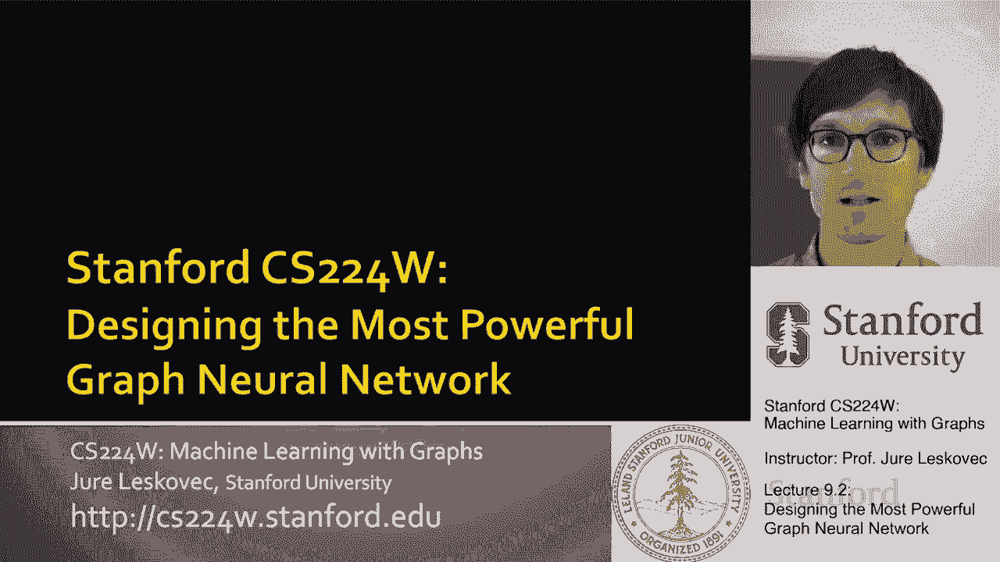
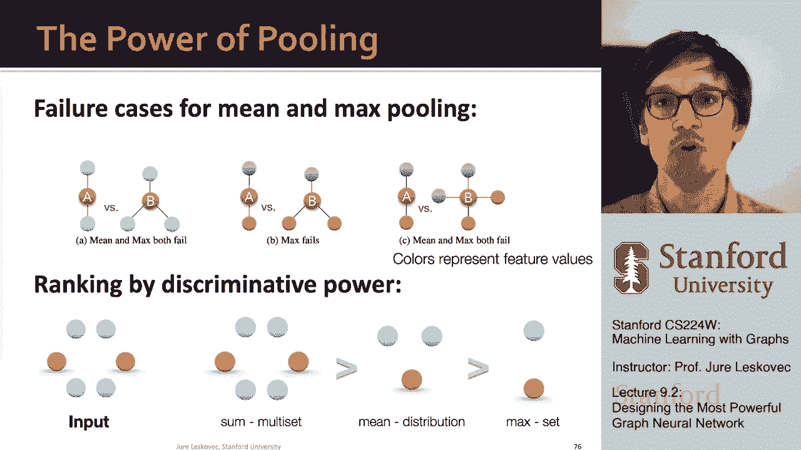

# 27：9.2 - 设计最强大的图神经网络 🧠

在本节课中，我们将学习如何设计最具表达能力的图神经网络。我们将从分析现有模型的局限性开始，然后介绍一个理论框架，帮助我们构建理论上最强大的图神经网络——图同构网络。

---

## 概述

图神经网络的表达能力，可以通过其邻域聚合函数的表达能力来表征。更具表达力的聚合函数，会带来更具表达力的图神经网络。如果邻域聚合函数是单射的，即能将不同的输入组合映射到不同的输出，那么信息就不会丢失，从而得到最具表达力的图神经网络。

接下来，我们将从理论上分析不同聚合函数的表达能力。

---

## 邻域聚合与多集

邻域聚合本质上是从邻居节点（子节点）收集信息并进行聚合。我们可以将邻域聚合视为一个作用于**多集**上的函数。多集是允许重复元素的集合。

例如，一个节点可能有两个黄色特征的邻居，而另一个节点可能有两个黄色特征和一个蓝色特征的邻居。当我们聚合这些信息时，我们希望聚合后的表示能够保留原始多集中的所有信息，使得这两个不同的多集在聚合后依然可区分。

---

## 分析现有聚合函数

以下是两种我们在第一节课中讨论过的模型所使用的聚合函数，我们将分析它们的表达能力。

### 1. GCN 的均值池化

GCN 使用**均值池化**，即对邻居节点的特征向量进行逐元素的平均。

**观察**：GCN 的聚合函数无法区分那些具有相同特征比例但节点总数不同的多集。

**原因**：当对特征向量进行平均时，比例相同的多集会得到相同的平均值。

**示例**：假设节点颜色用独热编码表示，黄色为 `[1, 0]`，蓝色为 `[0, 1]`。
*   一个黄色和一个蓝色的多集：`[1, 0]` 和 `[0, 1]` 的平均值是 `[0.5, 0.5]`。
*   两个黄色和两个蓝色的多集：四个向量的平均值同样是 `[0.5, 0.5]`。

即使后续应用非线性变换，由于聚合步骤的输出相同，最终表示也会相同。因此，均值池化无法区分特征比例相同但规模不同的多集。

### 2. GraphSAGE 的最大池化

GraphSAGE 的一个变体使用**最大池化**，即对经过多层感知机变换后的邻居特征进行逐元素的最大值操作。

**观察**：最大池化函数无法区分那些具有相同**不同颜色集合**的多集。

**原因**：只要多集中出现的不同颜色种类相同，那么逐元素最大值就会是这些颜色中的一种，无论各种颜色的具体数量或比例如何。

**示例**：考虑三个不同的多集，经过 MLP 变换后，颜色被编码为新的独热向量。
*   无论节点是两个、三个还是四个，只要出现的颜色种类（例如黄色和蓝色）相同，逐元素最大值在所有情况下都可能相同（例如 `[1, 1]`）。

这意味着所有不同的多集被映射到了相同的表示，信息丢失了。因此，最大池化也不是单射运算符。

---

## 本节小结

上一节我们分析了两种常见聚合函数的局限性，现在让我们总结一下关键发现：

*   图神经网络的表达能力由其邻域聚合函数的表达能力决定。
*   邻域聚合是多集上的函数。
*   GCN 和 GraphSAGE 的聚合函数（均值和最大池化）无法区分某些基本的多集，它们不是单射的，会导致信息丢失。
*   因此，GCN 和 GraphSAGE 不是最强大的图神经网络。

---

## 设计最强大的图神经网络 🎯

我们的目标是设计一个在所有消息传递图神经网络中最强大的模型。实现方式是设计一个**单射的邻域聚合函数**，确保在从子节点聚合信息以创建父节点消息时永不丢失信息。

### 理论基础：单射多集函数的表示

有一个重要的定理指出：**任何单射多集函数都可以表示为以下形式**：

$$
\Phi \left( \sum_{x \in X} f(x) \right)
$$

其中：
*   \( X \) 是一个多集。
*   \( f \) 是一个作用于多集中每个元素的函数。
*   \( \sum \) 表示求和。
*   \( \Phi \) 是另一个函数。

**直观理解**：函数 \( f \) 可以为不同的节点特征生成类似“独热编码”的表示。求和 \( \sum f(x) \) 实际上是在“计数”每种特征出现了多少次，从而保留了多集中的所有信息。最后，函数 \( \Phi \) 对这个求和结果进行变换。

### 用神经网络实现

我们不知道具体的 \( f \) 和 \( \Phi \) 是什么，但我们可以用神经网络（多层感知机，MLP）来学习它们。这依赖于**通用近似定理**：一个具有足够大隐藏层的 MLP 可以以任意精度逼近任何连续函数。

因此，我们可以构建一个神经网络来近似这个单射多集映射。具体做法是：用一个 MLP 作为 \( f \) 来转换每个邻居的特征，对结果求和，再用另一个 MLP 作为 \( \Phi \) 对求和结果进行变换。

### 图同构网络

基于以上理论，最具表达力的图神经网络之一被称为**图同构网络**。

它的聚合函数定义如下：

$$
h_v^{(k)} = \text{MLP}_{\Phi} \left( (1 + \epsilon) \cdot \text{MLP}_f (h_v^{(k-1)}) + \sum_{u \in \mathcal{N}(v)} \text{MLP}_f (h_u^{(k-1)}) \right)
$$

其中：
*   \( h_v^{(k)} \) 是节点 \( v \) 在第 \( k \) 层的嵌入。
*   \( \mathcal{N}(v) \) 是节点 \( v \) 的邻居集合。
*   \( \text{MLP}_f \) 和 \( \text{MLP}_{\Phi} \) 是两个多层感知机。
*   \( \epsilon \) 是一个小的可学习标量，用于调节节点自身信息的重要性。

这个聚合函数使用了**求和池化**，它比均值池化或最大池化更具表达能力，能够以单射的方式捕捉邻域信息，因此是消息传递类图神经网络中最强大的。

---

## GIN 与 WL 图同构测试的关系 🔗

我们之前提到的 WL 图同构测试（颜色细化算法）与 GIN 有深刻联系：

*   **WL 算法**：迭代地聚合邻居节点的颜色，并通过一个单射的哈希函数为节点生成新颜色。K 步后，节点的颜色总结了其 K 跳邻域的结构。
*   **GIN 模型**：可以看作是 WL 算法的**可微分神经网络版本**。
    *   WL 使用离散的节点颜色和确定的哈希函数。
    *   GIN 使用连续的低维节点嵌入，并用两个 MLP (`MLP_f` 和 `MLP_Φ`) 来模拟单射的哈希/聚合过程。

这种关系意味着：
1.  GIN 的表达能力**与 WL 测试一样强大**。
2.  由于 WL 测试在实践中已被证明能区分大多数现实世界的图结构，因此 GIN 的表达能力对于实际应用通常是足够的。
3.  这也为图神经网络的表达能力设定了一个**理论上限**：任何消息传递图神经网络最多只能像 WL 测试一样强大，而 GIN 达到了这个上限。

---

## 总结与展望

本节课我们一起学习了如何设计最强大的图神经网络：

1.  **核心结论**：图神经网络的表达能力取决于其邻域聚合函数。**求和池化**比均值池化或最大池化更具表达能力。
2.  **理论工具**：任何单射多集函数都可表示为 \( \Phi(\sum f(x)) \) 的形式，我们可以用 MLP 来学习 \( f \) 和 \( \Phi \)。
3.  **最强模型**：**图同构网络** 利用该理论，使用求和池化和 MLP 构建了单射聚合函数，达到了消息传递图神经网络的表达能力上限。
4.  **与 WL 的关系**：GIN 是 WL 图同构测试的可微分推广，两者表达能力等价。

最后需要指出，可以进一步提高图神经网络的表达能力：
*   **利用节点特征**：目前讨论假设节点初始特征可能不可区分。使用更丰富的节点特征可以增强区分能力。
*   **超越消息传递**：仅靠聚合邻域特征的消息传递框架，其表达能力受限于 WL 测试。要突破这个上限，需要引入更复杂的机制，例如使用图的结构化信息作为参考点。这将在后续课程中探讨。