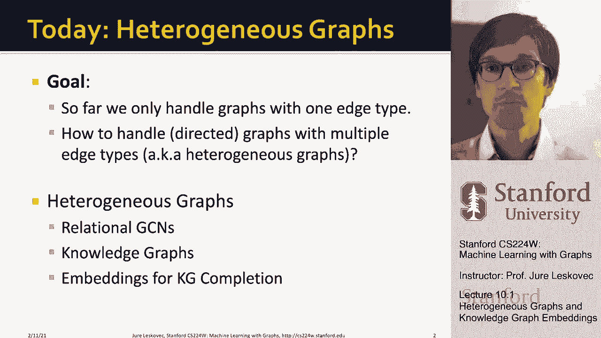
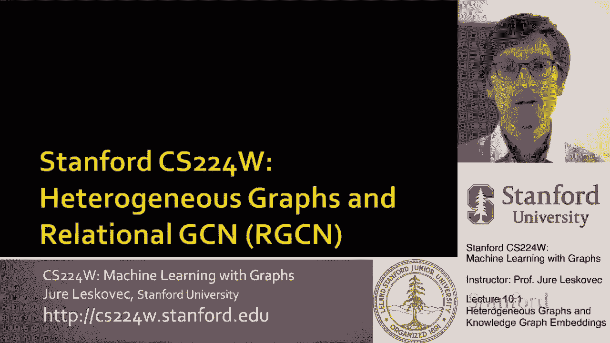
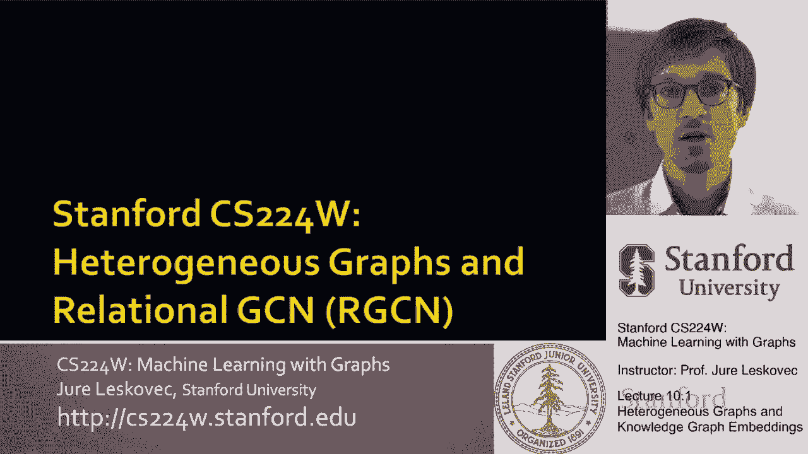
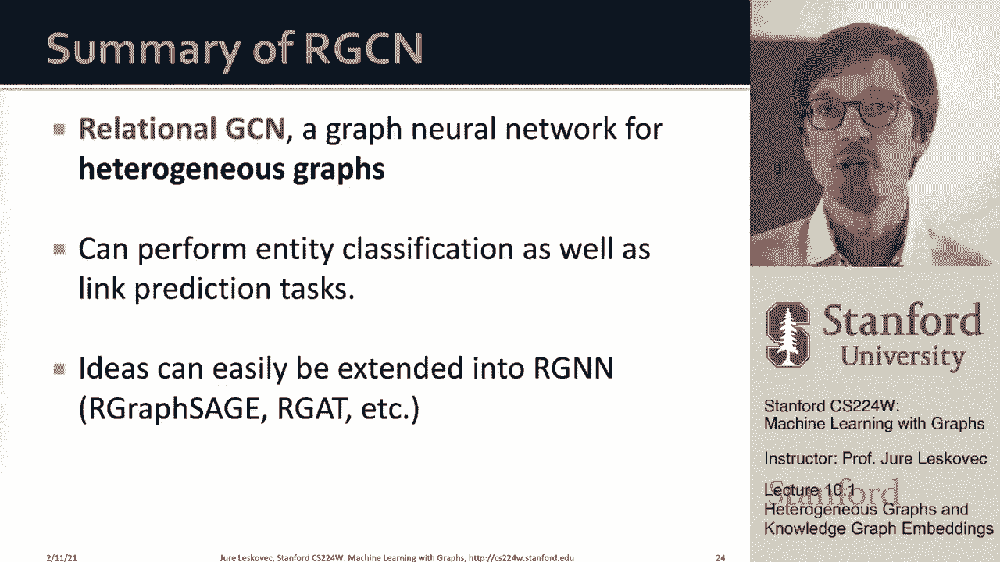

# 28：10.1 - 异构图与知识图谱嵌入 🧠

在本节课中，我们将学习异构图的概念，并重点介绍一种专门处理此类图的方法——关系图卷积网络。我们还将探讨其在知识图谱完成这一特定任务中的应用。

---

## 异构图与关系图卷积神经网络 (RGCN) 🔗

到目前为止，我们处理的图都只有单一的节点类型和边类型。然而，现实世界中的图通常包含多种类型的节点和它们之间多种类型的关系。这种图被称为**异构图**。

一个异构图由四元组定义：一组节点 `V`，一组边 `E`，其中每个节点都有一个类型，每条边都有一个关系类型 `r`。这意味着一条边现在是一个三元组 `(i, r, j)`，表示节点 `i` 通过关系 `r` 连接到节点 `j`。

以下是异构图的例子：
*   **生物医学图**：节点类型可以是疾病、蛋白质、药物等。边类型可以是“治疗”、“导致”、“相似于”等。
*   **事件图**：节点类型可以是航班、机场。边类型可以是“目的地是”、“出发地是”等。

为了处理这种异质性，我们需要扩展标准的图卷积网络。

---

### 从标准 GCN 到关系 GCN

上一节我们回顾了标准 GCN。现在，我们来看看如何将其扩展到多关系场景。

在标准 GCN 中，每个节点通过聚合其邻居的信息来更新自己的表示。聚合操作通常是对邻居的表示进行线性变换后求和并归一化。其单层更新公式为：

**公式：**
`h_v^(l+1) = σ( Σ_{u∈N(v)} (1 / c_v) * W^(l) * h_u^(l) )`

其中 `W^(l)` 是第 `l` 层的共享权重矩阵。

在异构图中，边具有不同的关系类型。关系 GCN 的核心思想是：**为不同的关系类型使用不同的变换矩阵**。这样，来自不同关系类型邻居的信息会以不同的方式被转换。

因此，关系 GCN 的单层更新公式变为：

**公式：**
`h_v^(l+1) = σ( Σ_{r∈R} Σ_{u∈N_r(v)} (1 / c_{v,r}) * W_r^(l) * h_u^(l) + W_0^(l) * h_v^(l) )`

这里：
*   `R` 是所有关系类型的集合。
*   `N_r(v)` 是通过关系 `r` 与节点 `v` 相连的邻居集合。
*   `W_r^(l)` 是专门用于关系 `r` 在第 `l` 层的变换矩阵。
*   `c_{v,r}` 是归一化常数，通常是关系 `r` 下节点 `v` 的入度。
*   `W_0^(l)` 用于处理节点自身的上一轮表示。

---

### 提升 RGCN 的可扩展性 ⚙️

当关系类型很多时（例如成百上千种），为每一层、每一种关系都学习一个独立的稠密矩阵 `W_r` 会导致参数量爆炸，容易过拟合且难以训练。以下是两种解决该问题的主要技术。

#### 方法一：块对角矩阵

这种方法的思路是强制每个关系特定的变换矩阵 `W_r` 具有**块对角结构**。这意味着矩阵中只有沿对角线的若干个小块是非零的，其余部分为零。

**优势**：这显著减少了需要学习的参数数量，因为只需估计这些小块中的参数。
**代价**：这种结构限制了不同特征维度之间的交互（只有同一块内的维度能直接交互），可能需要更深的网络来弥补。

#### 方法二：基变换分解

这是一种更优雅的权重共享方式。其核心思想是：所有关系特定的变换矩阵 `W_r` 都共享一组**基矩阵** `V_b`，而每个 `W_r` 只是这些基矩阵的线性组合。

**公式：**
`W_r = Σ_{b=1}^B a_{rb} * V_b`

这里：
*   `{V_1, V_2, ..., V_B}` 是一组共享的基矩阵（字典）。
*   `a_{rb}` 是标量系数，表示基矩阵 `V_b` 对构建关系 `r` 的变换矩阵的重要性。

**优势**：参数量从 `|R| * d * d` 大幅减少到 `B * d * d + |R| * B`。即使关系类型很多，我们只需要学习少量的基矩阵和组合系数，使模型更紧凑、更鲁棒。

---

### 在异构图上进行预测任务 🎯

我们已经构建了 RGCN 模型，现在来看看如何在异构图上执行具体的预测任务。

#### 节点分类（实体分类）

这与同构图上的节点分类类似。RGCN 为每个节点生成最终的嵌入表示 `h_v^(L)`。然后，我们可以简单地添加一个预测头，例如一个线性层加 softmax 激活函数，来预测节点的类别。

**公式（预测头）：**
`y_v = softmax( W_class * h_v^(L) + b )`

#### 链接预测

链接预测在异构图中变得更复杂，因为我们需要预测“是否存在某种特定类型的边”。关键步骤在于数据划分和负样本生成。

**数据划分（分层划分）**：我们不能随机拆分所有边，因为某些关系类型可能非常稀少。正确做法是**对每种关系类型的边单独进行划分**（分成训练/验证/测试集），然后再将各种关系类型的划分结果合并。这确保了即使罕见关系，在各个数据集中也有代表。

**训练阶段的负采样**：对于每个监督边（正样本）`(e, r, a)`，我们通过“破坏”它来生成负样本。例如，保持头节点 `e` 和关系 `r` 不变，随机替换尾节点 `a` 为一个未通过关系 `r` 与 `e` 相连的节点（如 `b`）。必须确保生成的负边 `(e, r, b)` 在图中不存在。

**评分函数**：我们需要一个函数来为给定的三元组 `(h, r, t)` 打分。一个简单的方法是使用双线性变换：
**公式：**
`score(h, r, t) = h^T * W_r * t`
其中 `h` 和 `t` 是头尾节点的嵌入，`W_r` 是关系 `r` 的评分矩阵。

**训练目标**：使用交叉熵损失，最大化正样本的分数，最小化负样本的分数。

**验证/评估**：计算正样本边的得分，并计算其在一组负样本边中的排名。常用评估指标有：
*   **命中率@K**：正样本边排名在前 K 位的频率。
*   **平均倒数排名**：正样本边排名的倒数的平均值。值越大越好。

---

### 总结 📝

本节课我们一起学习了异构图的表示及其嵌入方法。
1.  我们引入了**异构图**的概念，它包含多种节点和关系类型。
2.  我们重点介绍了**关系图卷积网络**，它通过为不同关系类型分配不同的变换矩阵来扩展标准 GCN。
3.  我们探讨了 RGCN 的**可扩展性挑战**，并学习了两种解决方案：使用**块对角矩阵**和**基变换分解**来减少参数量。
4.  最后，我们讲解了如何在异构图上进行**节点分类**和**链接预测**任务，特别是链接预测中分层数据划分和负采样的重要性。

RGCN 的思想可以自然地扩展到其他图神经网络架构，如 GAT 或 GraphSAGE，从而构建出更强大、更灵活的多关系图学习模型。