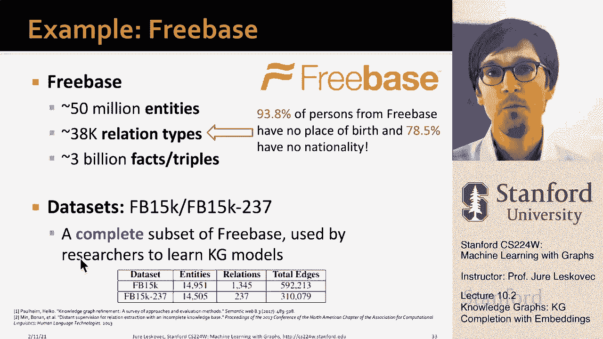

# 29：10.2 - 知识图谱补全 🧠

在本节课中，我们将要学习知识图谱的基本概念，并重点探讨如何使用嵌入方法来完成知识图谱补全任务。知识图谱补全是预测图中缺失关系的关键技术，在信息检索、问答系统等领域有广泛应用。

## 什么是知识图谱？

知识图谱旨在以图结构的形式存储特定领域的知识。其核心思想是捕捉实体类型以及不同实体之间的关系。因此，图中的节点被称为“实体”，每个实体都有其类型标签。实体之间则通过不同类型的关系进行连接。

从这个角度看，知识图谱是异构图的一个特例，但它通常特指用于捕捉领域事实知识的结构。例如，在学术文献网络中，节点类型可以包括**论文**、**作者**、**会议**、**年份**。关系类型则可以是“发表于”、“完成于”、“标题为”、“作者是”、“引用”等。

以下是一个简单的知识图谱模式示例：
*   论文与会议通过“发表于”关系连接。
*   论文与论文通过“引用”关系连接。
*   论文具有“标题”和“出版年份”属性。
*   论文与作者通过“作者是”关系连接。

另一个例子是生物医学知识图谱，其节点类型可能包括**药物**、**疾病**、**蛋白质**、**通路**。关系类型则可以是“有作用”、“导致”、“与…相关”等。这种图谱将生物学知识编码为图结构。

## 知识图谱的应用

知识图谱在工业界被广泛用于捕捉领域背景知识和实体间关系。

*   **信息检索**：例如，在搜索引擎中查询“《泰坦尼克号》的导演是谁？”。系统通过知识图谱找到“《泰坦尼克号》”实体，再通过“导演”关系找到对应的人物实体，并可直接展示相关信息。没有图结构的数据编码，回答此类复杂查询将非常困难。
*   **问答与对话代理**：智能系统需要理解问题中包含的实体及其关系，才能给出准确回答。维基百科、IMDB等都可以作为构建知识图谱的数据源。

目前存在许多公开的知识图谱，如Freebase、维基数据、DBpedia等。它们通常规模巨大，包含数百万甚至数十亿的节点和边。

## 知识图谱补全任务

然而，这些大型知识图谱普遍存在一个显著问题：**不完整性**。图中存在大量缺失的关系。

知识图谱补全的核心任务就是：给定一个大规模但不完整的知识图谱，预测其中哪些潜在的关系是真实存在但被遗漏的。这可以被视为一种链接预测任务。

以Freebase知识图谱为例，它包含约5千万个实体、3.8万种关系类型和30亿条边。但统计显示，其中约94%的“人物”实体缺失“出生地”信息，约78%缺失“国籍”信息。

因此，知识图谱补全要解决的问题是：我们能否自动推断出某个给定实体的国籍？或者某个人物的出生地？这就是**知识图谱补全**任务。

## 总结

本节课我们一起学习了知识图谱的基本概念，它是一种用图结构存储实体和关系的知识库。我们了解到知识图谱虽然规模庞大，但普遍存在数据不完整的问题。因此，知识图谱补全——即预测图中缺失的关系——成为了一项至关重要且具有挑战性的任务。在接下来的章节中，我们将深入探讨如何利用嵌入技术来解决这一任务。