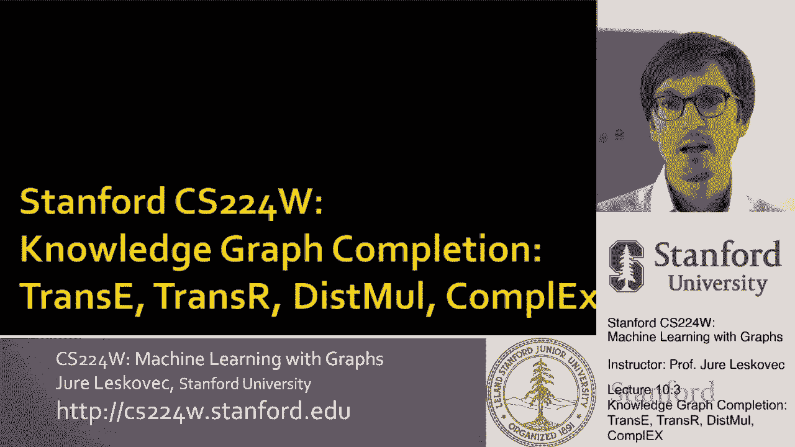
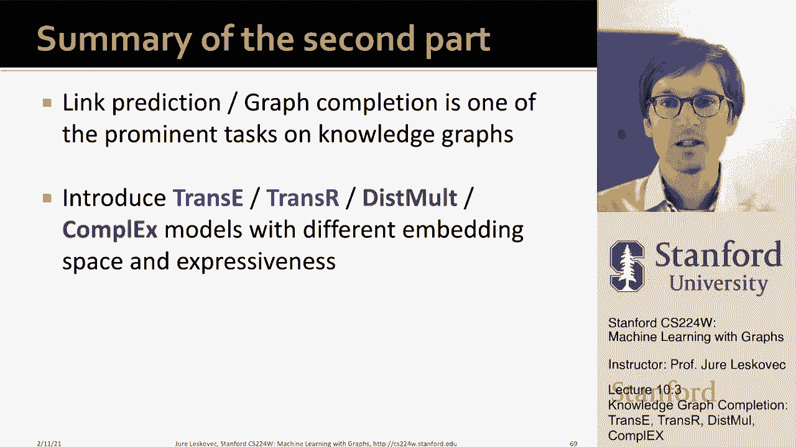

# 30：10.3 - 知识图谱补全 🧠

在本节课中，我们将学习知识图谱补全任务，并探讨完成该任务的各种方法。我们将介绍几种具有不同名称的方法，如TransE、TransR、DistMult和ComplEx，并理解它们各自能够捕获和预测何种类型的关系。

---

## 知识图谱补全任务概述

知识图谱补全任务的核心是：给定一个庞大的知识图谱，我们能否推断或预测其中缺失的信息？因为知识图谱通常是不完整的。

该任务的具体形式是：给定头节点和关系类型，我们需要预测缺失的尾节点。这与经典的链接预测任务略有不同，后者是预测整个图中缺失的所有链接，而这里我们关注的是特定节点和特定关系下的预测。

例如，我们可能想知道“J.K.罗琳”与“科幻”这一体裁是否相连。我们给定头节点“J.K.罗琳”和关系“体裁”，目标是预测尾节点“科幻”。

我们将通过节点嵌入来完成这个任务。知识图谱中的每个实体（节点）都将学习到一个嵌入向量。这里我们主要使用浅层嵌入，即直接为每个实体学习一个向量，而不使用图神经网络，以简化模型。

知识图谱通常表示为一组三元组 **(头实体, 关系, 尾实体)**。例如，（巴拉克·奥巴马，国籍，美国）。

核心思想是：将实体和关系建模为嵌入空间中的点和向量。对于真实的三元组 **(h, r, t)**，我们的目标是让 **头实体h和关系r的组合嵌入** 尽可能接近 **尾实体t的嵌入**。

不同的方法主要区别在于如何定义“组合嵌入”以及如何衡量“接近程度”。

---

## TransE：基于平移的嵌入模型 🚶‍♂️

上一节我们介绍了任务的基本设定，本节我们来看第一个也是最直观的方法——TransE。它的核心直觉是“平移”。

TransE希望学习到头实体h、尾实体t和关系r的嵌入向量，并满足以下公式：
`h + r ≈ t`

这意味着，如果我们从头实体h的嵌入点出发，沿着关系r对应的向量方向移动，应该到达尾实体t的嵌入点。

例如，对于（巴拉克·奥巴马，国籍，美国），我们希望“巴拉克·奥巴马”的向量加上“国籍”关系的向量，结果接近“美国”的向量。并且，这个“国籍”向量应该适用于任何人和其国籍国家。

**评分函数**用于衡量头尾实体通过关系组合后的接近程度，在TransE中通常使用负的L2范数距离：
`score = -|| h + r - t ||`
距离越小（或负值越大），表示三元组成立的可能性越高。

训练时，模型参数（所有实体和关系的嵌入）被随机初始化。我们会采样一个正例三元组和一个“损坏”的三元组（例如，保持h和r不变，随机替换t为一个错误的实体）。学习目标是使正例的距离小于损坏样本的距离。

TransE的优点是简单直观，它将关系视为实体空间中的平移操作。

现在，我们需要思考：TransE能够学习哪些类型的关系模式？关系可以具有不同的属性，例如对称性、互逆性等。

以下是几种重要的关系模式：
*   **对称/反对称关系**：对称关系（如“室友”）是相互的；反对称关系（如“上位词/下位词”）是单向的。
*   **互逆关系**：如果关系r1连接h到t，则存在另一个关系r2连接t到h（如“导师/学生”）。
*   **复合关系**：如果关系r1连接x到y，关系r2连接y到z，则存在关系r3连接x到z（如“母亲的丈夫是父亲”）。
*   **一对多关系**：一个头实体可以通过同一种关系连接到多个尾实体（如“指导学生”）。

那么，TransE能处理这些模式吗？

*   **反对称关系**：可以。因为从h通过r到达t后，再从t通过同一个r无法回到h。
*   **互逆关系**：可以。只需让互逆的两个关系向量互为相反数，即 `r2 = -r1`。
*   **复合关系**：可以。复合关系r3的向量可以表示为 `r3 = r1 + r2`。
*   **对称关系**：**无法处理**。要使 `h + r = t` 且 `t + r = h` 同时成立，唯一解是 `r = 0` 且 `h = t`，这迫使不同实体具有相同嵌入，不合理。
*   **一对多关系**：**无法处理**。要使 `h + r = t1` 和 `h + r = t2` 同时成立，唯一解是 `t1 = t2`，这迫使不同的尾实体具有相同嵌入，不合理。

因此，TransE虽然简单有效，但在处理对称和一对多关系时存在局限。

---

## TransR：关系特定空间的平移模型 🧩

为了解决TransE的局限性，我们引入了TransR。它的核心思想是：为每种关系设计一个独立的嵌入空间，并在该关系特定空间中进行平移操作。

在TransR中，实体被嵌入到一个**实体空间**，而每个关系r则关联一个**关系空间**以及一个将该实体从实体空间投影到关系空间的**投影矩阵Mr**。

对于三元组(h, r, t)，TransR首先使用关系特定的矩阵Mr将实体嵌入h和t投影到关系r的空间中，然后在该空间内应用类似TransE的平移思想。评分函数为：
`score = -|| Mr*h + r - Mr*t ||`

这种方法带来了更大的灵活性。

*   **对称关系**：可以处理。投影矩阵Mr可以将两个不同的实体（如室友）映射到关系空间中的同一点，然后只需设置平移向量 `r = 0` 即可满足对称性。
*   **反对称关系**：可以处理。原理与TransE类似，在投影后的空间中，从h到t和从t到h的路径不同。
*   **一对多关系**：可以处理。投影矩阵Mr可以将多个不同的尾实体（如多个学生）映射到关系空间中的同一点，使得 `Mr*h + r` 能够同时接近它们。
*   **互逆关系**：可以处理。要求两个互逆关系的投影矩阵相同，且它们的平移向量互为相反数。

那么，TransR有什么缺点呢？它无法处理TransE能够轻松处理的**复合关系**。因为每个关系都有自己的投影空间，我们不知道如何在不同关系空间之间进行组合。从空间A到空间B，再到空间C的变换，无法简单地用一个从A到C的变换来表示。

---

## DistMult：基于双线性评分的模型 ✖️

我们介绍了两种基于平移的模型，现在来看一种改变评分函数思路的方法——DistMult。它不再使用距离作为评分，而是采用双线性模型。

DistMult将实体和关系都嵌入到同一个向量空间中，并使用以下评分函数：
`score = sum( h_i * r_i * t_i )`， 其中i遍历向量的每个维度。
这可以写成向量形式：`score = h^T * diag(r) * t`
其中 `diag(r)` 是一个以向量r为对角线元素的对角矩阵。

这个评分函数可以理解为：关系r定义了一个超平面，其法向量由 `h * r`（逐元素乘积）决定。评分是尾实体t与该法向量的点积（余弦相似度）。如果三元组成立，t应该落在超平面的正确一侧（得分高）；否则得分低。

让我们分析DistMult的能力：

*   **一对多关系**：可以处理。多个尾实体可以位于超平面的同一侧。
*   **对称关系**：**可以处理**。因为评分函数 `h^T * diag(r) * t` 对于h和t是对称的（交换h和t结果不变）。
*   **反对称关系**：**无法处理**。正是由于上述对称性，它无法区分 `(h, r, t)` 和 `(t, r, h)`，因此不能建模单向关系。
*   **互逆关系**：**无法处理**。要使 `score(h, r1, t)` 和 `score(t, r2, h)` 都高，唯一简单解是 `r1 = r2`，但这会将互逆关系错误地建模为对称关系。
*   **复合关系**：**无法处理**。由多个关系组合诱导出的数据分布，无法用单个双线性超平面来完美表达。

---

## ComplEx：复数空间嵌入模型 🔮

最后，我们介绍ComplEx模型，它将嵌入空间从实数域扩展到复数域，以克服DistMult的一些限制。

在ComplEx中，实体和关系的嵌入都是复数向量，包含实部和虚部。它使用一个改进的评分函数：
`score = Re( sum( h_i * conj(r_i) * t_i ) )`
其中 `conj(r_i)` 是关系向量第i维的复共轭，`Re()` 表示取结果的实部。

引入复共轭操作打破了评分的对称性，从而带来了新的建模能力：

*   **反对称关系**：可以处理。利用复共轭的非对称性，可以区分 `(h, r, t)` 和 `(t, r, h)`。
*   **对称关系**：可以处理。只需将关系向量的虚部设为零，即可退化为DistMult的对称形式。
*   **互逆关系**：可以处理。通过设置两个互逆关系向量互为复共轭，即 `r2 = conj(r1)`。
*   **复合关系**：**无法处理**。与DistMult类似，其评分函数形式限制了它对关系组合的建模能力。
*   **一对多关系**：**无法处理**。原因与DistMult相同。

---

## 方法总结与实践建议 📊

本节课我们一起学习了四种用于知识图谱补全的嵌入方法。下表总结了它们对不同关系模式的建模能力：

| 方法 | 嵌入空间 | 核心思想 | 对称 | 反对称 | 互逆 | 复合 | 一对多 |
| :--- | :--- | :--- | :--- | :--- | :--- | :--- | :--- |
| **TransE** | 实数空间 | 关系即平移 | ❌ | ✅ | ✅ | ✅ | ❌ |
| **TransR** | 实体空间+关系空间 | 关系特定投影+平移 | ✅ | ✅ | ✅ | ❌ | ✅ |
| **DistMult** | 实数空间 | 双线性评分（超平面） | ✅ | ❌ | ❌ | ❌ | ✅ |
| **ComplEx** | 复数空间 | 双线性评分+复共轭 | ✅ | ✅ | ✅ | ❌ | ❌ |

> **注**：✅ 表示能够较好建模，❌ 表示难以或无法建模。

不同的知识图谱可能具有截然不同的关系模式。在实践中，没有一种方法在所有情况下都是最好的。

**选择建议如下：**
1.  **TransE** 是一个很好的起点，它简单、直观，且能处理复合关系。
2.  如果需要建模一对多关系，应避免使用TransE。
3.  如果需要建模反对称关系，应避免使用DistMult。
4.  一般来说，**TransR**和**ComplEx**能够建模更多样化的关系类型，表达能力更强。还有像**RotatE**（在复数空间做旋转，类似TransE）这样的模型也值得尝试。
5.  最终选择应基于你的知识图谱特点和你想要预测的关系类型。

---

## 课程总结

在本节课中，我们一起学习了知识图谱补全这一重要任务，并深入探讨了四种不同的嵌入方法：TransE、TransR、DistMult和ComplEx。这些方法在嵌入空间（实数/复数）和评分函数（平移/双线性）上各有不同，从而具备了不同的表达能力，能够建模不同类型的关系。理解这些方法的原理和优缺点，有助于我们在实践中根据具体任务选择最合适的模型。