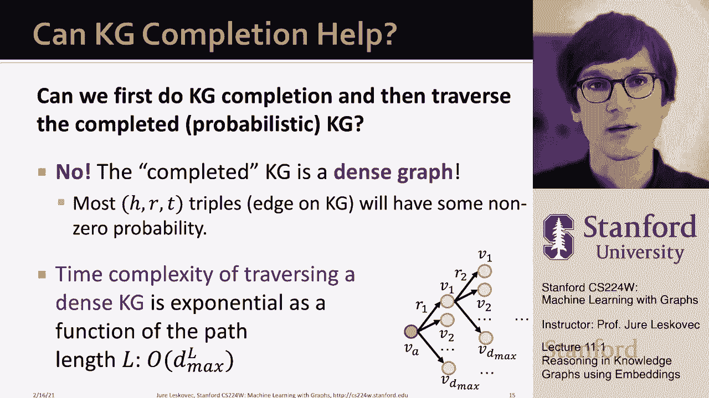

# 31：11.1 - 知识图谱推理 🧠

在本节课中，我们将学习如何在知识图谱中进行推理。具体来说，我们将探讨如何利用嵌入技术，来回答知识图谱中的多跳查询和复杂逻辑查询。我们将从简单的单跳查询开始，逐步扩展到路径查询和合取查询，并介绍一种名为“查询到盒子”的方法。

---

## 单跳查询与知识图谱补全

上一节我们介绍了知识图谱的基本概念。知识图谱由节点和节点间不同类型的关系构成。我们曾定义过一个任务，称为知识图谱补全任务。其核心问题是：给定一个庞大的知识图谱，我们能否预测其中缺失的关系？例如，给定一个头实体和一个关系，我们想要预测缺失的尾实体。

这本质上等同于回答一个单跳查询。例如，查询“药物富马酸替诺福韦酯会引起哪些副作用？”，就是从实体“富马酸替诺福韦酯”出发，沿着“引起”关系进行一步预测。

因此，知识图谱补全任务可以形式化为回答单跳查询。其目标是估计在头实体 `h` 和关系 `r` 下，尾实体 `t` 存在的可能性。我们可以用公式表示这个预测任务：

**公式：** `P(t | h, r)`

其中，`P` 表示概率，`h` 是头实体，`r` 是关系，`t` 是待预测的尾实体。

---

## 路径查询：多步推理

本节中，我们来看看如何将单跳查询推广到更复杂的多步推理，即路径查询。

一个 `n` 跳的路径查询 `q` 可以表示为一个锚点实体 `V_a`（起始实体）和一系列关系 `[R1, R2, ..., Rn]`。答案则是在知识图谱 `G` 中，从 `V_a` 开始，依次经过这些关系后所能到达的实体集合。

**公式表示：** `[[q]]_G = { v | V_a —R1→ ... —Rn→ v }`

用图形化的“查询计划”表示，即从锚点实体出发，依次遍历关系 R1, R2, ..., Rn。

例如，查询“哪些蛋白质与富马酸替诺福韦酯引起的副作用相关？”就是一个路径查询。其锚点实体是“富马酸替诺福韦酯”，关系序列是 [`引起`, `关联`]。

以下是回答路径查询的逻辑步骤：

1.  从锚点实体“富马酸替诺福韦酯”出发。
2.  沿着“引起”关系，找到所有由此药物引起的副作用实体（如头痛、脑出血等）。
3.  从这组副作用实体出发，再沿着“关联”关系，找到所有相关的蛋白质实体。
4.  最终得到的蛋白质集合就是该查询的答案。

在知识图谱完整的情况下，我们只需按照上述步骤遍历图谱即可得到答案。

---

## 不完整知识图谱的挑战

然而，现实中的知识图谱通常是不完整的。许多实体间的关系是缺失或未知的。例如，我们可能尚未发现“富马酸替诺福韦酯”会导致“呼吸短促”这一事实。

如果知识图谱缺失了这条“引起”边，那么在上述路径查询中，我们就无法通过“呼吸短促”这个节点，进一步发现蛋白质“B.E.R.K.2”也是答案之一。直接遍历不完整的图谱会导致答案遗漏。

一个直观的想法是：先利用知识图谱补全技术预测所有可能缺失的边，将图谱“补全”，然后再进行遍历。但这种方法存在严重问题：

1.  **计算爆炸**：补全后的图谱会新增大量边（即使是概率形式的）。当执行长路径查询时，每一步都可能扩展到大量节点，导致计算量随查询长度呈指数级增长。
2.  **管理复杂**：需要跟踪和处理这些带有概率的新增边，使得遍历过程变得异常复杂和低效。

因此，我们需要一种能够直接在不完整知识图谱上进行复杂查询推理的方法。

---

## 预测式查询：将推理转化为预测

为了解决上述挑战，我们引入“预测式查询”的概念。核心思想是：**不通过显式补全和遍历图谱来回答查询，而是将“回答查询”本身定义为一个复杂的预测任务**。

这意味着，我们将查询 `q`（如一个路径查询）作为输入，模型的目标是直接预测出属于答案集的实体。这种方法的关键优势在于：

*   **隐式处理不完整性**：模型在预测过程中，能够隐式地考虑和处理知识图谱中缺失的信息，而无需先显式地补全所有边。
*   **泛化能力强**：我们可以在训练时让模型学习如何回答各种基本查询模式。在测试时，即使遇到从未见过的复杂查询组合，模型也应能给出答案。
*   **是链接预测的泛化**：单跳的链接预测任务（预测 `(h, r, ?)`）只是预测式查询的一个特例（路径长度 `n=1`）。我们现在将其推广到任意多步的预测任务。

通过这种范式转换，我们将复杂的图谱遍历问题，转化为一个可学习的嵌入空间中的预测问题，从而能够高效、稳健地回答知识图谱上的复杂查询。

---

## 总结

本节课中，我们一起学习了知识图谱推理的基本框架。

1.  我们首先回顾了**单跳查询**，它等价于知识图谱补全任务。
2.  接着，我们将其推广到**路径查询**，它允许进行多步推理。
3.  我们指出了在**不完整知识图谱**上直接进行遍历查询的缺陷。
4.  最后，我们引入了**预测式查询**的新范式，其核心是将回答查询视为一个直接的预测任务，从而能够隐式处理知识缺失问题，并泛化了链接预测任务。

这为我们后续学习具体的推理方法（如处理合取查询的“查询到盒子”方法）奠定了重要的概念基础。