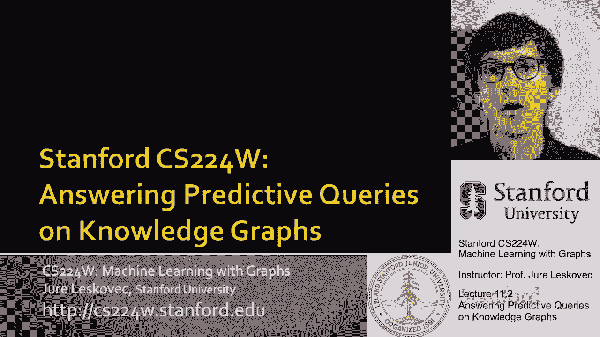
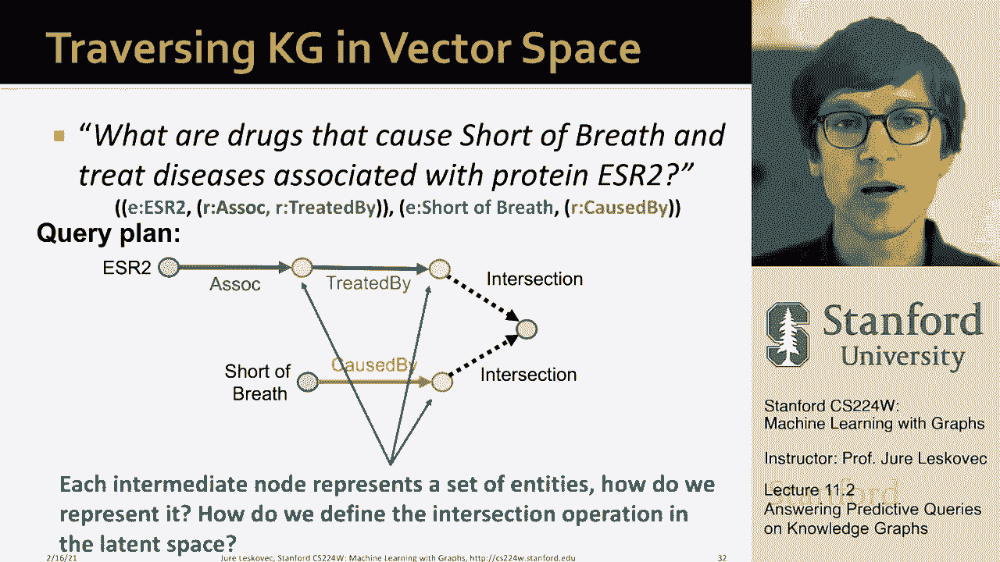

# 32：11.2 - 回答预测性查询 🔍




在本节课中，我们将学习如何利用知识图谱的嵌入空间结构来预测给定查询的答案。我们将从TransE方法的基础思想出发，探讨如何将其推广到处理多跳推理和包含逻辑运算符（如合取）的复杂查询。

---

## 从TransE到查询嵌入

上一节我们介绍了知识图谱补全的基本概念。本节中，我们来看看如何将TransE方法的思想用于回答预测性查询。

TransE知识图谱补全方法的核心思想是：给定头实体 `H` 和关系 `R`，我们希望尾实体 `T` 的嵌入满足 `H + R ≈ T`。其评分函数通常写作：

```
score(H, R, T) = - || H + R - T ||
```

这可以解释为：我们首先将查询嵌入为 `Q = H + R`，然后目标是使查询嵌入 `Q` 与答案实体 `T` 的嵌入之间的距离最小化。

例如，从实体“巴拉克·奥巴马”开始，加上关系“国籍”对应的向量，我们得到一个查询嵌入点 `Q`。我们希望 `Q` 与实体“美国人”的嵌入距离小，而与“纽约人”的嵌入距离大。

这种方法的优雅之处在于，查询嵌入只需简单的向量加法即可获得。

---

## 推广到多跳推理路径查询

理解了如何嵌入单关系查询后，我们可以将TransE自然地推广到多跳推理。

我们可以定义一个查询 `Q`，它由一个锚点实体和一系列关系组成。查询嵌入的生成方式是：从锚点实体的嵌入开始，依次加上每个关系对应的向量。

```
Q = E_anchor + R1 + R2 + ... + Rn
```

生成查询嵌入 `Q` 后，我们只需在嵌入空间中寻找与 `Q` 最接近的实体，这些实体就是预测的答案。

以下是一个多跳查询的示例步骤：
1.  从药物“氟维司群”的嵌入开始。
2.  加上“导致”关系对应的向量，到达一个代表其副作用的区域。
3.  再从此区域加上“与...相关”关系对应的向量，到达最终查询嵌入点 `Q`。
4.  与 `Q` 最接近的实体（蛋白质）即为答案。

这种方法之所以有效，是因为TransE具有关系组合性，允许我们将多个关系向量串联起来。

---

## 处理包含逻辑运算符的复杂查询

上一节我们处理了路径查询，本节中我们来看看如何回答更复杂的查询，例如包含合取（AND）逻辑运算符的查询。

考虑这样一个查询：“哪些药物既会导致呼吸短促，又能治疗与蛋白质ESR2相关的疾病？” 这涉及到两个子路径的**交集**。

如果知识图谱完整，我们可以通过图谱遍历来回答：
1.  从ESR2出发，沿“与...相关”关系找到相关疾病，再沿“被...治疗”关系找到治疗这些疾病的药物**集合A**。
2.  从“呼吸短促”出发，沿“由...导致”关系找到导致该症状的药物**集合B**。
3.  计算集合A与集合B的**交集**，即为答案。

然而，现实中的知识图谱往往不完整，缺失的边会使遍历失败。因此，我们需要在**嵌入空间**中实现这种集合操作。

关键洞察在于：查询计划中的中间节点（灰色节点）代表的是**实体集合**，而非单个实体。因此，我们需要解决两个问题：
1.  如何在嵌入空间中表示一个实体集合？
2.  如何在潜在空间中定义交集等逻辑运算符？

我们将在后续课程中探讨解决这些问题的具体嵌入方法。

---

## 核心要点总结

本节课中我们一起学习了如何利用嵌入技术回答知识图谱上的预测性查询。

*   **基础思想**：将查询嵌入到与实体相同的向量空间中，答案即为最接近查询嵌入的实体。
*   **路径查询**：通过连续叠加关系向量（`Q = E + R1 + R2 + ...`）来嵌入多跳查询，这是TransE方法组合性的直接应用。
*   **复杂查询**：对于包含合取等逻辑运算的查询，需要将查询计划中的中间节点视为实体集合，并**在嵌入空间中定义集合的交集操作**。
*   **嵌入优势**：与遍历相比，嵌入方法能够通过全局信息**隐式地补全缺失的关系**，从而对不完整的知识图谱进行鲁棒的推理。




通过将查询表示为向量空间中的点，我们能够以一种统一、可计算的方式处理从简单到复杂的各种预测性问题。