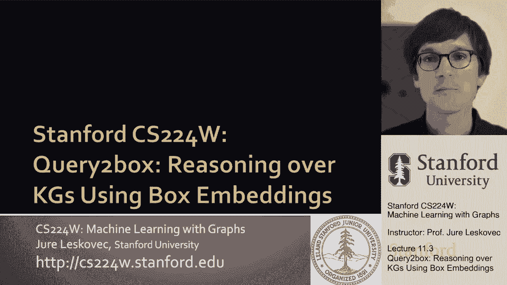
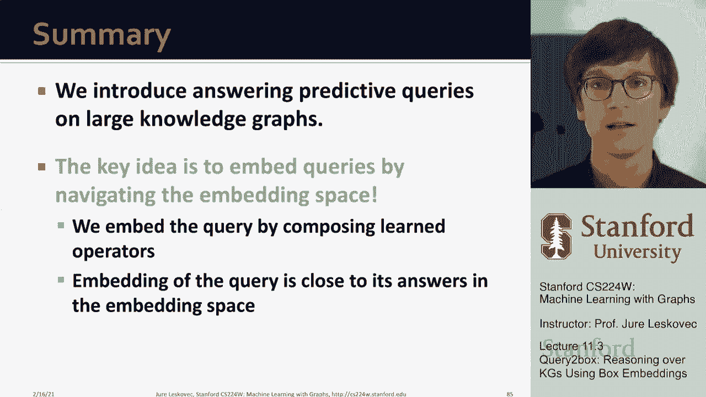

# 33：11.3 - 知识图谱上的查询到框推理 🧠




在本节课中，我们将学习一种名为“查询到框”的方法，它允许我们使用“框嵌入”对知识图谱进行推理。我们将探讨如何表示复杂的查询，以及如何在低维向量空间中执行逻辑操作，如交集和并集。

---

## 动机与问题设定

上一节我们介绍了在知识图谱上进行推理的挑战。本节中，我们来看看如何回答更复杂的预测性问题，特别是那些包含合取（交集）操作的查询。

我们需要解决两个核心问题：
1.  如何在嵌入空间中表示一组实体。
2.  如何在嵌入空间中定义交集操作符，以便快速找到两组实体的交集。

---

## 核心概念：框嵌入 📦

关键的洞察是引入“框嵌入”的概念。这意味着我们将所有实体和关系嵌入为多维空间中的矩形框。

一个框由两点定义：
*   **中心点**：表示框的位置。
*   **角偏移量**：表示框在各个维度上的大小。

**公式表示**：一个框可以表示为 `(中心点， 角偏移量)`。

直觉上，我们希望由某个查询（例如，遵循某个关系）所引出的所有实体，都能被紧密地包裹在一个框内。这样，实体集就与一个几何对象（框）关联起来。

---

## 为什么使用框？

使用框嵌入的主要原因是，框之间的交集可以很好地被定义。两个框的交集本身也是一个框（可能是一个空框或尺寸缩小的框）。

这意味着我们可以定义符合逻辑操作符的几何变换。当我们遍历知识图谱寻找答案时，每一步都会产生一组可达实体。我们现在用一个框来对这组实体进行建模。这个框提供了一个强大的抽象，因为它包含了这些实体，并且我们可以轻松地在其上定义几何交集操作符。无论我们以何种方式组合框，交集结果总是一个框，这保留了组合性。

---

## 方法框架：需要学习什么？

为了实现框嵌入推理，我们需要学习以下组件：

以下是需要学习的模型参数：
1.  **实体嵌入**：每个实体被嵌入为一个“平凡”的框，即一个体积为零的点框。
2.  **关系嵌入/投影算子**：每个关系对应一个学习到的“投影”算子 `P`。它接收一个输入框，并根据该关系移动和缩放这个框（改变其中心和偏移量），从而输出一个新框。
3.  **交集算子**：这是一个新的学习组件。它接收多个框作为输入，并输出一个代表它们交集的单个框。这个算子比简单的数学交集更灵活，具有可学习的参数。

---

## 工作流程示例

让我们通过一个具体查询来理解工作流程：“哪些疾病与蛋白质ESR2相关，并且其治疗方式也能引起呼吸急促？”

我们的查询计划是：
1.  从锚实体 `ESR2` 开始，沿“相关”关系投影，得到与ESR2相关的所有疾病的框。
2.  从锚实体“呼吸急促”开始，沿“引起”关系投影，得到能引起呼吸急促的所有事物的框。
3.  计算这两个框的交集，交集框中的实体就是答案。

**代码逻辑描述**：
```
框_Q1 = 投影算子_P_相关(实体_ESR2的嵌入框)
框_Q2 = 投影算子_P_引起(实体_呼吸急促的嵌入框)
答案框 = 交集算子_J(框_Q1， 框_Q2)
答案 = 所有位于“答案框”内的实体
```

---

## 交集算子的设计

我们如何定义这个学习的交集算子 `J` 呢？直觉上，我们希望：
*   **交集框的中心** 应该靠近所有输入框的中心。
*   **交集框的尺寸（偏移量）** 应该收缩，因为交集的集合小于任何输入集合。

具体定义如下：

**中心计算**：交集框的中心是输入框中心的加权和。权重通过一个可学习的注意力机制（`Softmax`）计算，该机制评估每个输入框对最终交集中心的重要性。
**公式**：`中心_交集 = Σ (注意力权重_i * 中心_框_i)`

**偏移量计算**：首先取所有输入框偏移量的最小值（保证收缩），然后通过一个带`sigmoid`激活的可学习函数进行变换，以增加模型表达能力。
**公式**：`偏移量_交集 = sigmoid( f_偏移量( min(偏移量_框1， 偏移量_框2， ...) ) )`

---

## 距离函数与答案评分

在现实中，由于数据噪声，答案实体可能并不严格在框内。因此，我们需要定义实体点与框之间的距离。

我们分两种情况定义距离：
1.  如果点在框**内**，距离是点到框中心的距离乘以一个小于1的缩放因子 `α`。这鼓励答案实体靠近框中心。
2.  如果点在框**外**，距离是点到框最近表面的距离加上一个惩罚项。

最终，一个实体作为查询答案的得分，可以通过计算该实体嵌入点到查询框的（负）距离来获得。距离越小（得分越高），是该答案的可能性越大。

---

## 如何处理析取（并集/OR）查询？ ➕

一个自然的问题是：能否处理包含析取（OR）操作的查询？答案是在低维空间中直接嵌入任意并集操作是困难的。

**原因**：为了在 `m` 个互不重叠的实体集合上表示任意的并集操作，所需的嵌入维度至少需要 `m-1` 维。对于大规模知识图谱（数万实体），这需要不可接受的高维度。

**解决方案**：利用逻辑等价性。任何一阶逻辑查询都可以重写为**析取范式**，即一系列合取查询的析取（OR）。
```
原始查询 -> 析取范式 = (合取查询1) OR (合取查询2) OR ...
```
这样做的好处是，所有并集操作都被推到了最后一步。我们可以先利用已有的框投影和交集算子，为每个合取查询生成一个答案框。最后一步，实体对于整个析取查询的距离，定义为它到各个合取查询框的**最小距离**。
**公式**：`距离(实体v， 查询Q) = min( 距离(实体v， 框_合取查询1)， 距离(实体v， 框_合取查询2)， ... )`

只要实体是任何一个合取查询的答案，它到整体查询的距离就会很小。

---

## 模型训练

现在我们已经讨论了方法框架，那么如何训练模型来学习这些嵌入和算子呢？

训练过程类似于知识图谱补全，采用负采样策略：

以下是训练步骤：
1.  **采样查询**：从训练知识图谱中随机采样各种结构的查询（单跳、多跳、含交集的查询等）。
2.  **确定正负样本**：对于每个查询，已知的答案实体作为正样本。随机采样一些非答案实体作为负样本（需小心避免采到未知的正确答案）。
3.  **计算得分与损失**：使用模型将查询嵌入为框，计算正样本和负样本实体到该框的距离得分。目标是最大化正样本得分，最小化负样本得分。
4.  **优化**：通过梯度下降优化损失函数，更新所有参数（实体嵌入、投影算子参数、交集算子参数）。

通过这种方式，模型学会将答案实体嵌入到查询框内，而非答案实体排除在外。

---

## 实例演示

在一个包含约1.5万个实体的真实知识图谱上，我们可以进行查询：“所有演奏弦乐器的男性器乐演奏家”。

1.  **投影“弦乐器”**：从“弦乐器”概念节点出发，投影得到包含所有具体弦乐器实例的框。
2.  **投影“演奏者”**：将上一步的框沿“演奏”关系投影，得到所有弦乐器演奏者的框。
3.  **投影“男性”**：从“男性”概念节点出发，投影得到所有男性实体的框。
4.  **计算交集**：对“弦乐器演奏者框”和“男性框”应用交集算子，得到最终的答案框。

可视化显示，系统能够高精度地识别出答案实体，展示了该方法对复杂逻辑查询的有效性。

---

## 总结

本节课中，我们一起学习了基于嵌入的知识图谱逻辑推理方法——查询到框。

*   **核心思想**：将多跳逻辑查询的答案预测任务，转化为在低维向量空间中“导航”并寻找一组实体（用框表示）的任务。
*   **关键创新**：
    *   引入**框嵌入**来表示实体集合。
    *   定义可学习的**投影算子**来模拟关系遍历。
    *   设计可学习的**交集算子**来处理合取查询。
    *   通过重写为**析取范式**并定义最小距离，来处理析取查询。
*   **优势**：该方法具有可扩展性（回答查询仅需简单的几何操作）和鲁棒性（不依赖于知识图谱中单个缺失的链接）。




通过将逻辑操作映射为几何空间中的变换，我们能够高效且灵活地对不完整的知识图谱进行复杂推理。