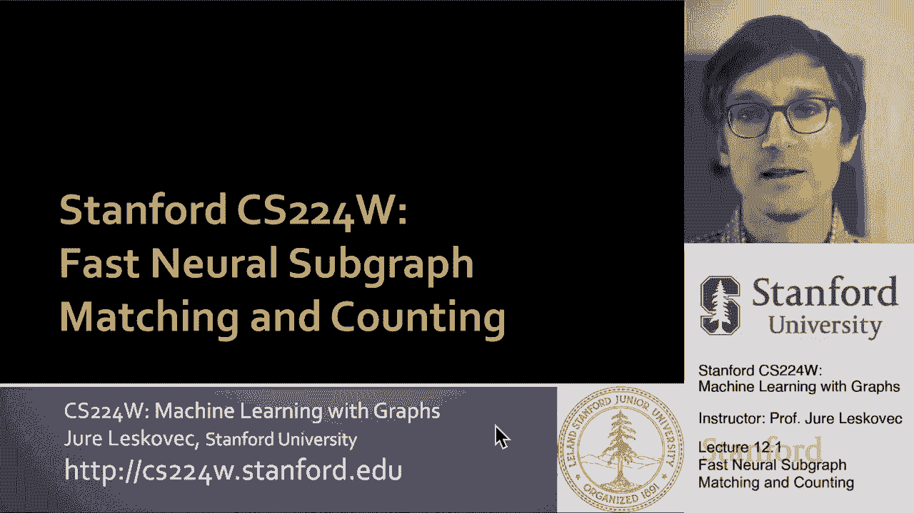
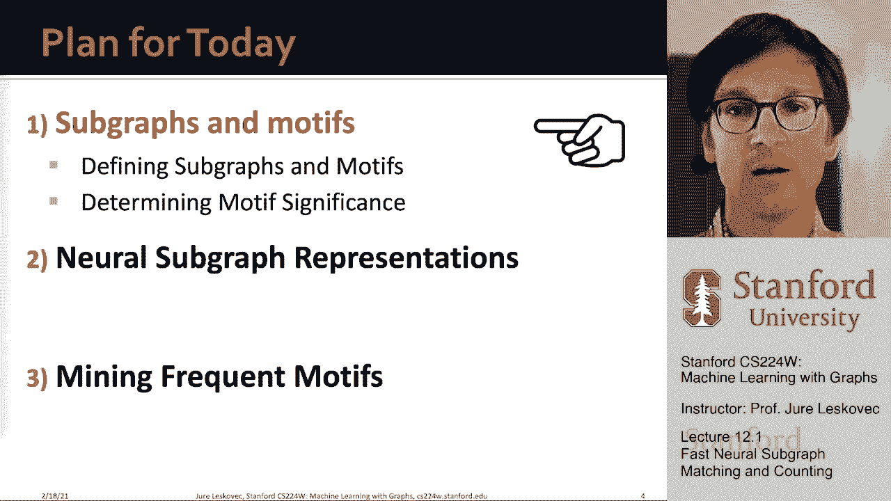
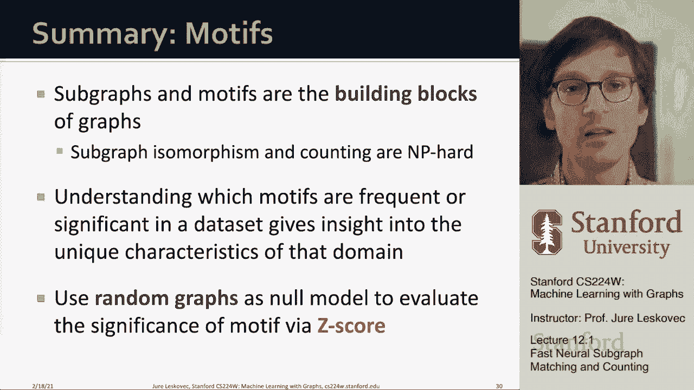

# 34：12.1 - 快速神经子图匹配与计数 🧠🔍




在本节课中，我们将学习一个非常有趣的问题：子图匹配与子图计数，也称为频繁子图匹配与计数。令人兴奋的是，我们将探讨如何利用神经网络来解决这个经典的组合问题，并将其转化为机器学习问题。我们将使用嵌入和图神经网络来实现高效、可扩展且准确的解决方案，从而替代复杂的离散匹配与计数方法。

## 概述：什么是网络构建块？🧱

我们通常将一个大图视为由许多小“积木”（即小子图）组合而成。就像用乐高积木搭建房屋一样，大图是由这些小碎片组合而成的。我们的目标是识别出这些最常见的“乐高积木”，即网络中最常见的子结构或模式。通过理解这些构建块，我们可以描述和区分不同的网络。



例如，观察一组分子（可以表示为图），我们可以问：在这些图中，常见的子结构是什么？识别出共同的亚结构（例如某个特定的官能团）可以帮助我们理解分子的性质（如酸性）。在许多领域中，反复出现的结构组件决定了其功能或行为。


我们将从三个步骤来解决这个问题：
1.  定义子图和网络主题。
2.  讨论如何识别重要的主题。
3.  介绍如何使用图神经网络和嵌入来快速识别公共子图，而无需进行昂贵的离散匹配。

---

## 第一部分：定义子图与网络主题 📐

上一节我们概述了课程目标，本节中我们将正式定义子图和网络主题。

### 子图的两种形式化定义

以下是形式化网络构建块的两种方法：

**1. 节点诱导子图**
*   **定义**：给定图 `G=(V, E)`，其节点诱导子图 `G'=(V', E')` 满足：`V'` 是 `V` 的子集，而 `E'` 包含了原图 `G` 中所有端点均在 `V'` 内的边。
*   **核心概念**：子图完全由所选节点集 `V'` 决定，并包含这些节点之间的所有原始边。通常简称为“诱导子图”。

**2. 边诱导子图**
*   **定义**：给定图 `G=(V, E)`，其边诱导子图 `G'=(V', E')` 满足：`E'` 是 `E` 的子集，而 `V'` 是 `E'` 中所有边的端点的集合。
*   **核心概念**：子图由所选边集 `E'` 决定，节点集随之确定。通常称为“非诱导子图”或简称为“子图”。

选择哪种定义取决于具体领域。在化学等领域，人们通常使用节点诱导子图；而在知识图谱等领域，可能更常用边诱导子图。

### 图同构与子图同构

要判断一个图是否包含另一个图，我们需要引入“同构”的概念。

**图同构**
*   **问题**：判断两个图 `G1` 和 `G2` 是否在结构上完全相同。
*   **定义**：称 `G1` 和 `G2` 同构，如果存在一个双射函数 `f: V(G1) -> V(G2)`，使得对于 `G1` 中的任意边 `(u, v)`，在 `G2` 中都存在边 `(f(u), f(v))`。函数 `f` 称为图同构。
*   **重要性**：图同构问题的计算复杂度尚未明确，它既未被证明是NP完全问题，也未有已知的多项式时间算法，是计算机科学中的一个重要开放问题。

**子图同构**
*   **定义**：称图 `G1` 是图 `G2` 的子图（即 `G1` 子图同构于 `G2`），如果 `G2` 存在一个子图（可以是节点诱导或边诱导的）与 `G1` 同构。
*   **示例**：若存在从 `G1` 节点到 `G2` 节点的双射映射，且 `G1` 中的边关系在 `G2` 的对应节点间得以保持，则 `G1` 是 `G2` 的子图。注意，`G2` 的对应节点间允许存在额外的边。

### 非同构子图的数量

当我们谈论给定大小的子图时，通常指的是所有“非同构”的子图，即结构互不相同的子图。这个数量随着节点数的增加而急剧增长。
*   **示例**：对于无向连通图，3个节点时有13种不同结构，4个节点时已有多种不同结构。对于有向图，数量更多。
*   **挑战**：由于不同子图的数量增长极快，通常只计算大小为3、4或5的构建块，因为规模更大时，跟踪所有可能子图会变得非常困难。

---

## 第二部分：定义网络主题及其重要性 🎯

上一节我们定义了子图，本节中我们来看看如何定义反复出现且重要的子图模式，即网络主题。

### 网络主题的定义

网络主题被定义为**图中反复出现的、互连的、显著的小型节点诱导子图模式**。这个定义包含三个关键部分：
1.  **模式**：一个小型的节点诱导子图。
2.  **反复出现**：必须在图中出现多次，即具有高频率。
3.  **显著/重要**：其出现频率必须显著高于随机预期。

为了量化“显著高于随机预期”，我们需要一个**空模型**作为比较基准。

### 子图频率

首先，我们需要量化一个子图在目标图中出现的次数，即计算其频率。有两种常见的定义方式：

**1. 图级子图频率**
*   **定义**：给定查询图 `G_q` 和目标图 `G_T`，频率 `F(G_q, G_T)` 是 `G_T` 中节点子集的数量，这些子集诱导出的子图与 `G_q` 同构。
*   **示例**：一个三角形查询图在目标图中出现了两次，则频率为2。

**2. 节点级子图频率**
*   **定义**：查询图 `G_q` 附带一个指定的“锚”节点。频率是指能够将 `G_q` 映射到 `G_T` 中，且锚节点被映射到不同目标节点的方式数量。
*   **示例**：一个星形图（中心为锚节点）在一个拥有100个叶节点的目标图中，节点级频率为1（只有一种方式映射中心锚点）。但如果锚节点是一个叶节点，则频率可能为100（有100种方式映射那个叶节点锚点）。

### 随机图空模型

为了评估显著性，我们需要生成与真实图具有某些相同统计特性（如节点数、边数）的随机图，作为空模型。常用的有两种：

**1. Erdős–Rényi (ER) 随机图模型 `G(n, p)`**
*   **方法**：给定节点数 `n` 和连边概率 `p`。初始化 `n` 个孤立节点，对于每一对节点，以概率 `p` 创建一条边。
*   **代码描述**：
    ```python
    # 伪代码：生成 ER 随机图
    initialize graph with n isolated nodes
    for each pair of nodes (i, j):
        if random() < p:  # random() 返回 [0,1) 均匀随机数
            add edge between i and j
    ```

**2. 配置模型**
*   **目标**：生成一个随机图，其度序列（每个节点的度数）与真实图 `G_T` 相同。
*   **方法**：
    1.  为每个节点 `i` 创建 `d_i` 个“存根”（stub），`d_i` 是其目标度数。
    2.  随机配对所有存根。
    3.  将配对的存根所属的节点连接起来（忽略自环和重边，在实际中大图中其概率很小）。
*   **优势**：比ER模型更精确地保留了原图的局部连接特性，通常作为首选的空模型。

### 主题显著性与Z分数

现在我们可以定义主题的统计显著性。

**Z分数**
*   **定义**：用于量化一个主题在真实图中相对于随机图是否过表征或欠表征。
*   **公式**：
    `Z_i = (N_i_real - mean(N_i_rand)) / std(N_i_rand)`
    其中：
    *   `N_i_real`：主题 `i` 在真实图中的出现次数。
    *   `mean(N_i_rand)`：主题 `i` 在多个随机图实例中出现的平均次数。
    *   `std(N_i_rand)`：上述次数的标准差。
*   **解释**：
    *   `Z_i ≈ 0`：该主题的出现频率与随机预期无异。
    *   `|Z_i| > 2`：通常认为该主题在统计上显著（过表征或欠表征）。

**网络显著性剖面**
*   **定义**：为了比较不同网络，我们将所有主题的Z分数归一化。
*   **公式**：对于主题 `i`，其显著性剖面分量为 `SP_i = Z_i / sqrt( sum(Z_j^2) )`，其中求和遍历所有考虑的主题。
*   **作用**：得到一个与网络规模无关的、可比较的显著性向量。

### 主题分析示例

通过计算不同网络（如基因调控网络、神经网络、社交网络、词邻接网络）的显著性剖面，我们可以发现：
*   **社交网络**：特定的三角关系（两人是朋友，但与第三人不是共同朋友）通常显著欠表征，这与社交理论（三角闭合）一致。
*   **其他网络**：如前馈循环在信号网络中可能过表征。
这些模式为我们理解网络的功能提供了深刻见解。

---

## 总结 📝

本节课中，我们一起学习了子图匹配与计数的核心概念：
1.  **子图与同构**：我们定义了节点诱导和边诱导子图，并介绍了图同构与子图同构的概念，这是判断图包含关系的基础。
2.  **网络主题**：我们定义了网络主题作为反复出现且统计显著的子图模式。其重要性通过比较真实图与随机空模型（如配置模型）中子图的频率来评估。
3.  **显著性量化**：我们引入了Z分数来量化主题的过表征或欠表征程度，并通过网络显著性剖面进行归一化比较。
4.  **应用洞察**：识别重要的网络主题有助于我们理解特定领域网络（如社交、生物、信息网络）的独特功能和结构特性。




总之，主题和子图是网络的基本构建块。子图同构和计数是计算上的难题。了解哪些主题是常见且重要的，能够使我们深入理解数据集的独特特征，而随机图空模型为我们提供了评估显著性的关键参考点。