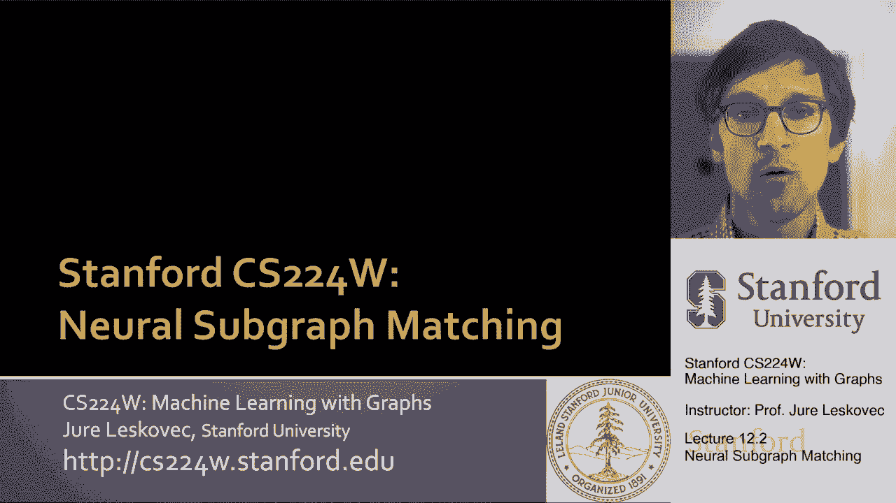
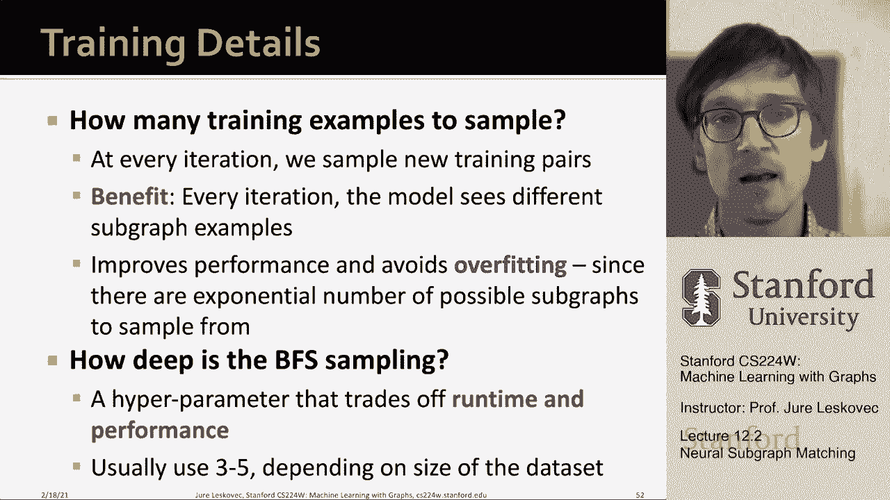

# 35：12.2 - 神经子图匹配 🧠🔍

在本节课中，我们将学习一种名为“神经子图匹配”的机器学习方法。该方法旨在快速判断一个小的查询图是否是一个大的目标图的子图，而无需进行复杂的组合匹配计算。

---

## 问题定义：子图匹配

上一节我们介绍了网络母题和子图的概念。本节中，我们来看看子图匹配的具体问题。

子图匹配问题描述如下：给定一个大的目标图和一个小的查询图，我们需要判断查询图是否是目标图的一个子图。

例如，在下图中，答案是肯定的，因为存在一种节点映射关系（用虚线表示），使得查询图中的所有边都能在目标图的对应节点间找到。

我们的任务不是找出具体的节点对应关系，而是进行一个二分类预测：如果查询图是目标图的子图，则返回 `True`；否则返回 `False`。

---

## 方法概述：利用嵌入空间

我们将把子图匹配问题构建为一个预测任务。核心思想是利用嵌入空间的几何形状来捕捉子图关系。

以下是该方法的高级步骤：
1.  **分解目标图**：将大的目标图分解为一组相对较小的“邻域”块。
2.  **生成嵌入**：使用图神经网络为每个邻域块以及查询图生成嵌入向量。
3.  **进行预测**：基于查询图的嵌入和各个邻域块的嵌入，构建一个预测器来判断查询是否是某个邻域的子图。

这样，当给出一个新查询时，我们只需将其嵌入与所有邻域块的嵌入进行比较，快速得到一系列“是/否”的预测结果。

---

## 关键概念：节点锚定邻域

为了实现上述方法，我们需要引入“节点锚定”的概念。

节点锚定意味着我们指定一个锚点节点。判断查询图是否是目标图（或其邻域）的子图时，我们要求查询图中的锚点必须映射到目标图邻域中的锚点，并且所有边和其他节点也必须正确映射。

我们将目标图分解为一组节点锚定邻域。具体做法是：对于目标图中的每个节点，获取其周围 K 跳范围内的所有节点和边，形成一个以该节点为锚点的邻域。参数 K 通常设置为 3 到 5。

对于查询图，我们也选择一个锚点节点，并获取其 K 跳邻域。

---

## 核心思想：顺序嵌入空间 🧩

现在，我们进入本节课最核心、最精彩的部分：顺序嵌入空间。

我们使用图神经网络将每个锚点节点（代表其所在邻域）嵌入到一个高维空间（例如64维）。我们要求这个嵌入空间的所有坐标都是**非负**的。

在这个空间中，我们定义一种**偏序关系**：如果一个嵌入向量 `z1` 的所有坐标都小于或等于另一个嵌入向量 `z2` 的所有坐标，则称 `z1` 位于 `z2` 的“左下角”，记作 `z1 ≤ z2`。

**为什么这个关系如此重要？**
因为它完美地编码了子图关系！我们的目标是学习这样的嵌入：
-   如果查询图 `Q` 是目标邻域 `T` 的子图，那么查询锚点的嵌入 `z_Q` 应位于目标锚点嵌入 `z_T` 的“左下角”，即 `z_Q ≤ z_T`。
-   如果不是子图，则 `z_Q` 不应位于 `z_T` 的“左下角”。

这种“左下角”关系具有传递性、反对称性等性质，与子图同构关系的性质一致，因此非常适合用于编码子图信息。

---

## 损失函数与模型训练

为了学习到能保持上述顺序关系的嵌入，我们需要设计一个合适的损失函数。

我们使用一种基于**最大间隔损失**的函数。对于一对图（查询 `Q` 和目标邻域 `T`），其损失定义如下：

**如果 `Q` 是 `T` 的子图（正样本）**，我们希望 `z_Q ≤ z_T`。违反此约束的程度（即 `z_Q` 的坐标大于 `z_T` 对应坐标的部分）将受到惩罚。
**如果 `Q` 不是 `T` 的子图（负样本）**，我们希望 `z_Q` 不满足 `z_Q ≤ z_T`，即鼓励出现违反约束的情况。

损失函数可以形式化地表示为铰链损失（Hinge Loss）的形式，确保模型能够区分正负样本。

以下是训练数据生成和模型训练的流程：

1.  **生成训练样本**：从目标图中随机选择锚点，获取其 K 跳邻域作为 `T`。
    -   **正样本**：通过对 `T` 进行随机游走或采样，生成一个肯定是 `T` 子图的查询图 `Q`。
    -   **负样本**：通过向正样本查询图中随机添加/删除节点或边，破坏其子图关系，生成负样本 `Q‘`。
2.  **训练嵌入模型**：使用生成的 `(Q, T)` 对，通过最小化上述最大间隔损失来训练图神经网络，使其学会生成符合顺序约束的嵌入。

---

## 推理过程

当训练好的模型接收到一个新的查询图时，推理过程非常高效：

1.  为查询图选择一个锚点，并使用训练好的 GNN 获取其嵌入 `z_query`。
2.  遍历目标图中所有（或部分）锚点节点的预计算嵌入 `{z_target_i}`。
3.  对于每个 `z_target_i`，只需检查是否满足 `z_query ≤ z_target_i`（即 `z_query` 的所有坐标是否都小于等于 `z_target_i` 的对应坐标）。
4.  如果对任何一个 `z_target_i` 满足该条件，则判断查询图是目标图的子图。

这种比较操作是逐元素的，计算速度极快，从而避免了 NP 难的子图同构计算。

---

## 总结

本节课中，我们一起学习了**神经子图匹配**方法。我们了解到：

1.  **问题转化**：将复杂的子图匹配问题转化为基于嵌入的二分类预测任务。
2.  **节点锚定**：通过锚定节点来定义和分解邻域，使问题可处理。
3.  **顺序嵌入**：引入了**顺序嵌入空间**的核心概念，利用“左下角”的偏序关系来编码子图包含关系。
4.  **模型训练**：设计了最大间隔损失函数，通过生成正负样本来训练图神经网络，学习保持子图关系的嵌入。
5.  **高效推理**：训练完成后，判断子图关系简化为在嵌入空间中快速的逐坐标比较操作。

这种方法巧妙地绕过了子图同构的传统计算难题，利用表示学习实现了快速且有效的子图匹配。