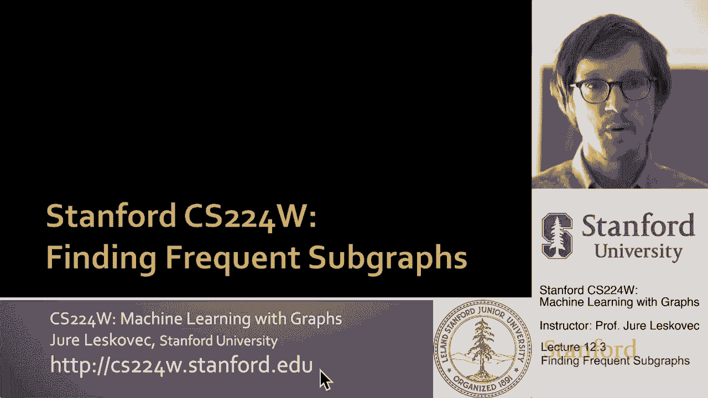
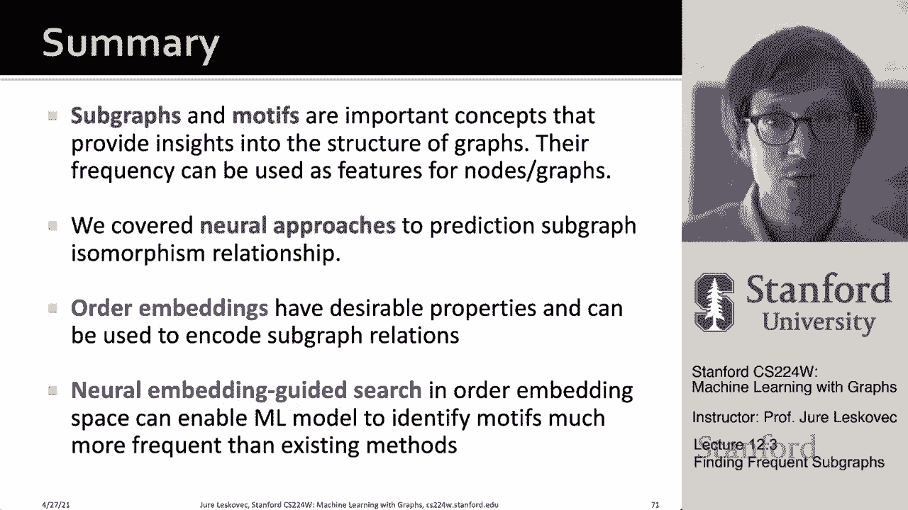

# 36：12.3 - 寻找频繁子图 🧩

在本节课中，我们将学习如何从一个大型目标图中找出那些频繁出现的子图结构，即“频繁子图挖掘”。我们将了解传统组合方法面临的挑战，并学习如何利用图神经网络和表示学习来优雅地解决这个计算难题。

---

## 概述

上一节我们讨论了子图和模体的概念，并介绍了如何利用神经网络快速判断一个查询图是否是某个大图的子图。本节中，我们将进一步扩展，探讨“频繁子图挖掘”问题。其核心目标是：给定一个大型目标图，我们希望找出其中出现频率最高的、由K个节点构成的子图结构。

传统组合方法需要枚举所有可能的K节点连通子图，并对每一个进行子图同构计数，这面临组合爆炸和计数困难两大挑战。接下来，我们将看到如何利用表示学习和图神经网络来巧妙地规避这些难题。

---

## 频繁子图挖掘的问题定义

首先，让我们更清晰地定义问题。给定一个大型目标图 **G_t**、子图大小参数 **K** 以及期望的结果数量 **R**，我们的目标是：在所有可能的K节点图中，找出在 **G_t** 中出现频率最高的前 **R** 个子图。

这里，我们采用“节点锚定频率”的定义。具体来说，一个查询图 **G_q** 的频率是指：在目标图 **G_t** 中，存在某个子图与 **G_q** 同构，并且该同构映射能将 **G_q** 中的某个指定“锚点”节点映射到 **G_t** 中节点 **u** 的节点 **u** 的数量。

**公式**： `频率(G_q) = |{ u ∈ V(G_t) | ∃ 子图 H ⊆ G_t，使得 H ≅ G_q 且同构映射 f 满足 f(锚点) = u }|`

这种定义方式能更稳健地处理组合爆炸问题。例如，一个六条边的星形查询图在一个有一百条边的星形目标图中，其频率是1（只有中心节点能匹配锚点），而不是简单的100选6。

---

## SPMiner 方法的核心思想

我们将介绍一种名为 **SPMiner** 的神经网络模型来识别频繁模体。其核心流程分为两步：

1.  **快速频率预测**：利用图神经网络和有序嵌入空间，快速预测任意给定子图的频率，而无需进行耗时的子图同构匹配。
2.  **引导式搜索**：从一个种子节点开始，逐步“生长”子图，在每一步都选择能保持高频率的扩展方式，最终得到指定大小的频繁子图。

上一节我们介绍了如何将图分解为节点锚定的邻域并用图神经网络进行编码。本节的新内容在于最后的搜索过程。

---

### 第一步：基于有序嵌入的快速频率预测

关键思想是将目标图 **G_t** 分解为大量以各节点为中心的邻域子图 **G_n**，并用图神经网络将它们嵌入到一个“有序嵌入空间”中。

在这个空间中，嵌入向量之间具有“小于等于”的偏序关系。如果一个子图 **G_a** 是另一个子图 **G_b** 的子图，那么 **G_a** 的嵌入向量的每个维度都应小于等于 **G_b** 对应维度的值。

**代码/公式概念**： 若 `G_q ⊆ G_n`，则在其嵌入 `z` 上有：`z(G_q) ≤ z(G_n)` （每个维度比较）。

基于此，预测查询图 **G_q** 频率的方法变得非常简单：
1.  将 **G_q** 也嵌入到同一空间，得到 `z(G_q)`。
2.  其预测频率就是目标图中，所有满足 `z(G_q) ≤ z(G_n)` 的节点邻域 **G_n** 的数量。

**公式**： `预测频率(G_q) = |{ G_n | z(G_q) ≤ z(G_n) }|`

这相当于在嵌入空间中，数出位于 `z(G_q)` 点“右上方”的所有邻域点的数量。这个操作非常快速，规避了直接进行子图同构匹配的昂贵计算。

---

### 第二步：神经嵌入引导的搜索过程

现在我们知道如何快速估计频率，接下来的问题是如何找到那些高频子图本身。我们不再枚举所有可能的K节点图，而是采用一种逐步生长的搜索策略。

以下是搜索过程的核心步骤：

1.  **初始化**：在目标图 **G_t** 中随机选择一个起始节点 **u**，当前模体 **S** 仅包含这个节点。
2.  **迭代生长**：当 **S** 的节点数小于目标大小 **K** 时，重复以下步骤：
    *   考虑将 **S** 在 **G_t** 中的邻居节点（或邻居的邻居）加入，形成候选的新模体 **S‘**。
    *   利用上一步的快速频率预测方法，评估每个候选 **S‘** 的预测频率。
    *   选择能使预测频率保持最高（或“违反度”最低，见下文）的节点加入，更新 **S**。
3.  **终止与返回**：当 **S** 大小达到 **K** 时，停止生长。返回最终的子图 **S** 及其预测频率。

**如何选择下一个节点？**
我们定义当前子图 **G** 的“总违反度”为：不包含 **G** 作为子图的邻域数量（即嵌入不满足 `z(G) ≤ z(G_n)` 的邻域数）。

**公式**： `总违反度(G) = |{ G_n | z(G) ≰ z(G_n) }|`

显然，最小化总违反度等价于最大化频率。因此，在每一步，我们可以贪心地选择那个加入后能使新子图 **S‘** 总违反度最小的节点。这引导着搜索朝着嵌入空间中“右上方”点密集的区域移动，最终找到的K节点子图会拥有尽可能多的邻域位于其“右上方”，即拥有高频率。

---

## 方法效果与总结

实验表明，SPMiner 方法非常有效。在真实网络数据上，对于传统方法只能计算到大小5或6的模体，SPMiner 能近乎完美地识别出前10个最频繁的模体。更重要的是，该方法可以轻松扩展到寻找大小为14、17甚至20的大型频繁模体，且计算效率很高，找到的模体频率远高于传统的随机搜索或启发式基线方法。

---

本节课中我们一起学习了频繁子图挖掘这一重要问题。我们了解到：
1.  子图和模体是理解大型图结构的重要概念，其频率可作为图或节点的特征。
2.  传统组合方法因面临组合爆炸和计数困难，只能处理很小的子图。
3.  我们利用有序嵌入空间和图神经网络，建立了快速的子图频率预测器。
4.  我们设计了一种神经嵌入引导的搜索策略，通过逐步生长来高效地发现大型高频子图。

这种方法将计算上棘手的组合问题，转化为高效的表示学习和搜索问题，在实践中兼具速度快和准确性高的优点。至此，我们完成了关于子图识别、子图计数和频繁子图挖掘的内容。