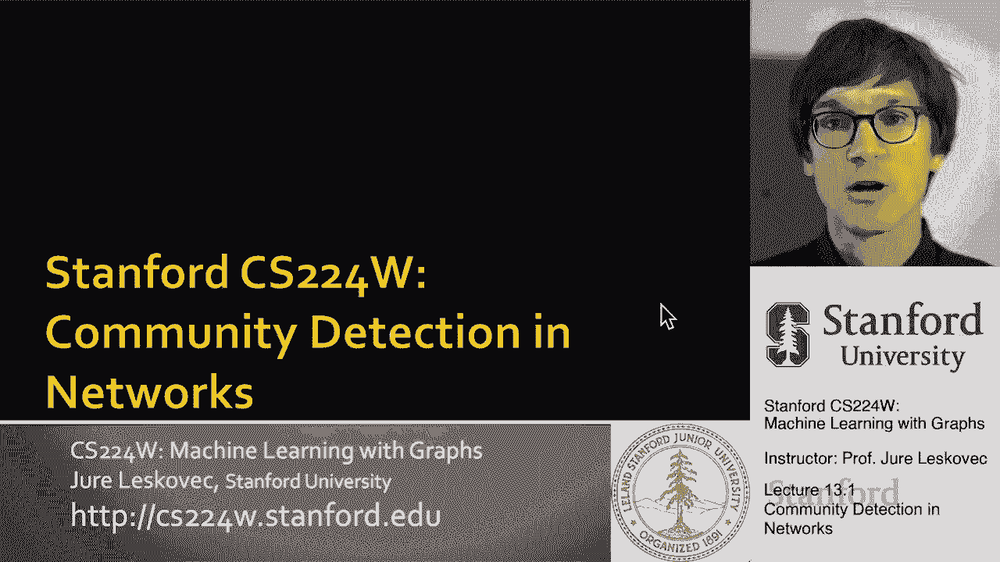
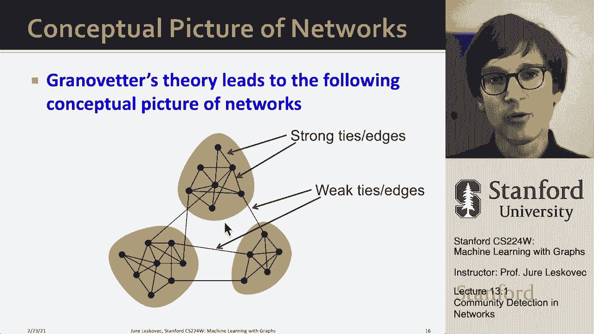

# 37：13.1 - 网络中的社区检测 🕸️

在本节课中，我们将要学习网络中的社区检测。社区检测本质上是在图中对节点进行聚类，这种聚类将基于网络的结构特性。我们将从定义问题开始，探讨其背后的社会科学原理，并了解这些原理如何指导社区检测方法的发展。

## 社区检测的定义与意义

上一节我们介绍了社区检测的基本概念，本节中我们来看看其具体定义和为什么它有意义。

当我们绘制网络时，通常会观察到一种结构：节点倾向于形成集群或社区。在这些社区内部，节点之间的连接（边）比不同社区之间的连接更为密集。这就是我们直观上对网络，尤其是社交网络的认知。

在社交网络中，这些集群可能对应着真实的社会群体。在生物网络中，它们可能代表执行特定任务的功能单元或模块。因此，我们认为网络并非杂乱无章的物体，而是具有内在的组织结构。

一个关键问题是：我们有什么证据表明这种结构真实存在于网络中？又是什么原因导致了这种结构的形成？

## 信息流动与社交网络结构

为了理解社区的形成，我们需要深入古典社会科学中的社交网络分析。核心问题是：信息如何通过网络流动？

在社交网络中，人们通过链接相连，信息通过这些链接传播。我们可以将链接分为两类：
*   **短链接/强联系**：指牢固的本地友谊。
*   **长链接/弱联系**：指与熟人、同事等不常联系的人之间的连接。

20世纪60年代，社会学家马克·格兰诺维特进行了一项开创性研究。他调查人们如何通过个人关系找到工作。一个有趣的发现是：告知求职者职位空缺信息的，更多是他们的“熟人”（弱联系），而非“亲密朋友”（强联系）。

这令人惊讶，因为通常我们认为亲密朋友更愿意帮助我们。这个发现意味着，在信息传播过程中，弱联系可能扮演着更重要的角色。

## 链接的结构视角与人际视角

格兰诺维特的研究连接了网络中链接的两个重要视角：

1.  **结构视角**：关注链接在网络中扮演的结构性角色。例如，一条边是连接了网络的不同部分，还是深深地嵌入在一个密集连接的集群中。
2.  **人际视角**：关注链接的强度，即关系是强还是弱。

格兰诺维特揭示了这两者之间的关联：
*   结构上嵌入良好的边（即端点拥有许多共同邻居的边），往往对应着人际上的强联系。
*   连接网络不同部分的边（即端点几乎没有共同邻居的边），往往对应着人际上的弱联系。

用公式表示，一条边 `(i, j)` 的**邻里重叠度**可以量化其结构嵌入性：
`邻里重叠度(i, j) = (i和j的共同邻居数) / (i和j的邻居总数 - 2)` （当 `i` 和 `j` 相连时）
重叠度高的边在结构上更强。

## 弱联系的力量与社区形成

格兰诺维特提出的第二个重要观点关乎信息流。弱联系（长链接）能够让你接触到网络中遥远部分的信息，这些信息对你而言可能是新颖且有价值的。相反，强联系（嵌入良好的边）在信息获取上往往是冗余的，因为你的亲密朋友们彼此认识，知道的信息也类似。

那么，为什么网络中会自然形成社区（密集连接的集群）呢？原因包括：
*   **三元闭包**：如果两个人有一个共同的朋友，他们更有可能相遇并建立联系。
*   **同质性**：我们倾向于与和自己相似的人建立联系。如果两个人都与同一个人有联系，他们可能共享某些相似点，从而更容易连接。

因此，网络中倾向于形成许多三角形结构。高聚类系数（即朋友的朋友也是朋友的程度）反映了一种温暖、紧密的社会结构，这也是人类社交所追求的。

## 理论验证：手机网络数据分析

格兰诺维特的理论在提出后约四十年，才在2007年得到大规模真实数据的验证。一项研究利用欧洲的手机通话数据，将通话频率作为联系强度的指标。

以下是该研究的关键发现：
*   **预测**：强联系（高频通话）应出现在网络的小集群中；弱联系（低频通话）应出现在连接不同集群的边上。
*   **验证**：数据显示，边的强度（通话量）与其邻里重叠度高度正相关。即，通话越频繁的链接，其端点的共同邻居越多；反之亦然。

为了更直观地展示，研究还进行了对照实验：
1.  随机打乱边上“通话量”的强度值，但保持网络结构不变。结果，原本清晰的“强联系聚集在社区内，弱联系作为桥梁”的图景消失了。
2.  逐步移除网络中的边。如果优先移除弱联系（低重叠边），网络会迅速分裂成多个连通组件；如果优先移除强联系（高重叠边），网络则能保持相对完整的连通性更久。

这证明了弱联系在连接整个网络不同社区方面起着关键的“桥梁”作用，而强联系则巩固了社区内部的结构。

## 核心概念总结

本节课中我们一起学习了网络社区检测的基础及其社会科学根源。我们了解到：

*   社区是网络中连接紧密的节点集群。
*   链接兼具**结构角色**（由其邻里重叠度 `邻里重叠度(i, j)` 衡量）和**人际强度**。
*   **弱联系**（低重叠度）往往是连接不同社区的桥梁，在信息传播中至关重要。
*   **强联系**（高重叠度）则密集地存在于社区内部，巩固了集群结构。
*   社区的形成受到**三元闭包**和**同质性**等社会过程的驱动。

这种对网络结构的深刻理解，为我们后续设计算法来自动识别网络中的社区和连接桥梁奠定了坚实的基础。