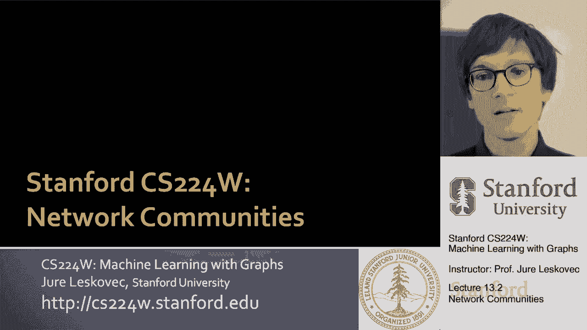
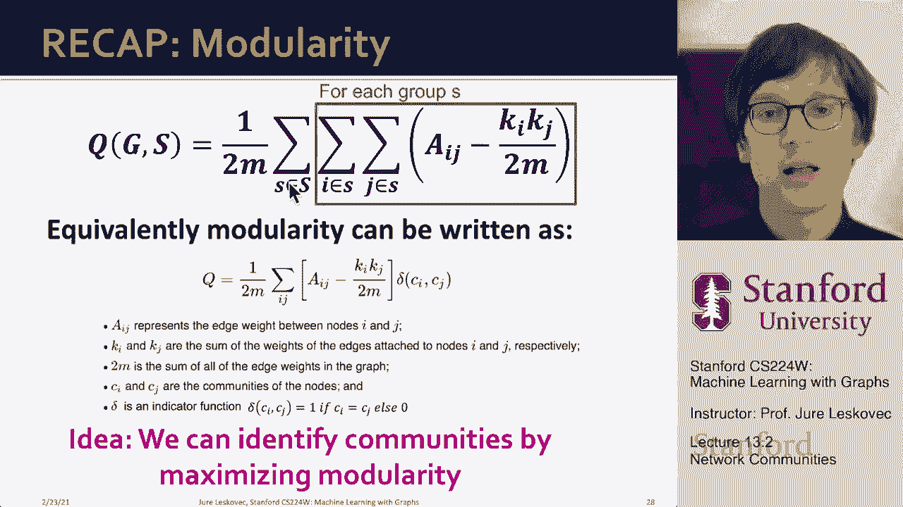

# 38：13.2 - 网络社区 🕸️

在本节课中，我们将学习网络社区的概念，了解如何从网络结构中识别出紧密连接的节点组（即社区）。我们将介绍一个名为“模块化”的核心度量，并学习如何利用它来发现网络中的社区结构。

---

上一节我们介绍了网络中存在紧密连接集群的直觉。本节中，我们来看看如何正式地确认和识别这些网络中的集群。

我们从已学知识开始。Granovetter的理论表明，网络由紧密连接的集群或节点集组成。在社会网络中，集群内部的联系很强，而跨集群的连接则很弱。这些集群也被称为社区、团体或模块。我们将使用“网络社区”一词来指代那些内部连接很多、外部连接很少的节点集合。

现在的问题是：给定一个网络，我们如何找到这些密集连接的节点组？理想情况下，这些节点组应能对应真实的社会团体。

以下是几个网络社区的例子：

*   **扎卡里空手道俱乐部网络**：在研究大学空手道俱乐部的社会关系时，俱乐部因冲突分裂为两组。引人注目的是，网络结构清晰地预示了这种分裂：基于最小化两组间交叉边数的划分，与最终实际形成的两个俱乐部成员高度一致。
*   **在线广告网络**：可以构建一个二分图，一边是广告商，另一边是搜索查询或关键词。邻接矩阵中的密集星团揭示了拥有共同兴趣的“微型市场”，例如，赌博广告商群体与对赌博感兴趣的人群查询。
*   **NCAA大学足球队网络**：将相互比赛的队伍连接起来。最初的可视化可能看不出明显结构，但应用社区检测方法后，识别出的集群与实际的体育会议（队伍组织）高度一致，揭示了隐藏的结构。

这些例子展示了如何从网络结构中提取社区，即使这种结构最初并不明显。

---

上一节我们看到了社区的例子。本节中，我们来看看如何形式化地识别这些紧密连接的节点集。

我们要定义一个名为**模块化**的度量，用于衡量网络划分到社区的程度。假设我们已有一个节点分组（分区），模块化得分 `Q` 的计算思路如下：

`Q` 正比于所有群组的总和。对于每个群组 `S`，我们计算：**群组成员之间的实际边数** 减去 **在某个随机零模型下，我们期望在该群组中看到的边数**。

如果群组 `S` 成员之间的边数远多于随机预期，那么我们就发现了一个强大的显著集群。整个网络的模块化程度，就是所有单个集群模块化分数的总和。

为了计算“期望的边数”，我们需要一个随机图零模型。这里我们使用**配置模型**。

配置模型的思路是：给定一个具有 `n` 个节点和 `m` 条边的真实图 `G`，我们创建一个随机网络 `G‘`。在这个随机网络中，每个节点保持其原始度数（连接数）不变，但边被随机重连。这意味着网络具有相同的度序列，但连接是随机的。我们将图视为允许多重边的图。

在这个模型下，节点 `i` 和节点 `j` 之间的期望边数公式为：

**`E(i, j) = (k_i * k_j) / (2m)`**

其中 `k_i` 和 `k_j` 分别是节点 `i` 和 `j` 的度数，`m` 是网络中的总边数。

---

现在，让我们回到模块化的正式定义。根据我们对配置模型（作为空模型）的了解，模块化 `Q` 可以写成如下公式：

**`Q = (1/(2m)) * Σ_S [ Σ_(i,j ∈ S) ( A_ij - (k_i * k_j)/(2m) ) ]`**

公式解析：
*   `m`：网络中的总边数。
*   `Σ_S`：对所有社区 `S` 求和。
*   `Σ_(i,j ∈ S)`：对社区 `S` 内的所有节点对 `(i, j)` 求和。
*   `A_ij`：邻接矩阵元素。如果节点 `i` 和 `j` 相连，则为1；否则为0。这部分计算社区内的实际边数。
*   `(k_i * k_j)/(2m)`：在配置模型下，节点 `i` 和 `j` 之间的期望边数。
*   `A_ij - (k_i * k_j)/(2m)`：实际边数与期望边数的差值，体现了社区连接的紧密程度。
*   `1/(2m)`：归一化常数，使模块化 `Q` 的值落在 `-1` 到 `1` 之间。

模块化 `Q` 的取值范围和意义：
*   `Q` 接近 `1`：表示社区结构非常强，组内的边远多于随机预期。
*   `Q` 为 `0`：表示社区结构与随机网络没有显著差异。
*   `Q` 为负值：表示网络没有社区结构，甚至可能具有反社区结构（例如，二分图核心）。在实践中，如果 `Q` 大于 `0.3` 到 `0.7`，通常认为网络存在显著的社区结构。

---

现在我们有了模块化得分作为目标函数。接下来的核心问题是：**我们能否通过最大化这个模块化得分来识别网络社区？** 换句话说，我们如何搜索节点的分组方式，以使 `Q` 值尽可能高？这将是后续要解决的关键问题。

---

本节课中我们一起学习了网络社区的概念。我们了解到，社区是网络中内部连接紧密、外部连接稀疏的节点组。我们引入了**模块化（Q）** 作为衡量社区划分好坏的核心指标，它通过比较真实网络与随机配置模型（空模型）下的连接差异来量化社区结构的强度。最后，我们提出了通过最大化模块化来发现社区的核心问题，为后续学习社区检测算法奠定了基础。