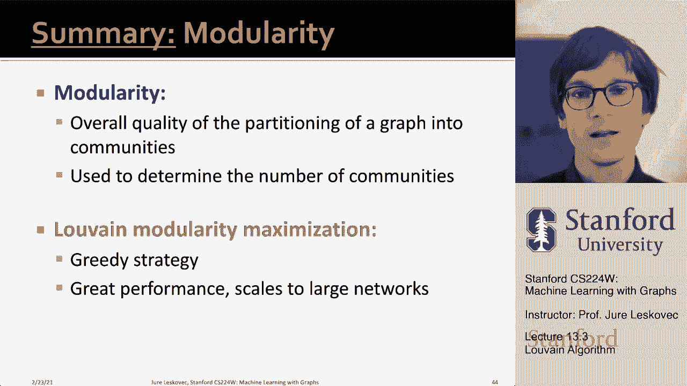

# 39：13.3 - Louvain 算法 🧩

在本节课中，我们将学习一种用于社区检测的流行算法——Louvain 算法。我们将了解它的工作原理、核心计算步骤以及它如何高效地将大型网络划分为具有高模块化得分的社区。

---

## 概述

Louvain 算法是一种用于识别网络中高模块化得分社区的算法。它以其发源地——比利时鲁汶大学命名。该算法具有高度可扩展性，是进行网络划分时实际上的首选方法。

它是一种贪婪的社区检测算法，时间复杂度约为 **O(n log n)**，其中 **n** 是网络中的节点数，因此能够扩展到大型网络。它支持加权图，并能提供**层次化的社区结构**，即不仅给出一个层级的聚类，还能展示单个节点如何加入小组，以及这些小组又如何聚合成更大的超级社区。

该算法应用广泛，有快速的实现，在实践中效果良好，能够发现具有高度模块化的社区。

---

## 算法运行的两个阶段

Louvain 算法分两个阶段运行，其核心思想是贪婪地将节点分配给社区以最大化模块化。每次迭代都包含这两个阶段。

上一节我们介绍了算法的基本目标，本节中我们来看看这两个具体阶段是如何运作的。

### 第一阶段：模块化优化

在第一阶段，算法通过仅允许节点对社区进行局部更改来优化模块化。每个节点都有机会改变其社区归属。

**具体步骤如下：**

1.  **初始化**：首先，将图中的每个节点放入一个独立的社区。即每个节点自成一个集群。
2.  **迭代优化**：对于每个节点 **i**，算法进行以下计算：
    *   计算如果将节点 **i** 放入其每个邻居节点 **j** 所在的社区，模块化将如何变化。
    *   核心问题是：将节点 **i** 放入节点 **j** 的社区，是否会增加整体模块化？
3.  **决策移动**：算法尝试将节点 **i** 放入其每个邻居所在的社区（前提是它们属于同一社区）。选择能使模块化增加最多的那个社区进行移动。
4.  **终止条件**：当没有任何单个节点移动到不同社区能提高模块化时，第一阶段停止。此时达到了模块化的一个局部极大值。

需要注意的是，算法的输出取决于处理节点的顺序。但在实践中，顺序影响不大，通常采用随机顺序即可。

以下是节点移动时，计算模块化增益（ΔQ）的核心公式：

假设节点 **i** 从当前社区 **D** 移动到新社区 **C**。模块化增益 **ΔQ** 可以高效地计算为：

**ΔQ = [Σ_in + 2k_i,in] / (2m) - [Σ_tot + k_i]² / (2m)² - [Σ_in / (2m) - (Σ_tot/(2m))² - (k_i/(2m))²]**

其中：
*   **Σ_in**: 社区 **C** 内部所有边的权重和。
*   **Σ_tot**: 与社区 **C** 中节点相连的所有边的权重和（包括连接外部社区的边）。
*   **k_i**: 节点 **i** 的度（所有边的权重和）。
*   **k_i,in**: 节点 **i** 与社区 **C** 内部节点相连的边的权重和。
*   **m**: 网络中所有边的总权重。

简化后，将节点 **i** 移入社区 **C** 的模块化增益近似为：

**ΔQ ≈ [k_i,in / (2m)] - [Σ_tot * k_i / (2m)²]**

这个公式表明，增益取决于节点 **i** 与社区 **C** 内部的连接强度（**k_i,in**）以及社区 **C** 的总连接规模（**Σ_tot**）。

### 第二阶段：网络重组（聚合）

当第一阶段达到稳定状态，无法再通过移动单个节点来提升模块化后，算法进入第二阶段。

**具体步骤如下：**

1.  **构建超级节点**：将在第一阶段识别出的每个社区“收缩”为一个**超级节点**。
2.  **构建超级网络**：
    *   如果原始网络中两个社区之间至少存在一条边，则在对应的两个超级节点之间创建一条边。
    *   这条新边的权重，等于原始网络中这两个社区之间所有边的权重之和。
    *   超级节点内部可能形成自环，其权重代表原社区内部所有边的权重和。
3.  **迭代**：这样，我们就得到了一个新的、更粗粒度的加权网络（超级网络）。然后，在这个新的超级网络上，再次运行**第一阶段**的算法，以发现更大的社区结构（即社区的社区）。

---

## 算法流程总结

现在，让我们将两个阶段串联起来，总结 Louvain 算法的完整流程：

1.  **输入**：原始网络。
2.  **初始化**：每个节点自成社区。
3.  **第一阶段**：
    *   遍历节点，计算将其移动到各邻居社区带来的模块化增益 **ΔQ**。
    *   将节点移动到能带来最大正增益的社区。
    *   重复此过程，直到没有节点移动能提升模块化。
4.  **第二阶段**：
    *   将上一步得到的每个社区聚合为一个超级节点。
    *   根据社区间的连接，构建新的超级节点网络（边权为社区间连接总和）。
5.  **迭代**：将新生成的超级网络作为输入，跳回步骤3（第一阶段）继续执行。
6.  **输出**：当网络结构稳定或达到预设层次后停止。最终得到一个层次化的社区结构（树状图或 dendrogram），展示了从单个节点到最大社区的聚合过程。

**举例说明**：例如，分析一个国家的通信网络。第一轮可能将网络划分为两个大社区（如法语区和荷兰语区）。第二轮可能将每个大社区进一步细分为更小的区域社区。这样就得到了一个国家通信网络的层次化社区结构。

---

## 总结

本节课中我们一起学习了 Louvain 社区检测算法。

*   我们首先回顾了**模块化**的概念，它是衡量网络划分质量的整体指标。
*   接着，我们深入探讨了用于**模块化最大化**的 Louvain 算法。该算法本质上是一种贪婪策略：
    *   我们从每个节点作为独立社区开始。
    *   然后，我们在社区间移动节点，使得整体模块化不断增长（第一阶段）。
    *   当无法再优化时，我们将社区聚合为超级节点，并在新的网络层级上重复聚类过程（第二阶段）。
*   通过这种“优化-聚合”的迭代，算法能够高效地发现网络中层次化的社区结构。

Louvain 算法在实践中表现优异，并且能够扩展到处理大型网络。