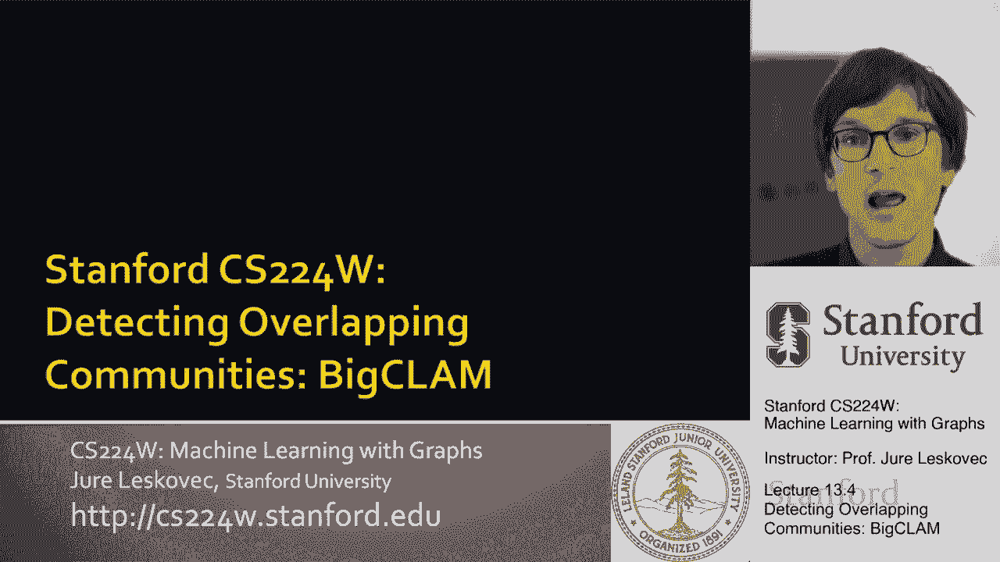
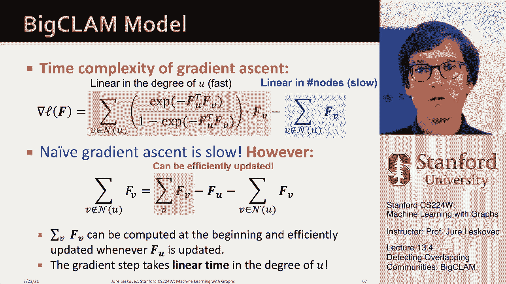

# 40：13.4 - 检测重叠社区 🧩

在本节课中，我们将学习如何检测网络中的重叠社区。与之前假设节点只属于一个社区不同，现实中的节点（如人或蛋白质）常常同时属于多个社区。我们将介绍一种基于生成模型的方法，通过拟合模型来发现这种重叠的社区结构。

---

## 重叠社区的概念

上一节我们介绍了非重叠社区的检测方法。本节中，我们来看看当社区可以重叠时的情况。

在许多现实网络中，节点可以同时属于多个社区。例如，一个人可能同时是高中同学圈、大学同学圈和公司同事圈的成员。在生物网络中，一个蛋白质也可能参与多个功能模块。因此，我们需要能够识别这种重叠社区结构的方法。

为了直观理解，我们可以对比两种社区结构在邻接矩阵中的表现：
*   **非重叠社区**：邻接矩阵呈现明显的块状结构，块内连接密集，块间连接稀疏。
*   **重叠社区**：邻接矩阵中，重叠区域的节点（属于多个社区）会与多个社区块内的节点都有连接，使得矩阵结构更加复杂。

我们的目标是：给定一个网络，如何自动提取出这种重叠的社区结构？

---

## 生成模型：隶属关系图模型 (AGM)

为了检测重叠社区，我们首先需要为网络定义一个生成模型。这个模型将基于节点的社区隶属关系来生成网络的边。

模型的核心思想如下：
*   我们有一组节点和一组社区。
*   每个节点可以属于零个、一个或多个社区。我们用一条边连接节点和它所属的社区来表示这种“隶属关系”。
*   每个社区 `C` 都有一个内部连接概率参数 `p_c`。

**边的生成过程**：
1.  对于任意一对节点 `u` 和 `v`，找出它们共同隶属的所有社区。
2.  对于每一个共同的社区 `C`，我们独立地抛一枚有偏硬币，其正面（产生连接）的概率为 `p_c`。
3.  如果**至少有一枚**硬币抛出正面，则在节点 `u` 和 `v` 之间创建一条边。

这意味着，如果两个节点共享多个社区，它们就有多次“机会”产生连接，因此它们之间更可能出现边。节点 `u` 和 `v` 之间存在边的概率可以表示为：

**公式**：
`P(A_{uv}=1) = 1 - ∏_{c∈C} (1 - p_c)`
其中，`C` 是节点 `u` 和 `v` 共同隶属的社区集合。

这个模型非常灵活，不仅可以表示重叠社区，还可以表示层次化社区等复杂结构。

---

## 从网络反推模型：最大似然估计

上一节我们知道了如何从模型生成网络。本节中，我们反过来思考：给定一个观察到的真实网络，最有可能生成这个网络的模型参数是什么？这个过程称为**最大似然估计**。

我们的目标是：找到一组模型参数 `F`（包括社区数量、每个节点的社区隶属关系、每个社区的连接概率 `p_c`），使得这组参数生成我们观察到的真实图 `G` 的概率最大。

**图 `G` 的似然**定义为模型 `F` 生成图 `G` 的概率。具体计算如下：
*   对于图中**存在**的每一条边 `(u, v)`，乘以模型预测该边存在的概率 `P(A_{uv}=1)`。
*   对于图中**不存在**的每一条边（即非边），乘以模型预测该边不存在的概率 `1 - P(A_{uv}=1)`。

**公式**：
`L(F) = ∏_{(u,v)∈E} P(A_{uv}=1) * ∏_{(u,v)∉E} (1 - P(A_{uv}=1))`

为了数值计算的稳定性，我们通常优化**对数似然** `log L(F)`，它将连乘转换为求和。

---

## 模型参数化与优化

直接优化上述公式中的 `p_c` 和离散的隶属关系比较困难。因此，我们引入一个“放松”的连续参数化方法：

*   我们为每个节点 `u` 对每个社区 `c` 定义一个**隶属强度** `f_{u,c}`。`f_{u,c} = 0` 表示节点不属于该社区，值越大表示隶属关系越强。
*   我们将社区 `c` 的内部连接概率参数化为隶属强度的函数：`p_c(u,v) = 1 - exp(-f_{u,c} * f_{v,c})`。

此时，节点 `u` 和 `v` 之间存在边的概率公式可以简化为一个优雅的形式：

**公式**：
`P(A_{uv}=1) = 1 - exp(-f_u · f_v)`
其中，`f_u` 和 `f_v` 分别是节点 `u` 和 `v` 的社区隶属强度向量，`·` 表示点积。

现在，我们的优化目标——对数似然——就变成了关于所有节点隶属强度向量 `{f_u}` 的函数。我们可以使用**梯度下降**法来求解：
1.  随机初始化所有节点的隶属强度向量 `{f_u}`。
2.  迭代直到收敛：固定其他所有节点的向量，计算对数似然关于当前节点 `u` 的向量 `f_u` 的梯度，然后沿着梯度方向更新 `f_u`，以增加对数似然值。

梯度计算中涉及对节点 `u` 的所有**非邻居**求和，这在大型网络上计算代价很高。一个有效的优化技巧是：将这个求和改写为对**所有节点**的求和，减去对**邻居节点**的求和。由于“所有节点求和”项可以预先计算并全局更新，而每个节点的邻居通常很少，这大大加快了计算速度，使得方法能够扩展到大型网络。

---

## 总结

本节课中，我们一起学习了如何检测网络中的重叠社区。

我们首先介绍了**隶属关系图模型 (AGM)**，这是一个基于节点社区隶属关系来生成网络边的概率模型。然后，我们通过**最大似然估计**的框架，将社区检测问题转化为一个模型拟合问题：即寻找最能解释当前观测网络结构的模型参数（节点的社区隶属关系）。

具体步骤包括：
1.  定义基于隶属强度的连续化模型。
2.  建立网络的对数似然函数。
3.  使用梯度下降法优化对数似然，从而得到每个节点对各个社区的隶属强度。

最终，通过将生成模型拟合到观测网络，我们能够自动地发现其中潜在的重叠社区结构。