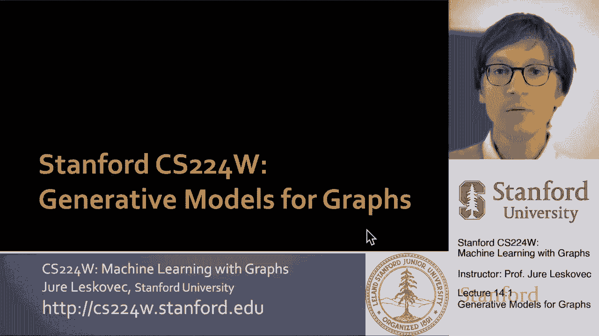
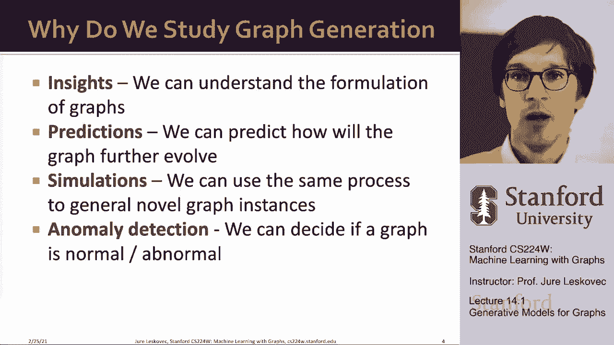
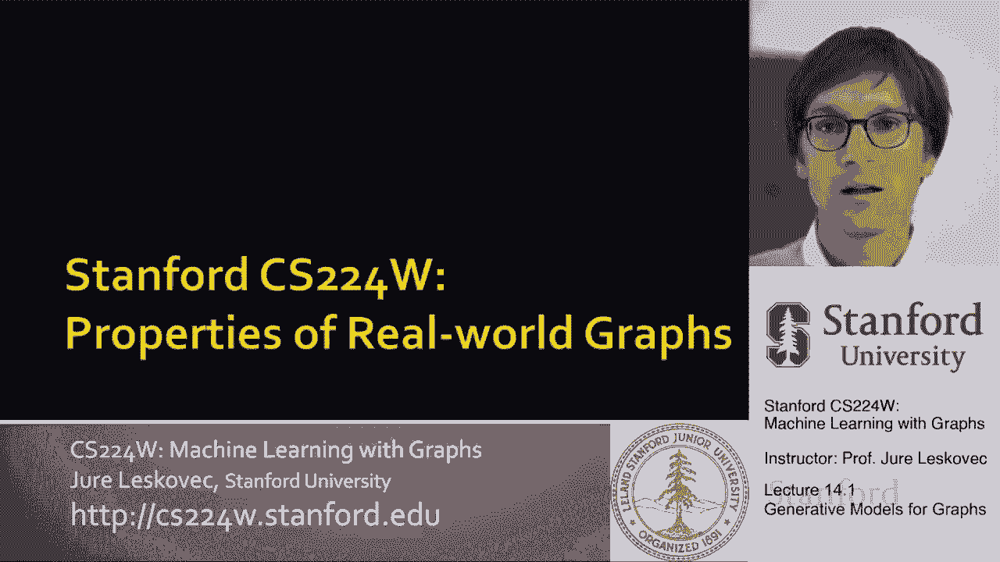
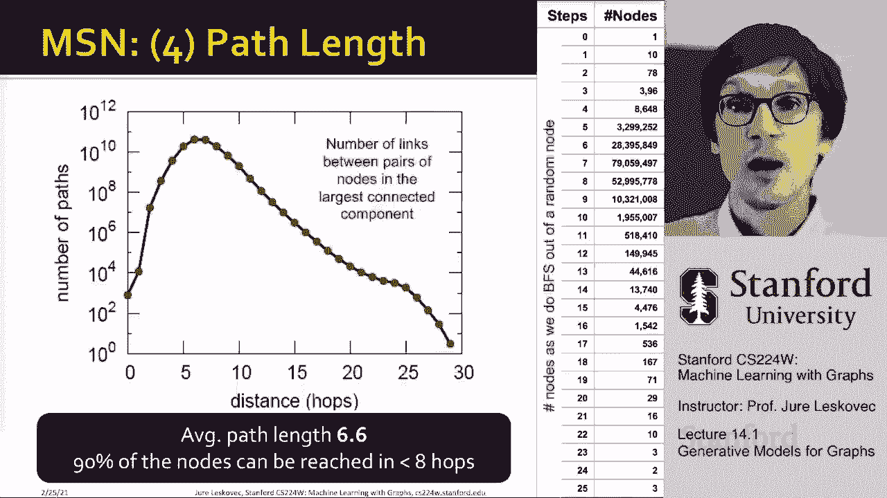
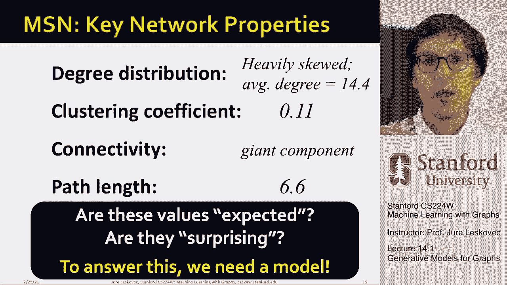

# 41：14.1 - 图的生成模型 📊

在本节课中，我们将要学习图的生成模型。我们将探讨如何生成合成图，使其与现实世界的网络（如社交网络或通信网络）具有相似的性质。通过学习这些模型，我们可以理解真实网络的形成过程，并利用它们进行预测、异常检测或作为测试算法的数据集。

---

## 真实世界图的性质 📈

上一节我们介绍了图生成模型的目标。本节中，我们来看看如何衡量一个图是否“逼真”。为了比较生成的图和真实的图，我们需要刻画图的一些关键性质。

以下是描述图的四个核心性质：

1.  **度分布**：度分布描述了随机选择一个节点，其具有给定度数的概率。它本质上是一个归一化的直方图。设 `P(k)` 表示一个节点度数为 `k` 的概率。
    *   **公式**：`P(k) = (具有度数 k 的节点数量) / (总节点数 N)`

2.  **聚类系数**：聚类系数衡量一个节点的邻居之间相互连接的程度。节点 `i` 的聚类系数 `C_i` 定义为：
    *   **公式**：`C_i = (节点 i 的邻居之间实际存在的边数) / (节点 i 的邻居之间可能存在的最大边数)`
    *   整个图的聚类系数通常是所有节点聚类系数的平均值。

3.  **连通性**：连通性通常通过**最大连通分量**的大小来衡量。连通分量是一组可以相互到达的节点。我们关注属于最大连通分量的节点比例。

4.  **最短路径长度**：最短路径长度描述了网络中节点间的平均距离。图的**直径**是任意两个节点之间最短路径的最大值。更常用的是**平均最短路径长度**，它计算所有可达节点对之间最短路径的平均值。

---

## 案例分析：微软即时通讯网络 💬

为了具体理解这些性质，我们分析一个现实世界的大规模网络：微软即时通讯（MSN Messenger）网络。该网络包含约1.8亿用户（节点）和30亿条边（表示用户之间至少交换过一条信息）。

以下是该网络的关键测量结果：

*   **度分布**：在对数坐标下绘制时，度分布呈现明显的“长尾”或幂律形状。大多数节点的度数很小（小于10），但存在极少数度数非常高的节点（最高约6000）。
*   **聚类系数**：该网络的平均聚类系数为 **0.11**。这意味着，平均而言，一个用户的朋友之间有11%的概率也是朋友。
*   **连通性**：**99.9%** 的节点属于同一个最大的连通分量，表明网络几乎是完全连通的。
*   **最短路径长度**：网络的平均最短路径长度仅为 **6.6**。这意味着，平均只需通过不到7个人，你就可以联系到这个庞大网络中的另一个人。这体现了“小世界”现象。

这些数字本身是否有意义？为了判断它们是否令人惊讶或具有特殊性，我们需要一个**空模型**作为参考基准。接下来，我们将介绍几种传统的图生成模型，它们将为我们提供这样的参考点。

---

## 传统图生成模型 🏗️

上一节我们分析了真实网络的性质，并意识到需要一个基准模型进行比较。本节中，我们来看看几种经典的传统图生成模型。这些模型相对简单，但提供了关于网络形成过程的重要见解。

以下是三种基础但重要的图生成模型：

1.  **Erdős–Rényi (ER) 随机图模型**：
    *   **描述**：该模型以概率 `p` 在每一对节点之间独立地生成一条边。
    *   **代码/公式**：给定 `N` 个节点，对于每一对节点 `(i, j)`，以概率 `p` 创建边。`G(N, p)`。
    *   **性质**：ER 图通常具有较低的平均最短路径长度，但聚类系数也极低，且度分布近似泊松分布，这与许多真实网络的“长尾”度分布不符。

2.  **小世界模型（Watts-Strogatz）**：
    *   **描述**：该模型从一个规则环状网络开始，然后以概率 `β` 随机“重连”一些边。它旨在生成具有高聚类系数和短平均路径的图。
    *   **过程**：
        1.  构建一个环状网络，每个节点与最近的 `K` 个邻居相连。
        2.  以概率 `β` 将每条边的一个端点随机重新连接到网络中的另一个节点。
    *   **性质**：通过调节 `β`，可以在高度规则（高聚类、长路径）和完全随机（低聚类、短路径）之间过渡，从而模拟小世界特性。

3.  **优先连接模型（Barabási-Albert）**：
    *   **描述**：该模型基于“富者愈富”的思想。新节点加入网络时，更倾向于连接到已经拥有较多连接的节点。
    *   **过程**：
        1.  从一个小型初始网络开始。
        2.  每次新增一个节点，并连接到 `m` 个现有节点。
        3.  新节点连接到节点 `i` 的概率与节点 `i` 的度数成正比。
    *   **性质**：该模型能够自然生成具有**幂律度分布**的网络，即存在少数高度连接的“枢纽”节点。这解释了像互联网、社交网络等许多真实系统中的度分布特征。

---

## 总结与展望 🎯

本节课中，我们一起学习了图的生成模型。我们首先明确了评估图是否“逼真”的四个关键性质：度分布、聚类系数、连通性和最短路径长度。接着，我们以微软即时通讯网络为例，具体观察了这些性质在真实网络中的体现。

最后，我们介绍了三种传统的图生成模型：ER随机图模型、小世界模型和优先连接模型。这些模型各自基于不同的简单机制，能够生成具有特定性质的图，为我们理解和模拟真实网络提供了基础框架和宝贵的参考基准。

在下节课中，我们将探讨更强大的**深度图生成模型**，它们能够学习并捕获真实图中更复杂、更细微的模式和结构。