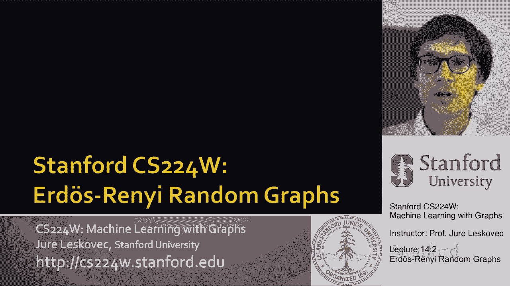
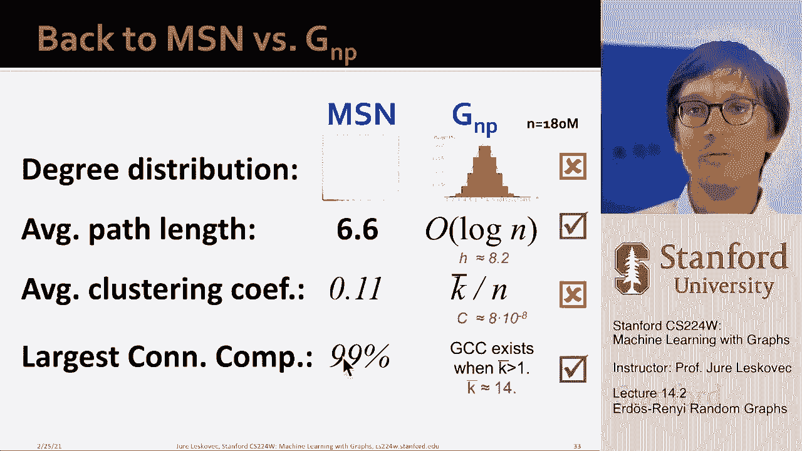

# 42：14.2 - 埃尔德什-瑞尼随机图模型 V2 📊

在本节课中，我们将学习埃尔德什-瑞尼随机图模型。这是一种最简单的图生成模型，可以作为分析真实网络时的参考基准。我们将探讨它的定义、关键性质，并将其与真实网络（如MSN网络）进行比较。

---

## 概述

埃尔德什-瑞尼随机图模型是图论中一个基础且重要的生成模型。它以两位匈牙利数学家的名字命名，其数学理论非常丰富。我们将学习该模型的两种变体，分析其度分布、聚类系数、连通性和平均路径长度等性质，并理解它为何无法完全模拟真实网络的特征。

---

## 埃尔德什-瑞尼随机图模型

现在，我们开始讨论这些可以作为参考基准的图生成模型。首先介绍的是埃尔德什-瑞尼随机图模型。

该模型有两种主要变体：**G(n, p)** 模型和 **G(n, m)** 模型。

以下是两种模型的核心定义：

*   **G(n, p) 模型**：该模型生成一个具有 `n` 个节点的无向图。图中每条边以独立同分布的概率 `p` 出现。这意味着对于每一对节点，我们都进行一次概率为 `p` 的“抛硬币”实验，以决定是否在这对节点之间创建边。
*   **G(n, m) 模型**：该模型生成一个具有 `n` 个节点和恰好 `m` 条边的无向图，这些 `m` 条边是从所有可能的边中均匀随机选取的。

这两种模型有什么区别呢？它们都有相同数量的节点。在期望上，G(n, p) 模型的边数也是 `m`（约为 `n * n * p`），并且边都是随机放置在节点之间的。关键区别在于，G(n, p) 的边数是随机的，可能因随机过程的方差而略有波动；而 G(n, m) 的边数总是固定的。

---

## 模型的性质分析

由于该模型是随机的，相同的参数 `n` 和 `p` 可以产生许多不同的图实例。接下来，我们分析从 G(n, p) 模型生成的随机图具有哪些性质。这个模型的优美之处在于其简单性，使得我们可以用数学方法精确推导出这些性质，而无需依赖模拟和测量。

### 度分布

G(n, p) 模型的度分布是**二项分布**。

**推导过程**：设 `P(k)` 表示具有给定度 `k` 的节点比例。对于一个特定节点，它有 `n-1` 个可能的邻居。该节点恰好与其中 `k` 个节点相连的概率，是选择 `k` 个邻居的组合数，乘以这 `k` 条边存在的概率，再乘以其余边不存在的概率。公式如下：

`P(k) = C(n-1, k) * p^k * (1-p)^(n-1-k)`

这正是二项分布的公式。该分布呈钟形（类似离散的高斯分布）。其均值（即平均度）为 `p * (n-1)`。当 `n` 很大时，平均度近似为 `n * p`。

需要注意的是，在像MSN这样的真实网络中，我们观察到的度分布是高度偏斜的，而非这种钟形曲线。因此，G(n, p) 模型生成的图的度分布与真实网络不同。

### 聚类系数

接下来我们分析聚类系数。回忆一下，节点 `i` 的聚类系数 `C_i` 定义为：其邻居之间实际存在的边数，除以邻居间所有可能的边数（即 `k_i*(k_i-1)/2`）。

在 G(n, p) 模型中，边以概率 `p` 独立出现。因此，节点 `i` 的邻居之间，期望的边数等于所有可能的邻居对数目乘以 `p`。

`E[#edges among neighbors of i] = C(k_i, 2) * p = [k_i*(k_i-1)/2] * p`

将上述期望值代入聚类系数公式，得到节点 `i` 的期望聚类系数：

`E[C_i] = p`

对于整个图，平均聚类系数 `C` 也约等于 `p`。而我们知道 `p` 约等于平均度 `<k>` 除以节点数 `n`。因此：

`C ≈ <k> / n`

这个结论意味着，随机图的平均聚类系数很小。如果我们生成越来越大的图，同时保持平均度不变，那么聚类系数将随着图规模的增大而减小。以MSN网络为例，其平均度为14，节点数为1.8亿，代入公式得到的聚类系数约为 `10^-8` 量级。这与MSN网络实际高达0.11的聚类系数相差甚远。因此，我们的MSN网络不是一个随机图。

### 连通性与巨连通分量

G(n, p) 模型中连通分量的行为非常有趣，我们可以分析图的连通性如何随边概率 `p` 变化。

*   如果 `p = 0`，图是空的，只有孤立节点。
*   如果 `p = 1`，图是完全图，所有节点都相连。

研究表明，当平均度 `<k> = p*(n-1)` 超过 **1** 时，图中会开始出现一个包含相当比例节点的**巨连通分量**。当平均度低于1时，则不会出现这样的巨分量。这体现了一种**相变**行为。

随着 `p` 继续增大，当 `p` 达到 `(2 * log n) / n` 量级时，图中将几乎没有孤立节点（尽管可能仍有一些小的不连通分量）。模拟结果也显示，当平均度超过1后，巨连通分量迅速出现；当平均度达到2时，已有约80%的节点位于最大连通分量中。

因此，G(n, p) 模型在平均度大于1时，就会出现巨连通分量。

---

## 平均路径长度与扩展性

为了讨论直径和平均路径长度，我们需要引入**扩展性**的概念。

### 什么是扩展性？

对于一个图，如果它具有扩展性 `α`，那么对于任意节点子集 `S`（假设 `S` 的规模不超过总节点数的一半），从 `S` 连接到图其余部分的边数至少为 `α * |S|`。

数学定义为：`α = min_{S} ( #edges leaving S / |S| )`

可以将扩展性理解为网络**鲁棒性**的一种度量。例如，要想将包含 `L` 个节点的子集 `S` 从图中断开，至少需要切断 `α * L` 条边。

*   **低扩展性图示例**：一个仅通过一条“桥”边连接两个稠密簇的图。如果选择其中一个簇作为子集 `S`，那么离开 `S` 的边数很少。
*   **高扩展性图示例**：一个近似完全图的网络，任何子集 `S` 都有大量边连接到外部。
*   **中等扩展性图**：具有社区结构的网络，社区内部连接紧密（局部扩展性高），但社区之间的连接稀疏（全局扩展性较低）。真实网络通常介于两者之间。

### 扩展性与路径长度的关系

有一个重要的数学结论：对于一个具有 `n` 个节点和扩展性 `α` 的图，图中任意两个节点之间的最短路径长度约为 `O(log n / α)`。

这意味着：
1.  图规模 `n` 越大，路径越长（以对数增长）。
2.  扩展性 `α` 越高，路径越短。

对于 G(n, p) 随机图，研究表明，当平均度 `<k> = n*p` 大于 `log n` 时，其直径约为 `O(log n / log(n*p))`。由于 `log n` 远小于 `n`，这说明随机图具有较短的路径长度和高扩展性。从任一节点出发，仅需对数步数（相对于总节点数）的广度优先搜索就能访问所有节点。

模拟实验也证实了这一点：在保持平均度不变的情况下，随着节点数 `n` 增加，图的平均最短路径长度增长非常缓慢，符合对数趋势。

---

## 与真实网络（MSN）的比较

现在，我们将 G(n, p) 模型的性质与MSN网络的实际观测值进行比较。

以下是关键属性的对比：

*   **度分布**：
    *   MSN：高度偏斜，长尾分布。
    *   G(n, p)：二项分布，钟形曲线。
    *   **结论：不匹配**。
*   **平均最短路径长度**：
    *   MSN：6.6。
    *   G(n, p)：量级为 `O(log n)`，对于1.8亿节点，`log10(1.8e8) ≈ 8.25`，量级相近。
    *   **结论：匹配**。
*   **聚类系数**：
    *   MSN：0.11。
    *   G(n, p)：`<k>/n ≈ 14/1.8e8 ≈ 7.8e-8`。
    *   **结论：严重不匹配**（相差超过6个数量级）。
*   **巨连通分量**：
    *   MSN：99.9%的节点位于最大连通分量中。
    *   G(n, p)：当平均度>1时出现巨分量。MSN平均度为14，满足条件。
    *   **结论：匹配**。

通过比较，我们可以得出结论：MSN网络（以及许多其他真实网络）在短路径和连通性上与随机图有相似之处，但在度分布和聚类系数（即局部结构）上存在根本性差异。因此，**真实网络不是随机的**。

尽管我们只分析了一个MSN网络的实例，但上述特性（偏斜的度分布、短路径、高聚类系数、整体连通）在很大一类真实世界网络中普遍存在。

---

## 总结与模型的意义

本节课我们一起学习了埃尔德什-瑞尼随机图模型。

我们了解到，如果问“真实网络像随机图吗？”，答案是复杂的：
*   在**巨连通分量**和**短路径长度**方面，其行为与随机图相似。
*   但在**聚类系数**和**度分布**方面，与随机图完全不同。

随机图模型的主要问题在于：其度分布与真实网络差异显著；巨分量的出现依赖于清晰的相变，而真实网络通常已是连通的；最重要的是，随机图缺乏局部结构，没有“朋友的朋友也是朋友”的效应，导致三角形数量极少，聚类系数过低。

尽管如此，埃尔德什-瑞尼随机图模型仍然非常有用。它作为一个简单而严谨的**基础参考模型**，为我们提供了第一个比较基准。当我们想要生成一个图或分析某个网络属性时，通常会首先问：“如果这是一个随机图，会怎么样？”因此，它是图模型研究中一个不可或缺的工具。

最后留下的问题是：我们能否扩展或修正这个 G(n, p) 模型，使其能匹配真实网络的更多属性呢？这将是我们后续课程可能探讨的方向。