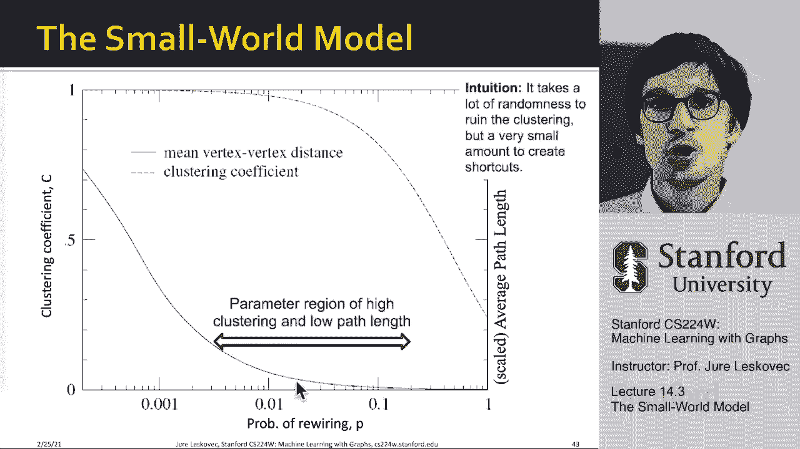

# 43：14.3 - 小世界模型 🌐

在本节课中，我们将要学习小世界模型。该模型旨在解释现实网络如何同时具备**较短的平均最短路径长度**和**较高的聚类系数**这两种看似矛盾的特性。我们将了解其基本原理、构建方法以及它如何帮助我们理解真实世界的网络结构。

---

## 模型的目标与矛盾

上一节我们介绍了GP（随机图）模型，本节中我们来看看小世界模型。

小世界模型试图同时实现两个目标：
1.  提供较短的平均最短路径长度。
2.  提供较高的聚类系数。

这两种特性通常是相互对立的：
*   在**随机图**中，存在大量随机连接，因此平均最短路径长度（或直径）很小。但随机连接也导致局部结构缺失，聚类系数很低。
*   在**规则格型图**（如环形网格）中，附近的节点相互连接，形成了许多三角形，因此聚类系数很高。但这种局部连接结构导致从一个角落到另一个角落需要很多步骤，因此直径很长。

现实网络（如社交网络、合作网络）的观察结果凸显了这一矛盾：
*   它们的平均最短路径长度与对应随机图相近，都很短。
*   但它们的聚类系数却远高于对应随机图，通常高出几个数量级。

因此，核心问题是：我们能否构建一个同时具备**高聚类系数**和**小直径**的网络？

---

## 小世界模型的构建思路

小世界模型的基本思想是在**高聚类的规则格型图**和**低直径的随机图**之间进行插值，从而结合两者的优点。

以下是构建小世界模型的步骤：

1.  **构建基础规则网络**
    从一个低维规则晶格开始，例如将节点排列成一个环，每个节点与其最近的 `k` 个邻居（如左右各 `k/2` 个）相连。这种结构具有高聚类系数，但直径也很大。

2.  **引入随机性以创建“捷径”**
    以概率 `p` 对网络中的边进行“重新布线”。对于每条边，我们有一定概率 `p` 将其一端断开，并随机连接到网络中的另一个节点上。这个过程创建了连接网络遥远部分的“捷径”。

**关键机制**：
*   当重连概率 `p = 0` 时，网络保持原始的规则格型结构（高聚类、高直径）。
*   当重连概率 `p = 1` 时，所有边都被随机重连，网络趋近于随机图（低聚类、低直径）。
*   当 `p` 取一个**较小的中间值**（例如 0.01 到 0.1）时，奇迹发生了：网络保留了大部分原始局部连接（从而保持高聚类），同时少数几条随机“捷径”极大地缩短了网络直径。

---

## 模型特性分析

通过模拟不同重连概率 `p` 下的网络，我们可以绘制出聚类系数和平均最短路径长度随 `p` 变化的曲线。

**观察结果**：
*   **平均最短路径长度**：随着 `p` 从 0 开始略微增加，它会**急剧下降**。这意味着只需很少的几条随机捷径，就能显著缩小网络直径。
*   **聚类系数**：在 `p` 较小的范围内，聚类系数**下降非常缓慢**，基本保持在高位。只有当 `p` 较大时，它才会显著降低。

因此，在 `p` 的某个中间范围内，我们成功获得了**高聚类系数**和**低平均最短路径长度**并存的“小世界”网络。这正是许多真实网络所展现的特性。

---

## 总结与意义

本节课中我们一起学习了小世界模型。

**核心总结**：
小世界模型通过**在规则网络中引入少量随机捷径**，巧妙地实现了高聚类与小直径的共存。它揭示了网络直径对随机连接的高度敏感性，以及聚类系数对局部结构的依赖性。

**模型的意义**：
1.  它提供了对网络**聚类特性**与**连通效率**之间相互作用的深刻见解。
2.  它成功地捕捉了众多现实世界网络（社交、生物、技术网络）的关键特征。
3.  它为我们提供了一种思考网络生成过程的模型框架。

**模型的局限**：
标准的小世界模型生成的网络**度分布是均匀的**（所有节点拥有大致相同的连接数），这与我们在MSN等网络中观察到的**幂律度分布**（少数节点拥有大量连接）不符。这引出了我们对更复杂网络模型（如偏好连接模型）的探索需求。

通过GP模型和小世界模型，我们可以看到，用不同的模型来解释网络的不同属性，有助于我们思考在现实世界中可能发生什么样的过程，从而形成我们观察到的网络性质。