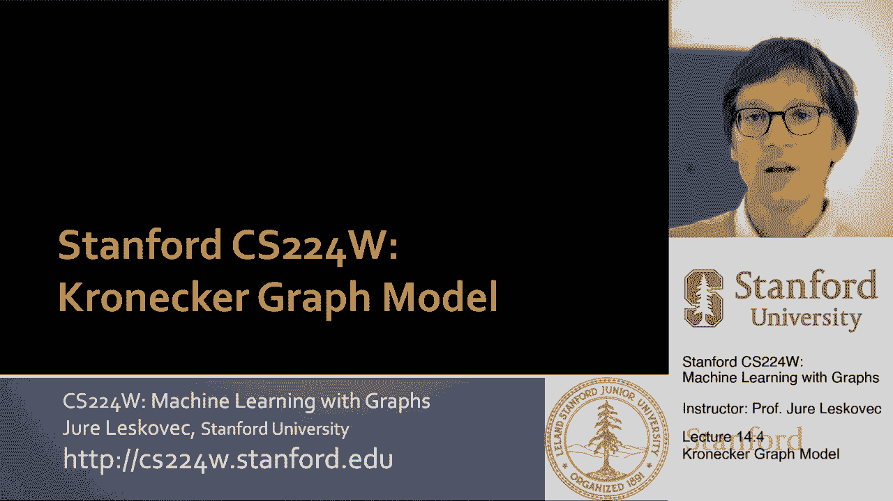
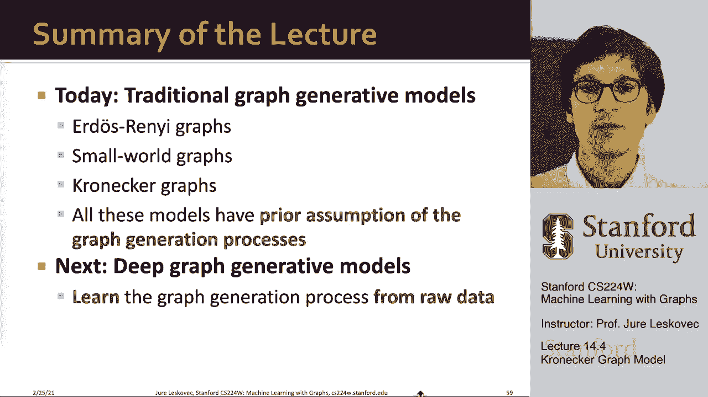

# 44：14.4 - 克罗内克图模型 🧩

在本节课中，我们将学习第三个图生成模型——克罗内克图模型。这是一个基于数学运算的模型，能够生成具有自相似结构的丰富网络。我们将从递归生成的角度理解它，并学习如何通过克罗内克积从一个小型“种子”图生成大型图。

---

## 什么是克罗内克图模型？ 🤔

上一节我们介绍了小世界模型，本节中我们来看看克罗内克图模型。该模型的核心思想是**递归生成**和**自相似性**。自相似意味着物体的整体结构与它的部分结构相似。克罗内克图模型旨在通过一个小的“种子”图（或称发起矩阵），递归地生成越来越大的图，从而模拟网络中不同社区的形成和增长。

克罗内克积是实现这一目标的关键数学工具，它允许我们生成自相似的邻接矩阵。

---

## 克罗内克积的定义与运算 ⚙️

为了理解模型，我们首先需要定义两个矩阵的克罗内克积。

**克罗内克积的定义如下：**
给定两个矩阵 **A**（大小为 `m × n`）和 **B**（大小为 `p × q`），它们的克罗内克积 **A ⊗ B** 是一个大小为 `(m*p) × (n*q)` 的矩阵。运算规则是：将矩阵 **B** 乘以矩阵 **A** 中的每一个元素，并用这个乘积块替换 **A** 中对应的元素位置。

用公式表示，结果矩阵 **C** 中的元素为：
`C[(i-1)*p + r, (j-1)*q + s] = A[i, j] * B[r, s]`
其中 `i, j` 是 **A** 的索引，`r, s` 是 **B** 的索引。

**两个图的克罗内克积** 则定义为它们对应邻接矩阵的克罗内克积。

---

## 确定性克罗内克图的生成 🏗️

有了克罗内克积的概念，我们就可以定义确定性克罗内克图。

**生成步骤如下：**
1.  从一个小的“发起矩阵” **K₁**（例如一个3x3的邻接矩阵）开始。
2.  递归地对 **K₁** 应用克罗内克积：**K₂ = K₁ ⊗ K₁**， **K₃ = K₂ ⊗ K₁**， 依此类推。
3.  经过 `m` 次迭代后，得到的矩阵 **Kₘ** 就是最终生成图的邻接矩阵。

这个过程会产生一个具有明显自相似块结构的邻接矩阵。例如，如果发起矩阵中有零块和非零块，生成的大矩阵中也会出现按比例放大的相同模式。

---

## 随机克罗内克图模型 🎲

确定性模型生成的是固定结构的图。为了生成随机图，我们引入了**随机克罗内克图模型**。

**核心思想是将发起矩阵视为概率矩阵。**
*   我们有一个发起矩阵 **Θ₁**，其每个元素值在0到1之间，代表该位置出现边的**概率**。
*   我们对这个概率矩阵进行克罗内克幂运算，得到一个大的概率矩阵 **Θₘ**。
*   最后，我们根据 **Θₘ** 中每个单元格的概率值进行“抛硬币”，独立地决定每条边是否存在，从而实例化出一个具体的图。

然而，对于一个有 `n` 个节点的图，其邻接矩阵有 `n²` 个元素，这意味着我们需要进行 `O(n²)` 次抛硬币操作，对于大规模图（如百万节点）来说计算量过大。

---

## 快速生成：随机“抛边”算法 ⚡

为了解决效率问题，我们使用一种称为“抛边”或“球下降”的快速采样算法。

**算法的直观理解如下：**
将最终的概率邻接矩阵想象成一个递归的四叉树结构（假设发起矩阵是2x2）。生成一条边的过程，就是从树根（整个矩阵）出发，递归地选择进入哪个子象限（即矩阵的哪个子块），直到到达代表单个单元格的叶子节点。

**算法步骤如下：**
以下是该算法的描述：
1.  将发起矩阵 **Θ₁** 的四个元素（a, b, c, d）归一化，使其和为1，作为选择概率。
2.  要生成一条边，我们从矩阵的顶层开始。
3.  在每一层，根据（a, b, c, d）的概率分布，随机选择四个象限中的一个进入。
4.  重复步骤3，不断深入更小的子象限，直到到达最底层的一个具体单元格 `(i, j)`。
5.  在节点 `i` 和 `j` 之间创建一条边。如果边已存在，则忽略此次结果（或重新采样）。
6.  重复步骤2-5，直到生成所需数量的边。

这种方法只需大约 `O(E log n)` 次操作即可生成 `E` 条边，效率远高于 `O(n²)`。

---

## 模型的表现与总结 📊

通过精心选择发起概率矩阵的几个参数（如一个2x2矩阵的四个值），随机克罗内克图模型能够生成在多个统计特性上与真实网络高度吻合的图。

例如，它能够同时匹配：
*   **度分布**
*   **聚类系数**
*   **直径**与**最短路径分布**
*   **连通分量**规模

本节课中我们一起学习了三种传统的图生成模型。我们从描述图的度量开始，首先介绍了最简单的**埃尔德什-雷尼随机图模型**，它具有良好的路径长度但缺乏聚类性。接着是**小世界模型**，它通过添加少量重连边就能在保持高聚类的同时缩短直径。最后，我们深入探讨了更数学化的**克罗内克图模型**，它通过克罗内克积实现递归和自相似生成，其随机版本配合“抛边”算法，能够高效地生成具有真实网络特性的大规模图。

下周，我们将进入网络的**深度生成模型**领域，那时我们将不再关注网络形成的机械式原因，而是将其视为一个机器学习问题，直接学习如何生成逼真的网络结构。