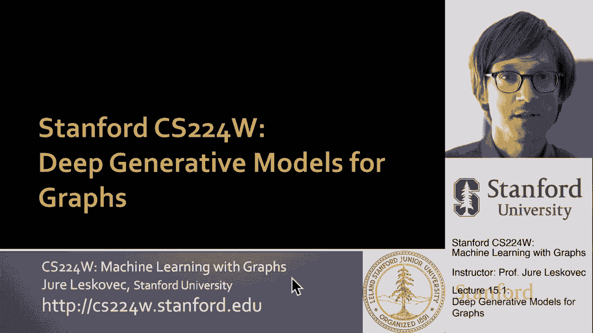
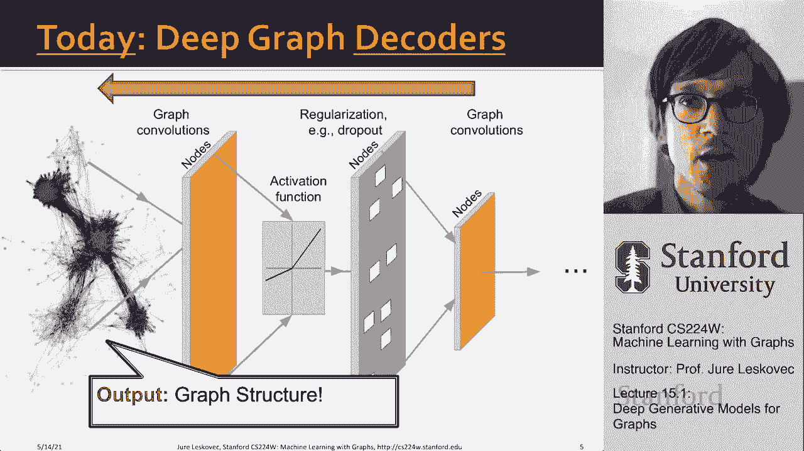
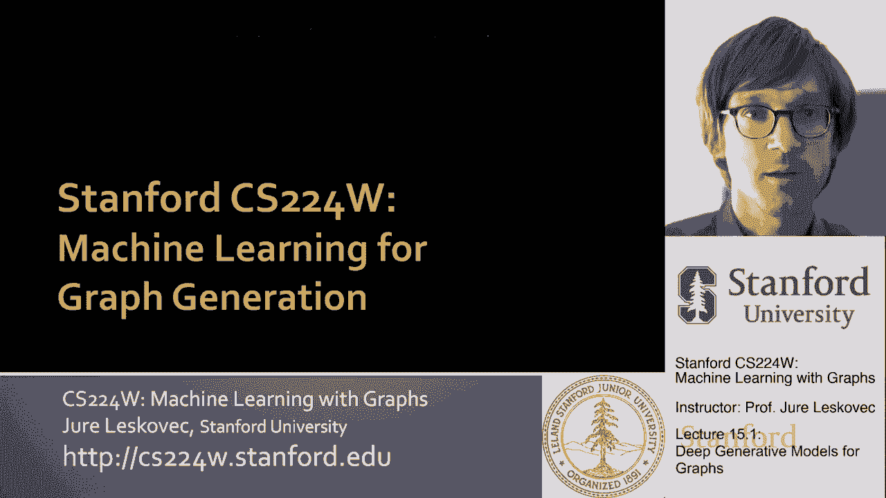
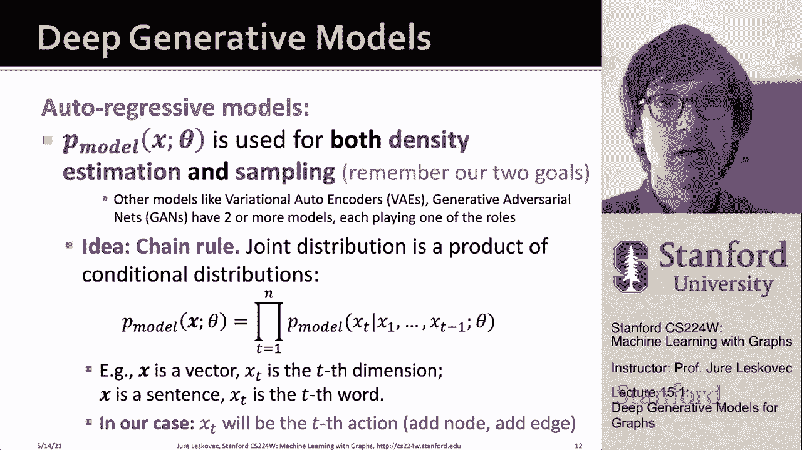
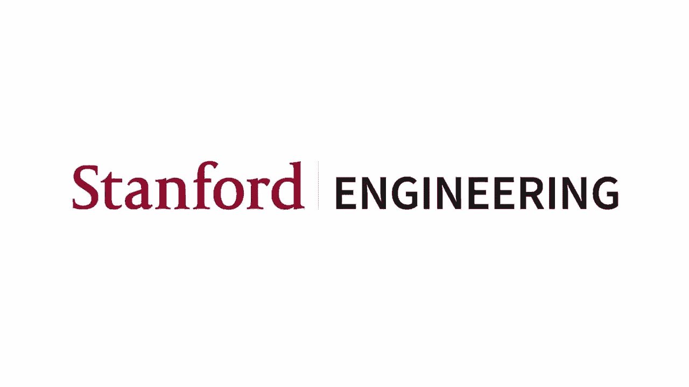

# 45：15.1 - 图的深度生成模型 🧠

在本节课中，我们将要学习图的深度生成模型。我们将探讨如何利用深度学习技术，从给定的图数据中学习其分布，并生成新的、具有相似特性的图。这包括理解生成模型的基本原理、最大似然估计方法，以及如何通过自回归模型将复杂的图生成过程分解为一系列简单的步骤。

---

## 概述 📋

图生成模型的目标是学习一个能够生成与真实世界图相似的合成图的模型。这种技术在许多领域都有应用，例如生成新的分子结构、设计材料、模拟社交网络、创建道路布局，甚至生成组合优化问题（如布尔可满足性问题）的实例。传统方法依赖于对网络性质的假设（如无标度特性）或统计模型，而深度学习方法则直接从数据中学习生成过程，更具通用性。

---

## 图生成任务的定义 🎯

上一节我们介绍了图生成模型的应用背景，本节中我们来看看如何将图生成任务形式化为一个机器学习问题。

我们假设真实世界的图是从一个未知的分布 **P_data** 中采样得到的。我们的目标是学习一个由参数 **θ** 定义的模型分布 **P_model**，使其尽可能接近 **P_data**。这包含两个子目标：
1.  **密度估计**：找到最优参数 **θ***，使得观测到的图数据 **x** 在 **P_model** 下的对数似然 **log P_model(x; θ)** 最大。
2.  **采样**：在获得 **P_model** 后，我们需要能够从中生成新的图样本 **x**。

为了实现采样，我们通常从一个简单的噪声分布（如标准正态分布）中采样一个随机种子 **z**，然后通过一个复杂的函数 **f**（通常是一个深度神经网络）将其“解码”成一个完整的图 **x**，并希望 **x** 遵循 **P_model** 的分布。

---

## 深度生成模型方法：自回归模型 🔄

上一节我们定义了图生成任务，本节中我们来看看实现该任务的一种核心方法——自回归模型。

在深度生成模型中，我们将使用自回归模型来同时进行密度估计和采样。其核心思想是利用概率的链式法则，将一个复杂的联合分布分解为一系列条件概率的乘积。

对于一组随机变量 **X = (x_1, x_2, ..., x_T)**，其联合分布可以表示为：
**P_model(X) = ∏_{t=1}^{T} P(x_t | x_1, x_2, ..., x_{t-1})**

这意味着，生成整个对象（如图）的概率，可以分解为按顺序生成其每个组成部分的概率，其中每个步骤都依赖于之前所有已生成的部分。

以下是这种方法应用于图生成的关键步骤：

1.  **将图表示为动作序列**：我们不直接生成整个图结构，而是生成一系列构建图的动作。每个动作可以是“添加一个新节点”或“在现有节点之间添加一条新边”。
2.  **顺序生成**：模型从空图开始，在每一步 **t**，它根据当前已构建的部分图（即历史动作 **a_1, a_2, ..., a_{t-1}**），预测下一个最可能的动作 **a_t** 的概率分布。
3.  **概率计算**：整个生成序列（即最终生成的图）的概率，就是每一步条件概率的乘积。

通过这种方式，我们将一个复杂的图生成问题，转化为了一个序列预测问题，这非常适合用循环神经网络（RNN）或Transformer等序列模型来解决。

---

## 总结 ✨

本节课中我们一起学习了图的深度生成模型。我们首先了解了图生成任务广泛的应用场景，从分子设计到社交网络模拟。接着，我们将其形式化为一个机器学习问题，即学习一个模型分布 **P_model** 来近似未知的真实数据分布 **P_data**，并完成密度估计和采样两个目标。最后，我们介绍了实现该任务的核心框架——自回归模型，它通过将图的生成过程分解为一系列顺序依赖的动作，巧妙地利用链式法则将复杂问题转化为序列预测问题，为使用深度学习模型生成图结构奠定了理论基础。