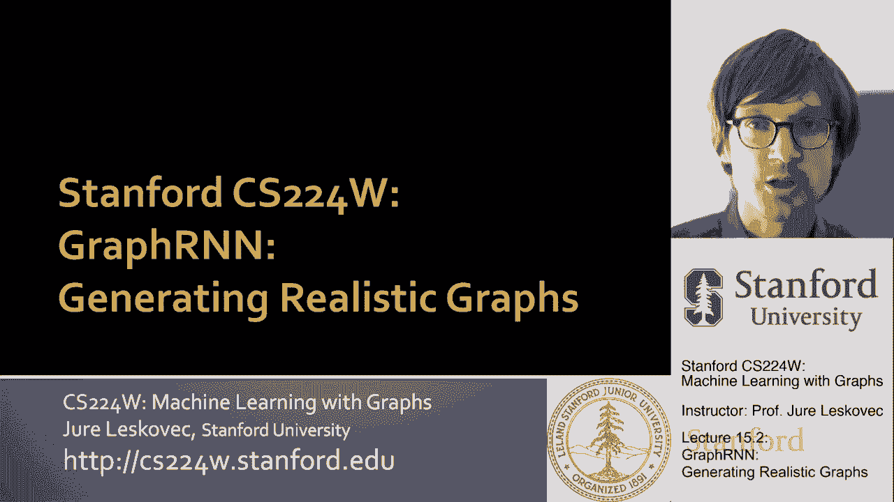
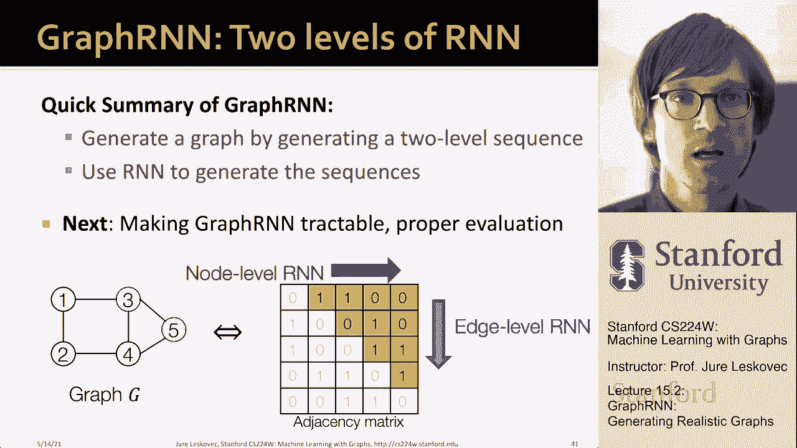

# 46：15.2 - 图RNN生成逼真图 🧠

在本节课中，我们将学习一种名为**图RNN**的图生成模型。该模型能够生成逼真且多样的图，无需对图的结构做出任何先验假设。我们将把复杂的图生成过程分解为一系列简单的步骤，并使用递归神经网络（RNN）来建模这些步骤之间的依赖关系。

---

## 核心思想：将图生成视为序列生成 🧩

上一节我们介绍了图生成的基本挑战。本节中，我们来看看如何将图生成问题转化为序列生成问题。

关键思想是：通过**顺序添加节点和边**来生成图。我们将一个复杂的图分布分解为许多小步骤，每一步都基于当前已生成的图状态，预测下一步要添加什么。

具体来说，给定一个节点顺序（排列π），图的生成过程可以唯一地映射为一个序列。这个序列包含两个层次：
1.  **节点级序列**：决定何时添加新节点。
2.  **边级序列**：在添加一个新节点后，决定该节点与之前所有已存在节点之间是否建立连接。

这相当于在生成邻接矩阵：节点级步骤添加新的一列，边级步骤填充该列的各个条目（0表示无边，1表示有边）。

---

## 模型架构：嵌套递归神经网络 🔄

既然我们将问题转化为序列生成，自然可以使用为序列数据设计的**递归神经网络（RNN）**。图RNN使用一个**嵌套的RNN结构**来建模两级序列。

以下是RNN的基本更新公式，它描述了RNN如何在每个时间步更新其隐藏状态并产生输出：

**公式**：
`S_t = σ(W * S_{t-1} + U * X_t)`
`Y_t = V * S_t`

其中：
*   `S_t` 是时间步 `t` 的隐藏状态，承载了RNN的记忆。
*   `X_t` 是时间步 `t` 的输入。
*   `Y_t` 是时间步 `t` 的输出。
*   `W`, `U`, `V` 是可训练的参数矩阵。
*   `σ` 是非线性激活函数。

在图RNN中，两个RNN协同工作：
*   **节点级RNN**：负责高级的节点生成序列。当它决定添加一个新节点时，会为**边级RNN**生成一个初始隐藏状态。
*   **边级RNN**：接收节点级RNN传来的状态，负责生成新节点与所有已有节点之间的连接序列（一串0和1）。生成完毕后，将其最终状态传回节点级RNN，以决定下一个节点的生成。

这个过程循环往复，直到边级RNN生成一个“序列结束”信号（例如，新节点不与任何已有节点相连），图生成过程便停止。

---

## 训练：使用教师强制和二元交叉熵 🎯

我们的目标是让RNN学习生成随机图，而非确定性的图。因此，在每一步，RNN的输出应是连接概率，而非确定的0或1。

**训练阶段**，我们使用**教师强制**技术：
1.  对于训练数据中的每个图，我们知道其真实的生成序列（即真实的边连接情况）。
2.  在RNN的每一步，我们使用**真实的上一时间步输出**（0或1）作为当前时间步的输入，而不是使用模型自己预测的结果。这有助于模型更快、更稳定地学习。

我们使用**二元交叉熵损失**来衡量模型预测的概率与真实连接情况之间的差异，并通过反向传播来优化RNN的参数。

**损失函数公式**：
`Loss = - [y* * log(y) + (1 - y*) * log(1 - y)]`
其中 `y*` 是真实标签（0或1），`y` 是模型预测的连接概率。

---

## 生成：基于概率采样进行序列展开 🎲

**生成（测试）阶段**，我们不再有真实序列作为指导。
1.  模型从初始状态开始。
2.  在每一步，边级RNN输出一个连接概率 `p`。
3.  我们进行一次**伯努利采样**（以概率 `p` 输出1，以概率 `1-p` 输出0），将这个采样结果（0或1）作为下一个时间步的输入。
4.  重复此过程，直到模型输出序列结束信号。

这种方法使得每次运行模型都能生成一个可能不同的、符合学习到的分布的新图。

---

## 总结 📝

本节课中，我们一起学习了**图RNN模型**的核心原理。我们首先将图生成问题转化为**两级序列生成问题**（节点级和边级）。然后，我们使用一个**嵌套的RNN结构**来建模这个序列过程：节点级RNN控制节点生成节奏，边级RNN负责生成具体的边连接。在训练时，我们采用**教师强制**和**二元交叉熵损失**来优化模型。在生成时，模型通过**概率采样**来自主展开序列，从而创造出逼真且多样的新图。这个框架非常通用，能够适应不同大小和结构的图生成任务。