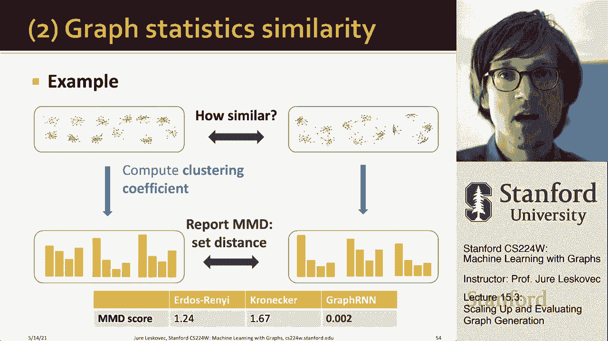

# 47：15.3 - 图生成的扩展与评估 📈

在本节课中，我们将要学习如何扩展图生成模型以处理大规模图，并探讨如何定量评估生成图的质量。我们将重点介绍一种名为广度优先搜索排序的技术，它能显著降低模型的计算复杂度。同时，我们将学习使用统计度量，如地球移动距离和最大均值差异，来量化生成图与真实图之间的相似性。

---

上一节我们介绍了图生成模型的基本框架。本节中我们来看看如何提升模型的可扩展性。

图生成模型面临的一个核心挑战是**可扩展性**。在图中，原则上任何新节点都可以连接到任何已有的节点。这意味着，当生成第 `n` 个节点时，模型可能需要考虑与之前 `n-1` 个节点的连接可能性。这要求模型生成一个完整的邻接矩阵，并导致非常长的依赖关系，因为模型需要记住所有早期节点的信息。

为了限制这种复杂性，一个关键的见解是：我们可以**主动选择节点的生成顺序**，而不是使用随机顺序。我们提出的节点排序方法称为**广度优先搜索节点排序**。

以下是BFS排序的具体步骤：
1.  从图中随机选择一个起始节点，标记为节点1。
2.  按照广度优先的顺序遍历图，依次为节点编号。
3.  在生成图时，按照此编号顺序依次添加节点和边。

BFS排序为我们带来了以下好处：
*   **减少长期依赖**：由于BFS的性质，一个节点不会连接到距离它很远的早期节点（例如，节点5不会连接到节点1）。这意味着模型在生成新节点时，只需要关注最近添加的几个节点，而无需记住整个历史。
*   **减少生成步骤**：邻接矩阵变得稀疏且具有带状结构。边缘级别的RNN只需要生成矩阵的一小部分（即非零的带状区域），而不是整个上三角部分。
*   **保持通用性**：这种排序方式并不限制模型生成图的能力，它只是利用图本身的稀疏性，让学习过程变得更加高效。

本质上，BFS排序将所需的记忆步骤从 `O(n)` 减少到了 `O(1)`，并极大地减少了需要考虑的可能连接数量。

---

上一节我们介绍了如何通过BFS排序来扩展模型。本节中我们来看看如何评估生成的图。

评估图生成模型的质量至关重要。我们有两种主要方法：**定性可视化观察**和**定量统计度量比较**。

首先，通过可视化可以直观判断生成图是否与训练图相似。例如，当输入是网格图时，GraphRNN能够生成新的网格图，而其他传统模型（如Kronecker、BA模型）则可能失败。同样，对于具有社区结构的图，GraphRNN也能成功捕捉并生成类似结构的图，这显示了其强大的通用性。

然而，我们需要更严谨的、可量化的评估标准。由于直接比较两个图（图同构测试）是计算困难的问题，我们转而比较它们的**图统计量**。

我们采用一个两步法来量化两组图集（例如，真实训练图集和合成生成图集）之间的相似性。

**第一步：计算并比较单个统计量的分布**
对于每个图，我们计算一组统计量，例如：
*   度分布
*   聚类系数分布
*   轨道计数分布

这些统计量通常表现为概率分布。接着，我们比较真实图集和生成图集在**同一统计量**上的分布差异。用于衡量两个分布之间差异的度量称为**地球移动距离**。

地球移动距离的直观理解是：将一个概率分布（想象成一堆土）转变为另一个分布所需移动的“泥土”的最小总工作量。如果两个分布相似，则移动距离小；如果差异很大，则移动距离大。其计算可以形式化为一个线性规划问题。

**第二步：聚合多个统计量的差异**
在得到每个统计量（如度分布、聚类系数分布）上的地球移动距离后，我们需要将这些差异聚合起来，得到一个整体的相似性分数。

我们使用**最大均值差异** 来完成这种聚合。MMD是一种衡量两个分布之间差异的方法，它计算在某个特征空间中，两个分布样本均值之间的差异。在我们的场景中，我们使用基于地球移动距离的内核函数。

具体公式为：
`MMD²(p, q) = E_p[k(x, x‘)] + E_q[k(y, y‘)] - 2E_{p,q}[k(x, y)]`
其中，`p` 和 `q` 是两个分布，`k(., .)` 是基于地球移动距离定义的内核函数，`E` 表示期望值。

---

本节课中我们一起学习了提升图生成模型可扩展性的关键技术——广度优先搜索节点排序，它通过精心设计节点生成顺序来降低模型复杂度和记忆需求。同时，我们探讨了评估生成图质量的方法，从直观的可视化检查到严谨的定量分析。我们重点介绍了使用地球移动距离来比较单个图统计量的分布，并使用最大均值差异来聚合多个统计量的比较结果，从而对生成图的整体相似性做出量化评估。