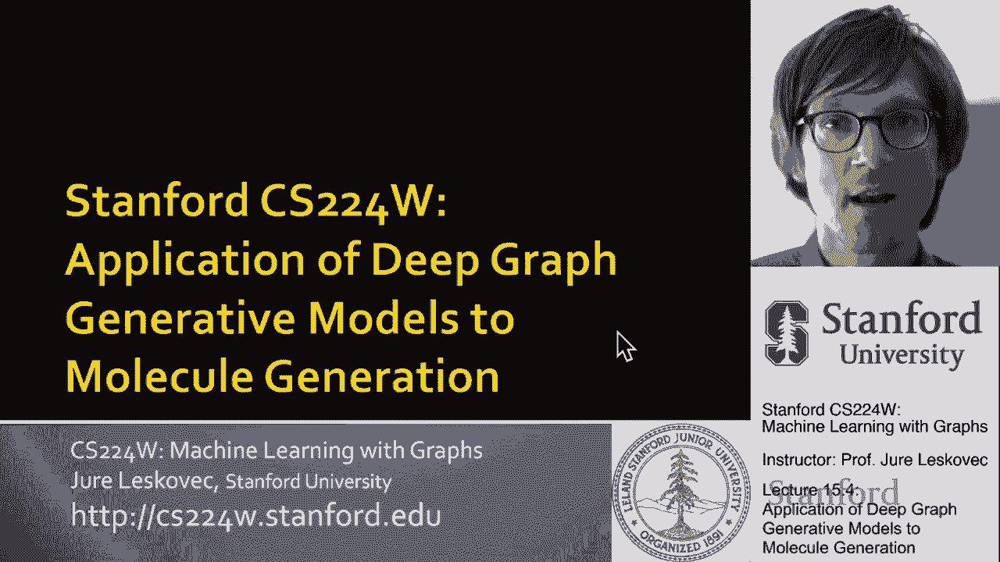
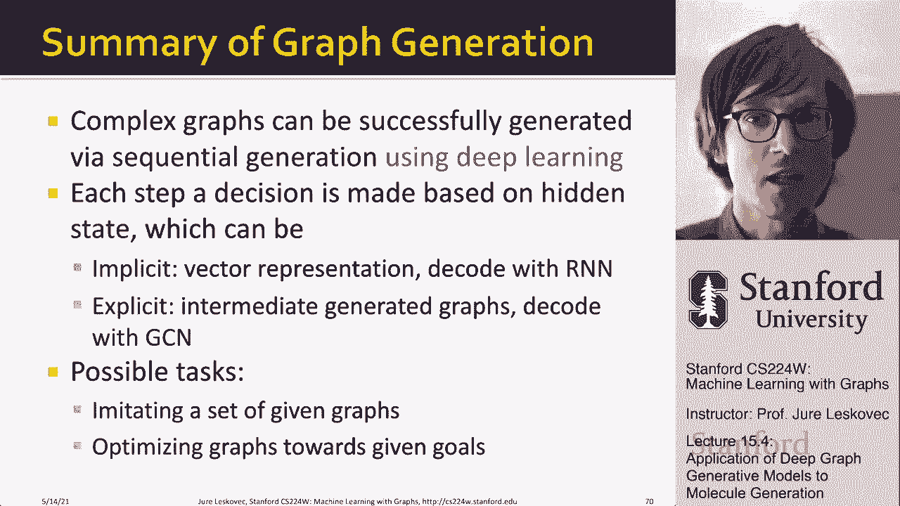
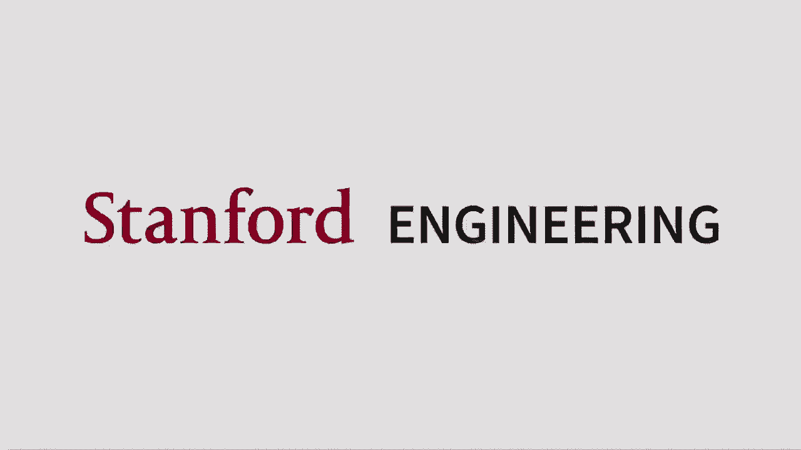

# 48：15.4 - 深度图生成模型的应用 🧪

在本节课中，我们将学习深度图生成模型在分子生成领域的应用。我们将探讨如何利用图生成模型来创造新的药物分子，并使其满足特定的化学性质和优化目标。

---

## 概述

本节课的最后一部分将讨论深度图生成模型在分子生成中的应用。核心目标是生成既符合化学规则又具有现实意义的药物分子，并优化其特定性质，如药物相似性或溶解度。

---

## 问题定义

我们希望构建一个模型，该模型能够输出一个给定的分子。这个分子必须满足两个核心条件：
1.  **有效性**：必须遵守化学规则。
2.  **现实性**：必须看起来像一个真实的药物分子，而非随意组合的结构。

此外，我们希望模型能够**优化给定的分子性质**，例如药物的相似性或溶解度。

---

## 解决方案：目标导向的分子图生成

我们将介绍一种称为“目标导向分子图的图卷积策略网络”的方法。以下是该方法的高级概述。

上一节我们介绍了图生成的基本概念，本节中我们来看看如何将其应用于优化特定目标。

**核心目标**：生成能够优化给定目标（如药物相似性）的图，同时确保生成的图遵循潜在的化学有效性规则，并且看起来逼真（即模仿训练数据集中真实分子的分布）。

**关键区别**：与单纯模仿现有图分布不同，我们不仅要生成有效的图，还要生成能优化特定**黑盒标准**的图。这里的“黑盒”意味着我们无需知道目标函数（如药物相似性评分）的内部物理或化学原理，只需知道当我们输入一个分子时，它能给出一个评分。

---

## 形式化：强化学习框架

我们将此问题形式化为一个**强化学习**问题：
*   **代理 (Agent)**：我们的图生成模型。
*   **环境 (Environment)**：化学规则和黑盒评分函数。
*   **动作 (Action)**：在部分生成的分子图上添加一个原子或一条键。
*   **奖励 (Reward)**：
    *   **即时奖励**：在每一步，如果添加原子或键的动作符合化学规则，则给予小的正面奖励。
    *   **长期奖励**：在完成整个分子的生成后，由黑盒评分函数给出的最终评分。

总奖励是即时奖励与长期奖励的总和。通过这种方式，模型学习既遵守规则（即时奖励），又朝着优化最终目标（长期奖励）的方向生成分子。

---

## 模型架构：图卷积策略网络

该解决方案的核心是**图卷积策略网络**。其关键组件是使用**图神经网络**来捕捉图的结构信息。

以下是两种图生成方法的对比：

**图RNN (Graph RNN)**：
*   使用RNN的隐藏状态来编码生成历史，并基于此状态预测下一个动作（添加节点或边）。
*   所有历史信息都压缩在隐藏状态中，对于大型图可能信息容量不足。

**图卷积策略网络 (我们的方法)**：
*   使用GNN为**部分生成的图**中的每个节点计算嵌入向量。
*   当要添加新节点时，基于所有现有节点和新节点的嵌入，通过**链接预测**来决定新节点应与哪些现有节点连接。
*   **优势**：GNN比RNN更具表现力，能更好地捕捉图结构。
*   **劣势**：计算成本通常更高。但由于药物分子通常较小，我们可以承受这种计算开销。

**生成流程**：
1.  插入一个新节点。
2.  使用GNN计算当前图（包括新节点）中所有节点的嵌入。
3.  基于节点嵌入，预测新节点与现有节点之间的连接（即进行链接预测）。
4.  检查该连接是否符合化学有效性规则，并给予即时奖励。
5.  重复步骤1-4，直到分子生成完成。
6.  将完成的分子输入黑盒函数，获得长期奖励。

---

## 模型训练

模型训练分为两个阶段：

**第一阶段：监督预训练**
*   **目标**：让模型学会生成**逼真**的分子。
*   **方法**：使用已有的真实分子图数据集，通过模仿学习（即让模型学习如何一步步重建这些真实分子）来训练策略网络。此阶段不涉及优化特定性质。

**第二阶段：策略梯度强化学习**
*   **目标**：让模型学会优化**奖励**（即特定分子性质）。
*   **方法**：使用策略梯度算法（如REINFORCE）进行训练。模型通过试错生成分子，并根据获得的即时奖励和长期奖励来更新策略，从而学习生成能获得更高总奖励（即更好性质）的分子。

---

## 应用与结果

这种方法允许我们：
1.  **从头生成优化分子**：从零开始生成试图优化特定性质（如溶解度 `LogP` 或药物相似性 `QED`）的全新分子结构。
2.  **完成部分分子结构**：给定一个起始的分子片段，模型可以“补全”该分子，以显著提高其目标性质。

例如，可以从一个溶解度很差的结构开始，让模型完成它，最终得到一个溶解度大幅改善的完整分子。

---

## 总结 🎯

在本节课中，我们一起学习了：
*   复杂的图可以通过**顺序生成**的方式创建，每一步都基于当前状态做出决策。
*   状态表示可以是**隐式**的（如图RNN中的隐藏状态），也可以是**显式**的（如图卷积策略网络中直接在图上计算的节点嵌入）。
*   图生成模型的任务包括**模拟给定图的分布**和**针对给定目标优化图**。
*   我们重点探讨了在**分子生成**中的应用，旨在产生具有最佳性质的分子。
*   这种框架具有通用性，可应用于任何类型的图生成任务，例如生成逼真的地图、城市道路网络或新材料的结构。

---

**核心概念公式/代码表示**：
*   **奖励函数**：`总奖励 R_total = Σ(即时奖励 R_step) + 最终奖励 R_final`
*   **策略网络**：`动作 a_t = π_θ(s_t)`，其中 `s_t` 是由GNN计算的当前图状态，`π_θ` 是参数为θ的策略网络。
*   **目标**：最大化期望总奖励 `J(θ) = E_π_θ[R_total]`。