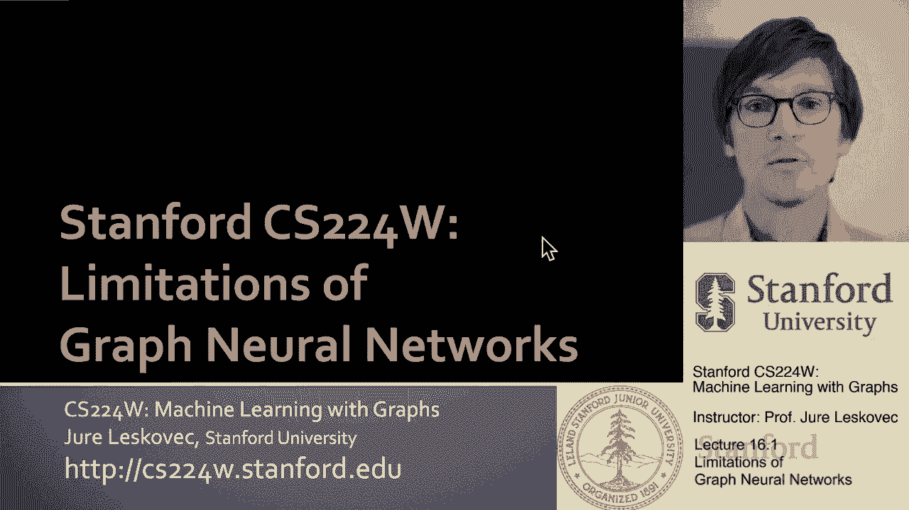
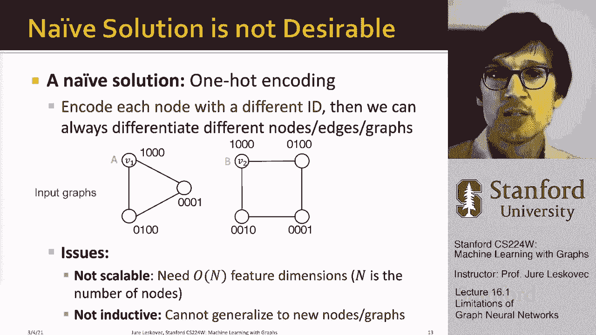

# 49：16.1 - 图神经网络的局限性 🧠

在本节课中，我们将要学习图神经网络（GNN）的两个核心局限性，并探讨如何通过设计更具表达力的模型来解决这些问题。我们将首先理解“完美”GNN的理想行为，然后分析现有模型在“位置感知任务”和“表达能力”上的不足。最后，我们将简要介绍两种改进思路：位置感知GNN和身份感知GNN。

---

## 什么是“完美”的图神经网络？ 🤔

上一节我们介绍了课程目标，本节中我们来看看一个理想化的“完美”GNN应该具备哪些特性。

一个K层图神经网络的嵌入，是基于目标节点周围K跳邻域的结构信息计算得出的。下图试图说明这一点：为了嵌入一个特定节点，模型会聚合该节点周围的图结构信息，并通过消息传递机制计算其嵌入。

一个完美的GNN会做到：**将每一个具有不同邻域结构的节点，都嵌入到嵌入空间中的不同位置**。

基于这种直觉，我们可以得出两个重要观察：

以下是关于完美GNN的两个核心观察：
1.  **观察一**：如果两个节点具有完全相同的邻域结构，那么一个完美的GNN会将它们嵌入到完全相同的点（假设没有额外的判别性特征信息）。例如，在下图中，假设两个连通分量结构相同，那么节点v1和v2将被嵌入到同一点。
    
2.  **观察二**：如果两个节点具有不同的邻域结构，那么一个完美的GNN会将它们嵌入到空间中的不同点。例如，一个位于三角形中的节点和一个位于正方形中的节点，应该被嵌入到不同的位置。

然而，这些观察所描述的理想情况在实践中并不总是成立，这也引出了GNN的局限性。

---

## 局限性一：无法处理位置感知任务 📍

上一节我们描述了完美GNN的理想行为，本节中我们来看看第一个现实中的局限性。

观察一可能会出现问题：**即使两个节点具有相同的邻域结构，我们有时也需要为它们分配不同的嵌入**。这是因为节点可能出现在图中的不同“位置”。

需要模型理解图中“位置”概念的任务，我们称之为**位置感知任务**。

即使是一个完美的、能在邻域结构和嵌入之间建立单射函数的GNN，也会在这类任务上失败。

例如，在一个简单的网格图中，节点v1和v2分别位于网格的两端。尽管它们在结构上都是“角落”节点，具有相同的邻域结构，但我们希望它们能被嵌入到不同的位置。然而，目前定义的GNN无法做到这一点，因为它们只依赖于局部邻域结构。

---

## 局限性二：表达能力不足 ⚖️

上一节我们讨论了GNN在位置感知任务上的不足，本节中我们来看看其根本的表达能力限制。

观察二的含义是：**我们目前介绍的GNN表达能力是不完美的、不够强大的**。

在第9讲中我们讨论过，具有判别性特征的消息传递图神经网络，其表达能力上限是**Weisfeiler-Lehman（WL）图同构检验**。

这意味着，在某些情况下，GNN无法区分结构不同的节点。

例如，考虑一个长度为4的环（循环图）上的两个节点v1和v2。如果我们查看它们的计算图结构（假设所有节点初始特征相同），这两个计算图的结构将是相同的。因此，GNN将无法区分v1和v2，总是将它们嵌入到空间的同一点，即使一个节点位于某种局部模式（如潜在的三角形连接趋势）中，而另一个位于另一种模式（如方形连接趋势）中。

---

## 本课程的改进计划 🛠️

上一节我们明确了GNN的两大核心局限，本节中我们来看看本课程计划如何解决它们。

我们计划通过设计更具表达力的图神经网络来解决这两个问题：

以下是我们的两项主要改进思路：
1.  **解决位置感知问题**：我们将根据节点在图中的“位置”来创建节点嵌入。核心思想是在图中创建一些“参考点”，然后根据节点与这些参考点的关系来量化其位置。这类模型被称为**位置感知图神经网络**。
2.  **提升表达能力**：我们将构建表达能力超越WL测试的消息传递GNN。这类方法的一个例子是**身份感知图神经网络**。

在讲座的最后部分，我们还将简要讨论图神经网络对对抗性攻击的鲁棒性。

---

## 一个直观但不可行的解决方案 💡

上一节我们概述了改进计划，本节中我们先分析一个简单直观但存在严重缺陷的解决方案。

我们的目标是：当两个节点（如v1和v2）具有相同特征但需要不同标签时，GNN能为它们分配不同的嵌入。

一个天真的解决方案是：**为图中的每个节点分配一个独热编码作为其初始特征**。

这样，每个节点都有了独一无二的特征ID。因此，即使它们的邻域结构相同，由于其自身ID不同，在消息传递过程中，计算图也会变得可区分，GNN便能为其分配不同的嵌入。

然而，这种方法存在两个致命问题：

以下是独热编码方案的两个主要缺陷：
1.  **不可扩展性**：这种方法需要O(N)维的特征向量，其中N是节点数量。对于拥有数万、数百万节点的大图，每个节点都需要一个极其冗长的特征向量，这在计算上是不可行的。
2.  **非归纳性**：这种方法无法推广到未见过的节点或新图上。节点ID的分配是任意的，模型学到的是与特定图节点顺序相关的模式。如果出现新节点，特征维度需要扩展，模型必须重新训练。将模型迁移到新图时，由于节点ID顺序不同，也无法保证有效。

因此，虽然“丰富节点特征以区分计算图”这个思路是好的，但简单地使用独热编码并不可行。我们需要更巧妙、可扩展且具有归纳能力的方法。

---

## 总结 📝

本节课中我们一起学习了图神经网络的两个关键局限性：
1.  **位置感知能力不足**：现有GNN难以区分图中不同位置但局部结构相同的节点。
2.  **表达能力有限**：其表达能力受限于WL测试，无法区分某些具有不同高阶结构的节点。

我们探讨了一个使用独热编码的直观但不可行的解决方案，并指出了其**不可扩展**和**非归纳性**的缺陷。最后，我们引出了本课程后续的改进方向：通过构建**位置感知GNN**和**身份感知GNN**来设计更具表达力的模型。

在接下来的课程中，我们将深入探讨这些更具表达力的GNN模型是如何构建的。