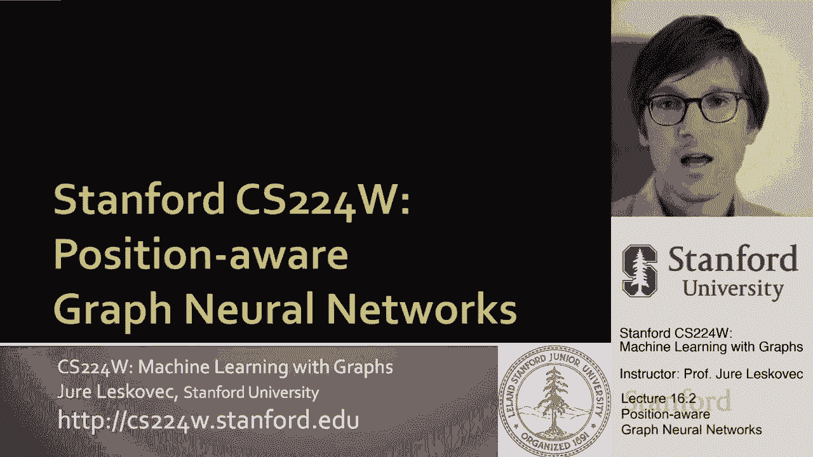
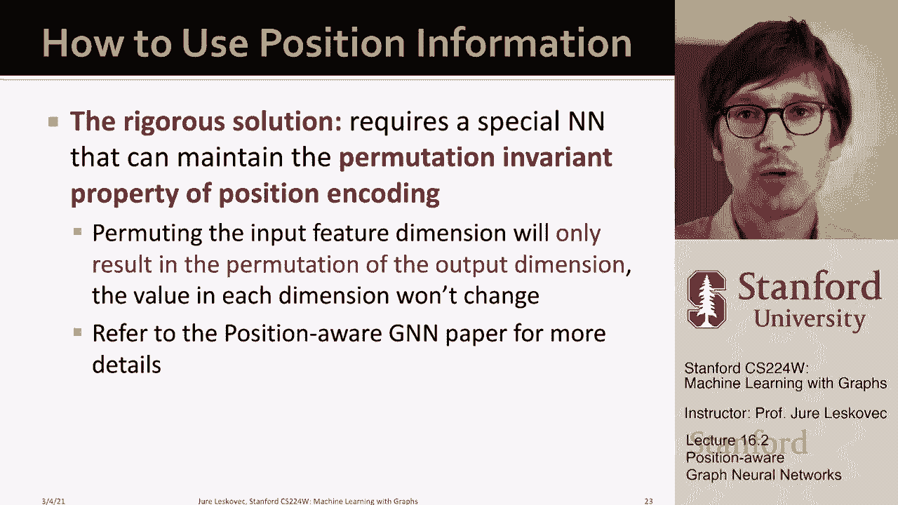

# 50：16.2 - 位置感知图神经网络 🧠📍

在本节课中，我们将要学习**位置感知图神经网络**。这是一种增强传统图神经网络表达能力的方法，使其不仅能理解节点的局部结构，还能感知节点在整个图中的全局位置。这对于解决某些特定类型的图学习任务至关重要。

---

## 概述：两种图任务类型 📊

上一节我们介绍了图神经网络的基础。本节中我们来看看图上的两种主要任务类型。

*   **结构感知任务**：节点的标签主要由其自身及其邻域的结构决定。例如，在一个由两个连通三角形组成的简单图中，节点根据其局部连接模式被标记为A或B。
*   **位置感知任务**：节点的标签主要由其在图中的全局位置决定。例如，在社区检测任务中，即使两个节点具有完全相同的局部邻域结构（即同构），如果它们位于网络的不同部分（如不同社区），也可能被赋予不同的标签。

传统图神经网络（如GCN、GAT）在结构感知任务上表现良好，因为它们通过不同的计算图来区分具有不同局部结构的节点。然而，在位置感知任务中，当两个位置不同但局部结构相同的节点具有相同的计算图时，传统GNN会为它们生成相同的嵌入，从而无法区分它们。

---

## 核心思想：引入锚点进行三角定位 🎯

那么，如何让图神经网络感知节点的位置呢？关键思想是引入**锚点**的概念。

我们可以将锚点视为图中的参考点。通过量化一个节点到不同锚点的距离，我们就能确定该节点的位置，这类似于通过三角定位法确定一个点的坐标。

### 从单个锚点到锚点集

首先，考虑使用单个锚点节点。通过计算目标节点到该锚点的距离，我们可以区分图中不同位置的节点。然而，单个锚点提供的信息有限。

更好的方法是使用**多个锚点**。这样，我们可以用一个向量来表示一个节点相对于图中多个参考区域的位置，从而更精确地定位节点。

为了进一步提升定位的效率和粒度，我们将锚点的概念从单个节点推广到**锚点集**。我们定义节点到锚点集的距离为该节点到该集合中**任何节点**的最短距离。

以下是使用锚点集的一个优势示例：
*   如果仅使用两个锚点节点S1和S2，节点V1和V3可能无法区分（它们到S1和S2的距离可能相同）。
*   但如果引入一个包含节点{V3， V1}的锚点集S3，那么V3到S3的距离为0（因为它在集合内），而V1到S3的距离为1。这样，V1和V3就被区分开了。

理论上，使用不同大小的锚点集组合，可以用相对较少的总坐标数（参考点数量）来实现对图中节点的有效定位。

---

## 构建位置编码 🧩

根据上述思想，我们可以为图中的每个节点构建一个**位置编码**。

1.  **生成锚点集**：随机选择多组节点作为锚点集。一个有效的策略是生成一系列大小呈指数增长的锚点集（例如，大小为1， 2， 4， 8...），但数量依次减半。这样可以用较少的锚点集覆盖更细粒度的位置信息。
2.  **计算距离**：对于每个锚点集，计算目标节点到该集合的最短路径距离。
3.  **形成编码**：将所有距离值组合成一个向量，即为该节点的位置编码。编码中的每个维度对应一个特定的锚点集，其值表示节点到该集合的最小距离。

**公式**：对于节点 `v` 和锚点集集合 `{S_1， S_2， ...， S_k}`，其位置编码 `PE(v)` 为：
`PE(v) = [d(v， S_1)， d(v， S_2)， ...， d(v， S_k）]`
其中 `d(v， S_i) = min_{u ∈ S_i} dist(v， u)`，`dist` 表示图中两节点间的最短路径距离。

---

## 将位置信息融入图神经网络 🔗

现在我们有了节点的位置编码，如何将其用于图神经网络呢？

### 简单方法：特征增强

最直接的方法是将位置编码作为额外的节点特征，与原始节点特征拼接后，输入到标准的GNN模型中。
`增强特征 = CONCAT(原始节点特征， 位置编码)`
这种方法在实践中通常效果良好且易于实现。

### 进阶考虑：置换不变性

然而，直接拼接存在一个潜在问题：位置编码的维度顺序是随机的（因为锚点集是随机选择的）。打乱这些维度的顺序，其语义是等价的，但可能会影响某些神经网络的输出。

更严谨的解决方案是设计一种特殊的神经网络算子，使其对位置编码的维度排列具有**不变性**。这意味着，无论位置编码的维度如何排列，算子的输出值（在相应排列后）应保持不变。相关研究（如P-GNN）对此进行了深入探讨。

但本节课的核心在于理解**锚点**的概念，以及通过**距离**来量化图中节点位置的基本原理。这从根本上增强了GNN的表达能力，使其能够同时感知**局部结构**和**全局位置**。

---

## 总结 📝

本节课中我们一起学习了位置感知图神经网络的核心思想。

1.  我们首先区分了**结构感知**与**位置感知**两类图任务，并指出了传统GNN在后者上的局限性。
2.  我们引入了**锚点**和**锚点集**作为参考点，通过计算节点到它们的**最短路径距离**来构建节点的**位置编码**，从而实现节点的“三角定位”。
3.  我们探讨了将位置编码融入GNN的两种方式：简单的**特征增强**和考虑**置换不变性**的更严谨方法。

通过引入位置感知能力，图神经网络能够应对更广泛的现实世界图学习问题。