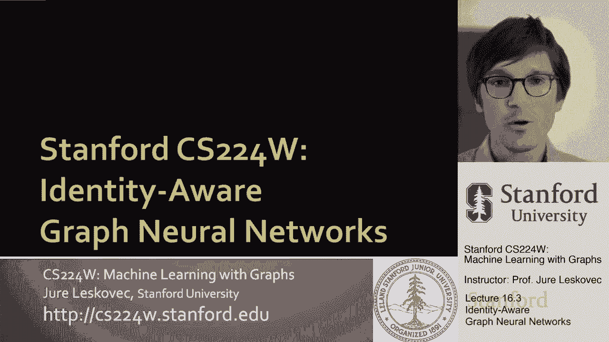
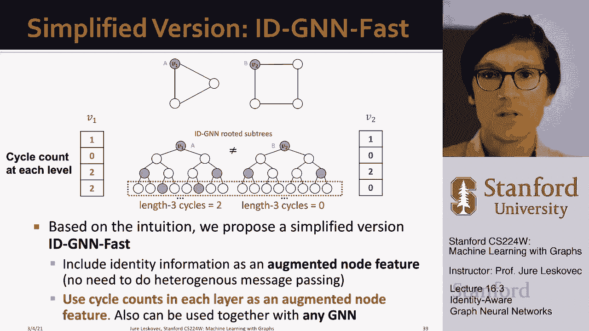

# 51：16.3 - 身份感知图神经网络 🧠

在本节课中，我们将学习身份感知图神经网络。这是一种更具表达力的图神经网络，它通过引入节点身份信息，解决了传统图神经网络在处理某些对称图结构时可能失效的问题。

上一节我们讨论了节点如何编码其在网络中的位置。本节中，我们将看看如何通过赋予节点“身份”来增强图神经网络的表达能力。

## 传统图神经网络的局限性

传统图神经网络在执行结构感知任务时存在局限性。问题在于，由于图结构的对称性，不同的输入节点或图可能产生相同的计算图，从而导致相同的嵌入表示，使得模型无法区分它们。

以下是几种典型的失败案例：

*   **节点级任务失败案例**：假设进行节点分类，两个不同的节点 `v1` 和 `v2` 可能拥有完全相同的邻居结构（计算图）。传统GNN会将它们嵌入到完全相同的点，无法分配不同的标签。
*   **链路预测失败案例**：在预测节点 `V0` 应与 `V1` 还是 `V2` 相连时，如果 `v1` 和 `v2` 的计算图相同，它们将获得相同的嵌入，导致模型为边 `a` 和边 `b` 分配相同的连接概率。
*   **图级任务失败案例**：两个不同构的图，如果所有节点度数相同且计算图结构一致，传统GNN会为这两个图生成相同的图级嵌入，无法区分它们。

在这些情况下，图神经网络在没有额外节点特征时，会将不同的输入分类到相同的类别中。

## 解决方案：身份感知的核心思想

那么，我们该如何解决这个问题？第二部分的核心思想是：为待嵌入的起始节点分配颜色。这就是“身份感知”的由来，因为图神经网络在展开计算时会记住起始节点的身份。

这个想法是归纳的，并且对节点顺序或标识保持不变。我们只对起始节点着色，然后观察这个着色节点在计算图中出现的频率。因为节点着色是归纳的，即使节点编号不同，基础计算图也不会改变，这有助于模型更好地泛化。

## 身份感知如何解决具体问题

现在，让我们具体看看归纳节点着色如何帮助我们解决之前提到的任务。

### 节点分类任务

在之前的案例中，三角形上的节点和正方形上的节点计算图可能相同。如果给根节点着色，再创建计算图，你会发现两者变得不同。特别是在两跳之后，着色方案会揭示结构差异（例如，是否回到了起始节点）。因此，模型能够成功区分节点 `v1` 和 `v2`。

### 图分类任务

对于两个输入图，通过标记起始节点，计算图中的着色模式会变得不同。这意味着节点的嵌入将不同，进而导致聚合后的图嵌入也不同。因此，我们可以将图 `A` 和图 `B` 嵌入到不同的点，并为它们分配不同的类别。

### 链路预测任务

在预测边 `a` 和边 `b` 时，我们同时为参与预测的两个节点着色。这样，节点 `v1` 和 `v2` 的计算图就会因为到达起始节点 `v0` 的速度不同而产生差异。这使得模型能够为边 `a` 和边 `b` 分配不同的概率。

## 如何构建身份感知图神经网络

现在的问题是，如何构建一个能利用这种节点着色的图神经网络？关键思想是使用**异构消息传递**。

在传统GNN中，我们对所有节点应用相同的消息聚合计算。在身份感知图神经网络中，我们将根据节点的颜色，应用不同类型的聚合和消息传递函数。

这意味着，在聚合信息到着色节点时，我们使用一种类型的转换算子；在聚合信息到非着色节点时，我们使用另一种类型的算子。这样，消息会根据是否涉及着色节点而以不同方式转换，最终导致不同的嵌入结果。

为什么异构消息传递有效？假设两个节点 `v1` 和 `v2` 的计算图结构相同但节点颜色不同。由于我们对不同颜色的节点应用了不同的神经网络参数，最终 `v1` 和 `v2` 的输出嵌入就会不同。

身份感知图神经网络实际上是在计算从给定根节点出发的不同长度的环。例如，它能识别一个节点是处于一个长度为3的环中，还是处于一个长度为4的环中。这种能力使其能够学习和计数图中的环结构。

## 简化实现方法

除了异构消息传递，还有一种简化方法。其基本思想是将身份信息作为增强的节点特征，从而避免复杂的异构消息传递。

具体做法是：在每一层中，使用环计数（例如，该节点是长度为0、2、3等的环的一部分）作为根节点的增强特征。然后，简单地应用均匀的消息传递。这样，两个计算图不同的节点就能获得不同的特征描述，从而被区分开来。

## 总结

本节课中，我们一起学习了身份感知图神经网络。这是对图神经网络框架的一个通用而强大的扩展。

*   它通过**归纳节点着色**和**异构消息传递**的核心思想，使图神经网络更具表达力。
*   这种方法可以应用于任何图神经网络架构（如图卷积网络、图同构网络等）。
*   它在节点、边和图级别的任务上都能提供一致的性能提升，因为它能打破对称性，识别节点所属的不同环结构。
*   身份感知图神经网络比传统GNN以及最简单的WL测试模型更具表达力。
*   它易于实现，本质上只需要为根节点着色。

关键思想是进行归纳节点着色。我们还提到了位置感知图神经网络，其思想是使用锚点的概念，通过节点到一组锚点的距离来描述节点的位置。我们通常希望使用不同尺寸的锚点集，并计算节点到这些锚点集中任何节点的距离。