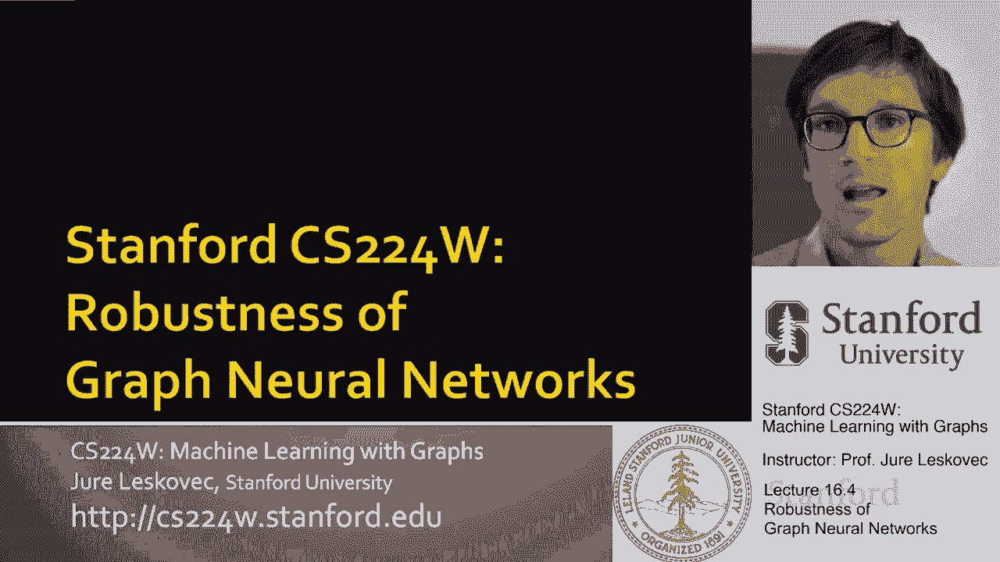
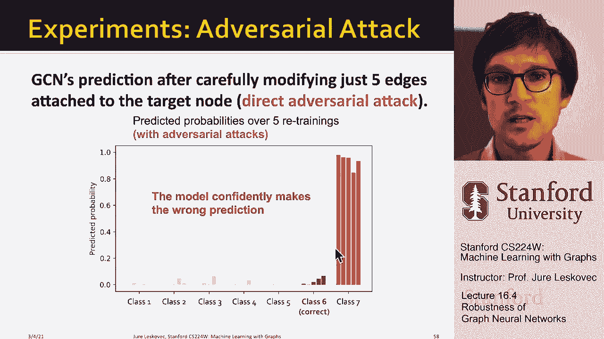

# 52：16.4 - 图神经网络的鲁棒性 🛡️

在本节课中，我们将要学习图神经网络（GNN）的鲁棒性。我们将探讨图神经网络模型在面对攻击，特别是对抗性攻击时的脆弱性，并了解如何形式化地描述这些攻击。通过本课程，你将理解为什么确保模型在现实世界中的鲁棒性至关重要。

---

## 攻击背景与动机

上一节我们介绍了图神经网络的基本概念，本节中我们来看看其在现实应用中的潜在风险。深度学习模型，包括图神经网络，虽然在许多任务上表现出色，但已被证明容易受到精心设计的微小扰动的影响，这被称为对抗性攻击。

在计算机视觉、自然语言处理等领域，攻击者可以通过对输入（如图像像素或文本）添加人眼难以察觉的噪声，就能完全改变模型的预测结果。例如，一张被分类为“熊猫”的图片，经过轻微扰动后，模型可能将其错误地分类为“长臂猿”。

这种对抗性示例的存在，阻碍了深度学习模型在关键现实场景（如金融、安全、推荐系统）中的可靠部署，因为恶意攻击者可能试图操纵系统输入以达成其目的。因此，研究模型的鲁棒性成为一个非常活跃的领域。

---

## 图神经网络中的攻击场景

了解了对抗性攻击的普遍性后，我们将其概念具体应用到图神经网络上。图神经网络的常见应用，如社交网络分析、推荐系统和搜索引擎，通常是公开可访问或涉及经济利益，因此更容易成为攻击目标。

攻击者有动机操纵输入的图结构或节点特征，试图改变或推翻图神经网络的预测结果。为了系统性地研究这个问题，我们设定以下框架：

*   **任务**：半监督节点分类。
*   **模型**：以图卷积神经网络（GCN）为例。
*   **设置**：我们有一个部分带标签的图，节点具有特征，目标是预测未标记节点的标签。

接下来，我们将描述攻击者可能实施的几种攻击类型。

---

## 攻击类型：直接攻击与间接攻击

以下是攻击者可能采取的两种主要策略：

**直接攻击**
在直接攻击中，攻击者控制的目标节点 `t` 就是其希望改变预测标签的节点。攻击者可以：
*   修改目标节点自身的特征（例如，更改用户个人资料）。
*   添加或删除目标节点与其他节点之间的连接（例如，购买粉丝或取消关注）。

**间接攻击**
在间接攻击中，攻击者希望改变一个其不控制的**目标节点** `t` 的预测。攻击者通过操纵其控制的**代理节点** `M` 来实现：
*   修改代理节点的特征和连接。
*   通过改变网络结构（特别是与目标节点的连接）来间接影响目标节点的分类结果。

---

## 形式化对抗性攻击

上一节我们介绍了攻击的类型，本节中我们来看看如何用数学语言形式化地定义一次攻击。攻击者的目标是：在尽可能少地改动图的前提下，最大化目标节点预测标签的变化。

设原始图的邻接矩阵为 `A`，节点特征矩阵为 `X`。攻击者操纵后的图对应 `A‘` 和 `X‘`。操纵的幅度 `ΔA = A‘ - A` 和 `ΔX = X‘ - X` 应当很小，以保持基本的图统计特性（如度分布）不被明显破坏。

攻击的正式目标可以表述为以下优化问题：

我们希望最大化目标节点 `v` 的预测变化 `Δ`。设 `c` 为原始预测的类别，`c‘` 为攻击后希望模型预测的类别。我们定义变化 `Δ` 为：
`Δ = log Pθ‘(c‘|A‘, X‘, v) - log Pθ(c|A, X, v)`
其中 `θ` 和 `θ‘` 分别是在原始图和操纵后图上训练得到的模型参数。

攻击者的优化问题是：
`argmax_{A‘, X‘} Δ`
同时满足约束：`ΔA` 和 `ΔX` 尽可能小。

解决此优化问题的挑战在于：
1.  邻接矩阵 `A` 是离散的，难以使用基于梯度的方法进行优化。
2.  每次对图结构的修改都需要重新训练 GCN 以评估预测效果，计算成本高昂。

---

## 实证结果与分析

理论形式化之后，让我们通过实验看看攻击的实际效果。我们在一个论文引用网络（约2800个节点，8000条边）上进行六分类的半监督节点分类任务。

首先，在无攻击情况下，GCN 模型表现良好，对大多数节点的分类具有高置信度。

然后，我们实施攻击：
*   **直接对抗性攻击**：攻击者直接修改目标节点的连接。实验发现，**仅修改连接到目标节点的5条边**，就足以使其预测标签从真实类别（如“类别6”）翻转为目标错误类别（如“类别7”），且模型对新预测具有高置信度。
*   **直接随机攻击**：随机添加/删除目标节点的边。这会降低模型性能，但效果远不如有针对性的对抗性攻击剧烈。
*   **间接对抗性攻击**：通过操纵代理节点来影响目标节点。其效果强于随机攻击，但弱于直接对抗性攻击。

下图总结了不同攻击下模型的分类置信度变化：
*   **无攻击**：大多数节点分类正确且置信度高。
*   **直接对抗性攻击**：模型在大量节点上做出错误且高置信度的预测。
*   **随机攻击**：性能下降，但多数预测仍正确。
*   **间接攻击**：能成功翻转相当一部分目标节点的标签。

---

## 总结与结论

本节课中我们一起学习了图神经网络，特别是图卷积神经网络（GCN）在半监督节点分类任务中的对抗鲁棒性。

我们首先讨论了对抗性攻击的背景和动机。接着，我们定义了图上的两种攻击场景：**直接攻击**和**间接攻击**。然后，我们将对抗性攻击**形式化为一个优化问题**，其核心是在最小化图改动的前提下，最大化目标节点预测标签的变化。最后，通过**实证分析**，我们观察到：
1.  GCN 对**直接对抗性攻击非常脆弱**，只需微小改动即可导致预测完全错误。
2.  GCN 对**随机扰动和间接攻击具有一定鲁棒性**，但性能仍会显著下降。

我们的结论是：当前的图神经网络模型对精心设计的对抗性攻击并不健壮，这提醒我们在将此类模型部署于开放或对抗性环境时，必须将鲁棒性纳入重要的考量范围。