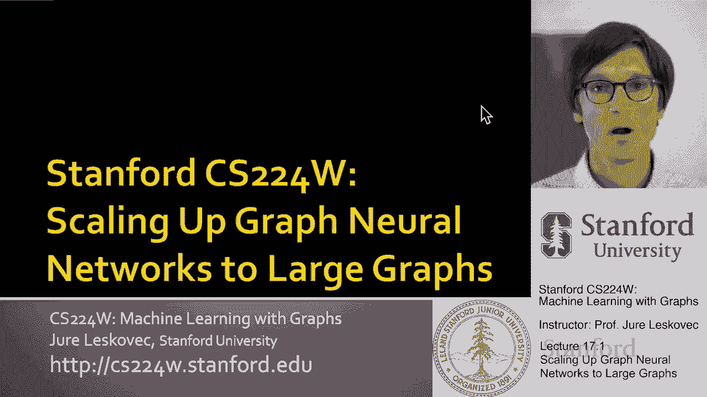
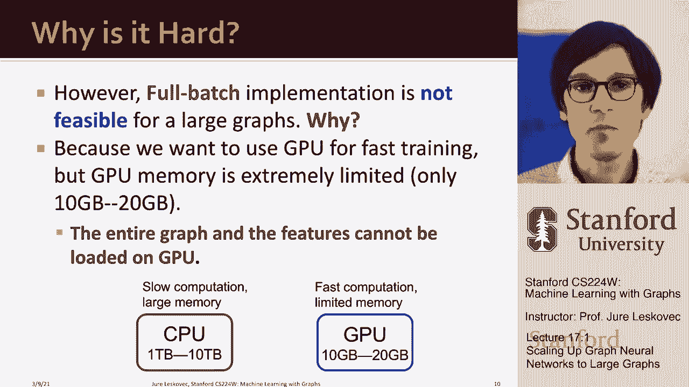

# 53：17.1 将图神经网络扩展至大规模图 🚀

## 概述
在本节课中，我们将学习如何将图神经网络（GNN）扩展应用于包含数百万乃至数十亿节点的大规模图。我们将探讨传统方法面临的挑战，并介绍几种关键技术，使GNN能够高效地处理海量图数据。

---

## 问题定义与动机

在许多现代应用中，我们都会遇到大规模图。例如，在推荐系统中，亚马逊向你推荐产品的系统、Pinterest的帖子推荐、Instagram的检查等。你可以将这些任务视为一种连接用户与内容（如产品、视频）的方式。这个推荐任务可以被看作是在一个巨大的二分图上进行链接预测。这个图的一端可能有数亿甚至数十亿用户，另一端则有数千万乃至数百亿的物品。我们的目标是预测哪些电影、视频或产品对哪些用户是有趣的。

另一个例子是社交网络，如Twitter、Facebook、Instagram。在这些网络中，我们有用户、朋友和关注关系。我们可能需要进行链接级别的朋友推荐、用户属性预测（如预测用户对哪些广告感兴趣或来自哪个国家），或者进行属性补全（例如，预测未知用户的性别）。这些网络通常拥有数十亿用户和数百亿到数千亿的边。

此外，异构图也是一个重要的应用领域。例如，微软学术图数据集包含1.2亿篇论文、1.2亿作者及其所属机构。这构成了一个巨大的异构知识图。任务可能包括论文分类、向作者推荐合作者、预测论文间的引用关系等。更广泛地说，我们可以考虑来自维基百科或Freebase的知识图，它们同样包含数亿实体，我们需要在其上完成知识图补全或知识推理任务。

所有这些应用的共同点是它们都是大规模的：节点数量从数百万到数十亿不等，边的数量从数千万到数千亿不等。核心问题是：面对如此大规模的数据，我们如何在节点级任务（如节点分类）和成对级任务（如链接预测）中应用GNN？我们需要开发什么样的系统和算法来处理这种海量数据？

---

## 传统方法的挑战

接下来，我们解释为什么这很困难，以及为什么需要特殊的方法来处理大规模数据集。

### 小批量梯度下降的困境

通常，当有大量数据点时，我们的目标是最小化训练数据上的平均损失。如果我们有 `n` 个训练数据点，损失函数可以表示为对所有数据点损失的求和：

**公式：** `总损失 = Σ(从 i=0 到 n-1) 损失(真实标签_i, 预测标签_i)`

为了高效计算，我们通常采用小批量梯度下降：随机选择一小批（大小为 `m`）数据点，用这小批数据的损失和梯度来近似整个数据集的梯度。这大大加快了计算速度。

然而，在图神经网络中，简单地采样一组节点作为小批量是行不通的。如下图所示，当我们采样一小批节点时，这些节点在图中很可能是彼此孤立的。因为GNN通过聚合邻居信息来生成节点嵌入，而这些邻居节点很可能不在当前的小批量中。这意味着小批量内的节点无法进行有效的消息传递，计算出的梯度无法代表整个图的梯度，从而导致随机梯度下降法无法有效训练GNN。

### 全批量训练的瓶颈

另一种思路是采用全批量训练：同时为图中所有节点计算嵌入。在K层GNN中，计算第k层的节点嵌入需要用到第k-1层所有节点的嵌入。这种递归结构要求我们将整个图结构以及每一层所有节点的嵌入都存储在内存中，以便进行计算。

全批量训练存在两个主要问题：
1.  **计算效率低**：即使不考虑时间，全批量训练对于大图来说也是不现实的。
2.  **内存限制**：为了快速训练，我们希望使用GPU。但GPU内存非常有限（通常为10-30GB）。对于一个拥有十亿节点、每个节点有数百字节特征的图，所需内存轻松达到TB级别，这远远超出了GPU的内存容量。虽然CPU内存更大，但计算速度慢。

因此，我们无法将全批量训练扩展到超过几千个节点的网络，更不用说数百万或数十亿节点的图了。

---

## 解决方案概览

这引出了本节课的核心：我们如何改变思考GNN的方式、如何实施训练、如何修改架构，从而将其扩展到数十亿节点的大规模图，并能在有限的GPU内存上运行？

我们将介绍三种主要方法，前两种基于在小批量内对子图进行消息传递，从而改变小批量的构建方式：
1.  **邻域采样技术**
2.  **Cluster-GCN技术**

第三种方法则通过简化GNN架构，使其计算能够主要在内存充足的CPU上高效执行：
3.  **简化GCN方法**

---

## 总结

本节课我们一起学习了将图神经网络扩展至大规模图所面临的挑战。传统的小批量梯度下降法因节点孤立而失效，全批量训练则受限于GPU内存。为了克服这些困难，我们需要采用新的策略，例如在构建小批量时考虑图的局部结构（如邻域采样、Cluster-GCN），或者设计更简洁、易于在CPU上计算的模型架构（如简化GCN）。这些技术使得GNN能够应用于推荐系统、社交网络、知识图谱等真实世界的大规模场景中。